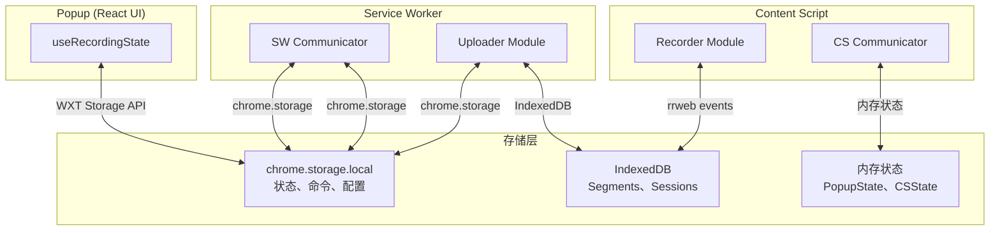
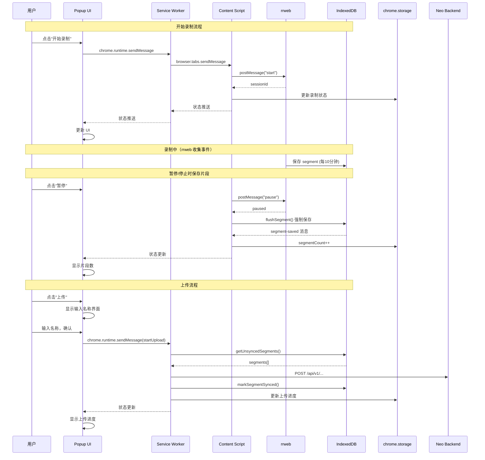

# Storage 存储架构文档

## 概述

本项目使用了 4 种不同的存储机制，每种都有其特定用途：

| 存储类型 | 用途 | 持久性 | 容量 |
|---------|------|--------|------|
| **chrome.storage** | 录制状态、上传命令、用户配置 | 持久 | ~10MB |
| **IndexedDB** | 录制片段、Session、会话数据 | 持久 | 无限制 |
| **内存 (in-memory)** | 当前状态、状态机 | 仅运行时 | 无限制 |
| **WXT Storage API** | 封装层，底层使用 chrome.storage | 持久 | ~10MB |

## 架构图



## 1. chrome.storage.local

### 用途
- 存储**录制状态**（isRecording, isPaused, duration, segmentCount）
- 存储**上传命令**（name, workspaceCode）
- 存储**上传进度**（progress, status）
- 存储**用户配置**（neoUrl, backendUrl）
- 存储**认证信息**（token, userInfo）

### 存储键定义

```typescript
// src/common/storage.ts
export const STORAGE_KEYS = {
  RECORDING_STATE: "local:recording.state",    // 录制状态
  RECORDING_CMD: "local:recording.cmd",        // 录制命令
  UPLOAD_CMD: "local:recording.uploadCmd",    // 上传命令
  UPLOAD_PROGRESS: "local:recording.uploadProgress", // 上传进度
  CONFIG: "local:recording.config",           // 用户配置
  AUTH_TOKEN: "local:auth.token",              // 认证 Token
  AUTH_USER_INFO: "local:auth.userInfo",       // 用户信息
};
```

### 使用场景

#### 1.1 录制状态同步
- **Popup 打开时**：读取 storage 中的录制状态初始化 UI
- **录制开始/暂停/停止时**：SW/CS 更新 storage
- **Popup 重新打开时**：从 storage 恢复状态

```typescript
// Popup: 初始化时读取
const state = await getRecordingState();

// SW: 命令执行后更新
await storage.setItem(STORAGE_KEYS.RECORDING_STATE, { isRecording: true, ... });
```

#### 1.2 上传命令传递
- Popup 点击上传 → SW 获取命令 → 执行上传
- 使用 `UPLOAD_CMD` 键存储上传参数

#### 1.3 跨上下文通信
- chrome.storage 是扩展内所有上下文共享的
- 可以通过 `storage.onChanged` 监听变化

## 2. IndexedDB

### 用途
- 存储**录制片段**（Segment）：包含 rrweb 事件数据
- 存储**会话信息**（Session）：录制会话元数据

### 数据库结构

```typescript
// 数据库名: neo-agent-recordings
// 版本: 1

// Segments Store
{
  uid: string,           // 片段唯一 ID
  sessionId: string,     // 所属 Session ID
  sequence: number,      // 片段序号
  startTime: number,     // 开始时间戳
  endTime: number,       // 结束时间戳
  eventCount: number,    // 事件数量
  events: string,       // rrweb 事件 JSON 字符串
  pageUrls: string[],    // 访问的页面 URL
  createdAt: number,    // 创建时间
  synced: boolean,       // 是否已上传
}

// Sessions Store
{
  uid: string,           // 会话唯一 ID
  startTime: number,     // 开始时间
  endTime: number,       // 结束时间
  active: boolean,       // 是否活跃
  createdAt: number,     // 创建时间
}
```

### 使用场景

```typescript
// 保存录制片段
await db.saveSegment(segment);

// 获取未上传的片段
const segments = await db.getUnsyncedSegments();

// 上传完成后标记
await db.markSegmentSynced(segment.uid);

// 清除所有数据
await db.clearAllSegments();
await db.clearAllSessions();
```

## 3. 内存状态 (in-memory)

### 用途
- 存储当前运行的**录制状态**（CS 内存）
- 存储**定时器引用**（updateTimer, pollInterval）
- 存储**待处理的 rrweb 消息**

### CS 内存状态

```typescript
// src/recording/cs/communicator.ts
let currentState: RecordingState = {
  isRecording: false,
  isPaused: false,
  duration: 0,
  segmentCount: 0,
  eventCount: 0,
};

// 定时器
let updateTimer: ReturnType<typeof setInterval> | null = null;
```

### SW 内存状态

```typescript
// src/recording/sw/communicator.ts
let uploadState: UploadState = {
  isUploading: false,
  progress: null,
};
```

### 为什么需要内存状态？
- **性能**：避免每次访问都读/写 storage
- **rrweb 通信**：需要管理待响应的消息
- **定时器**：需要持有引用以便清除

## 4. WXT Storage API

### 用途
- 作为 `chrome.storage` 的封装层
- 提供 Promise 化的 API

### 导入方式

```typescript
import { storage } from "#imports";

// 使用
await storage.setItem(STORAGE_KEYS.RECORDING_STATE, state);
const state = await storage.getItem(STORAGE_KEYS.RECORDING_STATE);
```

### 注意
WXT Storage API 底层就是 chrome.storage.local，所以数据是共享的。

## 数据流向图



## 存储清理策略

| 场景 | 清理内容 | 清理位置 |
|------|---------|---------|
| 点击"清除"按钮 | IndexedDB segments/sessions + storage state | `clearRecording()` |
| 上传成功 | IndexedDB segments (标记为 synced) | `uploader.ts` |
| 扩展卸载 | 无特殊处理 (storage 会自动清除) | - |
| 浏览器重启 | 从 storage 恢复状态 | `useRecordingState` 初始化 |

## 问题与改进建议

### 当前问题

1. **存储使用混乱**：`src/storage.ts` 和 `src/common/storage.ts` 有重复定义
2. **状态同步复杂**：Popup ↔ SW ↔ CS 三方同步
3. **没有统一的状态管理**：混用了 storage、内存、消息传递

### 建议的改进

1. **统一存储层**：只保留 `src/common/storage.ts`，删除 `src/recording/storage.ts`
2. **简化同步机制**：使用 StorageArea.onChanged 替代手动同步
3. **状态归一化**：
   - CS：只负责 rrweb 通信和事件收集
   - SW：状态权威源，负责持久化
   - Popup：纯展示，订阅 SW 推送

## 文件索引

| 文件 | 用途 |
|------|------|
| `src/common/storage.ts` | chrome.storage 封装，定义 STORAGE_KEYS（认证、录制状态、上传命令） |
| `src/common/storage.local/sysconfig.ts` | 系统配置管理：neoUrl, backendUrl, testMode |
| `src/recording/storage.ts` | (冗余) chrome.storage 封装 |
| `src/recording/messages.ts` | 消息类型定义和存储操作封装 |
| `src/recording/db/indexeddb.ts` | IndexedDB 操作：segments, sessions |
| `src/recording/cs/communicator.ts` | CS 状态管理（内存） |
| `src/recording/sw/communicator.ts` | SW 状态管理和命令路由 |
| `src/recording/ui/hooks/useRecordingState.ts` | Popup 状态管理 |

## Sysconfig 模块

### 配置模型

```typescript
// src/common/storage.local/sysconfig.ts

interface Config {
	neoUrl: string;      // Neo 平台地址
	backendUrl: string; // 后端服务地址
	testMode: boolean;   // 测试模式（只读）
}

// 默认配置
const DEFAULT_CONFIG: Config = {
	neoUrl: "http://localhost:3000",
	backendUrl: "http://localhost:8002",
};
```

### API

| 函数 | 用途 |
|------|------|
| `getConfig()` | 异步获取配置 |
| `setConfig(config)` | 异步保存配置 |
| `saveConfig(config)` | setConfig 的别名 |

### Storage Key

```typescript
const CONFIG_KEY = "local:recording.config";
```
