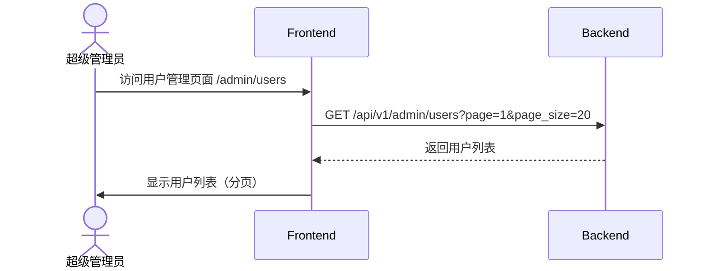
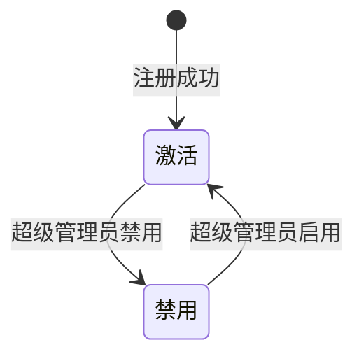

# 超级管理员用户管理 E2E 测试用例

## 概述

本文档定义超级管理员用户管理功能的端到端测试用例，覆盖用户列表、创建、编辑、启用/禁用等核心场景。

**前置条件**：测试用户必须为超级管理员角色（`is_admin: true`）

**测试环境**：
- 后端服务：`http://localhost:8000`
- 前端应用：`http://localhost:3300`

---

## 测试数据

| 类型 | 值 | 说明 |
|------|-----|------|
| 超级管理员手机号 | `13800138001` | 拥有管理权限的管理员账号 |
| 超级管理员密码 | `abcd1234` | 管理员密码 |
| 普通用户手机号 | `13800138002` | 用于测试普通用户 |
| 新用户手机号 | `13899999999` | 用于测试创建用户 |
| 新用户名 | `测试用户` | 用于测试编辑 |

---

## TC-001: 超级管理员查看用户列表

**优先级**：P0 - 核心功能

### 测试步骤

### 操作步骤

| 序号 | 操作 | 预期结果 |
|------|------|----------|
| 1 | 使用超级管理员账号登录 | 登录成功，进入首页 |
| 2 | 访问用户管理页面 `/admin/users` | 显示用户管理菜单 |
| 3 | 查看用户列表 | 显示所有用户，分页展示 |
| 4 | 查看用户详情 | 显示用户手机号、用户名、邮箱、状态等 |
| 5 | 切换分页 | 显示第2页及后续用户 |

### 验证点

- [ ] 仅超级管理员可访问 `/admin/users`
- [ ] 普通用户访问返回 403 Forbidden
- [ ] 用户列表包含：手机号、用户名、邮箱、状态、创建时间
- [ ] 默认每页 20 条记录
- [ ] 支持分页导航

### 相关 API

- `GET /api/v1/admin/users`

---

## TC-002: 超级管理员搜索用户

**优先级**：P1 - 功能场景

### 测试步骤

| 序号 | 操作 | 预期结果 |
|------|------|----------|
| 1 | 访问用户管理页面 `/admin/users` | 显示用户列表 |
| 2 | 输入搜索关键词 `张三` | 显示搜索中状态 |
| 3 | 按回车或点击搜索 | 提交搜索请求 |
| 4 | 查看搜索结果 | 显示匹配「张三」的用户 |

### 验证点

- [ ] 支持按用户名搜索
- [ ] 支持按手机号搜索
- [ ] 搜索结果高亮匹配项
- [ ] 无结果时显示「未找到匹配用户」

### 相关 API

- `GET /api/v1/admin/users?search=张三`

---

## TC-003: 超级管理员创建用户

**优先级**：P0 - 核心功能

### 测试步骤

| 序号 | 操作 | 预期结果 |
|------|------|----------|
| 1 | 访问用户管理页面 `/admin/users` | 显示用户列表 |
| 2 | 点击「创建用户」按钮 | 弹出创建用户对话框 |
| 3 | 输入手机号 `13899999999` | 手机号输入完成 |
| 4 | 输入用户名 `测试用户` | 用户名输入完成 |
| 5 | 输入邮箱 `test@example.com` | 邮箱输入完成 |
| 6 | 点击「确定」按钮 | 显示加载状态 |
| 7 | 创建成功 | 对话框关闭，用户列表刷新，显示新用户 |

### 验证点

- [ ] 创建用户无需密码（管理员可为用户初始化）
- [ ] 必填字段：手机号
- [ ] 选填字段：用户名、邮箱
- [ ] 手机号唯一性校验
- [ ] 创建成功后用户可登录（通过手机号+重置密码）

### 相关 API

- `POST /api/v1/admin/users`

---

## TC-004: 超级管理员编辑用户

**优先级**：P0 - 核心功能

### 测试步骤

| 序号 | 操作 | 预期结果 |
|------|------|----------|
| 1 | 访问用户管理页面 `/admin/users` | 显示用户列表 |
| 2 | 找到目标用户，点击「编辑」按钮 | 弹出编辑用户对话框 |
| 3 | 修改用户名 | 用户名输入框变为可编辑 |
| 4 | 点击「保存」按钮 | 保存修改 |
| 5 | 保存成功 | 对话框关闭，用户列表刷新 |

### 验证点

- [ ] 仅可修改用户名
- [ ] **手机号不可修改**（唯一标识）
- [ ] **邮箱不可修改**（唯一标识）
- [ ] 修改后立即生效
- [ ] 修改记录有审计日志（可选）

### 相关 API

- `PUT /api/v1/admin/users/{id}`

---

## TC-005: 超级管理员禁用用户

**优先级**：P0 - 核心功能

### 测试步骤

| 序号 | 操作 | 预期结果 |
|------|------|----------|
| 1 | 访问用户管理页面 `/admin/users` | 显示用户列表 |
| 2 | 找到目标用户（状态为「正常」） | 显示启用状态标识 |
| 3 | 点击「禁用」按钮 | 弹出确认对话框 |
| 4 | 点击「确定」 | 显示禁用中状态 |
| 5 | 禁用成功 | 用户状态变为「已禁用」，按钮变为「启用」 |
| 6 | 验证用户无法登录 | 使用该用户手机号登录，显示「账户已被禁用」 |

### 验证点

- [ ] 禁用操作需二次确认
- [ ] 禁用后用户状态立即更新为 `is_active: false`
- [ ] 被禁用用户无法登录
- [ ] 禁用后用户数据保留，不删除

### 相关 API

- `PATCH /api/v1/admin/users/{id}/status`

---

## TC-006: 超级管理员启用用户

**优先级**：P0 - 核心功能

### 测试步骤

| 序号 | 操作 | 预期结果 |
|------|------|----------|
| 1 | 访问用户管理页面 `/admin/users` | 显示用户列表 |
| 2 | 找到目标用户（状态为「已禁用」） | 显示禁用状态标识 |
| 3 | 点击「启用」按钮 | 弹出确认对话框 |
| 4 | 点击「确定」 | 显示启用中状态 |
| 5 | 启用成功 | 用户状态变为「正常」，按钮变为「禁用」 |
| 6 | 验证用户恢复登录 | 使用该用户手机号登录，成功 |

### 验证点

- [ ] 启用操作需二次确认
- [ ] 启用后用户状态立即更新为 `is_active: true`
- [ ] 被启用用户恢复登录能力
- [ ] 所有历史数据保持不变

### 相关 API

- `PATCH /api/v1/admin/users/{id}/status`

---

## TC-007: 普通用户访问用户管理页面被拒绝

**优先级**：P1 - 安全场景

### 测试步骤

| 序号 | 操作 | 预期结果 |
|------|------|----------|
| 1 | 使用普通用户账号登录 | 登录成功，进入首页 |
| 2 | 直接访问 `/admin/users` | 显示加载状态 |
| 3 | 请求被拒绝 | 返回 403 Forbidden |
| 4 | 页面处理 | 跳转至 403 错误页面或首页 |
| 5 | 显示提示 | 「您没有权限访问此页面」 |

### 验证点

- [ ] 普通用户 `is_admin: false` 无法访问管理页面
- [ ] API 返回 403 Forbidden
- [ ] 前端正确处理 403 响应
- [ ] 不暴露敏感管理功能

### 相关 API

- `GET /api/v1/admin/users`

---

## TC-008: 超级管理员修改自己不可删除

**优先级**：P1 - 安全场景

### 测试步骤

| 序号 | 操作 | 预期结果 |
|------|------|----------|
| 1 | 使用超级管理员账号登录 | 登录成功 |
| 2 | 访问用户管理页面 `/admin/users` | 显示用户列表 |
| 3 | 找到自己（超级管理员账号） | 显示当前管理员用户 |
| 4 | 尝试删除自己 | 删除按钮不存在或禁用 |
| 5 | 尝试禁用自己 | 禁用按钮不存在或禁用 |

### 验证点

- [ ] 超级管理员不可被删除
- [ ] 超级管理员不可被禁用（至少保留一个超级管理员）
- [ ] 删除/禁用按钮对超级管理员不可见或禁用

---

## TC-009: 用户列表分页功能

**优先级**：P1 - 功能场景

### 测试步骤

| 序号 | 操作 | 预期结果 |
|------|------|----------|
| 1 | 访问用户管理页面 `/admin/users` | 显示第1页用户列表 |
| 2 | 查看分页信息 | 显示「1 / 5」等分页信息 |
| 3 | 点击「下一页」 | 加载第2页数据 |
| 4 | 查看数据 | 显示第2页用户 |
| 5 | 点击「跳页」 | 输入页码，跳转至指定页 |
| 6 | 修改每页数量 | 切换每页显示 10/20/50 条 |

### 验证点

- [ ] 分页控件正常工作
- [ ] 每页显示指定数量用户
- [ ] 总页数正确计算
- [ ] 跳转页面加载正确数据

### 相关 API

- `GET /api/v1/admin/users?page=2&page_size=20`

---

## TC-010: 用户状态筛选

**优先级**：P2 - 功能场景

### 测试步骤

| 序号 | 操作 | 预期结果 |
|------|------|----------|
| 1 | 访问用户管理页面 `/admin/users` | 显示全部用户 |
| 2 | 点击状态筛选下拉框 | 显示选项：全部、正常、已禁用 |
| 3 | 选择「正常」 | 仅显示 `is_active: true` 的用户 |
| 4 | 选择「已禁用」 | 仅显示 `is_active: false` 的用户 |
| 5 | 选择「全部」 | 显示所有用户 |

### 验证点

- [ ] 状态筛选正常工作
- [ ] 筛选后列表正确更新
- [ ] 筛选与分页配合正常工作

---

## TC-011: 用户列表排序

**优先级**：P2 - 功能场景

### 测试步骤

| 序号 | 操作 | 预期结果 |
|------|------|----------|
| 1 | 访问用户管理页面 `/admin/users` | 显示用户列表 |
| 2 | 点击「创建时间」列标题 | 按创建时间升序排序 |
| 3 | 再次点击「创建时间」列标题 | 按创建时间降序排序 |
| 4 | 点击其他可排序列 | 按对应列排序 |

### 验证点

- [ ] 支持升序/降序切换
- [ ] 排序状态有视觉提示（箭头图标）
- [ ] 排序后列表正确更新

---

## TC-012: 编辑用户 - 手机号不可修改验证

**优先级**：P1 - 安全场景

### 测试步骤

| 序号 | 操作 | 预期结果 |
|------|------|----------|
| 1 | 访问用户管理页面 `/admin/users` | 显示用户列表 |
| 2 | 找到目标用户，点击「编辑」按钮 | 弹出编辑用户对话框 |
| 3 | 查看手机号字段 | 手机号字段为只读或不可编辑 |
| 4 | 查看邮箱字段 | 邮箱字段为只读或不可编辑 |
| 5 | 仅修改用户名 | 用户名输入框可编辑 |
| 6 | 保存修改 | 修改成功，仅用户名变更 |

### 验证点

- [ ] 手机号字段为只读状态
- [ ] 邮箱字段为只读状态（如果有）
- [ ] 用户名字段可编辑
- [ ] 仅保存允许修改的字段

### 相关 API

- `PUT /api/v1/admin/users/{id}`

---

## 测试覆盖矩阵

| 功能 | TC-001 | TC-002 | TC-003 | TC-004 | TC-005 | TC-006 | TC-007 | TC-008 | TC-009 | TC-010 | TC-011 | TC-012 |
|------|--------|--------|--------|--------|--------|--------|--------|--------|--------|--------|--------|--------|
| 用户列表查看 | ✅ | | | | | | | | | | | |
| 用户搜索 | | ✅ | | | | | | | | | | |
| 创建用户 | | | ✅ | | | | | | | | | |
| 编辑用户 | | | | ✅ | | | | | | | | ✅ |
| 禁用用户 | | | | | ✅ | | | | | | | |
| 启用用户 | | | | | | ✅ | | | | | | |
| 权限控制 | | | | | | | ✅ | ✅ | | | | |
| 分页 | | | | | | | | | ✅ | | | |
| 筛选 | | | | | | | | | | ✅ | | |
| 排序 | | | | | | | | | | | ✅ | |

---

## 错误码参考

| 错误码 | 说明 | HTTP 状态码 |
|--------|------|-------------|
| `2001` | User Not Found（用户不存在） | 404 |
| `2002` | User Already Exists（用户已存在） | 409 |
| `2003` | User Disabled（用户已被禁用） | 403 |
| `1001` | Invalid Parameter（参数校验失败） | 400 |
| `1002` | Invalid Password（密码错误） | 401 |

---

## 🔗 相关文档

- [ 用户管理产品设计 ](../../product/base/user-management)
- [ 用户管理技术设计 ](../../technical/admin/user-management)
- [ 超级管理员设置 ](../../product/base/admin-setup)
