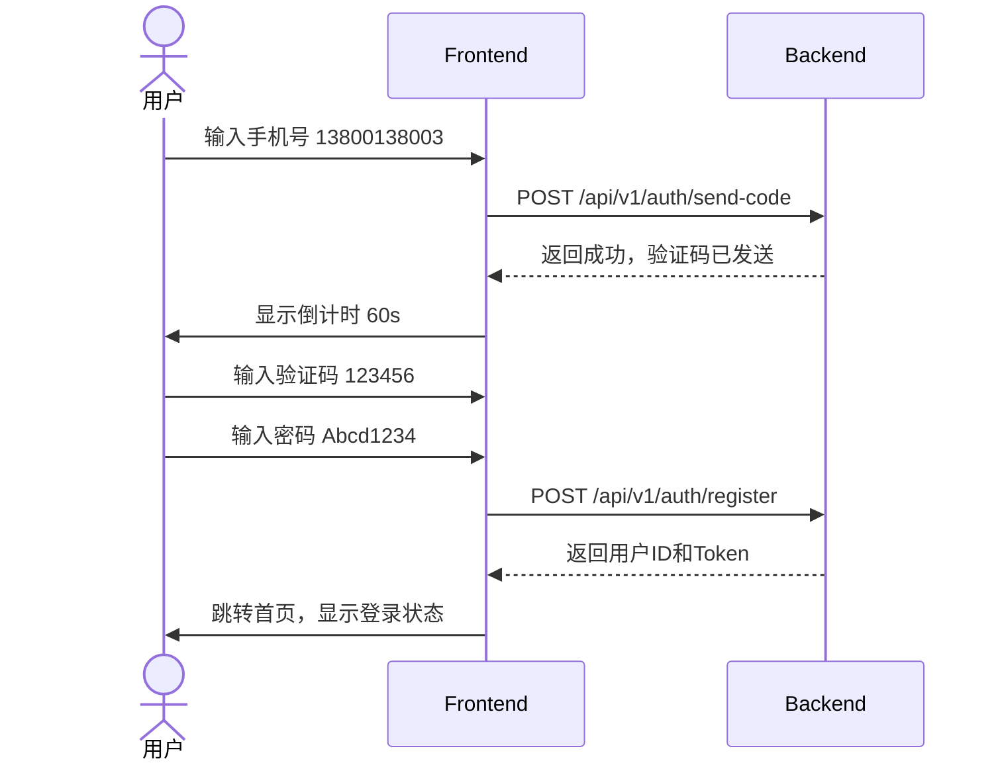

# 用户注册与登录 E2E 测试用例

## 概述

本文档定义用户注册和登录功能的端到端测试用例，覆盖关键用户流程和异常场景。

**测试环境**：
- 后端服务：`http://localhost:8000`
- 前端应用：`http://localhost:3300`

## 测试数据

| 类型 | 值 | 说明 |
|------|-----|------|
| 有效手机号 | `13800138001` | 可用于注册的新手机号 |
| 已注册手机号 | `13800138002` | 系统中已存在的手机号 |
| 有效密码 | `Abcd1234` | 8-20位，含字母和数字 |
| 弱密码 | `123456` | 不符合复杂度要求 |
| 正确验证码 | `123456` | 测试用验证码 |
| 错误验证码 | `654321` | 用于测试验证码错误场景 |

---

## TC-001: 用户注册成功

**优先级**：P0 - 核心功能

### 测试步骤

### 操作步骤

| 序号 | 操作 | 预期结果 |
|------|------|----------|
| 1 | 访问注册页面 `/register` | 显示注册表单 |
| 2 | 输入手机号 `13800138003` | 字段验证通过 |
| 3 | 点击「获取验证码」按钮 | 按钮变为倒计时状态，60秒后可重发 |
| 4 | 输入验证码 `123456` | 验证码输入框显示 6 位数字 |
| 5 | 输入密码 `Abcd1234` | 密码强度显示为强 |
| 6 | 点击「注册」按钮 | 显示加载状态 |
| 7 | 注册成功 | 自动登录，跳转至首页，显示用户名 |

### 验证点

- [ ] 验证码发送成功，显示倒计时
- [ ] 密码满足 8-20 位，包含字母和数字
- [ ] 注册成功后返回 user_id 和 token
- [ ] 注册成功后自动登录，显示用户信息
- [ ] 跳转至首页 `/`

### 相关 API

- `POST /api/v1/auth/send-code`
- `POST /api/v1/auth/register`

---

## TC-002: 用户登录成功

**优先级**：P0 - 核心功能

### 测试步骤

| 序号 | 操作 | 预期结果 |
|------|------|----------|
| 1 | 访问登录页面 `/login` | 显示登录表单 |
| 2 | 输入手机号 `13800138002` | 字段验证通过 |
| 3 | 输入密码 `Abcd1234` | 密码显示为掩码 |
| 4 | 点击「登录」按钮 | 显示加载状态 |
| 5 | 登录成功 | 跳转至首页，显示用户名 |
| 6 | 刷新页面 | 保持登录状态，Token 有效 |

### 验证点

- [ ] 手机号格式正确性验证
- [ ] 密码正确性验证
- [ ] 登录成功返回 Token
- [ ] Token 存储在 httpOnly Cookie 中
- [ ] 页面刷新后登录状态保持

### 相关 API

- `POST /api/v1/auth/login`

---

## TC-003: 注册 - 手机号已存在

**优先级**：P1 - 异常场景

### 测试步骤

| 序号 | 操作 | 预期结果 |
|------|------|----------|
| 1 | 访问注册页面 `/register` | 显示注册表单 |
| 2 | 输入已注册手机号 `13800138002` | 字段验证通过 |
| 3 | 点击「获取验证码」按钮 | 验证码发送成功 |
| 4 | 输入验证码 `123456` | 验证码输入框显示 |
| 5 | 输入密码 `Abcd1234` | 密码输入完成 |
| 6 | 点击「注册」按钮 | 显示错误提示 |
| 7 | 显示错误 | 「该手机号已注册」 |

### 验证点

- [ ] 返回错误码 `2002` (User Already Exists)
- [ ] 返回 HTTP 状态码 `409`
- [ ] 错误提示清晰：「该手机号已注册」
- [ ] 不跳转页面，用户可重新输入

### 相关 API

- `POST /api/v1/auth/register`

---

## TC-004: 注册 - 验证码错误

**优先级**：P1 - 异常场景

### 测试步骤

| 序号 | 操作 | 预期结果 |
|------|------|----------|
| 1 | 访问注册页面 `/register` | 显示注册表单 |
| 2 | 输入手机号 `13800138003` | 字段验证通过 |
| 3 | 点击「获取验证码」按钮 | 验证码发送成功 |
| 4 | 输入错误验证码 `654321` | 验证码输入框显示 |
| 5 | 输入密码 `Abcd1234` | 密码输入完成 |
| 6 | 点击「注册」按钮 | 显示错误提示 |
| 7 | 显示错误 | 「验证码错误」 |

### 验证点

- [ ] 返回错误码 `1003` (Invalid Code)
- [ ] 返回 HTTP 状态码 `400`
- [ ] 错误提示清晰：「验证码错误」
- [ ] 验证码输入框清空，允许重新输入

### 相关 API

- `POST /api/v1/auth/register`

---

## TC-005: 注册 - 验证码过期

**优先级**：P1 - 异常场景

### 测试步骤

| 序号 | 操作 | 预期结果 |
|------|------|----------|
| 1 | 访问注册页面 `/register` | 显示注册表单 |
| 2 | 输入手机号 | 字段验证通过 |
| 3 | 获取验证码 | 验证码发送成功 |
| 4 | **等待 5 分钟** | 验证码自动过期 |
| 5 | 输入过期验证码 | 验证码输入框显示 |
| 6 | 输入密码 | 密码输入完成 |
| 7 | 点击「注册」按钮 | 显示错误提示 |
| 8 | 显示错误 | 「验证码已过期，请重新获取」 |

### 验证点

- [ ] 返回错误码 `1004` (Code Expired)
- [ ] 返回 HTTP 状态码 `400`
- [ ] 错误提示清晰：「验证码已过期」
- [ ] 提示用户重新获取验证码

### 相关 API

- `POST /api/v1/auth/register`

---

## TC-006: 注册 - 密码复杂度不足

**优先级**：P2 - 表单验证

### 测试步骤

| 序号 | 操作 | 预期结果 |
|------|------|----------|
| 1 | 访问注册页面 `/register` | 显示注册表单 |
| 2 | 输入手机号 | 字段验证通过 |
| 3 | 获取验证码 | 验证码发送成功 |
| 4 | 输入验证码 `123456` | 验证码输入完成 |
| 5 | 输入弱密码 `123456` | 密码输入完成 |
| 6 | 实时校验 | 显示密码强度：弱 或 不符合要求 |
| 7 | 点击「注册」按钮 | 显示错误提示 |
| 8 | 显示错误 | 「密码需包含字母和数字，8-20位」 |

### 验证点

- [ ] 前端实时校验密码复杂度
- [ ] 不满足条件的密码无法提交
- [ ] 错误提示清晰说明要求

### 相关 API

- `POST /api/v1/auth/register`

---

## TC-007: 登录 - 用户不存在

**优先级**：P1 - 异常场景

### 测试步骤

| 序号 | 操作 | 预期结果 |
|------|------|----------|
| 1 | 访问登录页面 `/login` | 显示登录表单 |
| 2 | 输入未注册手机号 `13900000000` | 字段验证通过 |
| 3 | 输入密码 `Abcd1234` | 密码输入完成 |
| 4 | 点击「登录」按钮 | 显示错误提示 |
| 5 | 显示错误 | 「用户不存在」 |

### 验证点

- [ ] 返回错误码 `2001` (User Not Found)
- [ ] 返回 HTTP 状态码 `404`
- [ ] 错误提示：「用户不存在」或「账号或密码错误」
- [ ] 不泄露用户是否存在的信息安全

### 相关 API

- `POST /api/v1/auth/login`

---

## TC-008: 登录 - 密码错误

**优先级**：P1 - 异常场景

### 测试步骤

| 序号 | 操作 | 预期结果 |
|------|------|----------|
| 1 | 访问登录页面 `/login` | 显示登录表单 |
| 2 | 输入已注册手机号 `13800138002` | 字段验证通过 |
| 3 | 输入错误密码 `WrongPass123` | 密码输入完成 |
| 4 | 点击「登录」按钮 | 显示加载状态 |
| 5 | 显示错误 | 「密码错误」 |

### 验证点

- [ ] 返回错误码 `1002` (Invalid Password)
- [ ] 返回 HTTP 状态码 `401`
- [ ] 错误提示：「密码错误」或「账号或密码错误」
- [ ] 允许用户重新输入密码

### 相关 API

- `POST /api/v1/auth/login`

---

## TC-009: 登录 - 用户已被禁用

**优先级**：P1 - 异常场景

### 测试步骤

| 序号 | 操作 | 预期结果 |
|------|------|----------|
| 1 | 访问登录页面 `/login` | 显示登录表单 |
| 2 | 输入已禁用用户的手机号 | 字段验证通过 |
| 3 | 输入正确密码 `Abcd1234` | 密码输入完成 |
| 4 | 点击「登录」按钮 | 显示加载状态 |
| 5 | 显示错误 | 「账户已被禁用，请联系管理员」 |

### 前置条件

- 存在已被超级管理员禁用的测试用户

### 验证点

- [ ] 返回错误码 `2003` (User Disabled)
- [ ] 返回 HTTP 状态码 `403`
- [ ] 错误提示：「账户已被禁用」
- [ ] 引导用户联系管理员

### 相关 API

- `POST /api/v1/auth/login`

---

## TC-010: 注册 - 验证码输入错误3次后需重新获取

**优先级**：P2 - 安全策略

### 测试步骤

| 序号 | 操作 | 预期结果 |
|------|------|----------|
| 1 | 访问注册页面 `/register` | 显示注册表单 |
| 2 | 输入手机号 | 字段验证通过 |
| 3 | 获取验证码 | 验证码发送成功 |
| 4 | 输入错误验证码 `654321` | 第1次错误 |
| 5 | 重新输入错误验证码 | 第2次错误 |
| 6 | 再次输入错误验证码 | 第3次错误，显示提示 |
| 7 | 提示 | 「验证码错误次数过多，请重新获取」 |
| 8 | 输入正确验证码 | 无法提交，显示需重新获取 |
| 9 | 重新获取验证码 | 验证码发送成功，可正常注册 |

### 验证点

- [ ] 连续 3 次验证码错误后，验证码失效
- [ ] 需重新获取验证码才能继续注册
- [ ] 安全策略生效，防止暴力破解

### 相关 API

- `POST /api/v1/auth/register`

---

## TC-011: 登录 - Token 过期后自动跳转登录页

**优先级**：P1 - 体验场景

### 测试步骤

| 序号 | 操作 | 预期结果 |
|------|------|----------|
| 1 | 使用有效账号登录 | 登录成功，获取 Token |
| 2 | 等待 Token 过期 | Access Token 24小时后过期 |
| 3 | 访问受保护页面 `/workspace` | 显示加载状态 |
| 4 | 检测 Token 无效 | 请求被拒绝，返回 401 |
| 5 | 自动跳转 | 跳转至登录页面 `/login` |
| 6 | 显示提示 | 「登录已过期，请重新登录」 |

### 验证点

- [ ] Token 过期后 API 返回 401
- [ ] 前端检测到 401 状态码
- [ ] 自动跳转到登录页面
- [ ] 用户可重新登录

### 相关 API

- 所有需要认证的 API

---

## TC-012: 登录 - 免密码登录（验证码登录）

**优先级**：P2 - 功能场景

### 测试步骤

| 序号 | 操作 | 预期结果 |
|------|------|----------|
| 1 | 访问登录页面 `/login` | 显示登录表单 |
| 2 | 输入手机号 `13800138002` | 字段验证通过 |
| 3 | 点击「验证码登录」切换 | 界面切换为验证码登录模式 |
| 4 | 点击「获取验证码」按钮 | 验证码发送成功 |
| 5 | 输入验证码 `123456` | 验证码输入完成 |
| 6 | 点击「登录」按钮 | 登录成功，跳转首页 |

### 验证点

- [ ] 支持手机号+验证码登录模式
- [ ] 无需输入密码即可登录
- [ ] 登录成功后返回 Token

### 相关 API

- `POST /api/v1/auth/send-code` (type: login)
- `POST /api/v1/auth/login` (可选：统一接口，通过 code 参数判断)

---

## 测试覆盖矩阵

| 功能 | TC-001 | TC-002 | TC-003 | TC-004 | TC-005 | TC-006 | TC-007 | TC-008 | TC-009 | TC-010 | TC-011 | TC-012 |
|------|--------|--------|--------|--------|--------|--------|--------|--------|--------|--------|--------|--------|
| 手机号注册 | ✅ | | ✅ | ✅ | ✅ | ✅ | | | | ✅ | | |
| 手机号登录 | | ✅ | | | | | ✅ | ✅ | ✅ | | | ✅ |
| 验证码发送 | ✅ | | | | | | | | | | | ✅ |
| 验证码校验 | ✅ | | | ✅ | ✅ | | | | | ✅ | | |
| 密码验证 | ✅ | ✅ | | | | ✅ | | ✅ | | | | |
| Token 管理 | ✅ | ✅ | | | | | | | | | ✅ | |
| 用户状态 | | | | | | | | | ✅ | | | |

---

## 🔗 相关文档

- [ 用户管理产品设计 ](../../product/base/user-management)
- [ 用户管理技术设计 ](../../technical/admin/user-management)
- [ Workspace 产品设计 ](../../product/workspace)