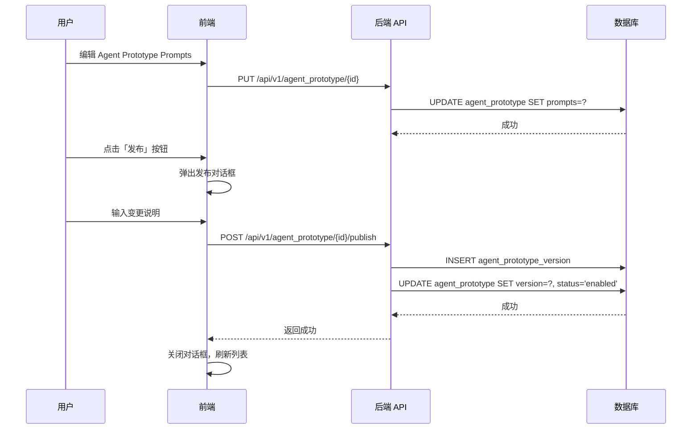
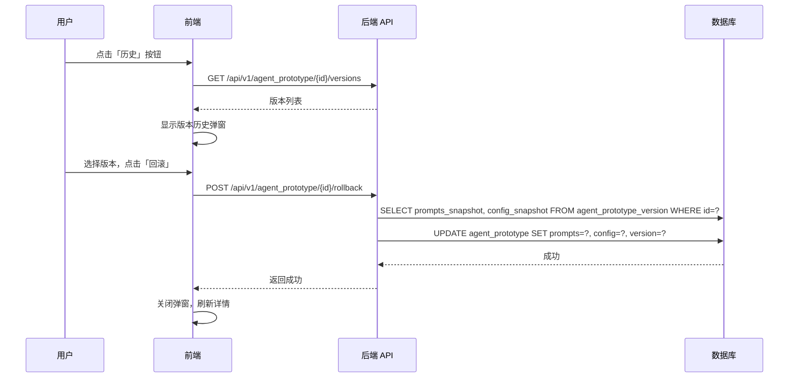

## 🎯 功能概述

本文档介绍 Agent Prototype 的管理功能，包括：

- 如何发布新版本
- 如何回滚到历史版本

**前提条件**：已了解 [Agent Prototype 设计](../agents/agent-prototype-design) 中的概念和状态机定义。

---

## 🎨 UI 原型设计要求

### 页面范围

| 页面       | 路由                               | 说明                               |
| ---------- | ---------------------------------- | ---------------------------------- |
| **列表页** | `/admin/agent-prototype`           | 展示所有 Prototype，支持筛选、新建 |
| **详情页** | `/admin/agent-prototype/{id}`      | 查看详情，版本历史入口             |
| **编辑页** | `/admin/agent-prototype/{id}/edit` | Markdown 编辑器                    |

### 设计规范

| 项目         | 要求                 |
| ------------ | -------------------- |
| **设计风格** | 轻量商务风，简洁现代 |
| **用户权限** | 仅管理员可访问和管理 |

### 列表页功能

- 展示所有 Prototype（ID、名称、版本、状态、创建时间）
- 支持按状态筛选：`draft` / `enabled` / `disabled`
- 支持搜索（按名称）
- 新建按钮

### 编辑页功能

- Markdown 编辑器
  - 语法高亮
  - 实时预览
- 保存草稿按钮
- 取消按钮

### 详情页功能

- 基础字段展示：ID、名称、版本、状态、创建时间
- 版本历史入口（点击弹窗查看历史版本列表）
- 发布按钮（弹窗输入版本号+变更说明）
- 编辑按钮（跳转编辑页）

### 状态与操作

| 状态       | 列表显示   | 详情页操作           |
| ---------- | ---------- | -------------------- |
| `draft`    | 草稿标签   | 编辑、发布、删除     |
| `enabled`  | 已启用标签 | 编辑、禁用、查看历史 |
| `disabled` | 已禁用标签 | 启用、查看历史       |

---

## 🔌 API 路由设计

### API 列表

```
/api/v1/agent_prototype
├── GET    /                         # 列表
├── POST   /                         # 创建
├── GET    /{id}                     # 详情
├── PUT    /{id}                     # 更新（包含 prompts）
├── DELETE /{id}                     # 删除（仅 draft）
├── POST   /{id}/publish             # 发布新版本
├── GET    /{id}/versions            # 版本历史
└── POST   /{id}/rollback            # 回滚到指定版本
```

### 核心 API 说明

| 方法     | 路径                                    | 说明                                        |
| -------- | --------------------------------------- | ------------------------------------------- |
| `GET`    | `/api/v1/agent_prototype`               | 获取 Agent Prototype 列表，支持分页、筛选   |
| `POST`   | `/api/v1/agent_prototype`               | 创建新 Agent Prototype，初始状态为 draft    |
| `GET`    | `/api/v1/agent_prototype/{id}`          | 获取 Agent Prototype 详情，包含当前 prompts |
| `PUT`    | `/api/v1/agent_prototype/{id}`          | 更新 Agent Prototype 内容和配置（草稿状态） |
| `DELETE` | `/api/v1/agent_prototype/{id}`          | 删除 Agent Prototype（仅支持 draft 状态）   |
| `POST`   | `/api/v1/agent_prototype/{id}/publish`  | 发布当前草稿为新版本                        |
| `GET`    | `/api/v1/agent_prototype/{id}/versions` | 获取版本历史列表                            |
| `POST`   | `/api/v1/agent_prototype/{id}/rollback` | 回滚到指定版本                              |

---

## 📝 发布与回滚流程

### 发布流程



**发布约束**：

- 版本号自动递增（如 1.0.0 → 1.0.1）
- change_summary (变更说明) 为必填项
- 发布后 Agent Prototype.status 变为 enabled

### 回滚流程



**回滚特性**：

- 回滚是复制操作，不删除目标版本
- 回滚后 prompts 变为历史版本内容
- version 更新为回滚的版本号
- 保留回滚历史，可再次回滚

---

## 🔗 相关文档

- [Agent Prototype 设计](../agents/agent-prototype-design) - Agent Prototype 的概念和状态机定义
- [Agent 数据库设计](../technical/agents/agent-database-design) - 详细的数据模型定义
- [Agent 提示词设计](../agents/agent-prompt-design) - 提示词配置结构和使用指南
