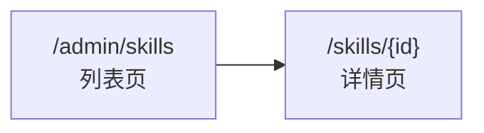

## 🎯 功能概述

本文档描述 Skills 的管理功能设计，包括页面路由和布局结构。

## 🔗 相关文档

- [Skills 功能概述](/product/admin/skills-overview)

## 📱 页面路由

| 页面          | 路由            | 说明                 |
| ------------- | --------------- | -------------------- |
| Skills 列表页 | `/admin/skills` | 管理后台，Skill 列表 |
| Skill 详情页  | `/skills/{id}`  | Skill 详情和编辑     |

### 路由结构



## 📄 页面设计

### 列表页 `/admin/skills`

| 区域       | 说明                   |
| ---------- | ---------------------- |
| **筛选区** | 按状态、标签、级别筛选 |
| **列表区** | Skill 列表，支持分页   |
| **操作区** | 新建按钮               |

#### 页面布局

```
┌─────────────────────────────────────────────────────────┐
│  筛选区                                                  │
│  ┌──────────┐ ┌──────────┐ ┌─────────────────────────┐  │
│  │  状态 ▼  │ │  级别 ▼  │ │ 🔍 搜索...              │  │
│  └──────────┘ └──────────┘ └─────────────────────────┘  │
├─────────────────────────────────────────────────────────┤
│  列表区                                                  │
│  ┌───────────────────────────────────────────────────┐   │
│  │  列表项...                                        │   │
│  │  列表项...                                        │   │
│  │  列表项...                                        │   │
│  │  ...                                              │   │
│  └───────────────────────────────────────────────────┘   │
├─────────────────────────────────────────────────────────┤
│  分页区                                                  │
│  ┌───────────────────────────────────────────────────┐   │
│  │        < 1 2 3 ... 10 >                           │   │
│  └───────────────────────────────────────────────────┘   │
├─────────────────────────────────────────────────────────┤
│                            ┌───────────────────────┐     │
│                            │   + 新建 Skill        │     │
│                            └───────────────────────┘     │
└─────────────────────────────────────────────────────────┘
```

### 详情页 `/skills/{id}`

| 区域         | 说明                   |
| ------------ | ---------------------- |
| **头部信息** | 名称、状态、版本、标签 |
| **文件树**   | 目录结构，可展开/折叠  |
| **文件内容** | 点击文件显示内容       |
| **操作栏**   | 编辑、发布、历史、禁用 |

#### 页面布局

```
┌─────────────────────────────────────────────────────────┐
│  头部信息                                                │
│  ┌─────────────────────────────────────────────────────┐ │
│  │  Skill 名称              [状态] [版本] [标签]       │ │
│  └─────────────────────────────────────────────────────┘ │
├─────────────────────────────────────────────────────────┤
│  ┌────────────────┐ ┌────────────────────────────────┐ │
│  │  文件树        │ │  文件内容                        │ │
│  │                │ │                                  │ │
│  │  📁 scripts/   │ │  # SKILL.md                      │ │
│  │    📄 file1.sh │ │                                  │ │
│  │    📄 file2.py │ │  文件内容...                     │ │
│  │  📁 docs/      │ │                                  │ │
│  │    📄 README.md│ │                                  │ │
│  │  📄 SKILL.md   │ │                                  │ │
│  │                │ │                                  │ │
│  └────────────────┘ └────────────────────────────────┘ │
├─────────────────────────────────────────────────────────┤
│  操作栏                                                  │
│  ┌────────┐ ┌────────┐ ┌────────┐ ┌────────┐          │
│  │  编辑   │ │  发布   │ │  历史   │ │  禁用   │          │
│  └────────┘ └────────┘ └────────┘ └────────┘          │
└─────────────────────────────────────────────────────────┘
```

---

## 🔄 版本历史弹窗

用户点击「历史」按钮后弹出版本历史弹窗，可查看历史版本并进行回滚操作。

### 页面布局

```
┌─────────────────────────────────────────────────────────┐
│  版本历史                                            [×] │
├─────────────────────────────────────────────────────────┤
│  ┌───────────────────────────────────────────────────┐ │
│  │  v1.2.0  (2026-05-15)  当前版本                     │ │
│  │  修复了 xxx 问题                                    │ │
│  │                                           [回滚]   │ │
│  ├───────────────────────────────────────────────────┤ │
│  │  v1.1.0  (2026-05-10)                              │ │
│  │  新增了 yyy 功能                                    │ │
│  │                                           [回滚]   │ │
│  ├───────────────────────────────────────────────────┤ │
│  │  v1.0.0  (2026-05-01)                              │ │
│  │  初始版本                                          │ │
│  │                                           [回滚]   │ │
│  └───────────────────────────────────────────────────┘ │
├─────────────────────────────────────────────────────────┤
│                                         [  取消  ]      │
└─────────────────────────────────────────────────────────┘
```

### 交互说明

| 步骤 | 说明                                           |
| ---- | ---------------------------------------------- |
| 1    | 用户点击「历史」按钮，弹出版本历史弹窗         |
| 2    | 列表展示所有历史版本，最新版本在顶部           |
| 3    | 每个版本显示版本号、发布时间、发布说明         |
| 4    | 用户点击「回滚」，确认后草稿快照被历史版本覆盖 |
| 5    | 关闭弹窗后，文件树和内容更新为历史版本状态     |

### 回滚确认弹窗

```
┌─────────────────────────────────────────────────────────┐
│  确认回滚                                              │
├─────────────────────────────────────────────────────────┤
│                                                         │
│  确定要回滚到 v1.0.0 版本吗？                           │
│                                                         │
│  回滚后当前草稿会被历史版本覆盖，你可以继续编辑后重新发布 │
│                                                         │
├─────────────────────────────────────────────────────────┤
│                        [  取消  ]  [  确定回滚  ]       │
└─────────────────────────────────────────────────────────┘
```
