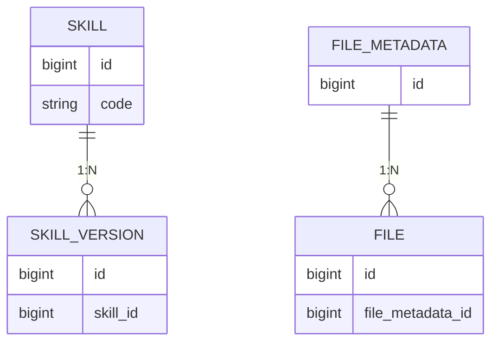
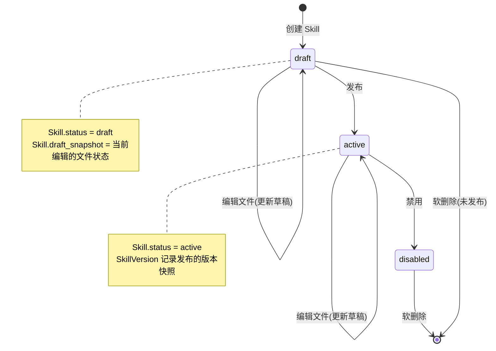
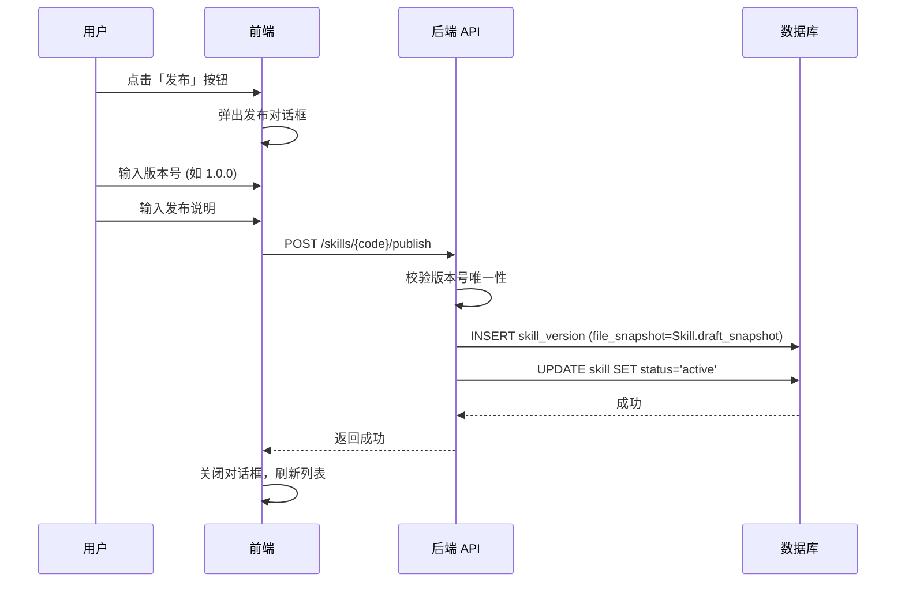
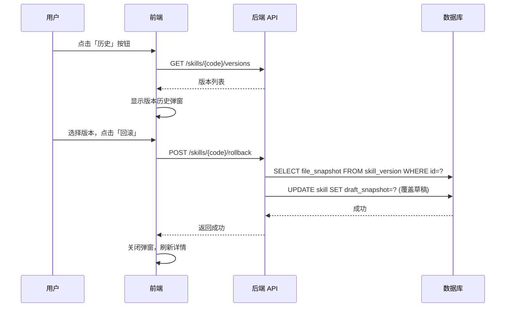

## 🎯 产品概述

### 1.1 功能定义

- Skills 是Neo项目的核心功能之一，为Agent提供skills支持。
- Skills 由markdown文档和script等文件组成
- Skills 有分类和标签属性
- Skills 有版本管理功能

### 1.2 Skills 的文件结构

skills的文件结构决定了skills该如何存储，下面示例一个复杂的skills的存储结构, 非常典型。

```
根目录
├── SKILL.md
├── some_file.md
│   ├── scripts/
│       ├── file1.sh
│       ├── file2.py
│   ├── some_dir/
│       ├── file1.sh
│       ├── file2.py
```

Skills由一个SKILL.md和多级目录文件组成, 为了承载这些文件，我们需要设计一个文件系统存储器，用于存储目录和文件，并且文件可以有多个版本。

### 1.3 Skills 数据模型

Skills 采用文件系统存储设计，包含四个核心实体：

#### 1.3.1 Skill 实体

| 属性             | 类型              | 约束                 | 说明                           |
| ---------------- | ----------------- | -------------------- | ------------------------------ |
| `id`             | BigInteger        | PK, 自增             | 唯一标识符                     |
| `code`           | String(100)       | UK, NOT NULL, 索引   | Skill 唯一标识符               |
| `name`           | String(200)       | NOT NULL             | Skill 展示名称                 |
| `level`          | Enum(SkillLevel)  | NOT NULL             | 粒度级别                       |
| `tags`           | JSON              | NULL                 | 标签数组                       |
| `create_user_id` | BigInteger        | NULL                 | 创建用户 ID                    |
| `status`         | Enum(SkillStatus) | NOT NULL, 默认 draft | 状态                           |
| `draft_snapshot` | JSON              | NULL                 | 草稿快照，记录编辑中的文件状态 |
| `deleted_at`     | DateTime          | NULL                 | 软删除时间                     |
| `created_at`     | DateTime          | NOT NULL             | 创建时间                       |
| `updated_at`     | DateTime          | NOT NULL             | 更新时间                       |

#### 1.3.2 SkillVersion 实体

| 属性            | 类型        | 约束                    | 说明                           |
| --------------- | ----------- | ----------------------- | ------------------------------ |
| `id`            | BigInteger  | PK, 自增                | 唯一标识符                     |
| `skill_id`      | BigInteger  | FK → skill.id, NOT NULL | 关联的 Skill                   |
| `version`       | String(50)  | NOT NULL                | 版本号，如 `1.0.0`             |
| `file_snapshot` | JSON        | NOT NULL                | 文件快照，记录各文件的 file.id |
| `comment`       | String(500) | NULL                    | 版本发布说明                   |
| `created_at`    | DateTime    | NOT NULL                | 发布时间                       |

**file_snapshot JSON 格式示例**:

```json
[
  { "file_metadata_id": 1, "file_id": 101 },
  { "file_metadata_id": 2, "file_id": 102 },
  { "file_metadata_id": 3, "file_id": 105 }
]
```

#### 1.3.3 FileMetadata 实体

| 属性         | 类型         | 约束     | 说明                            |
| ------------ | ------------ | -------- | ------------------------------- |
| `id`         | BigInteger   | PK, 自增 | 唯一标识符                      |
| `name`       | String(255)  | NOT NULL | 文件名，如 `file1.sh`           |
| `path`       | String(1024) | NOT NULL | 文件路径，如 `scripts/file1.sh` |
| `size`       | BigInteger   | NOT NULL | 文件大小（字节）                |
| `created_at` | DateTime     | NOT NULL | 创建时间                        |
| `updated_at` | DateTime     | NOT NULL | 更新时间                        |

**设计说明**: `path` 字段隐式表达目录结构，`a/b/c/d.md` 表示 `a/b/c/` 目录下的 `d.md`，无需单独的 directory 实体。

#### 1.3.4 File 实体

| 属性               | 类型       | 约束                            | 说明                      |
| ------------------ | ---------- | ------------------------------- | ------------------------- |
| `id`               | BigInteger | PK, 自增                        | 唯一标识符                |
| `file_metadata_id` | BigInteger | FK → file_metadata.id, NOT NULL | 关联的 FileMetadata       |
| `version`          | Integer    | NOT NULL                        | 文件版本号，如 1, 2, 3... |
| `content`          | LONGTEXT   | NOT NULL                        | 文件内容（二进制或文本）  |
| `created_at`       | DateTime   | NOT NULL                        | 创建时间                  |

#### 1.3.5 枚举值说明

**SkillLevel (粒度级别)**

| 值           | 说明                                        |
| ------------ | ------------------------------------------- |
| `Planning`   | 规划级 - 粗粒度Skill，适合复杂业务流程      |
| `Functional` | 功能级 - 中等粒度，适合常见业务场景         |
| `Atomic`     | 原子级 - 最小可复用单元，如数据查询、格式化 |

**SkillStatus (状态)**

| 值         | 说明                    |
| ---------- | ----------------------- |
| `draft`    | 草稿 - 初始状态，可编辑 |
| `active`   | 激活 - 已发布，可被调用 |
| `disabled` | 禁用 - 已下线，不可调用 |

#### 1.3.6 设计说明

- **草稿存储**: Skill.draft_snapshot JSON 字段存储当前编辑中的文件状态
- **文件系统存储**: Skill 包含多个文件，通过 FileMetadata + File 实现目录结构和多版本管理
- **目录隐式表达**: 无需单独 directory 实体，path 字段 `a/b/c/d.md` 隐式表达目录层级
- **软删除**: Skill 不做物理删除，通过 `deleted_at` 字段标记删除时间
- **文件版本**: 每次修改文件，File 表新增一条记录（保留历史）
- **版本快照**: SkillVersion.file_snapshot 通过 file_metadata_id + file_id 锁定历史时刻的文件集合
- **版本流转**: `draft → active → disabled`，状态不可逆

#### 1.3.7 实体关系



## 🔄 版本生命周期

### 1.4 文件操作与状态流转

#### 1.4.1 核心概念

| 概念         | 说明                                                    |
| ------------ | ------------------------------------------------------- |
| **草稿**     | 存储在 `Skill.draft_snapshot`，记录当前编辑中的文件集合 |
| **发布**     | 将草稿快照转为正式版本，存入 `SkillVersion`             |
| **当前版本** | `SkillVersion` 中 version 最新的那条记录                |
| **回滚**     | 用历史版本的文件快照替换当前草稿                        |

#### 1.4.2 状态流转图



#### 1.4.3 关键操作说明

| 操作         | 触发条件      | 前置状态       | 后置效果                                                  |
| ------------ | ------------- | -------------- | --------------------------------------------------------- |
| **创建文件** | 用户上传/新建 | draft/active   | 在 FileMetadata 中创建记录，File 中插入内容，草稿快照更新 |
| **编辑文件** | 用户编辑文件  | draft/active   | File 表新增版本记录，草稿快照更新 file_id                 |
| **删除文件** | 用户删除文件  | draft/active   | 草稿快照中移除该文件记录                                  |
| **发布**     | 用户点击发布  | draft/active   | 复制草稿快照到 SkillVersion，设置 status=active           |
| **禁用**     | 管理员禁用    | active         | 设置 status=disabled                                      |
| **回滚**     | 选择历史版本  | active         | 用 SkillVersion.file_snapshot 覆盖草稿快照                |
| **软删除**   | 用户删除      | draft/disabled | 设置 deleted_at 时间戳                                    |

#### 1.4.4 发布流程详解



**发布约束**:

- 版本号在同一 Skill 下必须唯一
- comment (发布说明) 为必填项
- 发布后 Skill.status 变为 active
- 发布内容来源是 draft_snapshot

#### 1.4.5 回滚流程详解



**回滚特性**:

- 回滚是复制操作，不删除目标版本
- 回滚后 `Skill.draft_snapshot` 变为历史版本的文件快照
- 可再次编辑后重新发布

#### 1.4.6 草稿与发布分离设计

**核心原则**: `Skill.draft_snapshot` 作为草稿区，`SkillVersion` 作为发布记录区

| 区域                   | 存储内容                | 修改时机   |
| ---------------------- | ----------------------- | ---------- |
| `Skill.draft_snapshot` | 当前草稿文件集合 (JSON) | 文件编辑时 |
| `SkillVersion[latest]` | 最新发布版本的文件快照  | 发布时复制 |
| `SkillVersion[n]`      | 历史版本快照            | 发布时创建 |

**设计优势**:

- 避免每次编辑都创建版本记录
- 草稿编辑无需版本号
- 回滚操作简单（快照覆盖）
- 可多次编辑后再发布

## 🔗 相关文档

## ✅ 设计检查清单

- [x] 定义清晰的产品边界
- [x] 确认隔离模型(全隔离)
- [x] 确认成员管理模型(全局用户池)
- [x] 定义状态机(draft→active→disabled)
- [ ] 明确所有者角色
- [ ] 定义页面路由
- [ ] 设计 API 接口
- [ ] 设计 UI 原型
- [ ] 定义权限矩阵
- [ ] 设计审计日志字段
