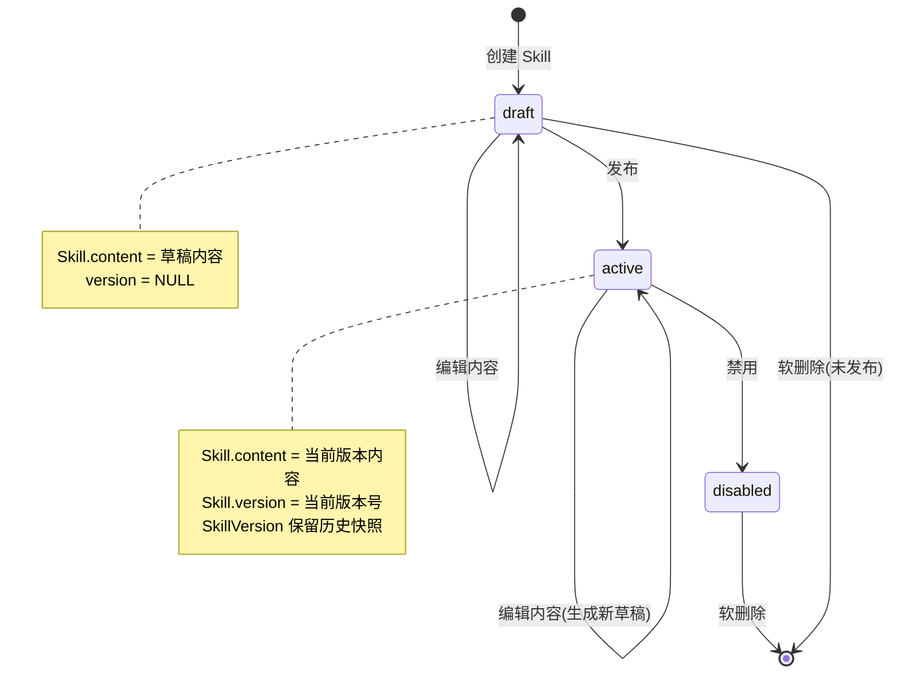
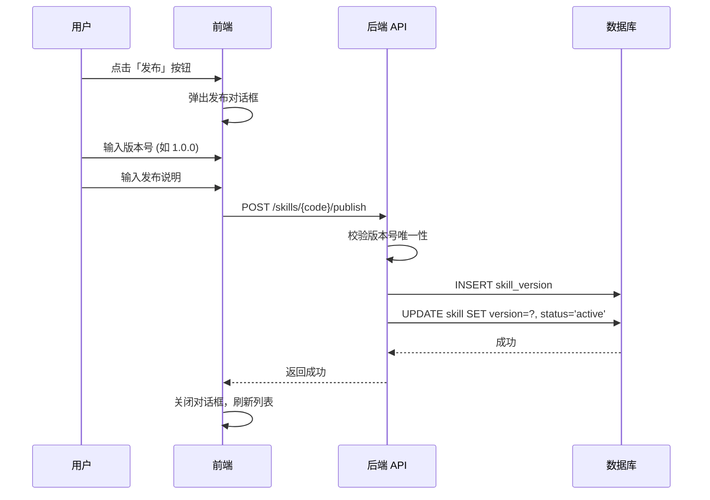
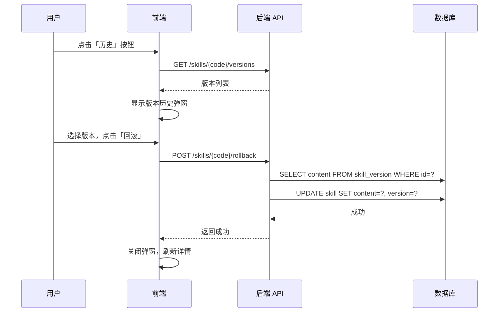

## 🎯 产品概述

### 1.1 功能定义

- Skills 是Neo项目的核心功能之一，为Agent提供skills支持。
- Skills 由markdown文档和script等文件组成
- Skills 有分类和标签属性
- Skills 有版本管理功能

### 1.2 Skills 数据模型

#### 1.2.1 Skill 实体

| 属性         | 类型              | 约束                 | 说明                                  |
| ------------ | ----------------- | -------------------- | ------------------------------------- |
| `id`         | BigInteger        | PK, 自增             | 唯一标识符                            |
| `code`       | String(100)       | UK, NOT NULL, 索引   | Skill 唯一标识符，用于代码引用        |
| `name`       | String(200)       | NOT NULL             | Skill 展示名称                        |
| `level`      | Enum(SkillLevel)  | NOT NULL             | 粒度级别                              |
| `tags`       | JSON              | NULL                 | 标签数组，如 `["数据分析", "可视化"]` |
| `author`     | String(50)        | NULL                 | 作者                                  |
| `content`    | Text              | NOT NULL             | Skill 内容（Markdown 格式）           |
| `version`    | String(50)        | NULL                 | 当前激活版本号，如 `1.0.0`            |
| `status`     | Enum(SkillStatus) | NOT NULL, 默认 draft | 状态                                  |
| `deleted_at` | DateTime          | NULL                 | 软删除时间，NULL 表示未删除           |
| `created_at` | DateTime          | NOT NULL             | 创建时间                              |
| `updated_at` | DateTime          | NOT NULL             | 更新时间                              |

#### 1.2.2 SkillVersion 实体

| 属性         | 类型        | 约束                    | 说明               |
| ------------ | ----------- | ----------------------- | ------------------ |
| `id`         | BigInteger  | PK, 自增                | 唯一标识符         |
| `skill_id`   | BigInteger  | FK → skill.id, NOT NULL | 关联的 Skill       |
| `version`    | String(50)  | NOT NULL                | 版本号，如 `1.0.0` |
| `content`    | Text        | NOT NULL                | 版本内容快照       |
| `comment`    | String(500) | NULL                    | 版本发布说明       |
| `created_at` | DateTime    | NOT NULL                | 发布时间           |

#### 1.2.3 枚举值说明

**SkillLevel (粒度级别)**

| 值           | 说明                                        |
| ------------ | ------------------------------------------- |
| `Planning`   | 规划级 - 粗粒度Skill，适合复杂业务流程      |
| `Functional` | 功能级 - 中等粒度，适合常见业务场景         |
| `Atomic`     | 原子级 - 最小可复用单元，如数据查询、格式化 |

**SkillStatus (状态)**

| 值         | 说明                    |
| ---------- | ----------------------- |
| `draft`    | 草稿 - 初始状态，可编辑 |
| `active`   | 激活 - 已发布，可被调用 |
| `disabled` | 禁用 - 已下线，不可调用 |

#### 1.2.4 设计说明

- **软删除**: Skill 不做物理删除，通过 `deleted_at` 字段标记删除时间
- **版本历史**: 每次发布新版本时创建 `SkillVersion` 记录，保留完整历史
- **内容同步**: `Skill.content` 存储当前内容，`SkillVersion.content` 存储历史快照
- **版本流转**: `draft → active → disabled`，状态不可逆（disabled 后不能再激活）

## 🔄 版本状态机

### 1.3 版本生命周期

#### 1.3.1 状态流转图

#### 1.3.2 关键操作说明

| 操作       | 触发条件     | 前置状态         | 后置效果                                                 |
| ---------- | ------------ | ---------------- | -------------------------------------------------------- |
| **创建**   | 用户点击新建 | -                | 生成 draft 状态的 Skill，content 为空                    |
| **编辑**   | 用户编辑内容 | draft / active   | 更新 Skill.content，版本状态不变                         |
| **发布**   | 用户点击发布 | draft / active   | 创建 SkillVersion 记录，更新 version，设置 status=active |
| **禁用**   | 管理员禁用   | active           | 设置 status=disabled，内容保留                           |
| **回滚**   | 选择历史版本 | active           | Skill.content 复制历史版本内容，更新 version             |
| **软删除** | 用户删除     | draft / disabled | 设置 deleted_at 时间戳                                   |

#### 1.3.3 发布流程详解

**发布约束**:

- 版本号在同一 Skill 下必须唯一
- comment (发布说明) 为必填项
- 发布后 Skill.status 变为 active

#### 1.3.4 回滚流程详解

**回滚特性**:

- 回滚是复制操作，不删除目标版本
- 回滚后 Skill.content 变为历史版本内容
- Skill.version 更新为回滚的版本号
- 保留回滚历史，可再次回滚到其他版本

#### 1.3.5 草稿与发布分离设计

**核心原则**: `Skill.content` 作为草稿区，`SkillVersion` 作为发布记录区

| 区域                   | 存储内容                   | 修改时机     |
| ---------------------- | -------------------------- | ------------ |
| `Skill.content`        | 当前草稿内容（始终可编辑） | 每次编辑保存 |
| `SkillVersion[latest]` | 最新发布版本内容           | 发布时复制   |
| `SkillVersion[n]`      | 历史版本快照               | 发布时创建   |

**设计优势**:

- 避免每次编辑都创建版本记录
- 草稿编辑无需版本号
- 回滚操作简单（内容复制）

## 🔗 相关文档

- [CDP Skill 版本管理设计](/cdp/openspec/changes/skill-version-management/design)

## ✅ 设计检查清单

- [x] 定义清晰的产品边界
- [x] 确认隔离模型(全隔离)
- [x] 确认成员管理模型(全局用户池)
- [x] 定义状态机(draft→active→disabled)
- [ ] 明确所有者角色
- [ ] 定义页面路由
- [ ] 设计 API 接口
- [ ] 设计 UI 原型
- [ ] 定义权限矩阵
- [ ] 设计审计日志字段
