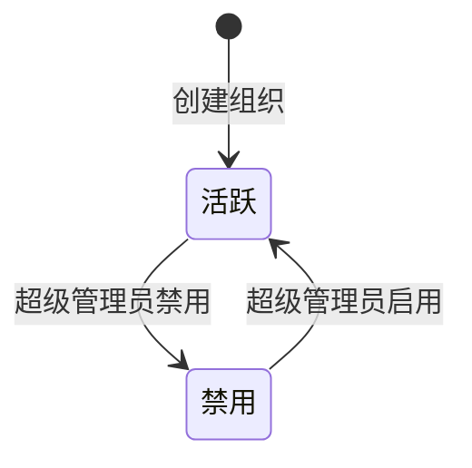
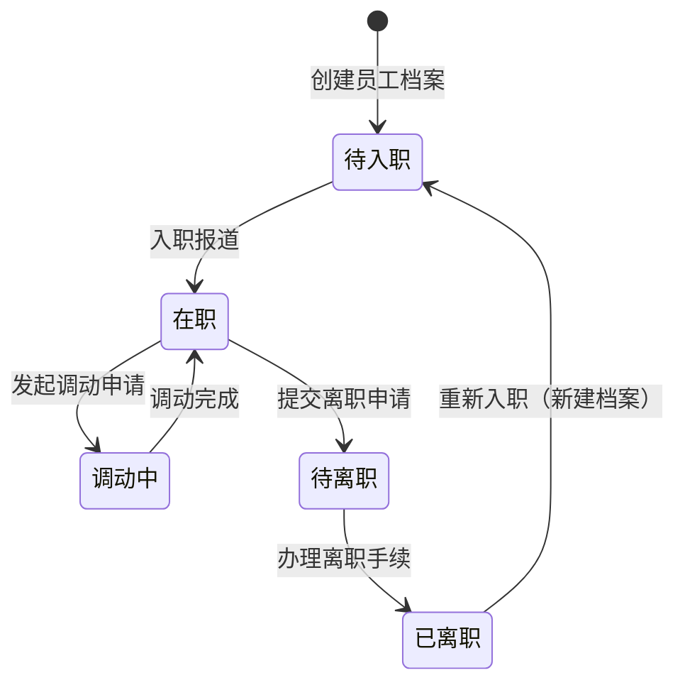

## 🎯 产品概述

### 1.1 组织定义

组织是 Neo 系统的**层级结构**，用于管理和隔离资源。一个组织可以包含多个 Workspace。

### 1.2 组织与 Workspace 的关系

```
┌─────────────────────────────────────────────────────────────────┐
│                         组织 (Organization)                      │
│  ┌────────────────────────────────────────────────────────────┐  │
│  │                                                            │  │
│  │   ┌─────────────┐    ┌─────────────┐    ┌─────────────┐    │  │
│  │   │ Workspace A │    │ Workspace B │    │ Workspace C │    │  │
│  │   └─────────────┘    └─────────────┘    └─────────────┘    │  │
│  │                                                            │  │
│  └────────────────────────────────────────────────────────────┘  │
│                                                                 │
│   成员 (Employee) ←→ User (全局用户池)                          │
│                                                                 │
└─────────────────────────────────────────────────────────────────┘
```

**关系说明**：

- **1:N**：一个组织可以拥有多个 Workspace
- Workspace 必须从属于某个组织
- 组织成员可以访问该组织下的所有 Workspace

### 1.3 组织层级

组织采用**树形结构**，最多支持 4 级：

| 级别 | 类型      | 示例         |
| ---- | --------- | ------------ |
| 1    | 公司/企业 | Matrix 公司  |
| 2    | 部门      | 北京研发中心 |
| 3    | 子部门    | 前端开发组   |
| 4    | 小组      | A 小组       |

### 1.4 核心概念

| 概念                      | 说明                                 |
| ------------------------- | ------------------------------------ |
| **OrganizationUnit**      | 组织单元，包含公司、部门、小组       |
| **OrgUnitClosure**        | 组织层级闭包表，存储祖先-后代关系    |
| **Employee**              | 员工，属于某个组织单元               |
| **EmployeeSecondaryUnit** | 员工辅助部门（可属于多个部门）       |
| **EmployeeTransfer**      | 员工调动记录                         |
| **User**                  | 系统用户，全局身份，与 Employee 解耦 |
| **UserEmployeeMapping**   | 用户与员工的关联表（1:0..1）         |

---

## 👤 组织管理

### 2.1 组织 CRUD

| 功能     | 说明                                 |
| -------- | ------------------------------------ |
| 创建组织 | 在指定父节点下创建子组织             |
| 查看组织 | 查看组织树形结构                     |
| 编辑组织 | 修改组织名称                         |
| 删除组织 | 删除组织（需校验是否有子组织或成员） |

> **说明**：移动组织功能本期不实现。

### 2.2 组织属性

| 属性         | 类型     | 必填 | 说明                                           |
| ------------ | -------- | ---- | ---------------------------------------------- |
| `id`         | bigint   | 是   | 自增主键，全局唯一标识符                       |
| `name`       | string   | 是   | 组织名称，1-100字符                            |
| `code`       | string   | 是   | 组织编码，唯一                                 |
| `type`       | enum     | 是   | 类型：company/branch/department/sub_department |
| `parent_id`  | bigint  | 否   | 父组织 ID，根组织为 null                       |
| `level`      | int     | 是   | 层级深度，0 开始                               |
| `sort_order` | int     | 是   | 排序顺序，数值越小越靠前                       |
| `leader_id`  | bigint  | 否   | 负责人用户 ID（FK → users.id）                 |
| `status`     | enum     | 是   | `active` / `inactive`                          |
| `created_at` | datetime | 是   | 创建时间                                       |
| `updated_at` | datetime | 是   | 更新时间                                       |

> **说明**：组织编码由超级管理员手动输入，需确保全局唯一

### 2.3 组织层级闭包表 (OrgUnitClosure)

用于高效查询组织层级关系，存储祖先-后代节点对及深度。

| 属性            | 类型 | 必填 | 说明                  |
| --------------- | ---- | ---- | --------------------- |
| `ancestor_id`   | bigint | 是   | 祖先组织 ID（PK, FK） |
| `descendant_id` | bigint | 是   | 后代组织 ID（PK, FK） |
| `depth`         | int  | 是   | 层级深度差            |

### 2.4 组织状态机



| 状态       | 说明                       | 可执行操作             |
| ---------- | -------------------------- | ---------------------- |
| `active`   | 正常状态                   | 查看、编辑、禁用       |
| `inactive` | 已禁用，资源保留但不可操作 | 查看、编辑、启用       |

**约束**：

- 删除组织前需校验：
  - 无子组织（该组织下没有其他子组织）
  - 无员工（该组织及所有子组织下没有状态为 `onboarding`、`on_job`、`transferring` 的员工，`offboarding` 状态的员工不计入）
  - 无 Workspace（该组织下没有 Workspace 或所有 Workspace 已禁用）
- 禁用组织前需校验：
  - 组织下存在有效的 Workspace（状态为启用）时，不允许禁用
  - 如有有效 Workspace，弹框提示："该组织下存在 \{N\} 个有效 Workspace，请先禁用或移除所有 Workspace 后再禁用组织"

---

## 👤 员工管理

### 3.1 员工属性

| 属性              | 类型     | 必填 | 说明                                                     |
| ----------------- | -------- | ---- | -------------------------------------------------------- |
| `id`              | bigint  | 是   | 自增主键，全局唯一标识符                                 |
| `user_id`         | int      | **是** | 关联的用户 ID（FK → users.id，通过 mapping 表关联）      |
| `employee_no`     | string   | 是   | 工号，唯一                                               |
| `name`            | string   | 是   | 员工姓名                                                 |
| `phone`           | string   | 否   | 手机号（自动同步自关联用户，禁止手动编辑）                |
| `email`           | string   | 否   | 邮箱                                                     |
| `position`        | string   | 否   | 岗位名称                                                 |
| `primary_unit_id` | bigint   | 否   | 主属组织单元 ID（FK → organization_unit.id）             |
| `status`          | enum     | 是   | `onboarding` / `on_job` / `transferring` / `offboarding` |
| `entry_date`      | date     | 否   | 入职日期                                                 |
| `dimission_date`  | date     | 否   | 离职日期                                                 |
| `created_at`      | datetime | 是   | 创建时间                                                 |
| `updated_at`      | datetime | 是   | 更新时间                                                 |

> **重要约束**：
> - `user_id` 为必填字段，创建员工时必须先选择关联的用户
> - `phone` 字段自动从关联用户同步，禁止手动编辑
> - 员工与用户为 **1:1** 映射关系，一个用户只能关联一个员工

### 3.2 员工辅助部门 (EmployeeSecondaryUnit)

员工可同时属于多个辅助组织单元。

| 属性          | 类型     | 必填 | 说明                                     |
| ------------- | -------- | ---- | ---------------------------------------- |
| `id`          | bigint | 是   | 自增主键                                 |
| `employee_id` | bigint | 是   | 员工 ID（FK → employee.id）              |
| `unit_id`     | bigint | 是   | 组织单元 ID（FK → organization_unit.id） |
| `created_at`  | datetime | 是   | 创建时间                                 |

**约束**：employee_id + unit_id 联合唯一

### 3.3 员工调动记录 (EmployeeTransfer)

| 属性             | 类型     | 必填 | 说明                                       |
| ---------------- | -------- | ---- | ------------------------------------------ |
| `id`             | bigint | 是   | 自增主键                                   |
| `employee_id`    | bigint | 是   | 员工 ID（FK → employee.id）                |
| `from_unit_id`   | bigint | 否   | 原组织单元 ID（FK → organization_unit.id） |
| `to_unit_id`     | bigint | 是   | 新组织单元 ID（FK → organization_unit.id） |
| `transfer_type`  | enum     | 是   | 调动类型：promotion/demotion/transfer      |
| `effective_date` | date     | 是   | 生效日期                                   |
| `reason`         | string   | 否   | 调动原因                                   |
| `created_at`     | datetime | 是   | 创建时间                                   |

### 3.4 员工与组织的关系

- **主属部门**：每个员工必须属于一个主属组织单元
- **辅助部门**：员工可以同时属于多个辅助组织单元
- **调动历史**：员工岗位变动时记录历史

### 3.5 员工与用户的映射关系

#### 核心规则

| 规则 | 说明 |
|------|------|
| **关联必选** | 创建员工时必须先选择关联的用户，不选择用户无法创建员工 |
| **映射关系 1:1** | 一个用户只能映射到一个员工，一个员工只能映射到一个用户 |
| **手机号强制同步** | 员工的手机号自动从关联用户同步，禁止手动编辑 |
| **姓名/邮箱可编辑** | 员工的姓名、邮箱可以与用户不同（员工可以有别称） |

#### 创建员工流程

```
┌─────────────────────────────────────────────────────────────────────┐
│                        添加员工                                      │
├─────────────────────────────────────────────────────────────────────┤
│                                                                     │
│  Step 1: 搜索选择用户                                               │
│  ┌─────────────────────────────────────────────────────────────┐   │
│  │ 🔍 搜索: [1380013   ]                                        │   │
│  │                                                             │   │
│  │ ○ 13800138002 - 张三 (已关联 → 员工: EMP-001)                 │   │
│  │ ● 13800138003 - 李四 (可用)                     ← 选中         │   │
│  │ ○ 13800138004 - 王五 (已关联 → 员工: EMP-003)                 │   │
│  └─────────────────────────────────────────────────────────────┘   │
│                                                                     │
│  Step 2: 自动填充 (选中用户后)                                       │
│  ┌─────────────────────────────────────────────────────────────┐   │
│  │ 工号:    [EMP-2024-001   ]  ← 手动输入                        │   │
│  │ 姓名:    [李四            ]  ← 从用户同步(可编辑)              │   │
│  │ 手机号:  [138****8003    ]  ← 从用户同步(只读) ⚠️             │   │
│  │ 邮箱:    [lisi@xxx.com   ]  ← 从用户同步(可编辑)              │   │
│  │ 职位:    [               ]  ← 手动输入                        │   │
│  │ 部门:    [技术部 ▼        ]  ← 手动选择                        │   │
│  └─────────────────────────────────────────────────────────────┘   │
│                                                                     │
│                              [取消]  [确定创建 ✓]                     │
│                              (未选择用户时按钮禁用)                   │
└─────────────────────────────────────────────────────────────────────┘
```

#### 用户列表展示

| 状态 | 展示方式 | 可选性 |
|------|----------|--------|
| 未关联用户 | 显示用户名、手机号(脱敏) | ✅ 可选 |
| 已关联用户 | 显示用户名、手机号(脱敏)、关联员工工号 | ❌ 禁用 |

#### 错误提示

| 场景 | 提示信息 |
|------|----------|
| 选择已关联用户 | "该用户已被其他员工关联" |
| 手机号与用户不匹配 | "手机号必须与用户手机号一致" |
| 未选择用户 | 按钮禁用，无法提交 |

### 3.6 员工状态机



| 状态           | 说明       | 可执行操作       |
| -------------- | ---------- | ---------------- |
| `onboarding`   | 待入职状态 | 编辑、调动       |
| `on_job`       | 在职状态   | 编辑、调动、离职 |
| `transferring` | 调动中状态 | 查看、办理调动   |
| `offboarding`  | 待离职状态 | 查看、办理离职   |

**约束**：

- 员工离职后状态变为 `offboarding`，数据保留在系统中
- 已离职员工如重新入职，需新建档案
- 调动为**直接调动**，无需审批流程，任何人都可以发起调动
- **员工支持软删除**：删除时设置 `is_deleted = true`，数据保留但不可见

---

## 👤 超级管理员功能

### 4.1 超级管理员的职责

| 功能     | 说明                           | 状态     |
| -------- | ------------------------------ | -------- |
| 组织列表 | 查看所有组织树形结构           | 已完成   |
| 创建组织 | 在指定位置创建新组织           | 已完成   |
| 编辑组织 | 修改组织名称                   | 已完成   |
| 删除组织 | 删除组织（需满足无子组织、无员工、无有效 Workspace） | 已完成   |
| 移动组织 | 调整组织层级                   | **暂不做** |
| 员工列表 | 查看所有员工                   | 已完成   |
| 员工调动 | 将员工从一个部门调到另一个部门 | 已完成   |
| 员工删除 | 软删除员工（is_deleted=true） | 已完成   |
| 批量导入 | Excel 导入员工数据             | 暂不做   |
| 批量导出 | Excel 导出员工数据             | 暂不做   |

> **说明**：批量导入/导出功能将在后续版本中实现，当前版本暂不包含。


---

## 🔗 相关文档

- [ 用户管理设计 ](./用户管理设计)
- [ 组织管理技术设计 ](../technical/org-management)
- [ Workspace 产品设计 ](./workspace)

---

## ✅ 设计检查清单

- [x] 定义组织与 Workspace 的关系（1:N）
- [x] 设计组织层级（树形结构，最多4级）
- [x] 设计组织状态机（active/disabled）
- [x] 设计员工状态机（onboarding/active/offboarding）
- [x] 设计员工与组织的关系
- [x] 定义员工必须关联用户（user_id 必填）
- [x] 定义手机号强制同步规则（只读字段）
- [x] 定义映射关系 1:1 约束
- [x] 设计员工创建时的用户选择流程
- [x] 设计员工与用户的解耦关系（仅通过 mapping 表关联）
- [x] 设计超级管理员组织管理功能
- [x] 定义组织属性（含完整字段设计）
- [x] 定义员工属性（含完整字段设计）
- [x] 定义组织删除前置条件（无子组织、无员工、无有效 Workspace）
- [x] 定义组织禁用前置条件（无有效 Workspace）
- [x] 明确调动为直接调动，无需审批流程
- [x] 批量导入/导出功能标记为暂不做
- [x] 移动组织功能标记为暂不做
- [x] 员工软删除功能（is_deleted 字段）

---
