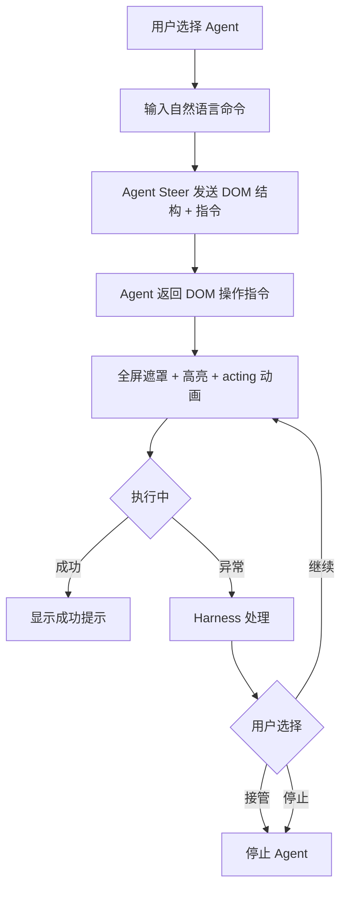

## 🎯 功能概述

- 指令驱动目标软件：用户选择Agent，输入命令，如"填写表单并提交"，Agent Steer 将用户所在页面 DOM 结构和指令发送给 Agent，Agent 把操作 DOM 的指令返回，Agent Steer 执行。期间可能出页面报错、超时、DOM 匹配错误等问题，需 Harness 工程技术处理，细节在技术文档描述。
- 任务驱动目标软件：类似指令驱动，只不过"指令"来自定期的 Agent Task
- 聊天界面：用户在界面上发送指令的输入界面
  - 技能选择：选择某个技能
  - 会话管理：创建、销毁会话

## 用户界面

### 操作输入

用户通过自然语言描述任务目标，Agent 解析后输出可执行的 DOM 操作指令。

### 执行呈现

- 全屏遮罩遮挡原页面
- Agent 高亮当前操作的页面区域
- 配置 acting 动画（如 loading 图标），表示 Agent 正在思考或执行

### 操作流程

### 操作控制

- 能暂停或停止
- "接管"即停止 Agent

### 执行反馈

- 操作完成后显示成功提示

### UI 状态

| 状态 | 说明 |
| ---- | ---- |
| 空闲 | 等待用户输入命令 |
| 思考中 | Agent 正在解析指令，播放 acting 动画 |
| 执行中 | Agent 正在驱动页面操作，高亮当前区域 |
| 暂停 | 用户暂停了执行，可恢复 |
| 停止 | 用户接管或主动停止 |
| 成功 | 操作完成，显示成功提示 |
| 失败 | 出现异常（如超时、DOM 匹配错误） |

### 组件布局

- **遮罩层**：全屏覆盖目标页面，遮罩上浮置 Agent 控制面板
- **控制面板**：位于遮罩层底部中央或右下角，包含当前步骤、暂停/停止按钮
- **聊天输入框**：位于遮罩层底部或侧边，供用户输入自然语言命令
