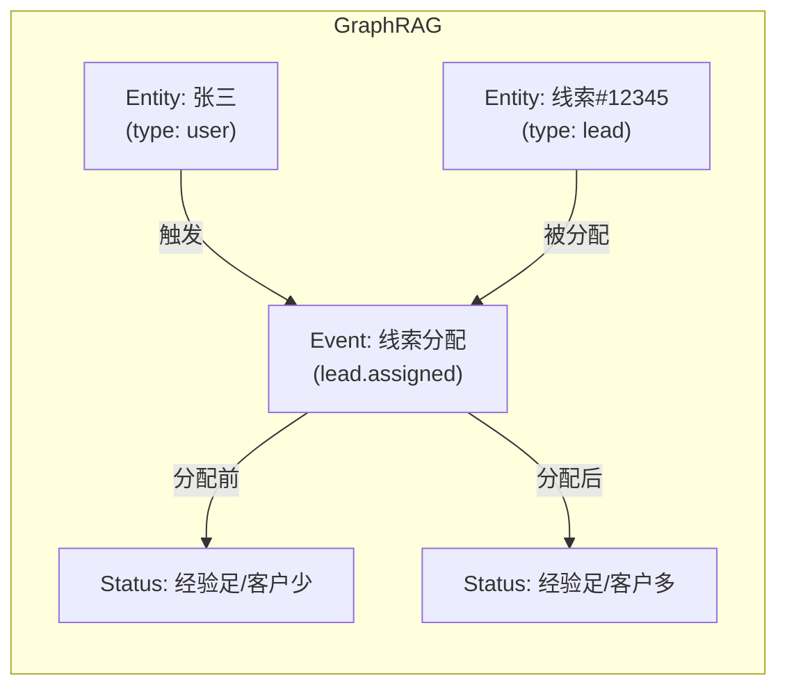

## 🎯 产品概述

产品与Agent交互的载体和通道，用户 - Agent Steer - Agent, 物理形态上表现为chrome插件。

它的名字来源于"驾驶舱（Steer/Cockpit）"的隐喻——用户坐在驾驶座上，操控和观察 Agent 的行为，就像飞行员操控飞机一样。

---

## 定义

### 事件 `Events` 定义和作用

事件用于描述谁在什么时间做了什么。比如用户的点击、页面浏览操作会产生事件，也可以是业务事件，比如线索分配事件。

### 状态 Status 定义和作用

在事件发生前后，会有不同的状态，一般导致状态变化的都是事件，有了状态后就有了推断事件产生的影响以及为什么用户要做某个事件，比如用户做了线索分配，分配前张三的客户经验很足，但是客户数很少，这是张三的状态，分配后张三有了客户，这是之后的状态，也许可以从中得知分配的原因。

---

## 📊 数据结构设计

> 为 GraphRAG 知识库做数据准备，Entity-Event-Status 三者联动设计。

### 设计原则

1. **独立存储**：Event 和 Status 解耦，不耦合在一起
2. **Entity 锚定**：通过 `entity_name` 作为唯一标识关联 Event 和 Status
3. **GraphRAG 友好**：先存储到关系型数据库，后期可导入 GraphRAG

### 数据来源

| 数据类型 | 来源 | 说明 |
|----------|------|------|
| Event | Agent Steer 拦截页面操作 | 点击、浏览等用户行为事件 |
| Status | Agent Steer 跟随用户操作捕获 | 用户查看实体时的状态快照 |

> **注**：未来可扩展为后端日志上报、产品数据库访问等，本次设计暂不考虑。

### Entity（实体）

实体是事件和状态的参与者，是 GraphRAG 中的节点。

```typescript
interface Entity {
  id: string;              // UUID，唯一标识
  name: string;             // 实体唯一名称，格式: {type}_{id}，如 "user_zhangsan"
  type: string;             // 实体类型，如 "user", "lead", "opportunity"
  description?: string;     // 实体描述
  metadata?: Record<string, any>; // 扩展元数据
  created_at: Date;         // 创建时间
  updated_at: Date;         // 更新时间
}
```

**命名规范**：`{type}_{id}` 格式，保证全局唯一。

| 示例 | entity_name | type |
|------|-------------|------|
| 用户张三 | `user_zhangsan` | user |
| 线索 #12345 | `lead_12345` | lead |
| 商机 #67890 | `opportunity_67890` | opportunity |

### Event（事件）

事件描述谁在什么时间做了什么，是 GraphRAG 中的边。

```typescript
interface Event {
  id: string;                // UUID，唯一标识
  name: string;              // 事件名称，如 "lead.assigned", "user.viewed"
  entity_name: string;       // 关联实体（主语），如 "lead_12345"
  target_entity_name?: string; // 目标实体（宾语），如 "user_zhangsan"
  actor: string;             // 触发者，如 "user_john", "agent_auto"
  event_time: Date;           // 事件发生时间
  page_url?: string;         // 页面 URL（来源上下文）
  session_id?: string;       // 会话 ID
  metadata?: Record<string, any>; // 扩展数据
}
```

**事件示例**：

| name | entity_name | target_entity_name | actor | 说明 |
|------|-------------|---------------------|-------|------|
| `lead.assigned` | `lead_12345` | `user_zhangsan` | `user_john` | John 把线索分配给张三 |
| `lead.viewed` | `lead_12345` | - | `user_zhangsan` | 张三查看线索 |
| `opportunity.created` | `opportunity_67890` | - | `agent_auto` | Agent 自动创建商机 |

### Status（状态快照）

状态是实体的属性快照，通过 `entity_name` 和 `captured_at` 与事件关联。

```typescript
interface Status {
  id: string;                // UUID，唯一标识
  entity_name: string;       // 关联实体，如 "user_zhangsan"
  attributes: Record<string, any>; // 属性快照
  create_at: Date;         // 状态采集时间
  source?: string;           // 来源，如 "crm_page_view", "user_action"
  session_id?: string;       // 会话 ID
}
```

**状态示例**：

```json
// 用户张三在查看线索时的状态
{
  "entity_name": "user_zhangsan",
  "attributes": {
    "experience": "high",
    "client_count": 2,
    "department": "sales",
    "monthly_quota": 10
  },
  "create_at": "2026-06-25T10:00:00Z",
  "source": "crm_page_view"
}
```

### Entity-Event-Status 关系图

### GraphRAG 视角

导入 GraphRAG 后，数据结构映射为：



---

## 功能列表

### 1. 软件操作录像与回放

#### 背景与目标

通过 Chrome 插件录制在浏览器中的操作行为，存储为录像，后期标注。新员工可以通过回放录像直观学习操作流程，无需反复打扰他人。

#### 价值

| 维度 | 描述 |
|------|------|
| 知识沉淀 | 将个人经验转化为可复用的组织资产，减少因人员流动导致的信息断层 |
| 学习效率 | 录像比文字教程更直观，新员工可以反复观看，直到完全理解 |
| 培训成本 | 减少老员工的重复讲解时间，一次录制可以服务多名新员工 |
| 操作规范 | 录制最佳实践操作，为后续的 Agent 引导提供基础数据 |

[详细设计](agent-steer-recording)
---

## 🔗 相关文档

- [Agent 概述](../agents/agents) - Agent 功能概述
- [事件管理](../workspaces/events) - 事件增删改查
- [状态管理](../workspaces/status) - 状态增删改查

---

## ✅ 设计检查清单

- [x] 定义清晰的产品边界
- [x] 定义名词解释
- [x] 定义功能范围
- [x] 设计 UI 界面
- [ ] 定义 UI 原型位置
- [ ] 定义权限矩阵
