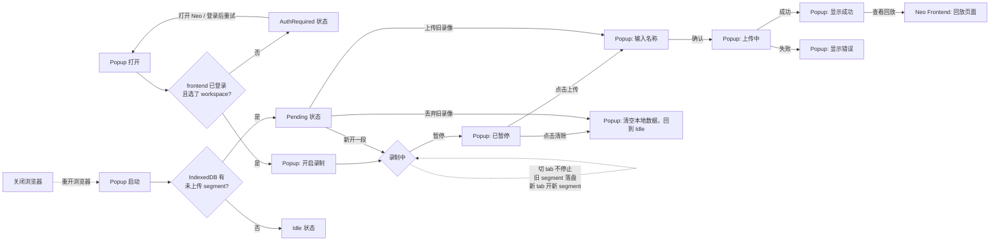
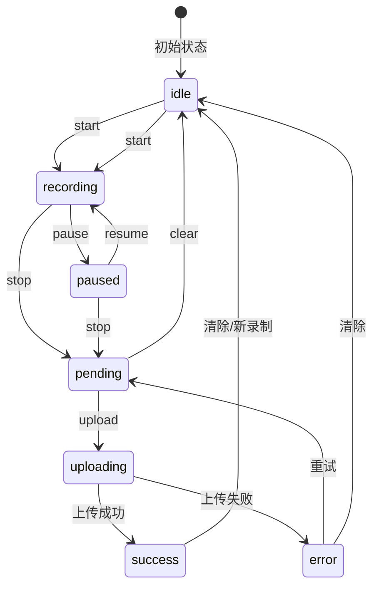

## 名词解释

- 目标软件：也就是chrome 扩展被嵌入的网站

## 🎯 功能概述

- **前置条件**：用户必须先在 Neo Frontend 登录并选择了工作区。Agent Steer 通过嵌入 frontend 的隐藏 iframe 复用登录态获取 token 和 workspace 信息。未登录或未选 workspace 时，Popup 会提示用户去登录。
- 是否开启录制：用户打开目标软件后，插件被加载，可通过popup选择是否开启录制
- 记录：开启录制后，Agent Steer会每10分钟录制一个rrweb录像，存储到本地 IndexedDB
- 上传录像：用户通过Agent Steer界面，点击上传录像，输入录像名称，将录像保存
- 查看回放：跳转回neo的frontend页面
- 标注： TODO 暂时不做

## UI 设计

### 操作入口

所有录像操作（开启录制、暂停、继续、上传、清除）均在 Chrome **Popup 页面**完成。

### 录制状态

用户在 Popup 中开启录制后，显示当前录制状态：

```
┌─────────────────────────────┐
│  🔧 Agent Steer              │
├─────────────────────────────┤
│                              │
│  ● 录制中                    │
│                              │
│  时长: 00:15:32             │
│  片段: 2 个                  │
│                              │
│  [ 暂停 ]                    │
│                              │
└─────────────────────────────┘
```

### 暂停状态

用户暂停后，显示上传按钮：

```
┌─────────────────────────────┐
│  🔧 Agent Steer              │
├─────────────────────────────┤
│                              │
│  ⏸ 已暂停                    │
│                              │
│  时长: 00:15:32             │
│  片段: 2 个                  │
│                              │
│  [ 继续录制 ]  [ 上传 ]  [ 清除 ]   │
│                              │
└─────────────────────────────┘
```

### 上传流程

用户点击"上传"后：

```
┌─────────────────────────────┐
│  🔧 Agent Steer              │
├─────────────────────────────┤
│                              │
│  录像名称:                   │
│  ┌───────────────────────┐  │
│  │                       │  │
│  └───────────────────────┘  │
│                              │
│  [ 取消 ]     [ 确认上传 ]   │
│                              │
└─────────────────────────────┘
```

上传成功后：

```
┌─────────────────────────────┐
│  🔧 Agent Steer              │
├─────────────────────────────┤
│                              │
│  ✅ 上传成功                  │
│                              │
│  [ 查看回放 ]                │
│                              │
└─────────────────────────────┘
```

### 查看回放

点击"查看回放"后，跳转到 Neo Frontend 页面。

### 操作流程



### AuthRequired 状态

用户未登录 Neo Frontend 或未选择工作区时显示：

```
┌─────────────────────────────┐
│  🔧 Agent Steer              │
├─────────────────────────────┤
│                              │
│  ⚠️ 请先登录 Neo              │
│                              │
│  打开 Neo 并登录后重新打开    │
│  此弹窗                       │
│                              │
│  [ 打开 Neo ]  [ 重试 ]      │
│                              │
└─────────────────────────────┘
```

变体：未选工作区时显示"请先在 Neo 中选择工作区"；iframe 5s 超时时显示"无法连接到 Neo，请检查网络" + 重试按钮。

## 状态机设计

### 问题背景

早期实现使用 `isRecording` + `isPaused` 两个布尔值来表示状态：

```typescript
interface RecordingState {
  isRecording: boolean;
  isPaused: boolean;
  // ...
}
```

这会导致 **4 种状态组合**，其中一种是无效状态：

| isRecording | isPaused | 含义 | 有效性 |
|-------------|----------|------|--------|
| false | false | 空闲 | ✅ 有效 |
| true | false | 录制中 | ✅ 有效 |
| true | true | 已暂停 | ✅ 有效 |
| **false** | **true** | **无效状态** | ❌ 不可能 |

### 设计方案

使用单一的 `status` 枚举来表示当前状态，消除无效状态：

```typescript
/**
 * 录制状态枚举
 * - idle: 空闲状态，未开始录制
 * - recording: 录制中
 * - paused: 已暂停（可继续或停止）
 * - pending: 已停止（数据就绪，可上传或清除）
 * - uploading: 上传中
 * - success: 上传成功
 * - error: 错误状态
 */
type RecordingStatus =
  | 'idle'
  | 'recording'
  | 'paused'
  | 'pending'
  | 'uploading'
  | 'success'
  | 'error';

interface RecordingState {
  status: RecordingStatus;
  duration: number;       // 录制时长（毫秒）
  segmentCount: number;   // 片段数量
  eventCount: number;     // 事件总数
  sessionId?: string;     // 当前会话 ID
  startTime?: number;     // 开始录制的时间戳
  error?: string;         // 错误信息（error 状态时使用）
  uploadProgress?: number; // 上传进度（uploading 状态时使用）
}
```

### 状态流转图



### 状态详细说明

| 状态 | 描述 | 可执行操作 |
|------|------|-----------|
| `idle` | 空闲，未开始录制 | `start` |
| `recording` | 正在录制 | `pause`, `stop` |
| `paused` | 录制已暂停 | `resume`, `stop`, `upload`, `clear` |
| `pending` | 录制已停止，数据就绪 | `upload`, `clear`, `start`（新开一段） |
| `uploading` | 正在上传 | 无（等待完成或失败） |
| `success` | 上传成功 | `clear`, `start` |
| `error` | 发生错误 | `clear`, `retry` |

### UI 视图映射

每个状态对应一个 UI 视图：

| 状态 | Popup 视图 | 说明 |
|------|-----------|------|
| `idle` | IdleView | 显示"开始录制"按钮 |
| `recording` | RecordingView | 显示"暂停"、"停止"按钮，时长实时更新 |
| `paused` | PausedView | 显示"继续"、"上传"、"清除"按钮 |
| `pending` | PendingView | 同 PausedView，可上传旧数据或新开录制 |
| `uploading` | UploadProgressView | 显示上传进度 |
| `success` | SuccessView | 显示成功消息和"查看回放"按钮 |
| `error` | ErrorView | 显示错误信息，可重试或清除 |
| `AuthRequired` | AuthView | 未登录或未选工作区（独立于录制状态） |

### 优点

1. **消除无效状态**：不存在矛盾的状态组合
2. **语义清晰**：`status` 直接表示当前处于哪个阶段
3. **易于扩展**：添加新状态只需在枚举中加一项
4. **便于调试**：状态流转日志更清晰
5. **统一管理**：状态验证和转换逻辑集中处理

### 关键交互

| 交互 | 状态转换 | 说明 |
|------|---------|------|
| 开启录制 | `idle` → `recording` | Popup 中点击开始，Content Script 开始录制 |
| 暂停录制 | `recording` → `paused` | 暂停当前录制，显示上传按钮 |
| 继续录制 | `paused` → `recording` | 继续当前录制片段 |
| 停止录制 | `recording`/`paused` → `pending` | 停止录制，数据就绪 |
| 上传 | `pending` → `uploading` → `success`/`error` | 输入名称后上传到 Neo |
| 清除 | `pending`/`success`/`error` → `idle` | 删除本地已录制的 segment 数据（不可恢复） |
| 重新录制 | `pending` → `recording` | 在已有数据基础上新开一段 |
| 切 tab | `recording` → `recording` | 录制不停止；当前 segment 落盘，新 tab 自动开新 segment（同一 session 跨 URL 连续） |
| 浏览器重启 | `pending` | popup 启动时检测 IndexedDB；如有未上传 segment，显示 Pending 状态 |
| 查看回放 | - | 跳转到 Neo Frontend 页面 |

