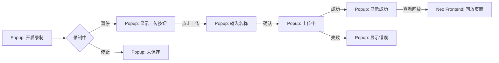

## 名词解释

- 目标软件：也就是chrome 扩展被嵌入的网站

## 🎯 功能概述

- 是否开启录制：用户打开目标软件后，插件被加载，可通过popup选择是否开启录制
- 记录：开启录制后，Agent Steer会每10分钟录制一个rrweb录像，存储到内存里
- 上传录像：用户通过Agent Steer界面，点击上传录像，输入录像名称，将录像保存
- 查看回放：跳转回neo的frontend页面
- 标注： TODO 暂时不做

## UI 设计

### 操作入口

所有录像操作（开启录制、暂停、上传）均在 Chrome **Popup 页面**完成。

### 录制状态

用户在 Popup 中开启录制后，显示当前录制状态：

```
┌─────────────────────────────┐
│  🔧 Agent Steer              │
├─────────────────────────────┤
│                              │
│  ● 录制中                    │
│                              │
│  时长: 00:15:32             │
│  片段: 2 个                  │
│                              │
│  [ 暂停 ]                    │
│                              │
└─────────────────────────────┘
```

### 暂停状态

用户暂停后，显示上传按钮：

```
┌─────────────────────────────┐
│  🔧 Agent Steer              │
├─────────────────────────────┤
│                              │
│  ⏸ 已暂停                    │
│                              │
│  时长: 00:15:32             │
│  片段: 2 个                  │
│                              │
│  [ 继续录制 ]  [ 上传 ]      │
│                              │
└─────────────────────────────┘
```

### 上传流程

用户点击"上传"后：

```
┌─────────────────────────────┐
│  🔧 Agent Steer              │
├─────────────────────────────┤
│                              │
│  录像名称:                   │
│  ┌───────────────────────┐  │
│  │                       │  │
│  └───────────────────────┘  │
│                              │
│  [ 取消 ]     [ 确认上传 ]   │
│                              │
└─────────────────────────────┘
```

上传成功后：

```
┌─────────────────────────────┐
│  🔧 Agent Steer              │
├─────────────────────────────┤
│                              │
│  ✅ 上传成功                  │
│                              │
│  [ 查看回放 ]                │
│                              │
└─────────────────────────────┘
```

### 查看回放

点击"查看回放"后，跳转到 Neo Frontend 页面。

### 操作流程



### 关键交互

| 交互 | 说明 |
|------|------|
| 开启录制 | Popup 中点击开始，Content Script 开始录制 |
| 暂停录制 | 暂停当前录制，显示上传按钮 |
| 继续录制 | 继续当前录制片段 |
| 上传 | 输入名称后上传到 Neo |
| 查看回放 | 跳转到 Neo Frontend 页面 |

