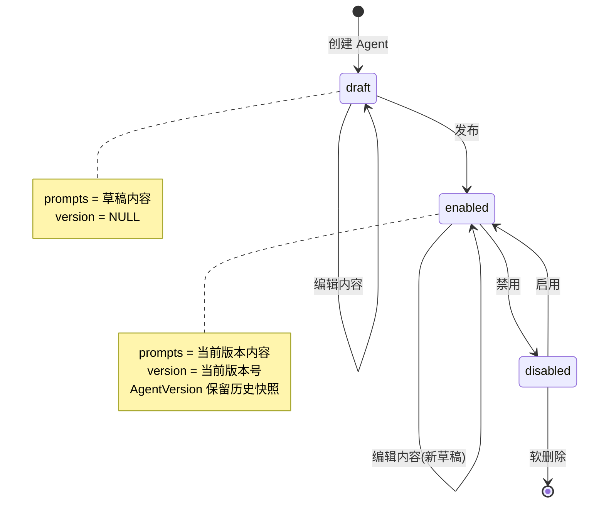
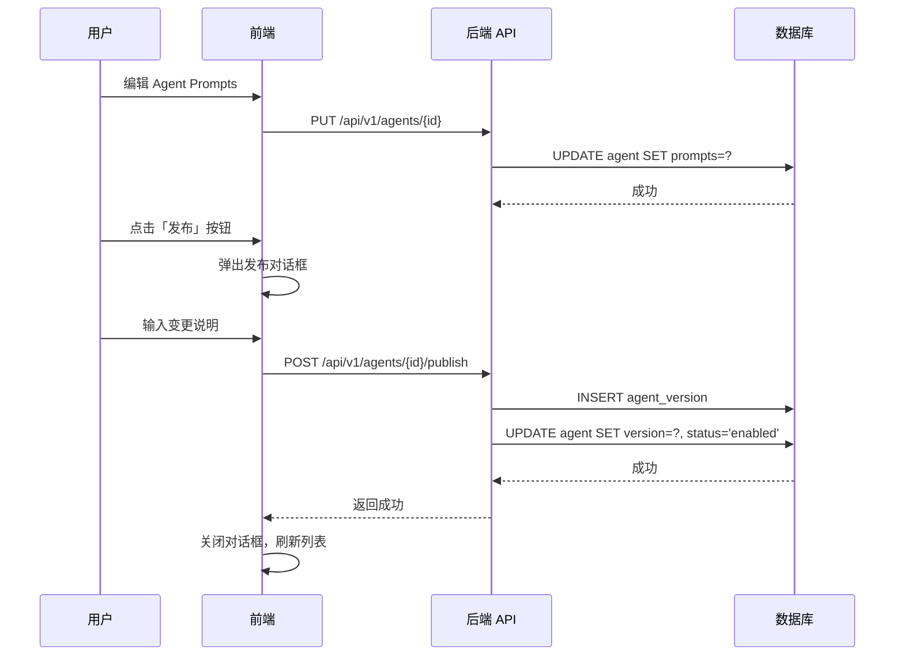
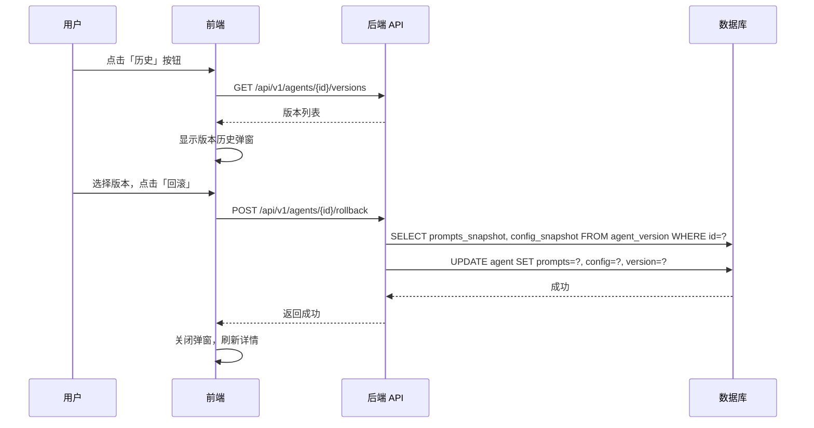

## 🎯 产品概述

### 1.1 功能范围

本文介绍 Neo 系统中 Agents 是如何被管理的，包括：

- 如何定义 Agent 原型
- 如何配置 Agent 的认知和行为模式
- 如何发布和回滚版本

**不包括**：Agent 如何调度和运行任务（由 Agent Task Manager 处理）

### 1.2 核心价值

| 价值点     | 说明                             |
| ---------- | -------------------------------- |
| **可配置** | 通过 Prompts 灵活定义 Agent 行为 |
| **版本化** | 完整的历史记录，支持回滚         |
| **模块化** | Prompts 按类型分层，职责清晰     |

---

## 📊 数据模型

### 2.1 Agent 实体

| 属性          | 类型              | 约束                    | 说明             |
| ------------- | ----------------- | ----------------------- | ---------------- |
| `id`          | BigInteger        | PK, 自增                | 唯一标识符       |
| `code`        | String(100)       | UK, NOT NULL, 索引      | Agent 唯一标识符 |
| `name`        | String(200)       | NOT NULL                | 展示名称         |
| `description` | Text              | NULL                    | 描述信息         |
| `version`     | String(50)        | NULL                    | 当前发布的版本号 |
| `model`       | String(100)       | NOT NULL                | 模型配置         |
| `prompts`     | JSON              | NOT NULL, 默认 `{}`     | 提示词配置       |
| `status`      | Enum(AgentStatus) | NOT NULL, 默认 draft    | 状态             |
| `created_by`  | BigInteger        | FK → users.id, NOT NULL | 创建人           |
| `created_at`  | DateTime          | NOT NULL                | 创建时间         |
| `updated_at`  | DateTime          | NOT NULL                | 更新时间         |

### 2.2 AgentVersion 实体

| 属性               | 类型       | 约束                    | 说明               |
| ------------------ | ---------- | ----------------------- | ------------------ |
| `id`               | BigInteger | PK, 自增                | 唯一标识符         |
| `agent_id`         | BigInteger | FK → agent.id, NOT NULL | 关联的 Agent       |
| `version`          | String(50) | NOT NULL                | 版本号，如 `1.0.0` |
| `prompts_snapshot` | JSON       | NOT NULL                | 发布时的提示词快照 |
| `config_snapshot`  | JSON       | NOT NULL                | 发布时的配置快照   |
| `change_summary`   | Text       | NULL                    | 变更说明           |
| `created_by`       | BigInteger | FK → users.id, NOT NULL | 发布人             |
| `created_at`       | DateTime   | NOT NULL                | 发布时间           |

### 2.3 枚举值说明

**AgentStatus (状态)**

| 值         | 说明                    |
| ---------- | ----------------------- |
| `draft`    | 草稿 - 初始状态，可编辑 |
| `enabled`  | 启用 - 已发布，可被调用 |
| `disabled` | 禁用 - 已下线，不可调用 |

---

## 💭 AgentPromptType 提示词类型

### 3.1 类型定义

```python
class AgentPromptType(str, Enum):
    # Layer 1: Cognition - 解决"怎么思考"
    SOUL = "soul"           # 核心灵魂：定义 Agent 的基本性格、价值观和行为准则
    MEMORY = "memory"       # 记忆机制：定义 Agent 如何存储和检索过往经验
    REASONING = "reasoning" # 推理方式：定义 Agent 的思考链和问题解决模式

    # Layer 2: Organization - 解决"怎么协作"
    AGENTS = "agents"       # 多智能体：定义多 Agent 协作时的角色分工
    WORKFLOW = "workflow"    # 工作流程：定义任务执行的标准流程和步骤
    COMMUNICATION = "communication"  # 沟通方式：定义 Agent 与用户交互规范
```

### 3.2 分层说明

| 层级                | 类型                            | 解决的问题            |
| ------------------- | ------------------------------- | --------------------- |
| **Layer 1: 认知层** | SOUL, MEMORY, REASONING         | 解决 Agent "怎么思考" |
| **Layer 2: 组织层** | AGENTS, WORKFLOW, COMMUNICATION | 解决 Agent "怎么协作" |

### 3.3 prompts 结构示例

```json
{
  "soul": "...markdown content...",
  "memory": "...markdown content...",
  "reasoning": "...markdown content...",
  "agents": "...markdown content...",
  "workflow": "...markdown content...",
  "communication": "...markdown content..."
}
```

---

## 🔄 状态机

### 4.1 状态流转图



### 4.2 关键操作说明

| 操作     | 触发条件         | 前置状态        | 后置效果                                                  |
| -------- | ---------------- | --------------- | --------------------------------------------------------- |
| **创建** | 用户点击新建     | -               | 生成 draft 状态的 Agent                                   |
| **编辑** | 用户编辑 Prompts | draft / enabled | 更新 prompts，内容版本不变                                |
| **发布** | 用户点击发布     | draft / enabled | 创建 AgentVersion 快照，更新 version，设置 status=enabled |
| **禁用** | 管理员禁用       | enabled         | 设置 status=disabled                                      |
| **启用** | 管理员启用       | disabled        | 设置 status=enabled                                       |
| **回滚** | 选择历史版本     | enabled         | 从 AgentVersion 恢复内容和配置                            |

---

## 🔌 API 路由设计

### 5.1 路由列表

```
/api/v1/agents
├── GET    /                         # 列表
├── POST   /                         # 创建
├── GET    /{id}                     # 详情
├── PUT    /{id}                     # 更新（包含 prompts）
├── DELETE /{id}                     # 删除（仅 draft）
├── POST   /{id}/publish             # 发布新版本
├── GET    /{id}/versions            # 版本历史
└── POST   /{id}/rollback            # 回滚到指定版本
```

### 5.2 核心 API 说明

| 方法     | 路径                           | 说明                              |
| -------- | ------------------------------ | --------------------------------- |
| `GET`    | `/api/v1/agents`               | 获取 Agent 列表，支持分页、筛选   |
| `POST`   | `/api/v1/agents`               | 创建新 Agent，初始状态为 draft    |
| `GET`    | `/api/v1/agents/{id}`          | 获取 Agent 详情，包含当前 prompts |
| `PUT`    | `/api/v1/agents/{id}`          | 更新 Agent 内容和配置（草稿状态） |
| `DELETE` | `/api/v1/agents/{id}`          | 删除 Agent（仅支持 draft 状态）   |
| `POST`   | `/api/v1/agents/{id}/publish`  | 发布当前草稿为新版本              |
| `GET`    | `/api/v1/agents/{id}/versions` | 获取版本历史列表                  |
| `POST`   | `/api/v1/agents/{id}/rollback` | 回滚到指定版本                    |

---

## 📝 发布与回滚流程

### 6.1 发布流程



**发布约束**：

- 版本号自动递增（如 1.0.0 → 1.0.1）
- change_summary (变更说明) 为必填项
- 发布后 Agent.status 变为 enabled

### 6.2 回滚流程



**回滚特性**：

- 回滚是复制操作，不删除目标版本
- 回滚后 prompts 变为历史版本内容
- version 更新为回滚的版本号
- 保留回滚历史，可再次回滚

---

## 🎨 设计决策

### 7.1 Prompts 直接存储

**决定**：Agent 表直接用 `prompts: JSON` 字段存储所有提示词内容，不再单独关联表。

**理由**：

- Prompts 和 Agent 版本天然一致，无需单独维护映射关系
- 简化数据模型，减少关联查询
- 编辑时无需关心版本管理

### 7.2 使用 BIGINT 自增主键

**决定**：所有表使用 BIGINT 自增主键，替代 UUID。

**理由**：

- 更简洁的 API URL
- 更易调试
- MySQL 索引性能更好

### 7.3 版本号自动递增

**决定**：发布时版本号自动递增（如 1.0.0 → 1.0.1）。

**理由**：

- 用户无需关心版本号规范
- 避免版本号冲突
- 简化发布流程

---

## ⚠️ 设计约束

| 约束         | 说明                                                |
| ------------ | --------------------------------------------------- |
| Prompts 长度 | 使用 TEXT 类型，最大 65535 字节；超长内容需考虑压缩 |
| JSON 验证    | 应用层校验 prompts 必须包含所有必需 type            |
| 删除限制     | 仅 draft 状态的 Agent 可删除                        |
| 状态切换     | enabled ↔ disabled 可互相切换                       |

---

## 🔗 相关文档

- [Agents 设计概述](./agents-overview)
- [Agent 嵌入](./agent-ingest)
- [Agent 任务系统设计](./agent-task-design)
