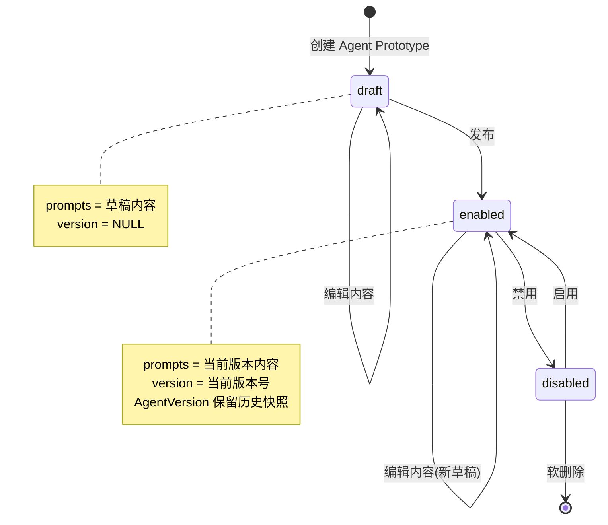

## 🎯 产品概述

### Agent Prototype 是什么

Agent ProtoType 并不是真正可以运行的Agent，只是Agent的草稿或者图纸，可以使用Agent ProtoType创建Agent。

### Agent Factory 是什么

Agent Factory根据Agent ProtoType生产Agent。因为Agent Factory必须结合workspace才能构建Agent，而这不是本文的重点，所以本文不会赘述Agent Factory。

### 1.1 功能范围

本文介绍 Neo 系统中 Agent Prototype 的概念和设计。

**不包括**：Agent 如何调度和运行任务（由 Agent Task Manager 处理）

### 1.2 核心价值

| 价值点     | 说明                             |
| ---------- | -------------------------------- |
| **可配置** | 通过 Prompts 灵活定义 Agent 行为 |
| **版本化** | 完整的历史记录，支持回滚         |
| **模块化** | Prompts 按类型分层，职责清晰     |

---

## 🔄 状态机

### 2.1 状态流转图

### 2.2 关键操作说明

| 操作     | 触发条件         | 前置状态        | 后置效果                                                  |
| -------- | ---------------- | --------------- | --------------------------------------------------------- |
| **创建** | 用户点击新建     | -               | 生成 draft 状态的 Agent Prototype                         |
| **编辑** | 用户编辑 Prompts | draft / enabled | 更新 prompts，内容版本不变                                |
| **发布** | 用户点击发布     | draft / enabled | 创建 AgentVersion 快照，更新 version，设置 status=enabled |
| **禁用** | 禁用             | enabled         | 设置 status=disabled                                      |
| **启用** | 启用             | disabled        | 设置 status=enabled                                       |
| **回滚** | 选择历史版本     | enabled         | 从 AgentVersion 恢复内容和配置                            |

---

## 🔗 相关文档

- [Agent 数据库设计](../technical/agents/agent-database-design) - 详细的数据模型定义
- [Agent 提示词设计](./agent-prompt-design) - 提示词配置结构和使用指南
- [Agent 嵌入](./agent-ingest)
- [Agent 任务系统设计](./agent-task-design)
- [Agent Prototype 管理设计](../admin/agent-prototype-management) - 版本管理和发布操作指南
