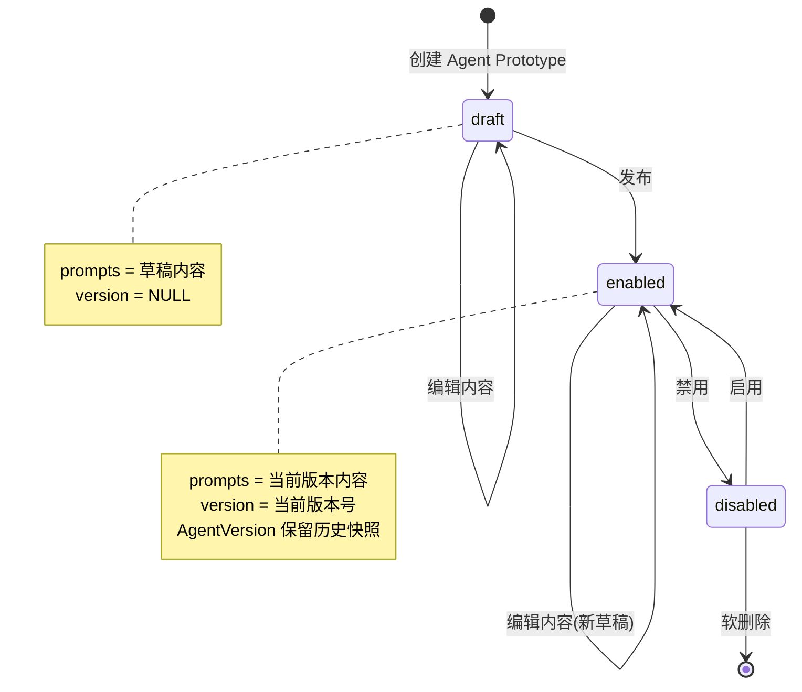
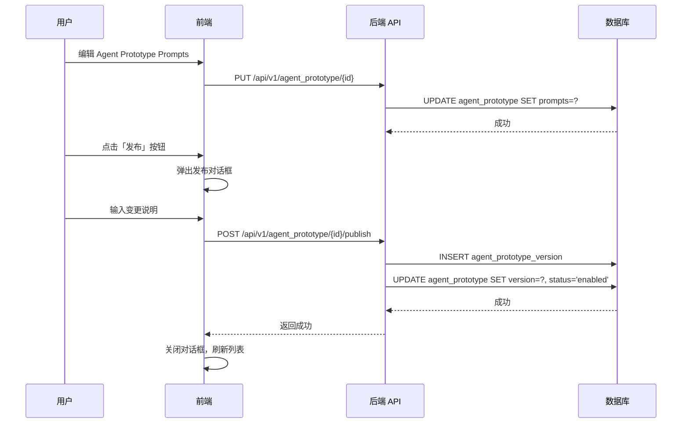
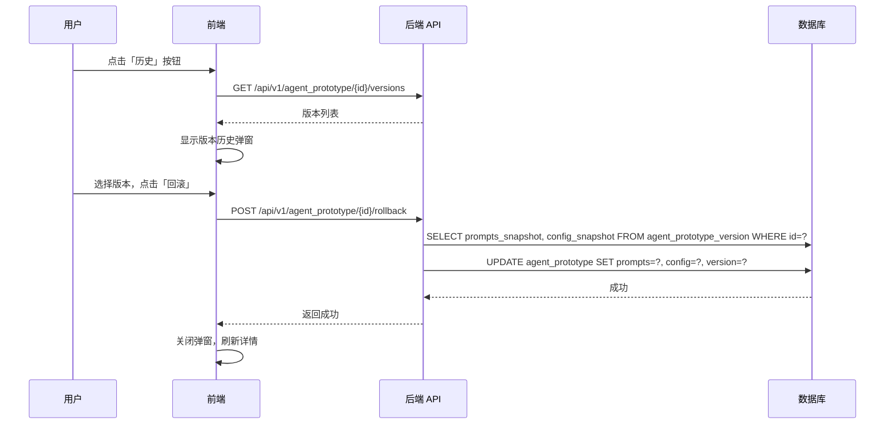

## 🎯 产品概述

### Agent Prototype 是什么

Agent ProtoType 并不是真正真正可以运行的Agent，只是Agent的草稿或者图纸，可以使用Agent ProtoType创建Agent。

### Agent Factory 是什么

Agent Factory根据Agent ProtoType生产Agent。因为Agent Factory必须结合workspace才能构建Agent，而这不是本文的重点，所以本文不会赘述Agent Factory。

### 1.1 功能范围

本文介绍 Neo 系统中 Agent Prototype 是如何被管理的，包括：

- 如何定义 Agent ProtoType
- 如何发布和回滚版本

**不包括**：Agent 如何调度和运行任务（由 Agent Task Manager 处理）

### 1.2 核心价值

| 价值点     | 说明                             |
| ---------- | -------------------------------- |
| **可配置** | 通过 Prompts 灵活定义 Agent 行为 |
| **版本化** | 完整的历史记录，支持回滚         |
| **模块化** | Prompts 按类型分层，职责清晰     |

---

## 🔄 状态机

### 2.1 状态流转图



### 2.2 关键操作说明

| 操作     | 触发条件         | 前置状态        | 后置效果                                                  |
| -------- | ---------------- | --------------- | --------------------------------------------------------- |
| **创建** | 用户点击新建     | -               | 生成 draft 状态的 Agent Prototype                         |
| **编辑** | 用户编辑 Prompts | draft / enabled | 更新 prompts，内容版本不变                                |
| **发布** | 用户点击发布     | draft / enabled | 创建 AgentVersion 快照，更新 version，设置 status=enabled |
| **禁用** | 禁用             | enabled         | 设置 status=disabled                                      |
| **启用** | 启用             | disabled        | 设置 status=enabled                                       |
| **回滚** | 选择历史版本     | enabled         | 从 AgentVersion 恢复内容和配置                            |

---

## 🔌 API 路由设计

### 3.1 路由列表

```
/api/v1/agent_prototype
├── GET    /                         # 列表
├── POST   /                         # 创建
├── GET    /{id}                     # 详情
├── PUT    /{id}                     # 更新（包含 prompts）
├── DELETE /{id}                     # 删除（仅 draft）
├── POST   /{id}/publish             # 发布新版本
├── GET    /{id}/versions            # 版本历史
└── POST   /{id}/rollback            # 回滚到指定版本
```

### 3.2 核心 API 说明

| 方法     | 路径                                    | 说明                                        |
| -------- | --------------------------------------- | ------------------------------------------- |
| `GET`    | `/api/v1/agent_prototype`               | 获取 Agent Prototype 列表，支持分页、筛选   |
| `POST`   | `/api/v1/agent_prototype`               | 创建新 Agent Prototype，初始状态为 draft    |
| `GET`    | `/api/v1/agent_prototype/{id}`          | 获取 Agent Prototype 详情，包含当前 prompts |
| `PUT`    | `/api/v1/agent_prototype/{id}`          | 更新 Agent Prototype 内容和配置（草稿状态） |
| `DELETE` | `/api/v1/agent_prototype/{id}`          | 删除 Agent Prototype（仅支持 draft 状态）   |
| `POST`   | `/api/v1/agent_prototype/{id}/publish`  | 发布当前草稿为新版本                        |
| `GET`    | `/api/v1/agent_prototype/{id}/versions` | 获取版本历史列表                            |
| `POST`   | `/api/v1/agent_prototype/{id}/rollback` | 回滚到指定版本                              |

---

## 📝 发布与回滚流程

### 4.1 发布流程



**发布约束**：

- 版本号自动递增（如 1.0.0 → 1.0.1）
- change_summary (变更说明) 为必填项
- 发布后 Agent Prototype.status 变为 enabled

### 4.2 回滚流程



**回滚特性**：

- 回滚是复制操作，不删除目标版本
- 回滚后 prompts 变为历史版本内容
- version 更新为回滚的版本号
- 保留回滚历史，可再次回滚

## 🔗 相关文档

- [Agent 数据库设计](../technical/agents/agent-database-design) - 详细的数据模型定义
- [Agent 提示词设计](./agent-prompt-design) - 提示词配置结构和使用指南
- [Agent 嵌入](./agent-ingest)
- [Agent 任务系统设计](./agent-task-design)
