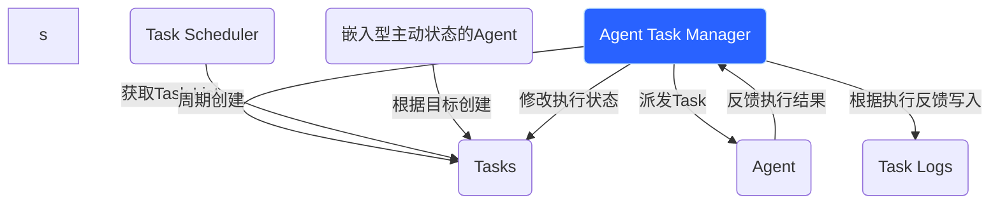

## 🎯 产品概述

### Agents 定义

Agents combine language models with tools to create systems that can reason about tasks, decide which tools to use, and iteratively work towards solutions.

```mermaid theme={"theme":{"light":"catppuccin-latte","dark":"catppuccin-mocha"}}
%%{
  init: {
    "fontFamily": "monospace",
    "flowchart": {
      "curve": "curve"
    }
  }
}%%
graph TD
  %% Outside the agent
  QUERY([input])
  LLM{model}
  TOOL(tools)
  ANSWER([output])

  %% Main flows (no inline labels)
  QUERY --> LLM
  LLM --"action"--> TOOL
  TOOL --"observation"--> LLM
  LLM --"finish"--> ANSWER

  classDef blueHighlight fill:#E5F4FF,stroke:#006DDD,color:#030710;
  classDef greenHighlight fill:#F6FFDB,stroke:#6E8900,color:#2E3900;
  class QUERY blueHighlight;
  class ANSWER blueHighlight;
  class LLM greenHighlight;
  class TOOL greenHighlight;
```

### Agents 在Neo系统中是如何运作的

#### 实体关系



#### 实体介绍

##### Agent Task Manager | Agent任务管理器

> **说明**：这是 service 层组件，不属于任何 workspace，负责协调任务流转。

- 获取`Tasks`列表
- 将`Tasks` delegate 给`Agents`
- 根据`Agents`执行结果修改`Tasks`的状态
- 将执行结果写入`Task Logs`

##### Task Scheduler

- 根据定义的周期任务配置周期的创建`Tasks`

##### [嵌入型主动状态的Agent](./agent-ingest)

- 根据目标创建`Tasks`（Agent 可以主动创建任务，创建的任务归属于 Agent 的 owner）

##### Agents

- 执行`Tasks`
- 将执行结果反馈给`Agent Task Manager`

##### Task Logs

存储执行结果

---

## 🔗 相关文档

- [ Agent 任务系统设计 ](./agent-task-design)
- [ Agent 嵌入 ](./agent-ingest)
- [ Workspace 技术设计 ](../technical/workspace技术设计)
