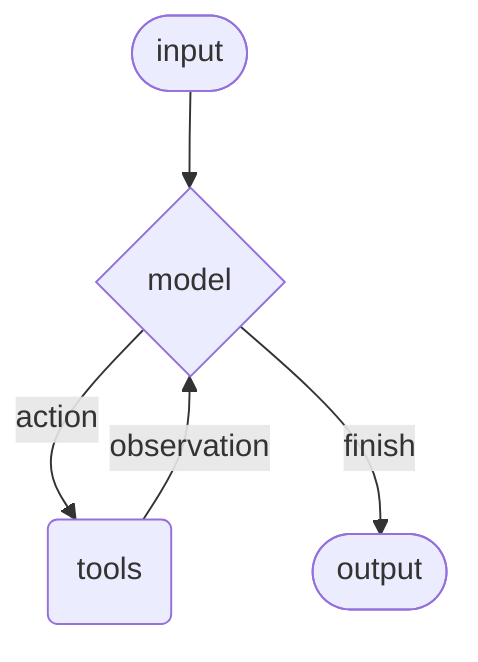
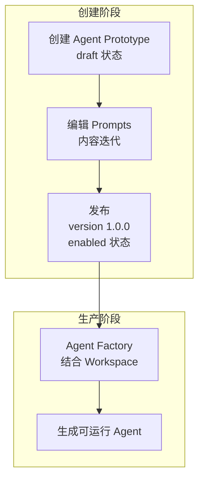
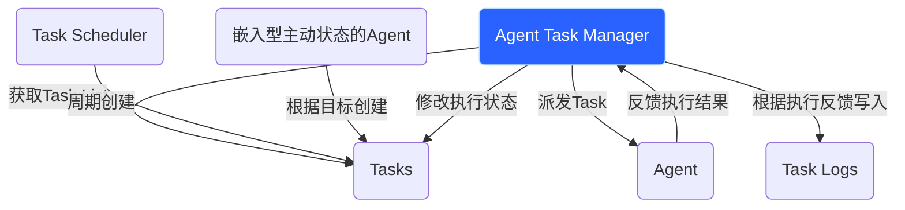

## 🎯 产品概述

### Agents 定义

Agents combine language models with tools to create systems that can reason about tasks, decide which tools to use, and iteratively work towards solutions.

### Agents 在Neo系统中是如何运作的

#### Agent 创建流程

#### 实体关系

#### 实体介绍

##### Agent Task Manager | Agent任务管理器

> **说明**：这是 service 层组件，不属于任何 workspace，负责协调任务流转。

- 获取`Tasks`列表
- 将`Tasks` delegate 给`Agents`
- 根据`Agents`执行结果修改`Tasks`的状态
- 将执行结果写入`Task Logs`

##### Task Scheduler

- 根据定义的周期任务配置周期的创建`Tasks`

##### [嵌入型主动状态的Agent](./agent-ingest)

- 根据目标创建`Tasks`（Agent 可以主动创建任务，创建的任务归属于 Agent 的 owner）

##### Agents

- 执行`Tasks`
- 将执行结果反馈给`Agent Task Manager`

##### Task Logs

存储执行结果

## 🔧 Agent 创建流程

| 阶段     | 产物            | 状态            | 说明                                       |
| -------- | --------------- | --------------- | ------------------------------------------ |
| **设计** | Agent Prototype | draft → enabled | 定义 Prompts，可发布多个版本               |
| **生产** | Agent           | 运行态          | 由 Factory 根据 Prototype + Workspace 生成 |

**相关文档**：

- [Agent Prototype 管理设计](./agent-prototype-management) - 如何定义和版本化管理 Prototype
- [Agent Factory](./workspaces/agent-factory) - 如何生产可运行的 Agent（待完善）

---

## 🔗 相关文档

- [ Agent Prototype 管理设计 ](./agent-prototype-management)
- [ Agent 任务系统设计 ](./agent-task-design)
- [ Agent 嵌入 ](./agent-ingest)
- [ Workspace 技术设计 ](../technical/workspace技术设计)
