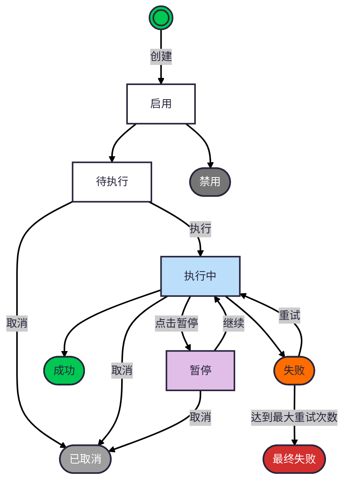

## 📐 UI 原型

[查看 UI 原型 →]()

---

## 🎯 产品概述

### Agent任务定义

Agent任务是一种分配给Agent执行的任务，可以是一段提示词组成的任务描述，也可以是一个更复杂的表现形式的任务，比如任务链或者DAG形式的任务。

### 任务创建方式

- Agent拥有者通过[Agent嵌入](./agent嵌入) 临时创建的任务
- Agent拥有者创建的周期任务
- 其他用户分配的派发任务

### 任务属性

- 创建人
- workspaceId: 工作区id。 查看[workspace设计](./workspace)
- 创建时间
- 优先级: 高、中、低
- 任务类型：临时任务、周期任务、派发任务
- 任务描述：任务的简要描述
- 任务内容：一段markdown文档
- 执行状态：待执行、执行中、暂停、成功、失败
- 状态：禁用、启用
- 重试设计：
  - 是否可以重试
  - 最大重试次数
  - 重试间隔时间
- 反馈webhook的url：任务执行完成后的反馈地址

### 任务执行产物和反馈

每次任务执行，将产生一条记录，如果是派发任务，将执行结果反馈给派发任务方

#### 任务执行记录属性

- 任务id
- 创建时间
- 任务开始时间
- 任务结束时间
- 任务执行录像：rrweb记录的录像url
- 任务结果
- 失败原因

#### 任务反馈方式

以webhook的方式将`任务执行记录`反馈给派发任务方

### 业务约束和假设

- 任务不能被删除，但是可以被禁用，以便追踪
- 任务成功后，不能再次执行

### 任务的状态机

### 业务目标

通过Agent任务系统，完成任务的创建、修改、分配、执行、反馈

### 非业务目标

Agent任务的执行逻辑不是本次设计的重点，包括如何设定skill、角色，如何调用大模型等都不在本次设计范畴

## 👤 用户角色与故事

### 用户角色

| 角色        | 描述                                          |
| ----------- | --------------------------------------------- |
| Agent拥有者 | 创建临时任务、周期任务, 分配任务给别人的Agent |

### 故事一 在Agent嵌入 系统中添加、查看、管理任务

Agent拥有者在[Agent嵌入](./agent嵌入)目标系统中，添加临时任务到任务列表中, 按照优先级排序执行。

### 故事二

Agent拥有者在[workspace](./workspace)查看所有任务，包括他自己的和别人的，对于自己的任务，可以有一些非只读的操作。

## 功能列表

### 一、任务管理

| 功能          | 描述                                           | 优先级 |
| ------------- | ---------------------------------------------- | ------ |
| 创建临时任务  | 创建一次性执行的任务，支持设置优先级、任务内容 | P0     |
| 创建周期任务  | 创建定时重复执行的任务，支持 Cron 表达式配置   | P0     |
| 任务列表      | 查看任务列表，支持筛选和搜索                   | P0     |
| 任务详情      | 查看任务的完整信息和配置                       | P0     |
| 编辑任务      | 修改任务属性（优先级、描述、内容、重试策略等） | P0     |
| 禁用/启用任务 | 禁用任务用于追踪，启用后可重新执行             | P0     |

### 二、任务执行控制

| 功能         | 描述                                                     | 优先级 |
| ------------ | -------------------------------------------------------- | ------ |
| 手动触发执行 | 手动触发任务立即执行                                     | P0     |
| 暂停执行     | 正在执行的任务可以手动暂停                               | P0     |
| 继续执行     | 将暂停的任务恢复执行                                     | P0     |
| 取消执行     | 取消正在执行、待执行或暂停的任务，标记为已取消           | P0     |
| 重试失败任务 | 对失败任务进行重试（受最大重试次数限制）                 | P0     |
| 查看执行状态 | 实时查看任务执行状态（待执行、执行中、暂停、成功、失败） | P0     |

### 三、任务查询与筛选

| 功能           | 描述                                     | 优先级 |
| -------------- | ---------------------------------------- | ------ |
| 按任务类型筛选 | 筛选临时任务、周期任务、派发任务         | P0     |
| 按执行状态筛选 | 筛选待执行、执行中、暂停、成功、失败状态 | P0     |
| 按优先级筛选   | 筛选高、中、低优先级任务                 | P1     |
| 按创建人筛选   | 按任务创建人筛选                         | P1     |
| 按关键词搜索   | 搜索任务名称或描述中的关键词             | P1     |
| 按创建时间排序 | 按创建时间升序/降序排列                  | P0     |
| 按优先级排序   | 按优先级排序                             | P1     |

### 四、任务执行记录

| 功能         | 描述                                             | 优先级 |
| ------------ | ------------------------------------------------ | ------ |
| 执行记录列表 | 查看任务的所有执行历史记录                       | P0     |
| 执行记录详情 | 查看单次执行的详细信息（开始/结束时间、结果）    | P0     |
| 录像回放     | 播放 rrweb 录制的任务执行录像                    | P0     |
| Webhook 反馈 | 任务完成后自动回调通知（派发任务专用）【暂不做】 | P0     |

## 🎨 Agent 任务 UI 设计
