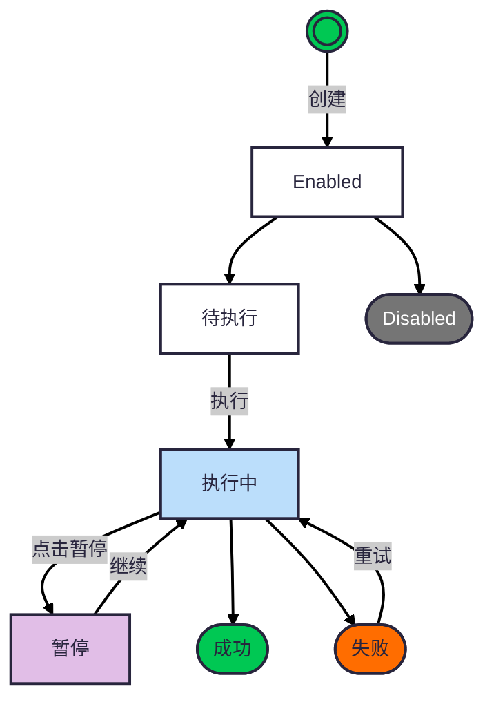

## 📐 UI 原型

[查看 UI 原型 →]()

---

## 🎯 产品概述

### Agent任务定义

Agent任务是一种分配给Agent执行的任务，可以是一段提示词组成的任务描述，也可以是一个更复杂的表现形式的任务，比如任务链或者DAG形式的任务。

### 任务创建方式

- Agent拥有者通过[Agent嵌入](/docs/product/agent-ingest) 临时创建的任务
- Agent拥有者创建的周期任务
- 其他用户分配的派发任务

### 任务属性

- 创建人
- workspaceId: 工作区id。 查看[workspace设计](/docs/product/workspace)
- 创建时间
- 优先级: 高、中、低
- 任务类型：临时任务、周期任务、派发任务
- 任务描述：任务的简要描述
- 任务内容：一段markdown文档
- 执行状态：待执行、执行中、暂停、成功、失败
- 状态：禁止、启用
- 重试设计：
  - 是否可以重试
  - 最大重试次数
  - 重试间隔时间
- 反馈webhook的url：任务执行完成后的反馈地址

### 任务执行产物和反馈

每次任务执行，将产生一条记录，如果是派发任务，将执行结果反馈给派发任务方

#### 任务执行记录属性

- 任务id
- 创建时间
- 任务开始时间
- 任务结束时间
- 任务执行录像：rrweb记录的录像url
- 任务结果

#### 任务反馈方式

以webhook的方式将`任务执行记录`反馈给派发任务方

### 业务约束和假设

- 任务不能被删除，但是可以被禁用，以便追踪
- 任务成功后，不能再次执行

### 任务的状态机

### 业务目标

通过Agent任务系统，完成任务的创建、修改、分配、执行、反馈

### 非业务目标

Agent任务的执行逻辑不是本次设计的重点，包括如何设定skill、角色，如何调用大模型等都不在本次设计范畴

## 👤 用户角色与故事

### 用户角色

| 角色     | 描述                                          |
| -------- | --------------------------------------------- |
| 一般员工 | 创建临时任务、周期任务, 分配任务给别人的Agent |

### 故事一 在Agent嵌入 系统中添加、查看、管理任务

一般员工在[Agent嵌入](/docs/product/agent-ingest)目标系统中，添加临时任务到任务列表中, 按照优先级排序执行。

### 故事二

一般员工在[workspace](/docs/product/workspace)查看所有任务，包括他自己的和别人的，对于自己的任务，可以有一些非只读的操作。

## 功能列表

## 🎨 Agent 任务 UI 设计
