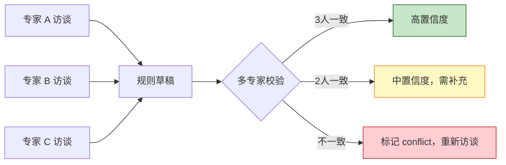
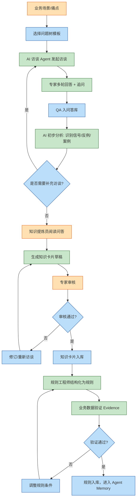
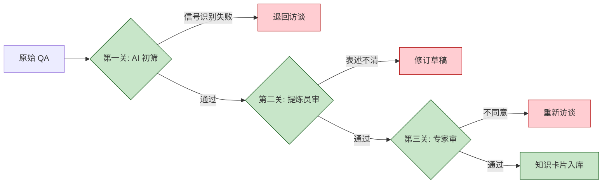

## 1. 概述

知识萃取（Knowledge Extraction）是**将问答库中的原始认知转化为结构化知识卡片、规则**的过程。本文档描述从"专家访谈"到"规则生成"的端到端流程。

### 1.1 萃取的本质

很多团队会把"知识萃取"等同于"AI 自动从文本提取信息"。这是错的。

正确的萃取是**三方的协作**：

```text
领域专家   → 提供原始认知（"我怎么看"）
AI Agent  → 辅助追问、结构化、生成草稿（"帮你提炼"）
知识提炼员 → 把关质量、补充上下文、关联案例（"确保对"）
```

任何缺失一方的流程，质量都会严重下降：

- 没专家 → 知识是 AI 编的
- 没 AI → 提炼效率极低
- 没人把关 → 知识充满错误

### 1.2 与传统 ETL 的类比

```text
传统数据：原始库 → ETL → 数据仓库 → 报表
本系统：  问答库  → 萃取  → 知识库/规则库 → Agent 执行
```

但有两个关键区别：

1. **不是全自动化**：必须有人工校对环节
2. **可回流**：执行反馈会回流到知识库，形成闭环

---

## 2. 萃取方法论

### 2.1 访谈方法：Critical Incident Technique（关键事件法）

这是知识管理领域的经典方法，由 John Flanagan 在 1954 年提出。

#### 2.1.1 核心思想

不抽象地问"你平时怎么做"，而是**问具体的关键事件**：

| 不好的问法 | 好的问法 |
| --- | --- |
| 你平时怎么做客户管理？ | 回忆最近一次**成交超预期**的客户，关键转折点是什么？ |
| 你怎么判断客户质量？ | 最近一次你判断失误的客户，当时哪里看走眼了？ |
| 你如何推进项目？ | 回忆一个**差点丢但最终救回来**的项目，你做了什么？ |

#### 2.1.2 事件类型模板

**成功案例**：

```text
回忆一个超预期成交案例：
1. 客户是什么情况？
2. 最关键转折点是什么？
3. 当时你为什么那么做？
4. 如果重来一次会怎么做？
```

**失败案例**：

```text
回忆一个失败案例：
1. 最早哪里出问题？
2. 当时为什么没发现？
3. 后来怎么看？
4. 当时有反常信号吗？
```

**判断失误**：

```text
回忆一次你判断错误的情况：
1. 你原本怎么判断的？
2. 实际发生了什么？
3. 偏差出在哪个环节？
4. 下次会怎么调整？
```

**反直觉案例**：

```text
回忆一个"按理说不行但实际成了"的案例：
1. 当时别人怎么看？
2. 你为什么坚持？
3. 关键变量是什么？
4. 这个变量能复制吗？
```

### 2.2 决策回溯（Decision Retrospective）

这是 Critical Incident 的强化版，专门挖"判断标准"。

#### 2.2.1 三连问

```text
最近成交的一单：
  → 为什么你当时觉得能成？
  → 你看到了什么信号？
  → 这些信号如何让你确信？

最近丢掉的一单：
  → 什么时候开始觉得危险？
  → 最早出现的信号是什么？
  → 为什么当时没及时处理？

最近一个客户流失：
  → 最早的信号是什么？
  → 如果重来一次会怎么介入？
```

#### 2.2.2 五要素挖法

每个决策尝试挖出五个要素：

```text
1. 触发事件（Trigger）：什么场景下做这个判断？
2. 观察信号（Signal）：看到/听到了什么？
3. 判断标准（Criterion）：凭什么这么判断？
4. 行动方案（Action）：判断后做了什么？
5. 结果验证（Outcome）：结果如何？反例是什么？
```

例如：

```yaml
trigger: "客户连续两次推迟会议"
signal:
  - "改会时间越来越长"
  - "不主动介绍与会者"
  - "对原方案不评论"
criterion: "决策人不出面 = 商机大概率假"
action: "主动申请见决策人，被拒则降级"
outcome:
  success: "大部分时候识别正确"
  counter_example: "1 例是客户内部政治，决策人故意回避"
```

### 2.3 边界挖掘（Boundary Mining）

规则的价值在于边界。必须主动挖反例。

#### 2.3.1 反例探针

```text
你刚才说"如果 A 就 B"，那：
  → 有没有 A 但不是 B 的情况？
  → 有没有不是 A 但也是 B 的情况？
  → 边界在哪里？A 加强到什么程度 B 才稳定？
```

#### 2.3.2 例外清单

```text
你刚才的规则：
  "客户连续 3 次改会 = 假商机"

例外清单：
  - 政府客户（节奏天然慢）
  - 大型集团（内部协调复杂）
  - 客户内部正在重组
  - 关键人出差 / 休假
```

### 2.4 多专家三角验证

同一规则必须经多专家验证：



---

## 3. 端到端萃取流程

### 3.1 流程总览



### 3.2 阶段详细说明

#### 阶段 1：场景识别与模板选择

**输入**：业务场景/痛点
**产出**：选中的问题树模板
**参与者**：知识提炼员

**关键问题**：

- 这是哪类决策？销售？客服？实施？
- 涉及哪类角色？销售总监？客服经理？
- 大概需要回答哪些问题？

#### 阶段 2：访谈采集（L1）

**输入**：问题树模板
**产出**：原始 QA 入库
**参与者**：领域专家 + AI 访谈 Agent

详见 [问答库产品设计 - AI 访谈 Agent](./q-a-library#42-ai-访谈-agent)

#### 阶段 3：AI 初步分析

**输入**：原始 QA
**产出**：结构化标注（信号、反例、案例候选）
**参与者**：AI

**AI 做的事**：

| 任务 | 说明 |
| --- | --- |
| 信号识别 | 识别回答中可结构化的信号词 |
| 反例标记 | 标记 "counter_example" 类型 QA |
| 案例提取 | 提取提到的真实案例 ID |
| 摘要生成 | 对每条 QA 生成一句话摘要 |
| 关联建议 | 推荐可能相关的其他 QA |

#### 阶段 4：知识提炼员整理

**输入**：已标注的 QA
**产出**：知识卡片草稿
**参与者**：知识提炼员（产品经理或资深业务人员）

**提炼员工作**：

1. 通读 QA 找出关键判断
2. 关联案例和反例
3. 撰写知识卡片草稿
4. 评估置信度
5. 提交专家审核

#### 阶段 5：专家审核

**输入**：知识卡片草稿
**产出**：审核通过的知识卡片
**参与者**：原始专家 + 至少 1 位其他专家

**审核要点**：

| 检查项 | 说明 |
| --- | --- |
| 表述是否准确 | 是否曲解了原意 |
| 条件是否完整 | 是否漏掉了关键条件 |
| 反例是否覆盖 | 反例是否列出 |
| 置信度是否合理 | 高/中/低是否合理 |

#### 阶段 6：规则化（L3）

**输入**：已审核的知识卡片
**产出**：可执行的规则
**参与者**：规则工程师 + AI 辅助

详见 [知识库与规则库产品设计 - 规则化](./knowledge-and-rule)

#### 阶段 7：业务数据验证（L3）

**输入**：规则
**产出**：Evidence（业务数据支撑）
**参与者**：系统 + 业务数据

**验证方式**：

```sql
-- 例如验证"连续 60 天无技术评估 = 商机大概率丢"
SELECT
  CASE
    WHEN days_since_last_tech_eval >= 60 THEN 'rule_match'
    ELSE 'rule_not_match'
  END as rule_group,
  AVG(CASE WHEN outcome = 'lost' THEN 1.0 ELSE 0.0 END) as lost_rate,
  COUNT(*) as sample_size
FROM opportunities
WHERE customer_type = 'enterprise_民营'
GROUP BY rule_group
```

输出：

| rule_group | lost_rate | sample_size |
| --- | --- | --- |
| rule_match | 0.73 | 156 |
| rule_not_match | 0.31 | 423 |

→ 规则有效，confidence 可上调。

#### 阶段 8：Agent 集成（L4）

**输入**：已验证规则
**产出**：Agent 可加载的规则
**参与者**：Agent 工程师

详见后续 Agent 集成文档（TODO）。

---

## 4. 萃取质量保障

### 4.1 三道质量关卡



### 4.2 反馈与回流

执行层反馈必须回流：

```text
Agent 触发规则 → 销售采纳建议
   ↓
销售反馈（采纳 / 未采纳 / 效果）
   ↓
写入 Evidence
   ↓
调整 confidence
   ↓
定期重新验证
```

### 4.3 知识保鲜

| 机制 | 说明 |
| --- | --- |
| **定期复审** | 每条规则每季度复审一次 |
| **置信度衰减** | 长期未触发的规则 confidence 衰减 |
| **强制刷新** | 关键岗位变动时强制刷新相关规则 |
| **失效追踪** | 业务结果与规则预测不符时自动告警 |

---

## 5. 萃取工具与 AI 能力

### 5.1 AI 访谈 Agent 能力清单

| 能力 | 说明 | 优先级 |
| --- | --- | --- |
| 问题树驱动 | 按模板提问 | P0 |
| 多轮追问 | 智能追问 | P0 |
| 信号识别 | 实时识别可结构化信号 | P0 |
| 反例挖掘 | 主动询问反例 | P0 |
| 摘要生成 | 自动生成访谈摘要 | P1 |
| 案例抽取 | 自动提取提到的案例 | P1 |
| 跨访谈记忆 | 记住之前访谈内容 | P2 |
| 录音转录 | 录音会议后转录 | P2 |

### 5.2 AI 提炼器能力清单

| 能力 | 说明 | 优先级 |
| --- | --- | --- |
| 信号词识别 | 识别"连续"、"超过"、"通常"等关键词 | P0 |
| 条件抽取 | 把自然语言转为 condition 表达式 | P0 |
| 反例标注 | 自动标记 counter_example | P0 |
| 知识卡片草稿 | 生成结构化草稿 | P1 |
| 置信度估算 | 基于多源自动估算 | P2 |
| 冲突检测 | 检测多专家回答中的冲突 | P1 |

### 5.3 关键 Prompt 设计

#### 5.3.1 信号识别 Prompt（示例）

```text
你是 CRM 知识提炼助手。给定一段专家访谈内容，识别其中可作为判断依据的信号。

要求：
1. 每条信号以"if [条件] then [结论]"形式输出
2. 标注信号类型：risk_signal / opportunity_signal / action_signal
3. 标注提到的反例（如果有）
4. 输出置信度（基于专家语气强度）

访谈内容：
{interview_content}
```

#### 5.3.2 知识卡片生成 Prompt（示例）

```text
你是 CRM 知识提炼助手。给定多条访谈 QA，生成知识卡片草稿。

要求：
1. 一句话陈述核心判断
2. 列出关键条件
3. 列出反例与例外
4. 评估置信度（基于多专家一致性 + 反例覆盖度）
5. 关联证据（提到的案例 ID）

输入：
{related_qas}
```

---

## 6. 萃取示例：完整走查

以"假商机识别"为例：

### 6.1 场景

> 销售团队反馈：很多商机看起来挺好，最后都丢了。希望提前识别假商机。

### 6.2 步骤 1：选择问题树模板

选中 `crm_opportunity_qualification`，聚焦 `Q-OP-2`（什么情况下放弃商机）和 `Q-OP-6`（最近丢的一单）。

### 6.3 步骤 2：访谈 3 位销售总监

通过 AI 访谈 Agent 访谈 3 位总监，每人 30 分钟。

### 6.4 步骤 3：访谈结果入库

3 位专家回答了相似但有差异的内容：

| 专家 | 关键回答 |
| --- | --- |
| 王总监 | "客户连续 3 次改会，且不介绍决策人，大概率假" |
| 李总监 | "决策人不出面是核心信号，改会只是表象" |
| 张总监 | "还要看预算，如果客户不愿意聊预算，决策人见了也白搭" |

### 6.5 步骤 4：AI 分析

```yaml
signals_extracted:
  - name: 改会次数过多
    type: risk_signal
    source: 王总监
  - name: 决策人不出面
    type: risk_signal
    source: 王总监, 李总监
  - name: 拒绝透露预算
    type: risk_signal
    source: 张总监

counter_examples:
  - source: 王总监
    case: "1 例政府客户，节奏天然慢"
  - source: 李总监
    case: "1 例集团客户，内部协调复杂"
```

### 6.6 步骤 5：提炼知识卡片

```yaml
knowledge_card:
  id: KC-FAKE-OP-001
  title: 假商机识别
  statement: |
    当商机同时具备多个风险信号时，假概率显著上升。
  confidence: 0.82
  key_signals:
    - 改会 3 次以上
    - 决策人不出面
    - 拒绝透露预算
  exceptions:
    - 政府客户适用更宽松标准
    - 大型集团客户适用更宽松标准
  source:
    - interview: INT-WANG-001
    - interview: INT-LI-002
    - interview: INT-ZHANG-003
```

### 6.7 步骤 6：专家审核

3 位专家都审核通过，王总监提出补充：

> "另外，如果客户对原方案一字不评论，也要警惕，可能是没认真看或者已经选了别家。"

→ AI 自动追加一条信号 `对方案无反馈`，confidence 微调为 0.83。

### 6.8 步骤 7：规则化

规则工程师把知识卡片结构化：

```yaml
rule:
  id: RULE-FAKE-OP-001
  name: 假商机识别（多信号联合）

  conditions:
    any_of:
      - all_of:
          - field: meeting_reschedule_count
            operator: ">="
            value: 3
          - field: decision_maker_met
            operator: "="
            value: false
      - field: budget_disclosed
        operator: "="
        value: false

  conclusion:
    action: notify_sales_to_review
    risk_level: high

  exceptions:
    - field: customer_type
      in: ["government", "large_enterprise"]

  confidence: 0.83
```

### 6.9 步骤 8：业务数据验证

```sql
-- 验证规则对历史商机预测的准确性
WITH classified AS (
  SELECT
    opportunity_id,
    CASE
      WHEN (meeting_reschedule_count >= 3 AND decision_maker_met = false)
        OR budget_disclosed = false THEN 'high_risk'
      ELSE 'normal'
    END as risk_class,
    outcome
  FROM opportunities
  WHERE customer_type NOT IN ('government', 'large_enterprise')
)
SELECT
  risk_class,
  COUNT(*) as n,
  AVG(CASE WHEN outcome = 'lost' THEN 1.0 ELSE 0.0 END) as lost_rate
FROM classified
GROUP BY risk_class
```

输出：

| risk_class | n | lost_rate |
| --- | --- | --- |
| high_risk | 89 | 0.78 |
| normal | 412 | 0.29 |

→ 规则有效，进入 Agent Memory。

---

## 7. 萃取运营

### 7.1 关键指标

| 指标 | 目标 |
| --- | --- |
| 月访谈场次 | 持续增长，半年内达到月均 30+ |
| 知识卡片产出 | 月均 20+ 卡片 |
| 规则产出 | 月均 10+ 规则 |
| 规则验证率 | ≥ 80% 的规则有 Evidence |
| 规则命中率 | ≥ 70%（执行时规则被触发的比例合理） |
| 规则有效率 | ≥ 75%（触发后实际有用的比例） |

### 7.2 团队配置建议

| 角色 | 人数 | 职责 |
| --- | --- | --- |
| 知识架构师 | 1 | 设计问题树、规则 schema |
| AI 工程师 | 2 | 访谈 Agent、提炼器 |
| 知识提炼员 | 2-3 | 整理知识卡片、对接专家 |
| 业务专家 | 兼职 | 提供原始认知、审核卡片 |

### 7.3 常见陷阱

| 陷阱 | 表现 | 应对 |
| --- | --- | --- |
| **过度依赖单一专家** | 只访谈 1 个人 | 强制多专家覆盖 |
| **无反例** | 规则只有正向 | 流程强制反例挖掘 |
| **置信度虚高** | 所有规则都 0.9+ | 多维评估标准 |
| **验证走形式** | 不查业务数据 | 强制 Evidence 环节 |
| **永不更新** | 规则上线后没人管 | 定期复审机制 |
| **过度提炼** | 一段普通对话也强行生成卡片 | 设置最低质量门槛 |

---

## 🔗 相关文档

- [知识库与问答库产品设计](../knlg-base/) - 总览文档
- [问答库产品设计](./q-a-library) - L1 问答库详细设计
- [知识库与规则库产品设计](./knowledge-and-rule) - L2/L3 详细设计
- [Agent Prototype 设计](../agents/agent-prototype-design) - 规则消费方

---

## ✅ 设计检查清单

- [ ] AI 访谈 Agent 技术方案
- [ ] AI 提炼器 Prompt 模板库
- [ ] 问题树模板（CRM、客服、实施各一套）
- [ ] 规则编辑器（前端）
- [ ] Evidence 验证工具
- [ ] 知识保鲜机制（定期复审提醒）
- [ ] E2E 测试用例
