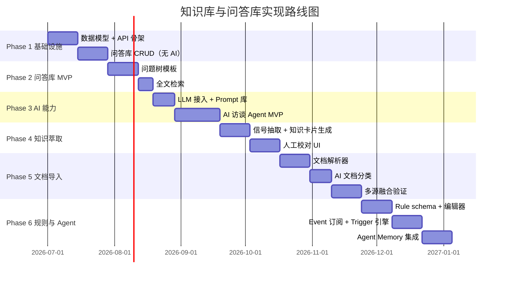
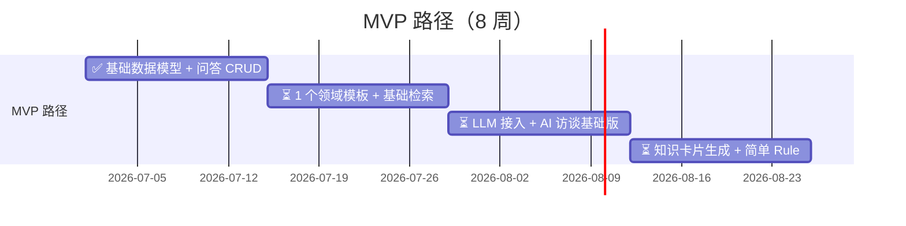
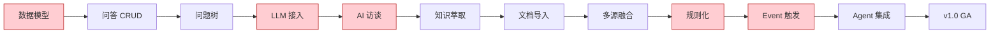

> **同步状态（2026-07-01）**：Phase 1 + MVP m1 已完成。
>
> - ✅ 技术设计 T1/T2/T3 完成（01-database-schema / 02-backend-api / 03-frontend-modules）
> - ✅ 19 张 knlg_* 表 + 58 个 API endpoint + 18 个前端页面全部就绪
> - ✅ CRM 端到端场景（产品文档 7.1-7.6）已验证：5 轮访谈问答 + 1 知识卡 + 1 规则
> - ✅ 状态机完整：知识卡 draft→published→deprecated↔draft，规则 draft→testing→active↔paused→deprecated
> - ✅ 测试：backend 541 passed / frontend 0 errors
> - ⏳ MVP m2-m4 待 Phase 2+ 启动

## 1. 概述

本文档描述 Neo 平台**知识库与问答库子系统**的工程实现路线图，与产品设计文档配套。

### 1.1 与产品设计的关系

```text
产品设计（已完成）
  ├── 总览 / 问答库 / 知识导入 / 萃取流程 / 知识库与规则库
  └── 评审指南
        ↓
技术设计（已完成 T1-T3）
  ├── ✅ 数据库 schema（01-database-schema）
  ├── ✅ API 设计（02-backend-api）
  ├── ✅ 后端模块拆分（01/02/03）
  ├── ✅ 前端模块拆分（03-frontend-modules）
  ├── ⏳ AI 服务设计（04-llm-gateway 等，待 Phase 3）
  └── ⏳ 部署架构（10-deployment，待 Phase 6）
        ↓
实现路线图（本文档）
  └── 6 个阶段，约 24-28 周
        ↓
P0 CRUD 实现（已完成 2026-07-01）
  ├── 19 张 knlg_* 表 + alembic migration
  ├── 58 个 API endpoint（5 个子模块 router）
  ├── 18 个前端页面（5 个子模块）
  └── OpenSpec change: knlg-base-p0-crud-dev (commit 7608b389)
```

### 1.2 阅读对象

| 角色 | 阅读重点 |
| --- | --- |
| 项目经理 | 整体节奏、里程碑、团队配置 |
| 后端工程师 | 分阶段任务、技术决策点 |
| 前端工程师 | UI 演进、前后端协同 |
| AI 工程师 | Prompt 工程、模型选型、置信度评估 |
| 产品经理 | 阶段交付物、人工把关环节 |

---

## 2. 关键依赖与前提

### 2.1 必须先就绪

```text
✅ Workspace 模块
   - 用户/权限/隔离模型已稳定
   - Workspace 切换与成员管理可用

✅ Agent Steer Event/Status schema
   - Event / Status / Entity schema 稳定
   - Interceptor 可生成 Event

✅ LLM 选型
   - 主模型确定（GPT-4 / Claude / 国内模型）
   - API 调用、限流、降级方案确定
```

### 2.2 可能阻塞项

| 阻塞项 | 影响 | 缓解策略 |
| --- | --- | --- |
| 文档解析能力（PDF OCR、Confluence API） | Phase 5 延迟 | 先支持 MD/Wiki，逐步扩展 |
| 业务数据访问权限 | 数据挖掘受限 | 与业务团队提前对齐，限定访问范围 |
| LLM 调用成本 | 月度预算可能 10x | 限流、缓存、分级（高级模型仅用于关键环节） |
| 知识提炼员招聘 | 人工把关环节卡壳 | 提前内部转岗准备，明确岗位职责 |

---

## 3. 整体路线图

### 3.1 甘特图



### 3.2 关键里程碑

```text
W4   ✅ 问答库可用（手动录入）           ← 2026-07-01 完成
W7   ⏳ 问题树模板上线                    ← P1 阶段待启动
W10  ⏳ AI 访谈能跑通                      ← P3 阶段待启动
W13  ⏳ 问答 → 知识卡片闭环              ← P4 阶段待启动
W17  ⏳ 文档导入闭环                       ← P5 阶段待启动
W23  ⏳ 规则触发闭环                       ← P6 阶段待启动
W24+ 🚀 v1.0 GA（General Availability）
```

---

## 4. 分阶段详细任务

### Phase 1：基础设施（第 1-4 周）— ✅ **已完成（2026-07-01）**

**目标**：数据模型 + 基础 API + 问答库 CRUD（不依赖 AI）

| 周次 | 后端 | 前端 | AI | 产出 |
| --- | --- | --- | --- | --- |
| W1 | ✅ 数据模型（19 张 knlg_* 表）<br/>✅ 基础 API（58 个 endpoint）<br/>✅ 权限校验（4 角色矩阵） | ✅ 路由骨架（knlg-base 子路由）<br/>✅ 18 个页面 | - | ✅ 数据库 schema v1<br/>✅ API 文档 v1 |
| W2 | ✅ 问答引用（QARef）<br/>⚠️ 全文检索用 LIKE（MySQL FULLTEXT 留 v2） | ✅ 引用关系展示<br/>✅ 搜索 UI | - | ✅ 检索可用（中文 LIKE） |
| W3-4 | ✅ QA CRUD + 引用<br/>✅ 手动录入访谈 API<br/>✅ 访谈/问答/会话/引用完整流程 | ✅ 访谈详情 + 问答流页面<br/>✅ 问题树简单列表 | - | ✅ 完整手动录入流程 |

**交付**：✅ 手动录入问答 + 访谈流 + 引用关系，全部可用。

**质量门控**：

- [x] ✅ 数据模型评审通过（OpenSpec proposal + design）
- [x] ✅ 权限隔离测试通过（跨 Workspace 访问统一返回 404）
- [ ] ⏳ 检索召回率 ≥ 80%（P1 引入 MySQL FULLTEXT 后评估）

**技术决策点**：

| 决策 | 选项 | 推荐 |
| --- | --- | --- |
| 检索方案 | MySQL FULLTEXT / Elasticsearch / Meilisearch | Elasticsearch（功能强、易扩展） |
| 主键生成 | UUID / Snowflake / Auto Increment | Snowflake（全局唯一、分布式友好） |
| 软删除策略 | 状态字段 / 单独 deleted_at | status 字段（与 Workspace 一致） |

### Phase 2：问答库 MVP（第 5-7 周）

**目标**：问题树模板 + 检索优化，让专家能用起来

| 周次 | 后端 | 前端 | AI | 产出 |
| --- | --- | --- | --- | --- |
| W5 | 问题树模板 schema<br/>模板版本管理 | 问题树模板编辑器<br/>模板市场浏览 | - | 模板 v1 |
| W6 | 标签/分类体系<br/>检索优化 | 标签云<br/>多维筛选 | - | 分类体系 v1 |
| W7 | 问答质量统计<br/>导出/导入 | 数据看板（贡献量、被引用数） | - | 运营基础 |

**交付**：领域专家能用问题树模板组织访谈，新人能用搜索查阅问答。

**质量门控**：

- [ ] 至少 3 套领域问题树模板上线
- [ ] 至少 5 位领域专家试用并反馈

### Phase 3：AI 能力（第 8-10 周）

**目标**：LLM 接入 + AI 访谈 Agent MVP

| 周次 | 后端 | 前端 | AI | 产出 |
| --- | --- | --- | --- | --- |
| W8 | LLM Gateway（统一接口、限流、降级） | - | Prompt 模板库<br/>访谈 Prompt v1 | LLM 接入可用 |
| W9 | AI 访谈 Session 管理<br/>追问决策引擎 | AI 访谈实时对话 UI<br/>追问原因展示 | 追问触发逻辑 | AI 访谈 MVP |
| W10 | 访谈自动汇总<br/>信号预标记 | 访谈结束确认页<br/>信号预览 | 实时信号识别 | AI 访谈可用 |

**交付**：AI 能主动向专家发起访谈，多轮追问，自动标记信号。

**质量门控**：

- [ ] AI 访谈完成率 ≥ 70%（专家不中途退出）
- [ ] 信号识别准确率 ≥ 60%（人工抽检）

**关键技术决策**：

| 决策 | 选项 | 推荐 |
| --- | --- | --- |
| LLM 主模型 | GPT-4 / Claude 3.5 / 国内模型（Qwen/文心） | 按预算和质量评估 |
| Prompt 版本管理 | 字符串 + Git / 数据库 + 后台 | 数据库 + 后台（产品可调） |
| 追问深度限制 | 3 层 / 5 层 / 动态 | 5 层（避免专家疲劳） |
| 会话状态持久化 | Redis / 数据库 | 数据库（可追溯、可回放） |

### Phase 4：知识萃取（第 11-13 周）

**目标**：从问答自动生成 Knowledge Card

| 周次 | 后端 | 前端 | AI | 产出 |
| --- | --- | --- | --- | --- |
| W11 | Knowledge Card schema<br/>来源追溯（source_qa_ids） | 知识卡片列表/详情/编辑 | 信号抽取模型 | Knowledge Card v1 |
| W12 | 置信度多维评估<br/>三道质量关卡流程 | 校对 UI（diff 视图）<br/>审核工作流 | 知识卡片生成 Prompt | 完整萃取流程 |
| W13 | 版本管理<br/>跨来源验证 | 版本对比 UI | 跨源一致性检查 | 版本化可用 |

**交付**：从问答 → 知识卡片端到端跑通，有人工把关环节。

**质量门控**：

- [ ] Knowledge Card 通过率 ≥ 50%（AI 生成后人工审核通过比例）
- [ ] 置信度分布合理（不能全部聚集在 0.9+）

### Phase 5：文档导入 + 多源融合（第 14-17 周）

**目标**：冷启动能力 + 多源融合验证

| 周次 | 后端 | 前端 | AI | 产出 |
| --- | --- | --- | --- | --- |
| W14 | Document schema<br/>文档解析（PDF/Word/MD）<br/>Confluence API 接入 | 文档上传 UI<br/>任务进度展示 | - | 解析可用 |
| W15 | AI 文档分类器<br/>信号抽取 | 分类结果展示<br/>手动调整 | 分类 Prompt | 分类准确率 ≥ 70% |
| W16 | CandidateKC 状态机<br/>反向触发访谈 | 候选审核 UI<br/>触发访谈按钮 | 反向访谈问题生成 | 冷启动闭环 |
| W17 | 跨来源验证逻辑<br/>Evidence 关联 | 跨源视图（同一知识多来源） | 跨源一致性 Prompt | 多源融合 v1 |

**交付**：能导入 SOP 文档，自动生成候选知识，反向触发访谈补充。

**质量门控**：

- [ ] 文档解析成功率 ≥ 80%（MD/Wiki 类）
- [ ] 候选知识通过率 ≥ 30%（人工审核后）
- [ ] 反向访谈触发后 Knowledge Card confidence 提升 ≥ 0.1

### Phase 6：规则化 + Agent 集成（第 18-23 周）

**目标**：Rule + Agent Steer Event 订阅 + 闭环

| 周次 | 后端 | 前端 | AI | 产出 |
| --- | --- | --- | --- | --- |
| W18 | Rule schema（trigger / conditions / conclusion）<br/>条件表达式 DSL | 规则编辑器（条件树可视化） | - | Rule 编辑器可用 |
| W19 | 回测 SQL 生成器<br/>Evidence 验证 | 回测配置 UI<br/>证据查看 | - | 回测闭环 |
| W20 | Event 订阅服务<br/>Trigger 引擎 | 规则触发日志<br/>订阅管理 | - | 事件触发闭环 |
| W21 | Agent Memory 加载接口<br/>执行反馈 API | Agent 配置集成 | - | Agent 集成 |
| W22-23 | 规则健康度监控<br/>性能优化<br/>AB 测试 | 监控看板<br/>灰度发布 | - | 灰度发布能力 |

**交付**：规则能根据 Agent Steer Event 触发，反馈能回流到 Evidence。

**质量门控**：

- [ ] Rule trigger 响应时间 ≤ 1 秒（P95）
- [ ] 规则命中率合理（不能全触发也不能全不触发）
- [ ] 至少 5 条规则在生产环境灰度运行

---

## 5. MVP 路径（最快 8 周可演示）— **m1 已完成**

如果需要**快速验证产品价值**，可走裁剪路线：



**m1 完成时间**：2026-07-01（commit `7608b389`）

**m1 交付物清单**：

- [x] ✅ 19 张 knlg_* 表（Alembic 迁移 + 2 个修复 migration）
- [x] ✅ 58 个 API endpoint（5 个子模块 router）
- [x] ✅ 18 个前端页面（home + knowledge + qa + rules + import）
- [x] ✅ 5 个 API client 模块（knowledge / qa / rule / import / _base）
- [x] ✅ 完整状态机：知识卡 draft→published→deprecated↔draft，规则 draft→testing→active↔paused→deprecated
- [x] ✅ CRM 端到端场景（产品文档 7.1-7.6）验证
- [x] ✅ 后端测试 541 passed / 前端 0 errors
- [x] ✅ OpenSpec change 文档化（`openspec/changes/knlg-base-p0-crud-dev/`）

**MVP 演示场景**：

1. 销售总监接受 AI 访谈（5 分钟）
2. 自动生成 3-5 张知识卡片
3. 提炼 1-2 条规则
4. 手动触发规则，看推送效果

**MVP 简化点**：

| 模块 | MVP 简化 | 后续补齐 |
| --- | --- | --- |
| 问答库 | 1 个领域模板 | 多领域模板 |
| AI 访谈 | 基础追问 | 复杂追问（反例、边界） |
| 知识萃取 | 单源 | 多源融合 |
| 文档导入 | 不做 | Phase 5 |
| Rule 触发 | 手动触发 | Event 订阅 |
| Agent 集成 | 不做 | Phase 6 |

---

## 6. 团队配置建议

### 6.1 各阶段人数

| 阶段 | 后端 | 前端 | AI 工程师 | 产品/运营 |
| --- | --- | --- | --- | --- |
| Phase 1-2 | 1-2 | 1 | 0 | 0.5 |
| Phase 3-4 | 1-2 | 1 | 1 | 0.5 |
| Phase 5-6 | 2-3 | 1-2 | 1 | 1 |

### 6.2 关键角色

| 角色 | 职责 | 关键能力 |
| --- | --- | --- |
| **后端工程师** | 数据模型、API、业务逻辑 | FastAPI / Python / DB |
| **前端工程师** | UI、交互、可视化 | React / TypeScript |
| **AI 工程师** | Prompt 工程、置信度评估、AI 集成 | LLM / NLP |
| **产品经理（知识提炼员）** | 访谈、校对、运营 | 领域知识 + AI 协作 |
| **领域专家访谈对象** | 提供原始认知 | 业务经验 |

### 6.3 跨团队协作

```text
知识库团队
  ├── 内部：后端、前端、AI、产品
  ├── 外部协作：
  │   ├── Agent Steer 团队（Event schema、Interceptor 集成）
  │   ├── Workspace 团队（权限、隔离）
  │   └── Agent Factory 团队（Agent Memory 加载）
  └── 领域专家（销售总监、客服经理、实施顾问）
```

---

## 7. 风险与缓解

### 7.1 主要风险

| 风险 | 影响 | 缓解策略 |
| --- | --- | --- |
| **LLM API 成本失控** | 月度成本可能 10x 增长 | 限流、缓存、分级（高级模型仅用于关键环节） |
| **AI 访谈质量低** | 专家疲劳、不愿参与 | 控制访谈时长（≤30 分钟）、追问深度（≤5 层） |
| **文档解析失败率高** | 冷启动失败 | 优先级排序：先支持 MD/Wiki，逐步扩展 PDF/Confluence |
| **多源融合冲突** | 用户困惑 | 严格标记来源 + 冲突时人工裁决 |
| **Agent Steer Event 不稳定** | Rule 无法触发 | 与 Agent Steer 团队同步，定义 Event schema 契约 |
| **专家不参与** | 知识萃取失败 | 提供 AI 访谈降低门槛 + 贡献度可视化 |
| **团队人手不足** | 项目延期 | 严格按 MVP 优先级，砍掉非核心功能 |

### 7.2 决策升级机制

```text
常规决策 → 项目经理（产品 + 技术 lead）
重大决策 → 项目发起人
战略决策 → 业务方
```

---

## 8. 与技术设计同步启动

按 Neo 平台设计规范（product → technical → coding），**Phase 1 开始时同时启动技术设计**。

### 8.1 技术设计文档清单

| # | 文档 | 负责 | 状态 | 启动时机 |
| --- | --- | --- | --- | --- |
| T1 | 数据库 schema 设计（合并所有实体） | 后端 | ✅ **已完成** | Phase 1 W1 |
| T2 | 后端模块拆分与 API 设计 | 后端 | ✅ **已完成** | Phase 1 W1 |
| T3 | 前端模块拆分与组件设计 | 前端 | ✅ **已完成** | Phase 1 W1 |
| T4 | LLM Gateway 设计（接口、限流、降级） | AI + 后端 | ⏳ 待启动 | Phase 3 W8 |
| T5 | Prompt 模板管理设计 | AI | ⏳ 待启动 | Phase 3 W8 |
| T6 | AI 访谈 Agent 状态机设计 | AI | ⏳ 待启动 | Phase 3 W9 |
| T7 | 文档解析器设计 | 后端 | ⏳ 待启动 | Phase 5 W14 |
| T8 | Event 订阅与 Trigger 引擎设计 | 后端 | ⏳ 待启动 | Phase 6 W20 |
| T9 | Agent Memory 加载接口设计 | AI + 后端 | ⏳ 待启动 | Phase 6 W21 |
| T10 | 部署架构与运维方案 | 后端 + 运维 | ⏳ 待启动 | Phase 6 W22 |

**已完成的 T1-T3**：

- `design/docs/technical/knlg-base/01-database-schema.md`（19 张表 schema）
- `design/docs/technical/knlg-base/02-backend-api.md`（58 个 endpoint + 错误码）
- `design/docs/technical/knlg-base/03-frontend-modules.md`（路由 + 组件 + 状态管理）

### 8.2 文档存放位置

```
docs/technical/knlg-base/
├── 01-database-schema.md
├── 02-backend-api.md
├── 03-frontend-modules.md
├── 04-llm-gateway.md
├── 05-prompt-management.md
├── 06-interview-agent.md
├── 07-document-parser.md
├── 08-event-trigger.md
├── 09-agent-memory.md
└── 10-deployment.md
```

### 8.3 与产品设计的边界

```text
产品设计（本文档体系）
  ├── 定义"做什么"、"为什么"
  ├── 用户故事、业务流程
  └── 实体字段（高层）

技术设计（待启动）
  ├── 定义"怎么做"
  ├── 数据模型、表结构
  ├── API 契约、接口规范
  └── 部署架构
```

---

## 9. 关键路径



**关键路径**：A → D → E → I → J → L（这些阶段延迟会直接影响 GA 时间）

---

## 10. 后续动作

### 10.1 立即可做

- [x] ✅ 评审本文档与产品设计文档（OpenSpec proposal + design 已评审）
- [ ] ⏳ 与 Agent Steer 团队对齐 Event schema（Phase 6 启动前）
- [x] ✅ 与 Workspace 团队对齐权限模型（已实现 4 角色矩阵）
- [ ] ⏳ LLM 模型选型评估（成本 + 质量，Phase 3 启动前）
- [ ] ⏳ 招聘/指定知识提炼员（Phase 4 启动前）

### 10.2 Phase 1 启动前

- [x] ✅ 完成技术设计 T1-T3（已交付）
- [x] ✅ 搭建开发环境（backend + frontend + alembic + hooks）
- [ ] ⏳ 建立 LLM Gateway 基础（Phase 3 启动前）
- [ ] ⏳ 准备问题树模板初稿（Phase 2 启动前）

### 10.3 Phase 3 启动前

- [ ] ⏳ 完成 LLM 选型
- [ ] ⏳ 完成 Prompt 模板管理设计（T5）
- [ ] ⏳ 准备至少 3 位领域专家访谈

### 10.4 Phase 6 启动前

- [ ] ⏳ 与 Agent Steer 团队完成 Event schema 联调
- [ ] ⏳ 准备至少 5 条候选规则
- [ ] ⏳ 设计规则健康度监控

### 10.5 Phase 1+ 已完成的具体改动

| 类别 | 内容 |
| --- | --- |
| 数据库 | 19 张 knlg_* 表 + 2 个修复 migration（metadata → meta_data） |
| Backend 代码 | 19 SQLAlchemy models + 25+ Pydantic schemas + 14 repositories + 10 services + 58 API endpoints |
| Frontend 代码 | 18 页面 + 8 组件 + 5 API client + 5 Zod schemas |
| OpenSpec | `openspec/changes/knlg-base-p0-crud-dev/` 完整 change 文档 |
| 测试 | backend 541 passed / frontend 0 errors |
| Git | commit `35a8ed19` (P0 CRUD) + `7608b389` (fixes) |
| 文档 | 03 文档一致性修正（统一 knlg_ 前缀、修复路径重复、对齐前端目录、角色命名）+ 路由表新增 24 条 knlg-base 路由 |

---

## 🔗 相关文档

- [知识库与问答库产品设计（总览）](./index)
- [问答库产品设计](./q-a-library)
- [知识导入模块设计](./knowledge-import)
- [知识萃取流程设计](./extraction-flow)
- [知识库与规则库产品设计](./knowledge-and-rule)
- [团队评审指南](./REVIEW-GUIDE)
- [Agent Steer 设计文档](../agent-steer/index) - 协同模块
- [Workspace 产品设计](../base/workspace设计) - 资源隔离容器

---

## ✅ 设计检查清单

- [x] 关键依赖与前提明确
- [x] 整体甘特图
- [x] 分阶段任务清单（按角色）
- [x] 质量门控与决策点
- [x] MVP 路径
- [x] 团队配置建议
- [x] 风险与缓解
- [x] 技术设计同步启动清单
- [x] 关键路径识别
