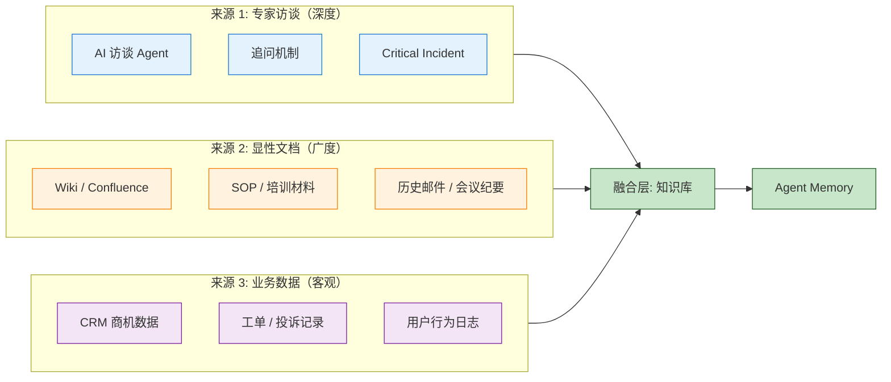
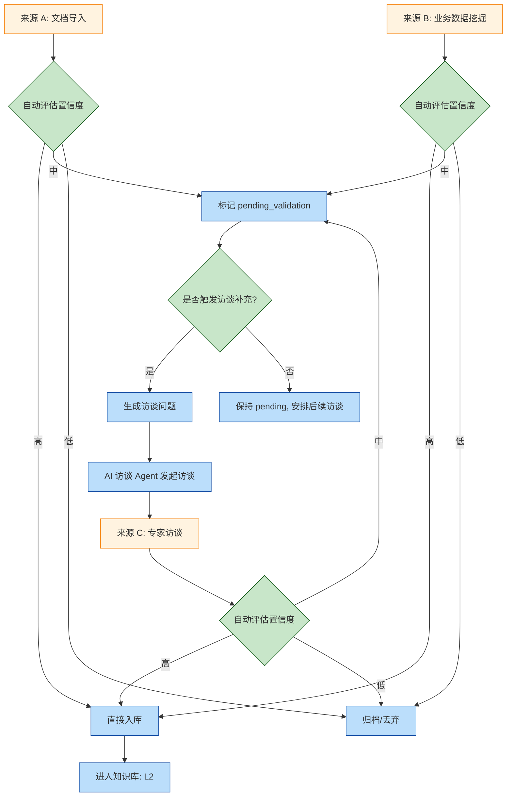
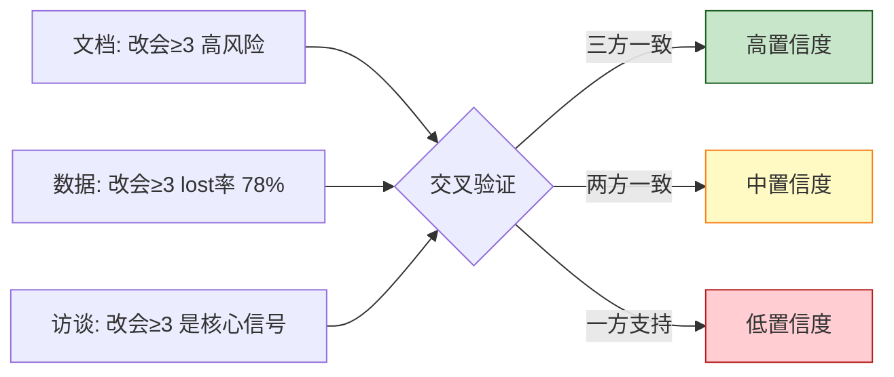
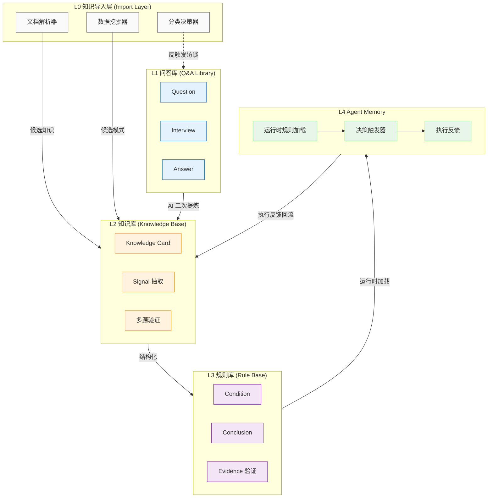
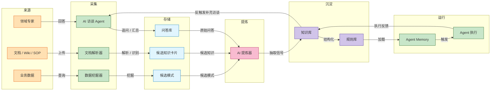
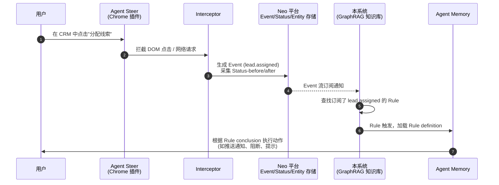
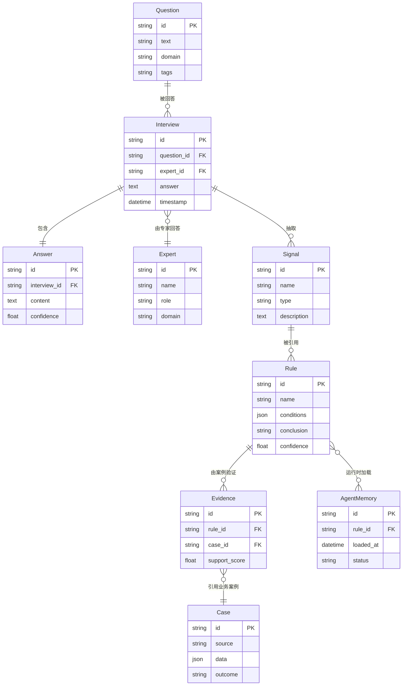
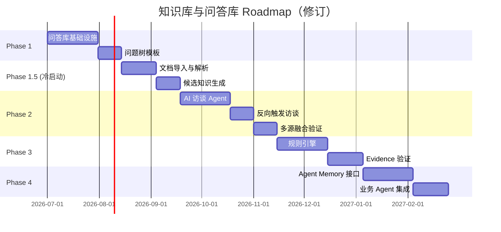

## 1. 概述

本文档描述 Neo 平台**知识库（Knowledge Base）**与**问答库（Q&A Library）**子系统的产品设计。

系统的核心定位是：**把领域专家脑子里的隐性经验，转化为可被 AI Agent 直接使用的决策记忆（Decision Memory）**。

> 名词约定：本文中"知识库"是广义概念，泛指"问答库 + 知识库 + 规则库 + Agent Memory"组成的整套经验沉淀与执行体系；狭义的"知识库"特指由问答库提炼出的结构化结论视图。下文会区分使用。

### 1.1 阅读对象

| 角色 | 阅读重点 |
| --- | --- |
| 产品经理 | 背景、目标、Roadmap、场景示例 |
| 后端工程师 | 整体架构、模块边界、数据流向 |
| 前端工程师 | 模块边界、UI 模块清单 |
| AI / Agent 工程师 | 四层架构、规则结构、Agent Memory 接口 |
| 业务专家（销售、客服、实施等） | 访谈方法、问答贡献流程 |

---

## 2. 背景与问题

### 2.1 企业的真正资产不在文档里

很多企业花了大力气做知识管理：上传文档、录培训视频、写 SOP、建 Wiki，但最终发现：

- 老销售一离职，他脑子里的"哪些客户能成、哪些是假商机"也跟着走了；
- 客服的经验是"听到某句话就要警惕"，但这种经验没写进任何文档；
- 实施顾问知道"哪个阶段最容易延期"，但延期判断靠的是感觉而非流程；
- 销售总监能一眼看出商机是不是真的，但他写不出判断标准。

这些**没有被显性化的判断与决策经验**，叫做**隐性知识（Tacit Knowledge）**。它们才是企业真正的竞争壁垒。

### 2.2 显性知识 vs 隐性知识

| 维度 | 显性知识 | 隐性知识 |
| --- | --- | --- |
| 形态 | 文档、SOP、视频 | 经验、直觉、判断 |
| 存储 | Wiki、Confluence、知识库 | 人脑 |
| 转移 | 阅读、培训 | 师徒带教、实操 |
| 流失 | 可长期保存 | 随人离开而消失 |
| 价值 | 标准化 | 决策质量 |

传统知识库只能管显性知识，对隐性知识束手无策。**而本系统的目标就是把隐性知识萃取出来，变成可保存、可复用、可被 AI 学习的结构化资产**。

### 2.3 当前痛点

| 痛点 | 描述 |
| --- | --- |
| 经验随人流失 | 核心员工离职，决策经验断层 |
| 培训效率低 | 新人靠"跟师傅"上手，无法批量复制 |
| AI 缺经验 | 即便有 RAG，AI 仍然无法做"像专家一样的判断" |
| 规则不沉淀 | 专家的判断标准从来没人提炼过 |
| 知识难追溯 | 没人能回答"这个判断标准是从哪儿来的" |

### 2.4 为什么"问答库"是第一等公民

很多团队会先把知识库搭起来，再考虑问答。这是错的。

**理由**：

1. **隐性知识最初不存在"答案"，只存在"观点"**。问销售总监"什么客户值得跟"，他会说"制造业客户好成"——这是观点，不是知识。
2. **观点必须经过追问才能变成知识**。"为什么好成？"→"采购流程规范"→"什么特征？"→"会主动拉采购部"→"哪些案例？"→ 规则才浮出水面。
3. **问答库保留了"为什么"的全过程**，而提炼后的知识库只保留了结论。一旦结论过时，没有问答库就无法回溯修正。
4. **AI 模型会越来越强**，未来重提问答就能重得知识；但如果没有问答库，很多经验永远消失。

因此本系统的设计原则是：

> **问答库是原始认知数据源，知识库、规则库都是它的物化视图（Materialized View）。**

---

## 3. 产品目标

### 3.1 愿景陈述

> **让企业里的每一个"专家判断"，都能被沉淀、被验证、被 Agent 复用。**

具体来说：

- 让 10 年老销售的经验**可以结构化表达**；
- 让客服的"危险信号"直觉**可以提炼为规则**；
- 让 AI Agent **能像优秀员工一样**做判断、做推荐、做预警。

### 3.2 成功指标

| 指标 | 目标 | 衡量方式 |
| --- | --- | --- |
| 问答覆盖率 | 关键岗位的核心判断能被问答覆盖 | 抽样访谈回溯，80% 决策能找到对应问答 |
| 规则置信度 | 提炼出的高置信度规则占比 | `confidence ≥ 0.8` 的规则占比 ≥ 30% |
| 规则验证闭环 | 50% 的规则有真实业务数据验证 | 规则关联的 Evidence Case 数量 |
| Agent 决策准确率 | 基于规则库的 Agent 决策与专家决策一致 | 抽样对比，≥ 70% |
| 专家贡献率 | 每月活跃贡献问答的专家人数 | 月活专家占比 ≥ 20% |

### 3.3 非目标（明确不做）

| 不做 | 原因 |
| --- | --- |
| 通用百科问答 | 系统是面向特定领域决策的，不是 ChatGPT 替代品 |
| 实时对话客服 | 这是 Agent 的应用层，本系统是 Agent 的记忆层 |
| 自动文档 RAG 替代品 | 显性文档知识不是本系统目标，应交给现有 RAG 方案 |
| 完全无监督知识发现 | 隐性知识萃取必须有人参与，AI 只是辅助 |

---

## 4. 核心设计理念

### 4.1 五个核心理念

```text
理念 1：问答库是最高质量原始数据源（不是唯一）
        → 知识有三种来源：访谈、文档、数据
        → 问答库提供深度与上下文，是质量的锚点

理念 2：知识库是物化视图
        → 知识可重新提炼，但问答不能丢

理念 3：经验驱动而非数据驱动
        → 先有专家判断，再用数据验证

理念 4：决策记忆（Decision Memory）而非知识库
        → 保留"为什么这么决策"，而不是只留"是什么"

理念 5：多源融合（Multi-Source Fusion）
        → 不同来源的知识在统一 schema 下融合
        → 跨来源交叉验证，反向触发访谈补充
```

### 4.2 决策记忆 vs 知识库

这是本系统与传统知识库最本质的区别。

| 维度 | 传统知识库 | 决策记忆 |
| --- | --- | --- |
| 存储内容 | 答案 | 决策过程 |
| 回答的问题 | "是什么" | "为什么这么做" |
| 更新方式 | 文档覆盖 | 追加 + 版本演化 |
| AI 使用方式 | RAG 检索 | 注入 Prompt / 触发规则 |
| 价值密度 | 低（大量冗余） | 高（每条都对应决策） |

### 4.3 知识的三种来源（关键概念）

很多人直觉上认为知识只从问答中来，这是错的。真实场景中知识有三个来源：



#### 三种来源对比

| 维度 | 专家访谈 | 显性文档 | 业务数据 |
| --- | --- | --- | --- |
| **采集方式** | AI 主动追问 | 解析导入 | 模式识别 |
| **带"为什么"** | ✅ 强 | ⚠️ 弱（取决于文档质量） | ❌ 无（只有相关性） |
| **带反例** | ✅ 强 | ⚠️ 弱 | ✅ 强（数据自带反例） |
| **置信度** | 高（多专家共识后） | 中（需验证） | 高（数据说话）但缺因果 |
| **因果关系** | ✅ 有 | ⚠️ 部分有 | ❌ 只有相关性 |
| **冷启动成本** | 高（需要访谈） | 低（已有文档） | 中（需要历史数据） |
| **维护成本** | 中（需要持续访谈） | 低（更新即可） | 中（需要重新挖掘） |
| **典型应用** | 决策判断、风险识别 | SOP、流程规范 | 客户分群、商机评分 |

#### 三种来源互补

| 场景 | 哪个来源最合适 |
| --- | --- |
| "客户连续 3 次改会 = 假商机" | **访谈**（解释因果） + **数据**（验证模式） |
| "报价单模板怎么填" | **文档**（标准化流程） |
| "哪些客户续约率高" | **数据**（客观规律） + **访谈**（解释为什么） |
| "如何跟决策人沟通" | **访谈**（隐性的判断） |

**关键洞察**：单一来源都有局限，融合才能产出高质量知识。

### 4.4 多源融合机制（核心理念 5 的展开）



#### 融合点 1：文档导入触发访谈

```text
文档："客户改会 3 次以上需要主动升级"（SOP 中的一句话）

自动识别：这是一条决策经验，不是通用流程

触发访谈问题：
  Q1: "你当时为什么把阈值定在 3 次？"
  Q2: "有没有改会 3 次但最终成的？"
  Q3: "政府客户适用同样的标准吗？"

访谈回答进入问答库
↓ 关联到该文档知识卡片
↓ 升级为 validated 状态
```

#### 融合点 2：数据挖掘触发访谈

```text
数据发现：A 销售赢单率 80%，B 销售赢单率 30%

自动识别：存在异常模式

触发访谈问题：
  Q1: "A 销售在首次沟通中通常会问什么问题？"
  Q2: "B 销售与 A 销售最大的差异是什么？"
  Q3: "你作为总监怎么辅导 B 销售？"

访谈回答进入问答库
↓ 形成知识卡片
↓ 升级 high_risk 信号
```

#### 融合点 3：跨来源交叉验证



### 4.5 与传统 RAG 的关系

| 模块 | 关注 | 数据形态 |
| --- | --- | --- |
| 传统 RAG | 显性文档知识（通用） | 文档 → chunk → 向量 |
| 本系统 | 决策经验知识（专家判断） | 问答/文档/数据 → 信号 → 规则 |

两者**互补而非替代**：

- 通用知识、流程文档 → 走传统 RAG；
- 专家判断、决策经验 → 走本系统（包括访谈、文档导入、数据挖掘）。

**注意**：本系统的"文档导入"和传统 RAG 的"文档处理"是**两件不同的事**：

| 对比项 | 传统 RAG 的文档处理 | 本系统的文档导入 |
| --- | --- | --- |
| 处理方式 | 切 chunk + 向量化 | 解析 + 结构化 + 候选知识卡片 |
| 输出 | 相似度检索 | 决策规则候选 |
| 用途 | 通用知识问答 | 决策经验沉淀 |
| 质量保障 | 无（依赖源文档） | 必须经过验证 |
| 是否进规则库 | 否 | 是（验证后） |

Agent 可以同时调用两者，获得"知识 + 经验"的完整决策能力。

---

## 5. 整体架构

### 5.1 整体架构（5 层 + 3 来源）



### 5.2 各层定位

| 层级 | 本质 | 数据形态 | 谁来生产 | 谁来消费 |
| --- | --- | --- | --- | --- |
| L0 知识导入层 | 经验源采集器 | Document / Pattern / Candidate KC | 文档 / 数据 / AI 解析器 | L2 知识库、L1 问答库 |
| L1 问答库 | 经验采集器（高价值） | Question / Interview / Answer | 领域专家 + AI 访谈 Agent | AI 提炼器、人类回溯 |
| L2 知识库 | 经验压缩器 | Knowledge Card（结论 + 证据 + 来源 + 验证状态） | AI 提炼 + 人工校对 | 业务用户、规则生成 |
| L3 规则库 | 经验结构化 | Rule（condition + conclusion + confidence） | 规则工程师 + AI | Agent Memory |
| L4 Agent Memory | 经验运行时 | 加载的规则集 + 触发器 | 系统 | Agent 执行器 |

### 5.3 数据流转图



### 5.4 模块对照

| 设计模块 | 对应实体 | 文档 |
| --- | --- | --- |
| 知识导入层 | Document / ImportJob / CandidateKC | [知识导入模块设计](./knowledge-import) |
| 问答库子系统 | Question / Interview / Answer | [问答库产品设计](./q-a-library) |
| 知识萃取流程 | 访谈方法 + AI 提炼 + 多源融合 | [知识萃取流程设计](./extraction-flow) |
| 知识库子系统 | Knowledge Card（含 source / validation 字段） | [知识库与规则库产品设计](./knowledge-and-rule) |
| 规则库子系统 | Rule / Evidence | [知识库与规则库产品设计](./knowledge-and-rule) |
| Agent Memory 接口 | Trigger / Runtime Rule | 见后续 Agent 集成文档 (TODO) |

---

### 5.5 与 Agent Steer 的集成

本系统不是孤岛，而是 **Neo 平台 Agent Steer 数据流的消费者**。

#### 5.5.1 整体数据流



#### 5.5.2 Rule trigger = Event 订阅

Rule 的 trigger 字段订阅 Agent Steer 产生的 Event，不是抽象的"业务事件"。

**Trigger schema**：

```yaml
rule:
  id: RULE-OP-STALE-001

  # trigger 是 Event 订阅表达式
  trigger:
    # 订阅的 Event 类型
    event_name: "opportunity.stage_changed"

    # 过滤条件（基于 Event 字段）
    filter:
      - field: "metadata.days_in_stage"
        operator: ">="
        value: 60
      - field: "metadata.customer_type"
        operator: "=="
        value: "enterprise_民营"

    # 作用于哪个 Entity
    target_entity:
      type: "opportunity"
      from: "event.entity_name"  # 从 Event 中提取
```

#### 5.5.3 多种 Trigger 类型

| Trigger 类型 | 含义 | 示例 |
| --- | --- | --- |
| **Event 订阅** | 订阅某种 Event 触发 | 订阅 `opportunity.stage_changed` Event |
| **定时巡检** | 周期性扫描实体状态 | 每小时扫描商机满足 `days_in_stage >= 60` 的 |
| **手动触发** | 由用户手动触发 | 测试 Rule 时使用 |
| **复合触发** | 多个 Event 联合 | Event A 发生且 Event B 未发生 |

#### 5.5.4 Event/Status/Entity 复用原则

| Neo 平台概念 | 在 Agent Steer 中定义 | 在本系统中的使用 |
| --- | --- | --- |
| **Entity** | GraphRAG 节点，`{type}_{id}` 命名 | Rule 作用的实体（`entity_name`） |
| **Event** | GraphRAG 边，记录"谁在何时做了什么" | Rule trigger 订阅对象 |
| **Status** | 实体属性快照 | Rule 评估时读取的"当前上下文" |
| **Interceptor** | 页面操作拦截器 | Event 生成的源头（本系统不重定义） |

**重要原则**：

- ✅ 本系统**消费** Agent Steer 的 Event/Status/Entity
- ❌ 本系统**不重新定义** Event/Status/Entity schema
- ❌ 本系统**不重新定义** Interceptor

详见 [Agent Steer 设计文档](../agent-steer/index)。

#### 5.5.5 Status 作为 Rule 评估上下文

Rule 不仅可以订阅 Event，还可以读取 Status 作为评估上下文：

```yaml
rule:
  id: RULE-OP-DECISION-MAKER-001
  name: 决策人未接触预警

  trigger:
    event_name: "opportunity.stage_changed"
    filter:
      - field: "metadata.new_stage"
        operator: "=="
        value: "evaluation"

  # Rule 评估时查询 Status
  evaluation:
    read_status:
      entity_name: "{event.entity_name}"  # 动态从 Event 提取
      attribute: "decision_maker_contacted"
      operator: "=="
      value: false

  conclusion:
    action: escalate_to_sales_director
    risk_level: high
```

#### 5.5.6 与 Neo 平台其他模块的边界

| 模块 | 职责 | 不做 |
| --- | --- | --- |
| **Agent Steer** | 采集 Event/Status/Entity | 不做规则决策 |
| **Interceptor** | 拦截页面操作生成 Event | 不做规则评估 |
| **本系统（知识库）** | 存储知识、定义 Rule、评估 Rule | 不生成 Event，不拦截操作 |
| **Agent Memory** | 加载 Rule，决策执行 | 不存储知识 |

---

---

## 6. 核心实体（概念模型）

### 6.1 实体关系图



### 6.2 实体说明

| 实体 | 作用 | 谁创建 |
| --- | --- | --- |
| Question | 待回答的问题（由人/AI 提出） | 任何用户、AI |
| Interview | 一次访谈记录（一问一答上下文） | 访谈系统 |
| Answer | 访谈中的回答内容 | 领域专家 |
| Expert | 领域专家（贡献问答） | 系统识别 |
| Signal | 从回答中抽取的可识别信号 | AI 提炼 |
| Rule | 由信号组合形成的可执行规则 | AI 提炼 + 人工校对 |
| Evidence | 规则的业务数据证据 | 系统关联 |
| Case | 业务案例（CRM 商机、工单等） | 业务系统 |

详细字段设计见各子系统产品文档。

---

## 7. CRM 示例场景（端到端故事）

为帮助理解，给出一个完整故事示例。

### 7.1 场景设定

某 CRM 系统的销售总监老王，10 年经验，团队业绩稳定。新人小李刚入职。

### 7.2 L1 问答采集

**AI 访谈 Agent** 在系统中向老王发起问题树：

```text
Q: 什么情况下你会放弃一个商机？
A: 客户连续两个月没实质进展。

Q: 什么叫"实质进展"？
A: 至少有一次进入技术评估，或者推进到商务谈判。

Q: 如果只是见了客户但没推进下一步呢？
A: 那不算，下周再来一次如果还没动作，就放弃。

Q: 有没有反例？明明没进展但最终签了？
A: 有，2-3 个，但都是政府客户。民营企业没遇到过。

Q: 那政府客户怎么处理？
A: 政府客户节奏慢，半年没动作也正常。
```

这些对话进入**问答库**，成为可追溯的原始资产。

### 7.3 L2 知识提炼

AI 提炼器分析上述访谈，输出**知识卡片**：

```yaml
knowledge_card:
  id: KC-001
  title: 商机阶段性停滞判断

  statement: |
    当民营企业商机连续两个月无实质进展（无技术评估 / 无商务谈判），
    销售应主动评估是否继续投入。

  confidence: 0.78

  conditions:
    - 客户类型为民营（非政府）
    - 60 天内无技术评估
    - 60 天内无商务谈判进展

  exceptions:
    - 政府客户适用更长的容忍期（180 天）

  source:
    - interview: INT-001
    - expert: 王总监
```

### 7.4 L3 规则生成

规则工程师把知识卡片结构化为**规则**：

```yaml
rule:
  id: RULE-OP-STALE-001
  name: 商机阶段性停滞预警

  scope:
    customer_type: enterprise_民营

  conditions:
    - field: days_since_last_tech_eval
      operator: ">="
      value: 60
    - field: days_since_last_business_talk
      operator: ">="
      value: 60

  conclusion:
    action: notify_sales_to_review
    risk_level: medium
    suggestion: "评估是否调整跟进策略或降级"

  confidence: 0.78

  evidence:
    - rule_id: RULE-OP-STALE-001
      cases:
        - case_id: OPP-1003
          outcome: lost_after_90_days
        - case_id: OPP-1054
          outcome: lost_after_75_days
```

### 7.5 L4 Agent 执行

当 CRM 系统检测到新商机满足上述条件：

```text
[Agent Memory 加载 RULE-OP-STALE-001]

发现商机 OPP-2099:
  - 客户类型：民营
  - 距上次技术评估：63 天
  - 距上次商务谈判：61 天

触发规则：
  → 推送通知给小李："商机 OPP-2099 已停滞 60+ 天，
    王总监的经验建议评估跟进策略调整"

执行反馈：
  → 小李看到推送，3 天后联系客户，发现已丢
  → 反馈回流：规则有效（避免更大投入损失）
```

### 7.6 闭环回流

```text
执行反馈
   ↓
 写入知识库（更新 evidence）
   ↓
 提升/降低 confidence
   ↓
 规则持续演化
```

这就是完整的"问答 → 知识 → 规则 → 执行 → 反馈"闭环。

---

## 8. 落地路径（Roadmap）

### 8.1 阶段总览（修订：增加冷启动阶段）



### 8.2 Phase 1：问答库基础设施

**目标**：把问答库建起来，能存、能查、能引用。

| 能力 | 说明 |
| --- | --- |
| 问答 CRUD | 手动录入、编辑、删除 |
| 问题分类 | 按 domain / tags 组织 |
| 问题树模板 | 内置 CRM、客服、实施等场景的问题树模板 |
| 引用与链接 | 问答可被其他问答、知识、规则引用 |
| 检索 | 全文检索 + tag 筛选 |

**交付**：一个可以用的问答库 + 至少 3 套领域问题树模板。

详细设计：[问答库产品设计](./q-a-library)

### 8.3 Phase 1.5（新增）：冷启动 - 文档导入

**目标**：快速导入已有文档，生成候选知识，解决冷启动问题。

| 能力 | 说明 |
| --- | --- |
| 文档上传 | 支持 PDF/Word/Markdown/Confluence 等 |
| 文档解析 | 按文档类型采用不同解析策略 |
| AI 文档分类 | 区分决策经验类 vs 通用知识类 |
| 信号抽取 | 从决策经验类文档中抽取结构化信号 |
| 候选 Knowledge Card | 自动生成候选知识卡片 |
| 置信度评估 | 多维评估候选质量 |
| 候选审核 UI | 供知识提炼员审核 |

**交付**：可以上传 100+ 文档并产出 50+ 候选知识。

详细设计：[知识导入模块设计](./knowledge-import)

### 8.4 Phase 2：知识萃取与多源融合

**目标**：从问答库 / 文档 / 数据三种来源统一提炼知识。

| 能力 | 说明 |
| --- | --- |
| AI 访谈 Agent | 自动追问、记录、汇总 |
| 信号抽取 | 从三种来源中识别可结构化的信号 |
| 知识卡片生成 | 自动生成知识卡片草稿（支持多 source_refs） |
| 人工校对 | 专家/产品经理校对、修订 |
| **反向触发访谈**（新增） | 文档/数据生成的候选自动触发访谈补充 |
| **多源交叉验证**（新增） | 多个来源验证同一知识时 confidence 提升 |

**交付**：从三种来源到知识卡片的端到端流程跑通。

详细设计：[知识萃取流程设计](./extraction-flow)

### 8.5 Phase 3：规则化与置信度评估

**目标**：把知识卡片转化为可被 Agent 加载的规则。

| 能力 | 说明 |
| --- | --- |
| 规则编辑器 | 把知识卡片条件结构化为 rule schema |
| Evidence 验证 | 用业务数据验证规则有效性 |
| 置信度评估 | 自动计算 confidence score（多维度） |
| 版本管理 | 规则可演化、可回滚 |
| **source_refs 追踪**（新增） | 规则可追溯到所有支持来源 |

**交付**：规则库 + 验证闭环。

详细设计：[知识库与规则库产品设计](./knowledge-and-rule)

### 8.6 Phase 4：Agent 集成与运行时

**目标**：让 Agent 在业务场景中真正使用规则。

| 能力 | 说明 |
| --- | --- |
| Agent Memory 接口 | 加载/卸载/查询规则 |
| 触发器 | 业务事件 → 规则匹配 |
| 执行反馈 | 执行结果回流到规则 evidence |
| 规则健康度 | 监控规则的命中率、误判率 |

**交付**：1-2 个业务 Agent 真正使用规则库。

> Phase 4 与 Neo 现有 Agent Factory 深度集成，详细设计见后续 Agent 集成文档 (TODO)。

---

## 9. 风险与权衡

### 9.1 主要风险

| 风险 | 影响 | 缓解策略 |
| --- | --- | --- |
| 专家不贡献 | 问答库起不来 | 提供 AI 访谈降低门槛 + 贡献激励 |
| 知识提炼质量低 | 规则不可用 | 必须人工校对环节，不允许全自动 |
| 规则误判 | 业务损失 | 高风险规则需二次确认 + 灰度上线 |
| 知识过期 | 规则失效 | 规则版本化 + 定期复审 |
| 过度依赖单一专家 | 偏听则暗 | 每个知识卡片至少 3 位专家覆盖 |
| **文档分类错误（新增）** | 决策经验被当通用知识丢进 RAG，或反之 | AI 分类仅是建议，最终由人工审核决定 |
| **数据挖掘误判（新增）** | 虚假相关性被当成因果规律 | 必须辅以访谈解释因果，不能仅凭数据 |
| **来源冲突（新增）** | 文档与访谈给出矛盾结论 | 人工裁决，标记 `conflict`，不仓促入规则 |

### 9.2 与现有模块的关系

本系统与 Neo 平台其他模块存在紧密的协同关系，同时**严格遵守各模块已有的设计原则**，避免重新定义。

#### 9.2.1 定位关系

| 模块 | 关系 | 职责边界 |
| --- | --- | --- |
| **Workspace** | 资源隔离容器 | 问答库/知识库/规则库都是 **Workspace 级别资源**，不跨 Workspace 共享 |
| **Agent** | 规则消费方 | 消费规则库 → Agent Memory，用于业务决策 |
| **Agent Steer**（Event/Status/Entity） | 数据生产者 | **本系统消费 Agent Steer 产生的 Event/Status，不重新定义** |
| **Interceptor** | 事件采集入口 | 页面操作 → Interceptor → Event，本系统订阅 Event 作为 Rule 触发器 |
| **现有 RAG** | 互补 | RAG 走显性文档，本系统走隐性经验（决策规则） |

#### 9.2.2 关键协同点

**1. Event/Status 复用（不重复定义）**

Agent Steer 已经定义了完整的 Event / Status / Entity schema 及 GraphRAG 映射。本系统**不重新定义 Event/Status**，而是直接消费：

```text
Agent Steer 拦截页面操作
        ↓
生成 Event + Status （已存在的 schema）
        ↓ 存入 Neo 平台
        ↓
Agent Steer 后续阶段可能导入 GraphRAG
        ↓
本系统订阅 Event 作为 Rule 触发器
        ↓
Rule 结论作用于 Entity
```

**2. Rule trigger = Event 订阅**

本系统的 Rule trigger **订阅的是 Agent Steer 产生的 Event**，而不是抽象的"业务事件"。例如：

```yaml
rule:
  id: RULE-OP-STALE-001
  name: 商机阶段性停滞预警

  # Rule trigger 订阅 Agent Steer 的 Event
  trigger:
    event_name: "opportunity.stage_changed"
    filter:
      - field: "metadata.days_in_stage"
        operator: ">="
        value: 60
    - field: "metadata.customer_type"
        operator: "=="
        value: "enterprise_民营"

  conclusion:
    action: notify_sales_to_review
    risk_level: medium
```

**3. 本系统 = Neo 平台的 GraphRAG 知识库**

Agent Steer 设计中提到 "为 GraphRAG 知识库做数据准备"，本系统就是**那个 GraphRAG 知识库**：

| 概念 | Agent Steer 中的原始设计 | 在本系统的映射 |
| --- | --- | --- |
| Entity | GraphRAG 节点 | KnowledgeCard 中提及的实体（如 `opportunity_123`） |
| Event | GraphRAG 边 | Rule 的 trigger 订阅对象 |
| Status | 实体属性快照 | Rule 评估时读取 `entity_name` 的当前 Status |
| 关系推理 | GraphRAG | 通过 KnowledgeCard + Rule 实现 |

**4. Workspace 资源隔离原则**

严格遵守 Workspace 的"**无跨 Workspace 资源**"原则：

- 问答库 / 知识库 / 规则库都是 Workspace 级别
- 规则**不跨 Workspace 共享**
- 规则**模板**可以在 **Org 级别**共享（org_id），但实例化时仍归属某个 Workspace
- 删除"跨 Workspace 规则市场"概念

#### 9.2.3 不做的事情

| 不做 | 原因 |
| --- | --- |
| 重新定义 Event/Status | Agent Steer 已经定义，本系统消费即可 |
| 跨 Workspace 共享规则 | 违反 Workspace 设计原则 |
| 自己实现 Entity 命名规范 | 复用 Agent Steer 的 `{type}_{id}` 格式 |

---

## 10. 后续规划（待细化）

- **多模态访谈**：未来支持从会议录音、聊天记录中萃取问答
- **自动问题发现**：基于业务数据异常，自动生成新的访谈问题
- ~~**规则市场**：组织间共享规则模板~~（已删除：违反 Workspace 隔离原则）
- **规则模板库（Org 级别）**：模板在组织级别共享，实例化后归属某个 Workspace
- **规则版本与 AB 测试**：规则可以灰度发布
- **智能冲突检测（新增）**：自动识别多源之间的矛盾，主动告警
- **知识保鲜机制（新增）**：定期检查知识是否过期，自动安排复审
- **多语种支持（新增）**：支持中文/英文/双语混排文档
- **增量文档更新（新增）**：检测源文档变化，只处理 diff 部分

---

## 🔗 相关文档

- [问答库产品设计](./q-a-library) - 问答库子系统产品设计
- [知识导入模块设计](./knowledge-import) - 文档导入与多源融合
- [知识萃取流程设计](./extraction-flow) - 从访谈到规则的端到端流程
- [知识库与规则库产品设计](./knowledge-and-rule) - 知识库与规则库子系统设计
- [实现路线图](./implementation-roadmap) - 6 阶段约 24 周的实现路径
- [Workspace 技术设计](../../technical/workspaces/workspace) - Workspace 技术设计 (TODO)
- [Agent Prototype 设计](../agents/agent-prototype-design) - Agent 子系统
- [事件管理](../workspaces/events) - 事件管理（规则触发来源）
- [团队评审指南](./REVIEW-GUIDE) - 评审检查清单与决策项

---

## ✅ 设计检查清单

- [x] 完成问答库产品设计（详细字段、UI、API）
- [x] 完成知识导入模块设计（多源融合架构）
- [x] 完成知识萃取流程设计（访谈方法、提炼规则）
- [x] 完成知识库产品设计（知识卡片结构 + 多源 source_refs）
- [x] 完成规则库产品设计（规则 schema、验证机制）
- [x] 完成实现路线图（Phase 1-6 + MVP 路径）
- [ ] 完成 UI 高保真原型（design 阶段）
- [ ] **⏸️ 等待用户确认设计文档 → 再启动技术设计**
- [ ] 完成 E2E 测试用例（e2e 阶段）
- [ ] 与现有 Agent 模块的集成方案
- [ ] 团队评审完成
