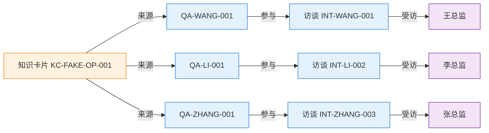
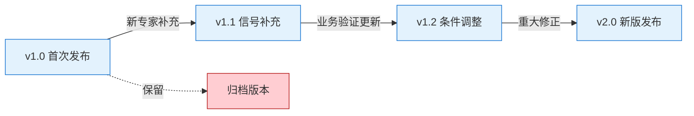
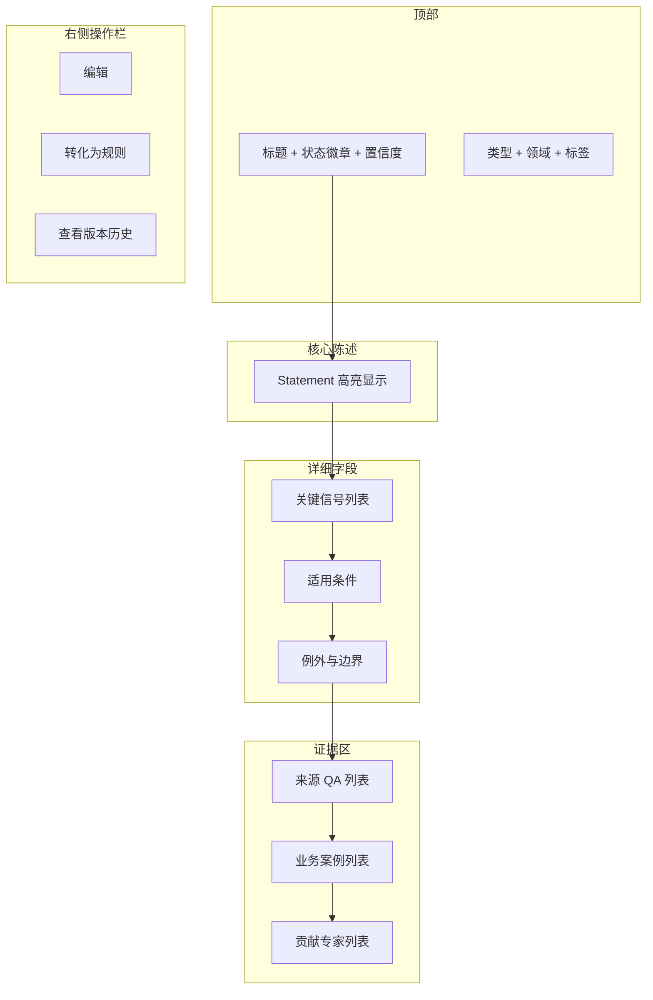
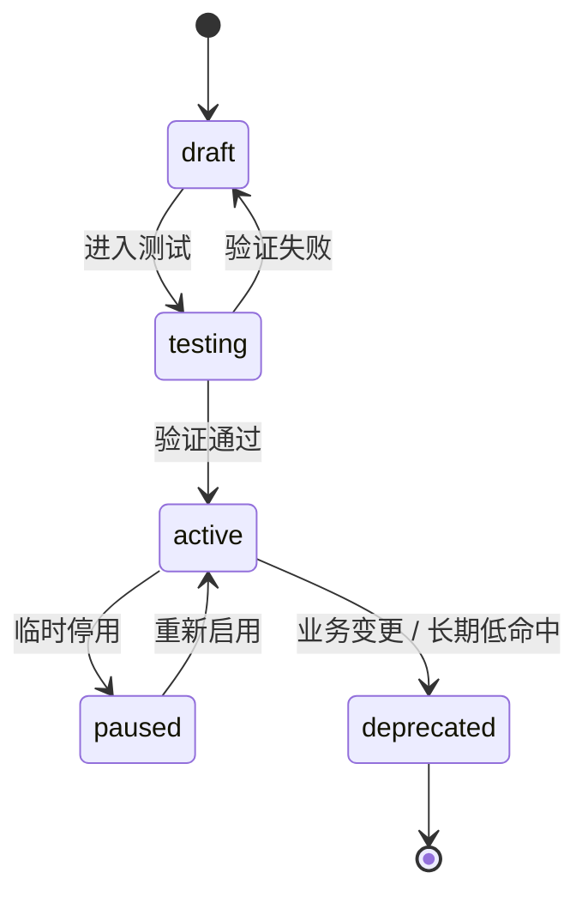
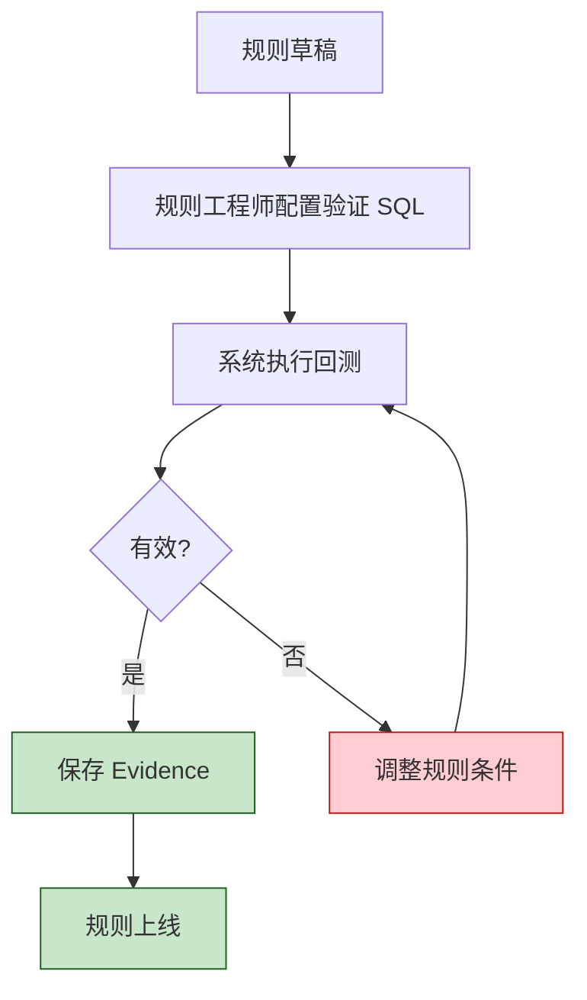
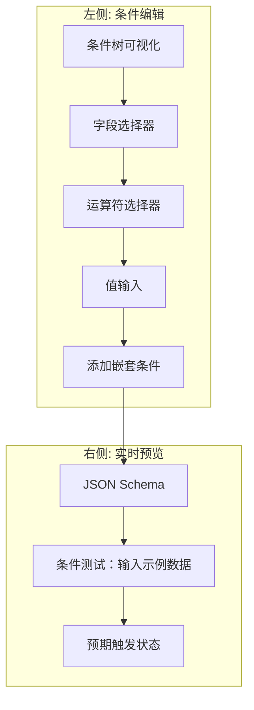

## 1. 概述

本文档描述**知识库（Knowledge Base）**与**规则库（Rule Base）**两个子系统的产品设计。

- **知识库**：问答库经过 AI 提炼 + 人工校对后的**结构化结论视图**，即"知识卡片"的集合
- **规则库**：知识卡片经过结构化、可执行化后的**可被 Agent 加载的规则集合**

二者共同构成"从问答到执行"的桥梁。

### 1.1 角色对比

| 模块 | 角色 | 形态 | 谁来消费 |
| --- | --- | --- | --- |
| 知识库 | 经验压缩器 | 知识卡片（自然语言为主，含结构化字段） | 业务用户、新人、AI RAG |
| 规则库 | 经验结构化 | 规则（schema 化、可执行） | Agent Memory |

### 1.2 与多源的关系

```text
来源 1：问答库（专家访谈）
来源 2：文档导入
来源 3：业务数据挖掘
        ↓ 多源融合
知识库（统一 schema 的 Knowledge Card）
        ↓ 结构化
规则库（Rule / Evidence）
        ↓ 加载
Agent Memory（运行时视图）
```

**知识库是"多源融合"的产物**，不是只从问答库来：

- 同一张 KnowledgeCard 可以有多个 source（如同时引用一个文档 + 一个访谈 + 一个数据模式）
- confidence 由多源交叉验证共同决定
- 任何来源缺失"为什么"时，会反向触发访谈补充

知识库和规则库都是**物化视图**，都可重新生成。问答库不能丢。详见 [知识导入模块设计](./knowledge-import)。

---

## 2. 知识库子系统

### 2.1 核心实体：知识卡片

知识卡片（Knowledge Card）是知识库的最小单元，承载一条结构化的经验结论。

#### 2.1.1 实体字段

| 字段 | 类型 | 必填 | 说明 |
| --- | --- | --- | --- |
| `id` | string | 是 | 唯一标识 |
| `title` | string | 是 | 卡片标题（如"假商机识别"） |
| `statement` | text | 是 | 一句话核心陈述 |
| `domain` | string | 是 | 领域 |
| `tags` | string[] | 否 | 标签 |
| `type` | enum | 是 | `judgement` / `risk` / `opportunity` / `process` / `communication` / `competitive` |
| `key_signals` | json[] | 否 | 关键信号列表 |
| `conditions` | text | 否 | 适用条件描述（自然语言） |
| `exceptions` | text | 否 | 例外与边界（自然语言） |
| `confidence` | float | 是 | 置信度 0-1 |
| `source_qa_ids` | string[] | 否 | 来源 QA（可追溯） |
| `source_doc_ids` | string[] | 否 | 来源文档（多源融合） |
| `source_pattern_ids` | string[] | 否 | 来源数据模式（多源融合） |
| `source_refs` | SourceRef[] | 否 | 完整来源关联（推荐使用） |
| `evidence_case_ids` | string[] | 否 | 业务案例（验证用） |
| `expert_ids` | string[] | 否 | 贡献专家 |
| `validation_status` | enum | 是 | `pending_validation` / `partially_validated` / `validated` / `auto_published` |
| `validation_sources` | string[] | 否 | 验证来源（哪些来源验证了它） |
| `status` | enum | 是 | `draft` / `reviewing` / `published` / `deprecated` |
| `version` | string | 是 | 版本号 |
| `created_at` | datetime | 是 | - |
| `updated_at` | datetime | 是 | - |
| `workspace_id` | bigint | 是 | 所属 workspace |

#### 2.1.2 字段详解

**type 枚举**：

| 类型 | 含义 | 例子 |
| --- | --- | --- |
| `judgement` | 判断类 | "什么样的客户值得跟" |
| `risk` | 风险类 | "客户流失前的 3 个信号" |
| `opportunity` | 机会类 | "哪些行为代表强采购意愿" |
| `process` | 流程经验 | "哪个阶段最容易出问题" |
| `communication` | 沟通策略 | "如何跟不同角色交流" |
| `competitive` | 竞争经验 | "遇到某竞品怎么打" |

**validation_status 枚举**（多源融合新增）：

| 状态 | 含义 | 处理方式 |
| --- | --- | --- |
| `pending_validation` | 待验证（低置信度） | 不入规则库 |
| `partially_validated` | 部分验证（中置信度） | 可入规则库但需标记 |
| `validated` | 已验证（高置信度） | 可入规则库 |
| `auto_published` | 自动发布（来自文档导入的高置信度候选） | 可入规则库 |

**source_refs 字段（多源融合核心）**：

```yaml
source_refs:
  - source_type: "expert_interview"
    source_id: "INT-WANG-001"
    source_excerpt: "客户连续 3 次改会说明决策人不出面"
    contribution_weight: 0.40
  - source_type: "document"
    source_id: "DOC-SOP-OP-001"
    source_excerpt: "改会 3 次以上应主动升级到销售总监"
    contribution_weight: 0.30
  - source_type: "data_pattern"
    source_id: "PAT-RESCHED-001"
    source_excerpt: "89 个样本，赢率从 31% 降到 22%"
    contribution_weight: 0.30
```

**confidence 多维构成（增加来源维度）**：

```yaml
confidence_breakdown:
  expert_agreement: 0.85        # 多专家一致性
  evidence_coverage: 0.90       # 反例覆盖度
  case_validation: 0.75         # 业务数据验证
  recency: 0.80                 # 时效性

  # 多源融合新增维度
  source_authority: 0.75        # 来源权威性
  source_diversity: 0.85        # 来源多样性（多源 > 单源）
  cross_source_consistency: 0.80  # 跨来源一致性

overall: 0.82                   # 加权平均
```

**source_authority 计算**：

| 来源类型 | 基础分 |
| --- | --- |
| 多个专家访谈（多专家共识） | 0.90 |
| 单个专家访谈 | 0.70 |
| 官方 SOP | 0.80 |
| 培训手册 | 0.70 |
| 个人笔记 | 0.50 |
| 业务数据模式（充分样本） | 0.75 |
| 业务数据模式（小样本） | 0.50 |

**cross_source_consistency 计算**：

| 一致情况 | 分值 |
| --- | --- |
| 文档 + 数据 + 访谈三方一致 | 0.95 |
| 任意两方一致 | 0.80 |
| 仅一方 | 0.60 |
| 任意两方冲突 | 0.40 + 标记 `conflict` |

#### 2.1.3 示例

```yaml
knowledge_card:
  id: KC-FAKE-OP-001
  title: 假商机识别

  statement: |
    当商机同时具备多个风险信号时（决策人不出面 / 改会过多 / 拒绝透露预算），
    假概率显著上升。

  type: risk
  domain: opportunity

  key_signals:
    - name: decision_maker_missing
      description: 决策人不主动出面或拒绝见面
    - name: excessive_reschedule
      description: 连续 3 次以上改会
    - name: budget_evasion
      description: 不愿透露预算或对预算问题回避

  conditions: |
    适用于民营企业的常规销售场景
    客户进入实质性跟进阶段（已见过 2 次以上）

  exceptions: |
    - 政府客户适用更宽松标准（节奏天然慢）
    - 大型集团客户适用更宽松标准（内部协调复杂）
    - 客户内部正在重组期

  confidence: 0.83
  confidence_breakdown:
    expert_agreement: 0.90
    evidence_coverage: 0.85
    case_validation: 0.78
    recency: 0.80

  source_qa_ids:
    - QA-WANG-001
    - QA-WANG-002
    - QA-LI-001
    - QA-ZHANG-001

  evidence_case_ids:
    - OPP-1003
    - OPP-1054
    - OPP-2099

  expert_ids:
    - EXP-WANG
    - EXP-LI
    - EXP-ZHANG

  status: published
  version: "1.2"
```

### 2.2 知识卡片与问答的追溯

#### 2.2.1 双向链接



#### 2.2.2 反向追溯

任何一张知识卡片都可以一键追溯到原始访谈：

```text
[知识卡片 KC-FAKE-OP-001]
   ↓ 点击"查看来源"
[3 条 QA（按时间排列）]
   ↓ 点击"查看访谈上下文"
[完整访谈记录：3 位专家的多轮对话]
   ↓ 点击"查看原始录音/转录"（v2）
[录音 + AI 转录]
```

### 2.3 知识卡片版本管理



**版本规则**：

- **小版本（1.x）**：补充信号、调整置信度，不改变核心结论
- **大版本（x.0）**：核心结论变化，必须重走审核流程
- **归档版本**：保留可查但不参与规则生成

### 2.4 知识库 UI

#### 2.4.1 路由

| 页面 | 路由 | 说明 |
| --- | --- | --- |
| 知识库首页 | `/workspace/{code}/knowledge` | 卡片列表 + 检索 |
| 卡片详情 | `/workspace/{code}/knowledge/{id}` | 卡片详情 + 来源追溯 |
| 卡片编辑 | `/workspace/{code}/knowledge/{id}/edit` | 修订卡片 |
| 卡片审核 | `/workspace/{code}/knowledge/review` | 待审核列表 |
| 版本对比 | `/workspace/{code}/knowledge/{id}/versions` | 任意两个版本 diff |

#### 2.4.2 卡片详情页布局



---

## 3. 规则库子系统

### 3.1 规则定义

规则（Rule）是把知识卡片**结构化、可执行化**后的产物。规则必须满足：

1. **可被 Agent 加载**：标准 schema
2. **可被业务数据匹配**：条件表达式明确
3. **可触发行动**：结论明确

### 3.2 核心实体：规则

#### 3.2.1 实体字段

| 字段 | 类型 | 必填 | 说明 |
| --- | --- | --- | --- |
| `id` | string | 是 | 唯一标识 |
| `name` | string | 是 | 规则名称 |
| `description` | text | 否 | 规则说明 |
| `source_kc_id` | string | 是 | 来源知识卡片 |
| `scope` | json | 是 | 适用作用域 |
| `trigger` | json | 是 | **触发器**（订阅 Agent Steer 的 Event） |
| `conditions` | json | 是 | **评估条件**（Rule 评估时判断什么） |
| `conclusion` | json | 是 | 触发结论 |
| `exceptions` | json | 否 | 例外条件 |
| `confidence` | float | 是 | 置信度 0-1 |
| `evidence_case_ids` | string[] | 否 | 验证案例 |
| `execution_stats` | json | 否 | 运行时统计 |
| `status` | enum | 是 | `draft` / `testing` / `active` / `paused` / `deprecated` |
| `version` | string | 是 | 版本号 |
| `created_at` | datetime | 是 | - |
| `updated_at` | datetime | 是 | - |
| `workspace_id` | bigint | 是 | 所属 workspace |

> **trigger 与 conditions 的区别**：
>
> - `trigger`：**什么时候评估 Rule**（订阅什么 Event）
> - `conditions`：**评估什么**（具体判断条件）
> - 这两者分离后才能支持复合触发与多 Event 联合。

#### 3.2.2 触发器（trigger）

Rule trigger **订阅的是 Agent Steer 产生的 Event**（不是抽象的"业务事件"）。详见 [与 Agent Steer 集成](./../knlg-base/index#55-与-agent-steer-的集成)。

**Trigger schema**：

```yaml
# 类型 1: Event 订阅（最常用）
trigger:
  type: "event_subscription"
  event_name: "opportunity.stage_changed"

  # Event 字段过滤
  filter:
    - field: "metadata.days_in_stage"
      operator: ">="
      value: 60
    - field: "metadata.customer_type"
      operator: "=="
      value: "enterprise_民营"

  # 作用实体（从 Event 中提取）
  target_entity:
    from: "event.entity_name"   # 或 "event.target_entity_name"

# 类型 2: 定时巡检
trigger:
  type: "scheduled"
  cron: "0 * * * *"            # 每小时
  scan_entity:
    type: "opportunity"
    where:
      - field: "current_stage_days"
        operator: ">="
        value: 60

# 类型 3: 手动触发（测试用）
trigger:
  type: "manual"

# 类型 4: 复合触发（多 Event 联合）
trigger:
  type: "composite"
  all_of:
    - type: "event_subscription"
      event_name: "opportunity.stage_changed"
    - type: "event_absent"
      event_name: "opportunity.contacted"
      within: "P30D"           # 30 天内未发生
```

#### 3.2.3 评估条件（conditions）

条件表达式必须支持复杂逻辑：

```yaml
# 简单条件
conditions:
  all_of:
    - field: meeting_reschedule_count
      operator: ">="
      value: 3
    - field: decision_maker_met
      operator: "=="
      value: false

# 嵌套逻辑
conditions:
  any_of:
    - all_of:
        - field: meeting_reschedule_count
          operator: ">="
          value: 3
        - field: budget_disclosed
          operator: "=="
          value: false
    - all_of:
        - field: days_since_last_contact
          operator: ">"
          value: 30
        - field: customer_type
          operator: "=="
          value: "enterprise_民营"

# 字段引用
conditions:
  - field: days_since_last_contact
    operator: ">"
    value: "{customer.stale_threshold_days}"
```

#### 3.2.4 运算符清单

| 运算符 | 适用类型 | 说明 |
| --- | --- | --- |
| `==` / `!=` | 任意 | 等于 / 不等于 |
| `>` / `>=` / `<` / `<=` | 数值 / 日期 | 比较 |
| `in` / `not_in` | 数组 | 包含 |
| `contains` / `not_contains` | 字符串 / 数组 | 子串 / 子数组 |
| `is_null` / `is_not_null` | 任意 | 空值判断 |
| `between` | 数值 / 日期 | 区间 |
| `matches_regex` | 字符串 | 正则 |

#### 3.2.5 结论（conclusion）

```yaml
conclusion:
  # 触发动作
  action: notify_sales_to_review
  risk_level: high                    # low / medium / high

  # 推送内容
  notification:
    title: "商机 OPP-{opp_id} 可能存在假商机风险"
    body: |
      检测到多个风险信号同时出现：
      - 决策人连续 3 次未出面
      - 客户不愿透露预算

      建议：申请决策人见面，如被拒则降级跟进。

  # 自动执行（可选）
  auto_actions:
    - type: update_opportunity_status
      params:
        new_status: at_risk
    - type: notify_manager
      params:
        level: 2
```

#### 3.2.6 例外（exceptions）

```yaml
exceptions:
  - field: customer_type
    in: ["government", "large_enterprise"]
  - field: opportunity_stage
    in: ["initial_qualification"]   # 早期阶段不触发
```

### 3.3 规则生命周期



| 状态 | 说明 | Agent 可加载 |
| --- | --- | --- |
| `draft` | 草稿，未验证 | ❌ |
| `testing` | 测试中（灰度） | ✅（仅 10% 流量） |
| `active` | 已上线 | ✅ |
| `paused` | 临时停用 | ❌ |
| `deprecated` | 已废弃 | ❌ |

### 3.4 规则验证（Evidence）

#### 3.4.1 验证流程



#### 3.4.2 Evidence 字段

| 字段 | 类型 | 说明 |
| --- | --- | --- |
| `id` | string | 唯一标识 |
| `rule_id` | string | 关联规则 |
| `case_id` | string | 业务案例 ID |
| `case_source` | string | 来源（如 `opportunity`、`ticket`） |
| `case_data` | json | 案例数据快照 |
| `outcome` | string | 实际结果 |
| `matched_rule` | bool | 是否符合规则预测 |
| `support_score` | float | 支持度（-1 到 1） |
| `validated_at` | datetime | 验证时间 |
| `validator_type` | enum | `historical_backtest` / `expert_judgement` / `live_outcome` |

#### 3.4.3 回测示例

```sql
-- 规则: 民营客户 + 改会>=3 + 决策人未见面 → 高风险
WITH classified AS (
  SELECT
    opportunity_id,
    customer_type,
    meeting_reschedule_count,
    decision_maker_met,
    outcome,
    CASE
      WHEN customer_type = 'enterprise_民营'
        AND meeting_reschedule_count >= 3
        AND decision_maker_met = false THEN 'rule_match'
      ELSE 'rule_not_match'
    END as rule_class
  FROM opportunities
  WHERE created_at BETWEEN '2025-01-01' AND '2026-06-01'
),
metrics AS (
  SELECT
    rule_class,
    COUNT(*) as n,
    AVG(CASE WHEN outcome = 'lost' THEN 1.0 ELSE 0.0 END) as lost_rate
  FROM classified
  GROUP BY rule_class
)
SELECT
  rule_class,
  n,
  lost_rate,
  -- 规则的 lift 指标
  (lost_rate / NULLIF(
    (SELECT lost_rate FROM metrics WHERE rule_class = 'rule_not_match'),
    0)) as lift
FROM metrics
```

输出：

| rule_class | n | lost_rate | lift |
| --- | --- | --- | --- |
| rule_match | 89 | 0.78 | 2.69 |
| rule_not_match | 412 | 0.29 | - |

- `lift > 2`：规则有效
- `lost_rate` 显著高于基线
- 样本量足够（n ≥ 30）

→ 规则通过验证。

### 3.5 规则运行时统计

每次规则被加载、触发、误判，都记录：

| 字段 | 说明 |
| --- | --- |
| `load_count` | 加载次数 |
| `trigger_count` | 触发次数 |
| `false_positive_count` | 误判次数（触发了但结果不符） |
| `false_negative_count` | 漏判次数（应该触发但没触发） |
| `last_trigger_at` | 最近触发时间 |
| `hit_rate` | 命中率 |
| `precision` | 精确率 |
| `recall` | 召回率 |

健康度评估：

```yaml
health_check:
  precision < 0.5:        # 误判多
    action: 暂停并复审
  recall < 0.5:           # 漏判多
    action: 检查规则条件是否过严
  hit_rate == 0 for 90d:  # 长期不触发
    action: 候选废弃
```

### 3.6 规则库 UI

#### 3.6.1 路由

| 页面 | 路由 | 说明 |
| --- | --- | --- |
| 规则库首页 | `/workspace/{code}/rules` | 规则列表 + 筛选 |
| 规则详情 | `/workspace/{code}/rules/{id}` | 规则定义 + 统计 |
| 规则编辑器 | `/workspace/{code}/rules/{id}/edit` | 条件/结论编辑 |
| 规则验证 | `/workspace/{code}/rules/{id}/verify` | 回测配置 |
| Evidence 列表 | `/workspace/{code}/rules/{id}/evidence` | 关联案例 |

#### 3.6.2 规则编辑器（关键 UI）



---

## 4. 与其他模块的关系

| 模块 | 关系 |
| --- | --- |
| **问答库** | 知识库是问答库的物化视图，可重新生成 |
| **Workspace** | 知识库和规则库属于某个 Workspace（不跨 Workspace 共享） |
| **Agent Steer（Event/Status/Entity）** | 本系统**消费** Agent Steer 产生的 Event/Status，**不重新定义** |
| **Interceptor** | Event 的生成源头，本系统订阅 Event 作为 Rule trigger |
| **Agent Memory** | 规则库 → 加载 → Agent Memory |
| **GraphRAG** | 本系统**就是** Neo 平台的 GraphRAG 知识库（一致定位） |

### 4.1 Event/Status 复用原则

Agent Steer 已经定义了完整的 Event / Status / Entity schema 及 GraphRAG 映射。本系统不重新定义这些概念，而是：

| Agent Steer 定义 | 本系统使用方式 |
| --- | --- |
| `Event.name` | Rule trigger 订阅的事件类型 |
| `Event.entity_name` | Rule 作用的目标实体 |
| `Event.metadata.*` | Rule filter / conditions 的字段源 |
| `Status.attributes.*` | Rule evaluation 读取的上下文 |
| `Entity` 命名规范 `{type}_{id}` | 严格复用，不重新定义 |

### 4.2 Workspace 隔离原则

严格遵守 Workspace 的"无跨 Workspace 资源"设计：

- 知识库、规则库都是 **Workspace 级别**资源
- Rule trigger 订阅的 Event **限定在当前 Workspace 范围内**
- 规则**模板**（org 级别共享）与**实例**（workspace 级别）严格分离

---

## 5. 关键业务规则

### 5.1 知识卡片规则

| 规则 | 说明 |
| --- | --- |
| 一张卡片只表达一个判断 | 避免大杂烩 |
| 必须有来源 QA | 不能凭空生成 |
| confidence 必须基于多维评估 | 不允许主观打分 |
| 至少 2 位专家覆盖 | 避免单点偏差 |
| 反例必须列出 | 边界即价值 |

### 5.2 规则库规则

| 规则 | 说明 |
| --- | --- |
| 规则必须有对应知识卡片 | 不能凭空写规则 |
| 规则上线前必须有 Evidence | 不允许盲上 |
| 规则必须有例外处理 | 防止误伤 |
| 规则版本必须可回滚 | 防止升级事故 |
| 高风险规则需二次确认 | 避免误判造成业务损失 |

---

## 6. 后续规划

- **规则市场**：跨 workspace 共享规则模板
- **自动规则发现**：基于业务数据自动发现候选规则（人审）
- **规则 AB 测试**：规则灰度发布、对比效果
- **规则解释**：触发规则时显示完整推理路径
- **规则血缘**：跨规则的依赖关系图谱

---

## 🔗 相关文档

- [知识库与问答库产品设计](../knlg-base/) - 总览文档
- [问答库产品设计](./q-a-library) - L1 问答库
- [知识萃取流程设计](./extraction-flow) - L1 → L2 → L3 的流程
- [Agent Prototype 设计](../agents/agent-prototype-design) - 规则消费方
- [事件管理](../workspaces/events) - 规则触发来源

---

## ✅ 设计检查清单

- [ ] 知识卡片编辑 UI
- [ ] 规则条件表达式 DSL 设计
- [ ] 规则编辑器（可视化）
- [ ] Evidence 验证工具
- [ ] 回测 SQL 模板库
- [ ] 规则健康度监控
- [ ] 版本管理与回滚机制
- [ ] E2E 测试用例
