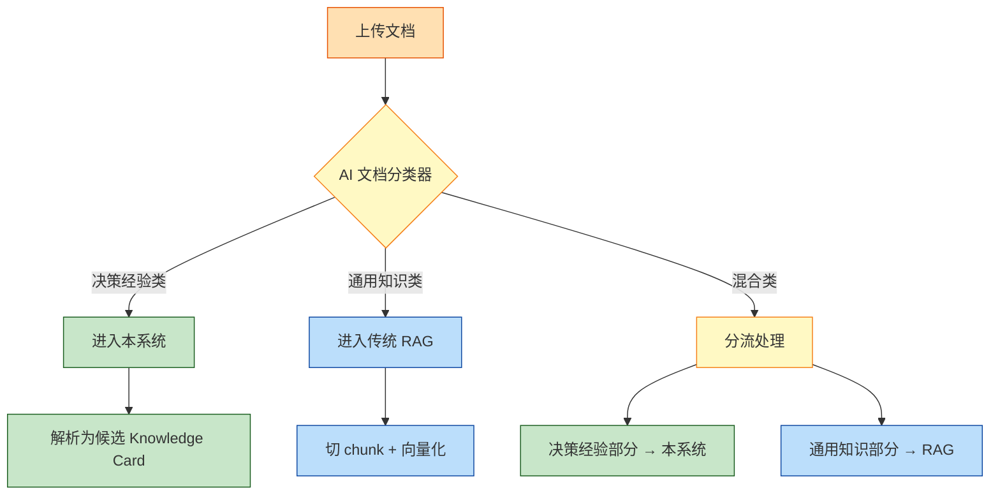
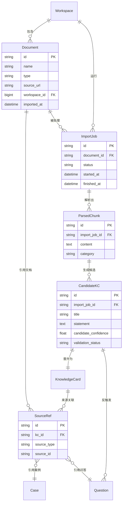
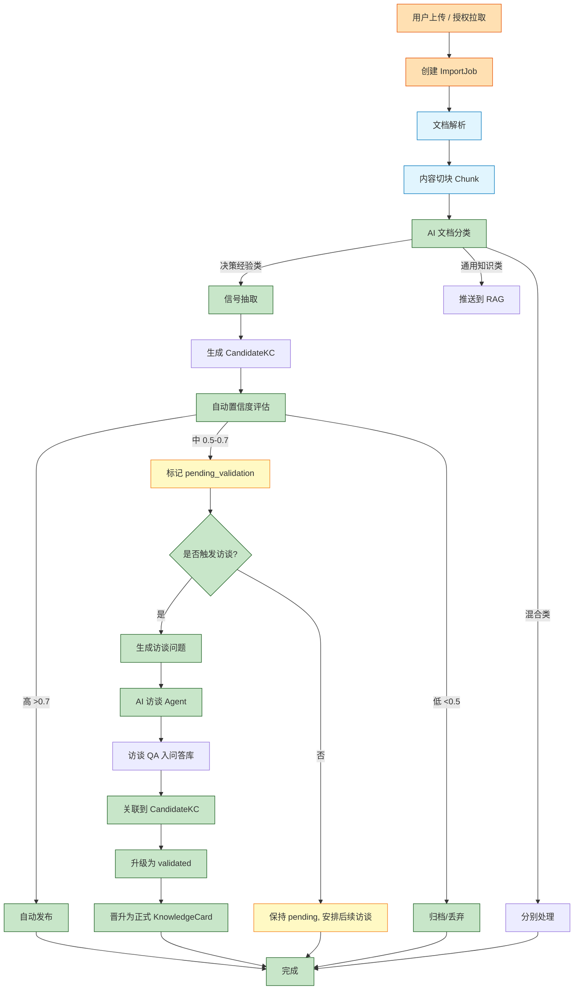
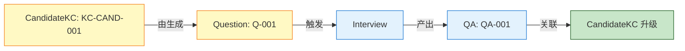
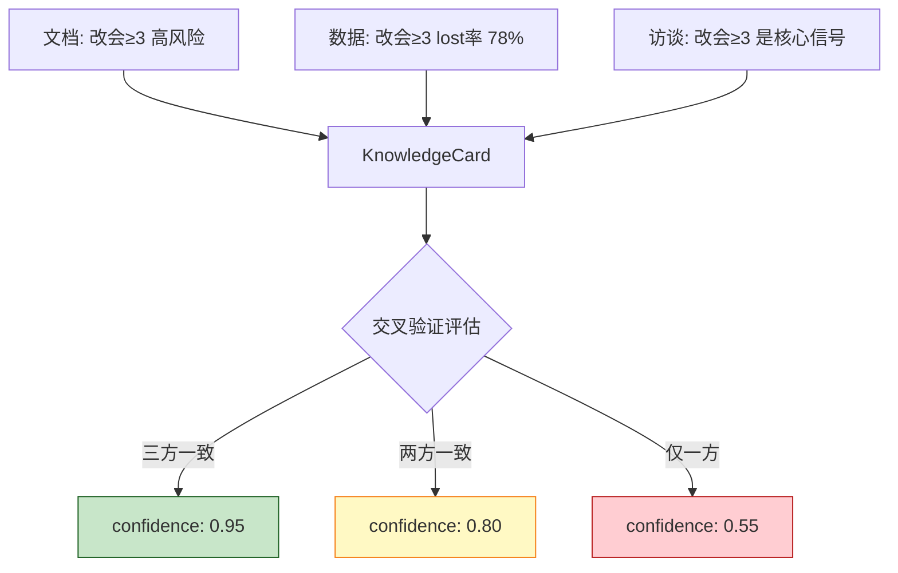
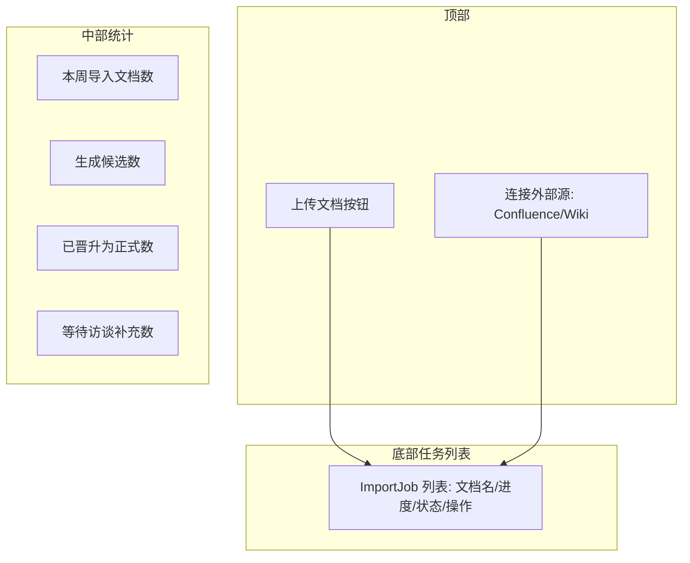
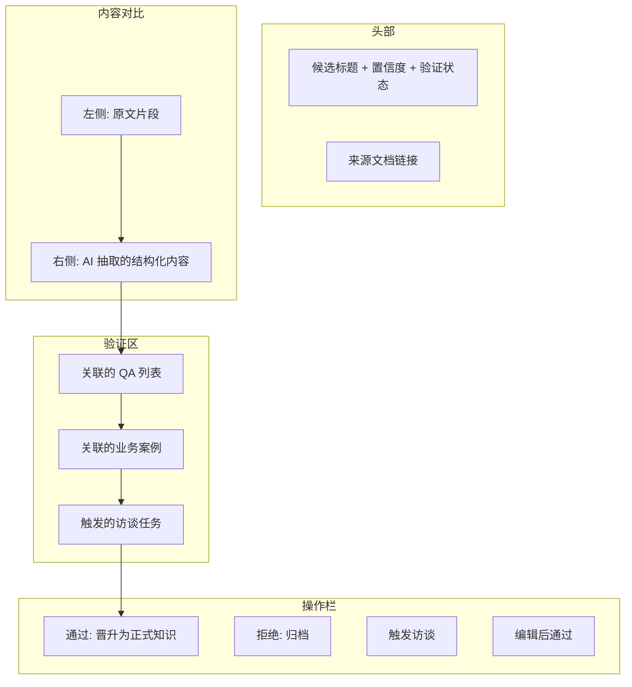

## 1. 概述

知识导入模块是**冷启动与多源融合的关键入口**。它把组织已有的显性文档、业务数据转化为知识库的**候选知识**，并通过反向触发访谈的方式，把这些低置信度的候选知识升级为高置信度的可用知识。

### 1.1 为什么需要这个模块

现实场景中：

- **大多数组织不是从零开始**：已有大量 Wiki、Confluence、SOP、培训材料
- **从访谈开始太慢**：访谈是异步的，可能要数周才能产出第一条知识
- **已有知识被浪费**：传统做法是把这些文档丢给 RAG，但 RAG 不会提炼决策经验
- **冷启动需要快速见效**：上线第一天就要能看到"有知识"

**本模块解决**：把已有文档/数据快速导入，并通过反向访谈补充"为什么"，形成可用知识。

### 1.2 与传统 RAG 导入的区别

| 维度 | 传统 RAG | 本模块 |
| --- | --- | --- |
| 处理方式 | 切 chunk + 向量化 | 解析 + 结构化 + 候选知识卡片 |
| 输出 | 相似度检索 | 决策规则候选 |
| 用途 | 通用知识问答 | 决策经验沉淀 |
| 质量保障 | 无（依赖源文档） | 必须经过验证 |
| 是否进规则库 | 否 | 是（验证后） |
| 是否触发访谈 | 否 | 是（反向触发） |

---

## 2. 核心设计理念

### 2.1 三条原则

```text
原则 1：宽进严出
        → 导入尽量宽松，所有文档都尝试解析
        → 但低质量候选必须经过验证才能进入规则库

原则 2：来源透明
        → 每条知识必须标记来源（文档/数据/访谈）
        → 用户能清楚看到这条知识是怎么来的

原则 3：交叉验证
        → 多个来源指向同一结论时，置信度提升
        → 单一来源的知识需要补充访谈
```

### 2.2 文档分类决策

导入时**先判断文档属于哪一类**，决定后续处理路径：



**分类判断依据**：

| 特征 | 决策经验类（本系统） | 通用知识类（传统 RAG） |
| --- | --- | --- |
| 文档类型 | SOP、判断指南、培训手册 | 产品手册、API 文档、术语表 |
| 内容特征 | "如果 X 则 Y"、"X% 客户..." | "X 是 Y"、"X 用于 Z" |
| 触发关键词 | "应该"、"必须"、"通常"、"建议" | "是"、"可以"、"用于"、"定义" |
| 应用方式 | 决策时参考 | 查阅时检索 |
| 失败代价 | 高（决策错误） | 低（理解偏差） |

### 2.3 反向触发访谈

**核心机制**：从候选知识卡片反向生成访谈问题。

```text
[文档片段]
"客户连续 3 次改会应主动升级到销售总监"

↓ 自动识别为决策经验

↓ 反向生成访谈问题：

Q1: 你当时为什么把阈值定在 3 次？
Q2: 有没有改会 3 次但最终成的？
Q3: 政府客户适用同样的标准吗？
Q4: 升级之后通常谁接手？效果如何？

↓ AI 访谈 Agent 发起访谈

↓ 获得 4 条 QA 入问答库

↓ 关联到该候选 Knowledge Card

↓ 升级为 validated 状态（confidence 提升）
```

---

## 3. 核心实体

### 3.1 实体关系图



### 3.2 实体字段说明

#### Document（源文档）

| 字段 | 类型 | 说明 |
| --- | --- | --- |
| `id` | string | 唯一标识 |
| `name` | string | 文档名称 |
| `type` | enum | `wiki` / `confluence` / `pdf` / `docx` / `md` / `csv` / `email` / `meeting_notes` |
| `source_url` | string | 来源 URL（如果是外部导入） |
| `workspace_id` | bigint | 所属 workspace |
| `imported_at` | datetime | 导入时间 |
| `metadata` | json | 元数据（作者、版本、最后更新时间） |
| `hash` | string | 内容哈希，用于检测更新 |

#### ImportJob（导入任务）

| 字段 | 类型 | 说明 |
| --- | --- | --- |
| `id` | string | 唯一标识 |
| `document_id` | string | 源文档 |
| `status` | enum | `pending` / `parsing` / `classifying` / `extracting` / `completed` / `failed` |
| `progress` | float | 进度 0-1 |
| `started_at` | datetime | - |
| `finished_at` | datetime | - |
| `result_summary` | json | 处理结果摘要（生成多少候选、丢弃多少） |
| `error_message` | text | 失败原因 |

#### ParsedChunk（解析片段）

| 字段 | 类型 | 说明 |
| --- | --- | --- |
| `id` | string | 唯一标识 |
| `import_job_id` | string | 所属任务 |
| `content` | text | 内容 |
| `category` | enum | `decision_experience` / `general_knowledge` / `mixed` |
| `key_signals` | json[] | 提取的信号列表 |
| `confidence_hint` | float | AI 评估的"是不是决策经验"置信度 |

#### CandidateKC（候选知识卡片）

| 字段 | 类型 | 说明 |
| --- | --- | --- |
| `id` | string | 唯一标识 |
| `import_job_id` | string | 来源任务 |
| `title` | string | 候选标题 |
| `statement` | text | 候选陈述 |
| `key_signals` | json[] | 关键信号 |
| `candidate_confidence` | float | AI 评估的置信度 |
| `validation_status` | enum | `pending` / `validating` / `validated` / `rejected` / `auto_published` |
| `validation_sources` | string[] | 验证来源（哪些 QA / Case 验证了它） |
| `promoted_kc_id` | string | 晋升后的 KnowledgeCard ID |

#### SourceRef（来源关联）

通用来源关联表，把 KnowledgeCard / Rule 与原始来源绑定：

| 字段 | 类型 | 说明 |
| --- | --- | --- |
| `id` | string | 唯一标识 |
| `kc_id` | string | 关联知识卡片 |
| `rule_id` | string | 关联规则（可选） |
| `source_type` | enum | `document` / `case` / `interview` / `data_pattern` |
| `source_id` | string | 来源实体 ID |
| `source_excerpt` | text | 来源片段（用于追溯） |
| `contribution_weight` | float | 该来源对置信度的贡献权重 |

---

## 4. 关键功能

### 4.1 文档导入

#### 4.1.1 支持的来源

| 来源 | 说明 | 优先级 |
| --- | --- | --- |
| **Confluence / Wiki** | 已有知识库 | P0 |
| **上传 PDF / Word** | 离线文档 | P0 |
| **上传 Markdown** | 技术文档 | P0 |
| **会议纪要** | 历史会议 | P1 |
| **邮件导出** | 重要邮件（仅授权范围） | P2 |
| **CRM 商机描述** | 业务案例 | P1 |
| **工单 / 投诉记录** | 客服案例 | P1 |

#### 4.1.2 导入流程



#### 4.1.3 文档解析策略

不同文档类型采用不同解析策略：

| 文档类型 | 解析策略 |
| --- | --- |
| **结构化 SOP** | 按章节解析，保留标题层级 |
| **Wiki / Confluence** | 按段落解析，识别列表、表格 |
| **PDF** | OCR + 结构化识别 |
| **Markdown** | 按标题解析 |
| **会议纪要** | 按议题/发言人解析 |
| **邮件** | 按邮件线程解析 |

### 4.2 AI 文档分类器

#### 4.2.1 分类维度

| 维度 | 决策经验类 | 通用知识类 |
| --- | --- | --- |
| **动词特征** | "应该"、"必须"、"通常"、"建议"、"避免" | "是"、"可以"、"用于"、"提供"、"支持" |
| **条件结构** | "如果 X 则 Y"、"当 X 出现时" | "X 是 Y"、"X 用于 Z" |
| **量化特征** | "X% 客户"、"平均 X 天"、"通常 X 次" | - |
| **反例存在** | 经常有（"例外情况"） | 通常无 |
| **应用动词** | "判断"、"决策"、"升级"、"处理" | "了解"、"查询"、"参考" |

#### 4.2.2 分类 Prompt 设计

```text
你是文档分类助手。给定一段文档内容，判断它属于哪一类：

A. 决策经验类（应进入知识库系统）
   - 包含判断、决策、行动指引
   - 通常有条件、阈值、例外
   - 例子：SOP、判断指南、培训手册

B. 通用知识类（应保留在传统 RAG）
   - 描述事实、定义、流程说明
   - 不包含决策指引
   - 例子：产品手册、API 文档、术语表

输出格式：
{
  "category": "A" | "B",
  "confidence": 0.0-1.0,
  "reasons": ["理由1", "理由2"]
}

文档内容：
{document_content}
```

### 4.3 信号抽取

对分类为"决策经验类"的片段，AI 抽取信号：

```yaml
# 信号抽取 Prompt 的输出结构
extracted_signals:
  - statement: "客户连续 3 次改会应主动升级"
    type: "decision_rule"
    conditions:
      - field: "meeting_reschedule_count"
        operator: ">="
        value: 3
    action: "escalate_to_sales_director"
    confidence: 0.75

  - statement: "改会通常意味着预算或决策人问题"
    type: "cause_analysis"
    confidence: 0.65

  - statement: "民营企业适用，政府客户不适用"
    type: "exception"
    confidence: 0.60
```

### 4.4 候选置信度评估

#### 4.4.1 多维评分

```yaml
candidate_confidence_breakdown:
  classification_certainty: 0.85    # 分类器确信度
  signal_clarity: 0.75              # 信号清晰度
  quantification: 0.70              # 是否有具体数值
  exception_coverage: 0.60          # 反例覆盖度
  source_authority: 0.70            # 源文档权威性（官方 > 个人笔记）

overall_candidate_confidence: 0.74  # 加权平均
```

#### 4.4.2 自动发布阈值

| 置信度区间 | 处理方式 |
| --- | --- |
| `> 0.80` | 自动发布，标记 `auto_published` |
| `0.60 - 0.80` | 标记 `pending_validation`，触发访谈 |
| `< 0.60` | 归档，标记 `rejected`，保留备查 |

### 4.5 反向触发访谈

#### 4.5.1 触发条件

- 候选置信度在 0.60-0.80 之间
- 涉及关键业务判断（如客户分类、风险识别）
- 文档来源是个人笔记（非官方 SOP）

#### 4.5.2 访谈问题生成

基于候选卡片，自动生成 3-5 个访谈问题：

```yaml
generated_questions:
  - text: "你当时为什么把阈值定在 3 次？"
    type: "rationale"
    rationale: "挖掘决策依据"
  - text: "有没有改会 3 次但最终成的？"
    type: "counter_example"
    rationale: "寻找反例"
  - text: "政府客户适用同样的标准吗？"
    type: "boundary"
    rationale: "识别适用边界"
  - text: "升级之后通常谁接手？效果如何？"
    type: "outcome"
    rationale: "了解执行效果"
```

#### 4.5.3 关联机制



### 4.6 跨来源交叉验证

知识卡片的支持来源可以是多个。验证机制：



**交叉验证规则**：

| 一致情况 | confidence 调整 |
| --- | --- |
| 文档 + 数据 + 访谈三方一致 | 基础值 × 1.2（封顶 1.0） |
| 任意两方一致 | 基础值 × 1.1 |
| 任意两方冲突 | 基础值 × 0.7 + 标记 `conflict` |
| 仅一方 | 基础值不变 |

---

## 5. 数据挖掘模块（来源 3）

除了文档导入，本模块还负责**从业务数据中挖掘模式**。

### 5.1 支持的数据来源

| 数据 | 说明 |
| --- | --- |
| CRM 商机数据 | 赢率、阶段时长、决策人字段 |
| 工单 / 投诉数据 | 投诉类型、响应时长、客户流失 |
| 用户行为日志 | 页面访问、点击、停留 |
| 销售业绩数据 | 个人业绩、转化率、客户分布 |

### 5.2 挖掘方法

#### 5.2.1 模式识别

```sql
-- 示例：发现赢单率与某字段的关系
SELECT
  CASE
    WHEN meeting_reschedule_count >= 3 THEN 'high_reschedule'
    ELSE 'normal'
  END as pattern_group,
  COUNT(*) as n,
  AVG(CASE WHEN outcome = 'won' THEN 1.0 ELSE 0.0 END) as win_rate
FROM opportunities
WHERE created_at >= '2025-01-01'
GROUP BY pattern_group
```

#### 5.2.2 异常发现

```sql
-- 示例：发现不同销售业绩异常
SELECT
  sales_id,
  COUNT(*) as opp_count,
  AVG(CASE WHEN outcome = 'won' THEN 1.0 ELSE 0.0 END) as win_rate,
  -- 与团队均值对比
  AVG(CASE WHEN outcome = 'won' THEN 1.0 ELSE 0.0 END) -
  (SELECT AVG(CASE WHEN outcome = 'won' THEN 1.0 ELSE 0.0 END)
   FROM opportunities WHERE created_at >= '2025-01-01') as deviation
FROM opportunities
WHERE created_at >= '2025-01-01'
GROUP BY sales_id
HAVING ABS(deviation) > 0.20  -- 偏差超过 20%
```

### 5.3 模式 → 访谈问题

```yaml
# 数据发现的模式
pattern:
  name: "改会≥3 次赢率显著下降"
  data_evidence: 89 个商机，赢率从 31% 降到 22%
  statistical_significance: 0.95

# 自动生成访谈问题
generated_questions:
  - text: "你认为是改会导致丢单，还是改会只是表象？"
    type: "causal_analysis"
  - text: "哪些类型的客户在改会后还能救回来？"
    type: "recovery_pattern"
  - text: "改会 1-2 次和改会 5 次以上有本质区别吗？"
    type: "boundary"
```

### 5.4 模式置信度

```yaml
pattern_confidence:
  sample_size: 89
  effect_size: 0.31 -> 0.22 (delta=0.09)
  statistical_significance: 0.95
  consistency_over_time: 0.80  # 不同时间段表现一致

overall_pattern_confidence: 0.83
```

---

## 6. UI 设计

### 6.1 路由

| 页面 | 路由 | 说明 |
| --- | --- | --- |
| 知识导入首页 | `/workspace/{code}/knowledge/import` | 上传入口、任务列表 |
| 上传文档 | `/workspace/{code}/knowledge/import/upload` | 上传文件或连接外部源 |
| 导入任务详情 | `/workspace/{code}/knowledge/import/jobs/{id}` | 查看进度和结果 |
| 候选知识审核 | `/workspace/{code}/knowledge/candidates` | 候选 KnowledgeCard 列表 |
| 候选知识详情 | `/workspace/{code}/knowledge/candidates/{id}` | 单个候选审核 |

### 6.2 关键页面

#### 6.2.1 知识导入首页



#### 6.2.2 候选知识详情页



---

## 7. 业务规则

### 7.1 导入优先级

| 优先级 | 文档类型 | 理由 |
| --- | --- | --- |
| P0 | 官方 SOP | 权威性最高，决策价值最大 |
| P0 | 培训手册 | 已有结构化经验 |
| P1 | 老员工会议纪要 | 隐性经验富矿 |
| P1 | CRM 案例描述 | 真实场景 |
| P2 | 个人笔记 | 质量参差，需要筛选 |
| P3 | 邮件往来 | 通常是片段化信息 |

### 7.2 候选知识生命周期

```text
pending (刚生成)
   ↓ 自动置信度评估
   ├─> auto_published (高置信度)
   ├─> pending_validation (中等置信度, 等待访谈)
   └─> rejected (低置信度, 归档)

pending_validation
   ↓ 访谈补充
   ├─> validated (升级为正式知识卡片)
   └─> abandoned (访谈失败, 归档)
```

### 7.3 反向触发的边界

不是所有候选都触发访谈，避免专家疲劳：

- **必须触发**：关键业务判断（涉及赢率/风险/合规）
- **建议触发**：重要但不紧急
- **不触发**：琐碎流程（如"请假流程"）

---

## 8. 与其他模块的关系

| 模块 | 关系 |
| --- | --- |
| **问答库** | 文档/数据触发的访谈进入问答库；问答库反向为候选知识提供验证 |
| **知识库** | 候选晋升为正式 KnowledgeCard |
| **业务数据源** | 数据挖掘器查询 CRM/工单/日志 |
| **Agent** | v2 可让 Agent 自动发现需要补充访谈的知识 |
| **传统 RAG** | 通用知识类文档推送到 RAG |

---

## 9. 后续规划

- **智能分类**：分类器不断学习，提高准确率
- **增量导入**：检测文档更新，只处理变化部分
- **文档版本**：追踪源文档版本变化，标记知识过期风险
- **跨语言**：支持中英文混排文档
- **多模态**：OCR 识别图片中的知识、ASR 识别录音

---

## 🔗 相关文档

- [知识库与问答库产品设计（总览）](./index) - 总览，包含多源融合的设计理念
- [问答库产品设计](./q-a-library) - L1 问答库
- [知识萃取流程设计](./extraction-flow) - 访谈方法、提炼规则
- [知识库与规则库产品设计](./knowledge-and-rule) - Knowledge Card 与 Rule 详细设计
- [Agent Prototype 设计](../agents/agent-prototype-design) - 规则消费方

---

## ✅ 设计检查清单

- [ ] 文档解析器（支持主流格式）
- [ ] AI 文档分类器（含 Prompt 模板）
- [ ] 信号抽取器
- [ ] 候选置信度评估模型
- [ ] 反向访谈问题生成
- [ ] 跨来源验证逻辑
- [ ] 数据挖掘器
- [ ] 候选审核 UI
- [ ] E2E 测试用例
