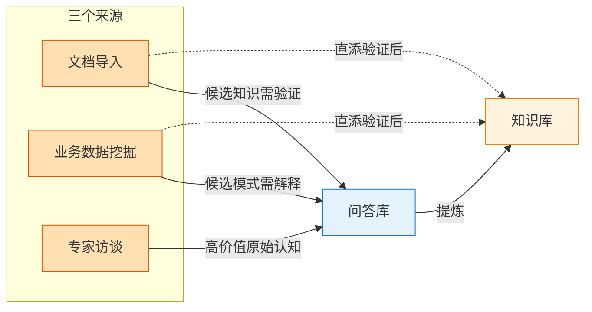
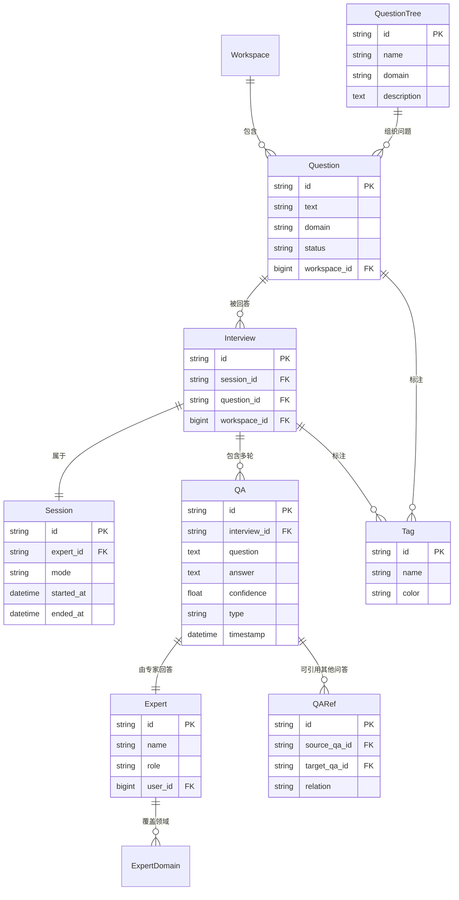
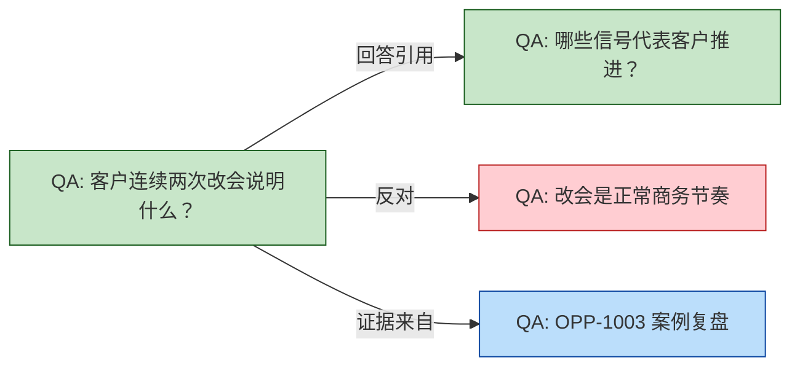
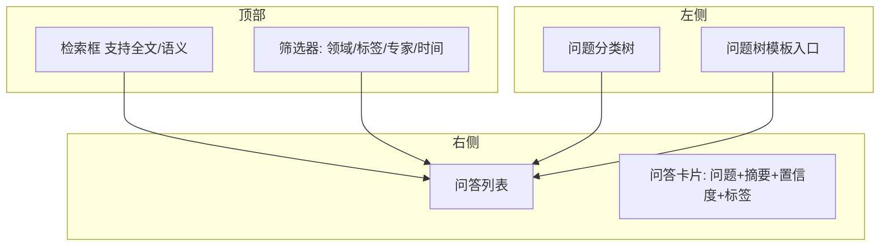
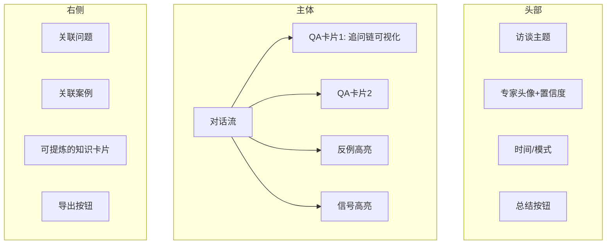

## 1. 概述

问答库（Q&A Library）是知识库体系的**第一等公民**，承担"经验采集器"的角色。它存储的是**专家原始认知**——未经提炼的观点、感受、判断和案例，是后续知识库、规则库的源头数据。

### 1.1 与传统 FAQ 的区别

| 维度 | 传统 FAQ | 本问答库 |
| --- | --- | --- |
| 答案来源 | 一次性整理 | 持续访谈、追问、迭代 |
| 答案结构 | 简短结论 | 完整对话上下文 |
| 是否可追问 | 否 | 是（追问是核心机制） |
| 是否带证据 | 否 | 是（每个回答有来源） |
| 是否带反例 | 否 | 是（反例是规则的边界） |
| 是否被 AI 消费 | 检索式 | 提炼式（生成知识卡片） |

### 1.2 核心设计原则

1. **完整保留对话上下文**：一次访谈的多轮问答必须放在一起，不能拆散
2. **回答可被追问**：必须支持后续追问、补问、反驳
3. **回答带元数据**：每条回答必须带专家、时间、场景、置信度等
4. **可追溯到原始来源**：每条回答必须能追溯到是哪次访谈、哪位专家
5. **永不删除**：问答是组织认知的原始数据源，原则上只追加不删除

### 1.3 在多源融合中的角色

问答库是知识库体系的**最高质量原始数据源**，但**不是唯一来源**。完整的多源融合架构中：



关键点：

| 场景 | 问答库的角色 |
| --- | --- |
| **主动访谈** | 原始认知数据源 |
| **验证文档知识** | 为文档中的判断补充"为什么" |
| **解释数据模式** | 为数据发现的规律补充因果关系 |
| **争议调停** | 当文档与数据冲突时，由专家访谈裁决 |

详见 [知识导入模块设计](./knowledge-import) 和 [总览 - 多源融合理念](./index#4-核心设计理念)。

---

## 2. 用户角色

| 角色 | 主要行为 | 关键诉求 |
| --- | --- | --- |
| **领域专家** | 接受 AI 访谈、回答问题 | 访谈高效、不被打扰、能反驳与补充 |
| **AI 访谈 Agent** | 主动发起访谈、追问、汇总 | 有问题树模板、能理解回答、识别追问点 |
| **知识提炼员**（产品 / 业务） | 阅读问答、提炼知识卡片 | 问答可检索、可关联、可标记 |
| **新人** | 通过问答了解"为什么" | 问答可全文检索、可按场景查找 |
| **Agent** | 调用问答做 RAG 检索 | 问答有结构化字段、有版本 |

---

## 3. 核心实体

### 3.1 实体关系图



### 3.2 实体字段说明

#### Question（问题）

问题是一个**待回答的提问**，是访谈的起点。

| 字段 | 类型 | 说明 |
| --- | --- | --- |
| `id` | string | 唯一标识 |
| `text` | text | 问题内容 |
| `domain` | string | 领域分类，如 `opportunity_judgement`、`customer_communication` |
| `tags` | string[] | 标签 |
| `parent_question_id` | string | 上级问题（用于构建问题树） |
| `priority` | int | 优先级，影响访谈顺序 |
| `status` | enum | `pending` / `in_progress` / `answered` / `archived` |
| `created_by` | string | 创建者 |
| `created_at` | datetime | 创建时间 |

#### Interview（访谈）

访谈是**一次完整的对话过程**，通常围绕一个问题或一组问题展开。

| 字段 | 类型 | 说明 |
| --- | --- | --- |
| `id` | string | 唯一标识 |
| `session_id` | string | 所属会话 |
| `question_id` | string | 起始问题 |
| `expert_id` | string | 受访专家 |
| `mode` | enum | `ai_agent` / `manual` / `self` |
| `summary` | text | AI 自动生成的总结 |
| `started_at` | datetime | 开始时间 |
| `ended_at` | datetime | 结束时间 |
| `workspace_id` | bigint | 所属 workspace |

#### QA（一问一答）

QA 是访谈中的**单个问答单元**，是问答库最核心的数据。

| 字段 | 类型 | 说明 |
| --- | --- | --- |
| `id` | string | 唯一标识 |
| `interview_id` | string | 所属访谈 |
| `sequence` | int | 在访谈中的顺序 |
| `question` | text | 追问/原始问题 |
| `answer` | text | 专家回答 |
| `type` | enum | `initial` / `followup` / `counter_example` / `clarification` |
| `confidence` | float | 回答置信度（0-1，由专家自评或 AI 评估） |
| `source_case_ids` | string[] | 引用的真实案例 |
| `parent_qa_id` | string | 上一轮 QA（追问链） |
| `tags` | string[] | 标签 |
| `timestamp` | datetime | 时间 |

#### Session（会话）

会话把多次相关访谈聚合在一起。例如一次"销售方法论"访谈可能包含 5 个 Interview。

| 字段 | 类型 | 说明 |
| --- | --- | --- |
| `id` | string | 唯一标识 |
| `expert_id` | string | 受访专家 |
| `topic` | string | 会话主题 |
| `mode` | enum | `ai_agent` / `manual` |
| `started_at` | datetime | - |
| `ended_at` | datetime | - |

#### QuestionTree（问题树模板）

问题树是**预设的访谈大纲**，按场景组织问题序列。

| 字段 | 类型 | 说明 |
| --- | --- | --- |
| `id` | string | 唯一标识 |
| `name` | string | 模板名称 |
| `domain` | string | 适用领域 |
| `description` | text | 模板说明 |
| `questions` | json | 问题列表（含层级、追问建议） |
| `version` | string | 版本号 |

#### Expert（领域专家）

| 字段 | 类型 | 说明 |
| --- | --- | --- |
| `id` | string | 唯一标识 |
| `user_id` | bigint | 关联系统用户 |
| `name` | string | 姓名 |
| `role` | string | 角色（销售总监 / 客服经理 等） |
| `domains` | string[] | 覆盖领域 |
| `experience_years` | int | 从业年限 |
| `expertise_score` | float | 系统计算的专业度评分 |

---

## 4. 关键功能

### 4.1 问题树模板（核心入口）

#### 4.1.1 设计思路

问题树是"问答库"的灵魂。一个好的问题树能让 AI 访谈 Agent 自动挖出专家 80% 的核心判断。

#### 4.1.2 内置模板（v1）

| 模板 | 领域 | 主要问题 |
| --- | --- | --- |
| `crm_sales_overview` | 销售全局 | 客户画像、商机判断、跟进策略、流失信号 |
| `crm_opportunity_qualification` | 商机资格 | 假商机识别、预算确认、决策链识别、竞争应对 |
| `crm_customer_communication` | 客户沟通 | 不同角色的话术、异议处理、推进技巧 |
| `support_risk_warning` | 客服风险 | 投诉真伪、流失预警、紧急度判断 |
| `implementation_delay_warning` | 实施风险 | 延期信号、需求蔓延、资源冲突 |

#### 4.1.3 模板结构示例

```yaml
template:
  id: crm_opportunity_qualification
  name: 商机资格判断访谈模板
  domain: opportunity
  version: 1.0

  questions:
    - id: Q-OP-1
      text: "什么样的客户最值得跟？为什么？"
      followups:
        - "这种客户有什么共同特征？"
        - "你能举 1-2 个具体例子吗？"
        - "有没有反例？看起来像但最终没成的？"

    - id: Q-OP-2
      text: "什么情况下你会放弃一个商机？"
      followups:
        - "最早什么时候能识别出来？"
        - "放弃的标准是什么？"
        - "有没有放过不该放的？"

    - id: Q-OP-3
      text: "你如何识别谁是真正的决策人？"
      followups:
        - "如果决策人不出面呢？"
        - "多长时间还见不到就该升级？"

    - id: Q-OP-4
      text: "遇到竞品时你怎么判断输赢？"
      followups:
        - "你最怕遇到哪家竞品？"
        - "什么情况下不要硬打？"

    - id: Q-OP-5
      text: "你最近成交的一单最关键的转折点是什么？"
      followups:
        - "为什么当时觉得能成？"
        - "如果重来一次会怎么调整？"
        - "当时的客户是什么状态？"

    - id: Q-OP-6
      text: "你最近丢掉的一单，最早的失误信号是什么？"
      followups:
        - "当时为什么没发现？"
        - "后来怎么看？"
        - "如果是现在你会怎么做？"
```

#### 4.1.4 模板进化机制

问题树模板不是一成不变的，会通过以下方式进化：

- AI 分析新访谈，自动识别"值得追问的方向"
- 知识提炼员标记"高频被问到的追问" → 反哺到模板
- 专家反馈"这个问题问得好/不好" → 调整模板

### 4.2 AI 访谈 Agent

#### 4.2.1 访谈模式

| 模式 | 触发方式 | 适用场景 |
| --- | --- | --- |
| **主动访谈** | 系统按模板主动联系专家 | 系统性收集某领域经验 |
| **被动访谈** | 专家主动发起 / 聊天式问答 | 临时想到的经验想记录 |
| **会议录制访谈** | 录音会议后 AI 转录 + 追问 | 月度复盘、项目回顾 |

#### 4.2.2 追问机制

AI 访谈 Agent 不会只问一个问题就结束。**追问是核心机制**。

**追问触发点**：

1. **回答模糊**："你说的'实质进展'具体指什么？"
2. **提到新概念**："你刚提到'决策人不出面'，这种情况多久算不正常？"
3. **要求反例**："有没有看起来一样但最终没成的？"
4. **要求量化**："你说'经常'，具体是几次？"
5. **要求来源**："能举个例子吗？哪个客户？"
6. **挑战假设**："如果是我的话，我会觉得……你怎么看？"

**追问深度控制**：

- 单次访谈追问深度 ≤ 5 层（避免疲劳）
- 单次访谈时长建议 ≤ 30 分钟
- 必要时拆分到多次访谈

#### 4.2.3 实时结构化

AI 在访谈过程中会**实时识别**：

- 可结构化的信号 → 标记 `signal_candidate` 标签
- 反例 → 标记 `counter_example` 标签
- 案例引用 → 标记 `case_candidate` 标签
- 矛盾点 → 标记 `conflict` 标签

这些标记会传给知识提炼员，提高提炼效率。

### 4.3 问答检索与浏览

#### 4.3.1 检索能力

| 维度 | 说明 |
| --- | --- |
| 全文检索 | 关键词搜索 |
| 语义检索 | 基于 Embedding 的相似度搜索 |
| 标签筛选 | 按 domain / tags |
| 专家筛选 | 按受访专家 |
| 时间范围 | 按访谈时间 |
| 反例检索 | 专门检索 `counter_example` 类型 QA |

#### 4.3.2 视图模式

| 视图 | 说明 |
| --- | --- |
| **按问题浏览** | 一个 Question 的所有 Interview + QA |
| **按访谈浏览** | 一次 Interview 的完整对话流 |
| **按专家浏览** | 某专家的所有回答 |
| **按场景浏览** | 按业务场景聚合（如"假商机识别"相关的所有问答） |

### 4.4 引用与链接

问答之间可以互相引用：



引用类型：

| 引用类型 | 用途 |
| --- | --- |
| `support` | 支持当前观点 |
| `counter_example` | 反例 |
| `refine` | 细化补充 |
| `derived_from` | 衍生来源 |
| `replaced_by` | 被新回答取代（保留历史） |

### 4.5 回答质量保障

#### 4.5.1 自评置信度

每次回答，专家需要自评置信度：

| 置信度 | 含义 |
| --- | --- |
| `0.9-1.0` | 几乎确信，多年经验反复验证 |
| `0.7-0.9` | 比较确信，但有少数反例 |
| `0.5-0.7` | 有依据但不算强 |
| `< 0.5` | 直觉，无明确依据 |

#### 4.5.2 多专家交叉

重要问题需要至少 3 位专家覆盖：

```text
如果 3 位专家都同意：
  → confidence 上升，可作为高置信度知识
如果 2 同意 1 反对：
  → 标记 conflict，需要进一步访谈
如果 3 位都不同意：
  → 标记 contested，不进入规则库
```

#### 4.5.3 沉淀审核

由知识提炼员定期审核：

- 是否有可提炼的知识
- 是否需要补充追问
- 是否需要更新标签

---

## 5. UI 设计

### 5.1 路由

| 页面 | 路由 | 说明 |
| --- | --- | --- |
| 问答库首页 | `/workspace/{code}/qa` | 检索、浏览入口 |
| 问题详情 | `/workspace/{code}/qa/questions/{qid}` | 一个问题的所有访谈和回答 |
| 访谈详情 | `/workspace/{code}/qa/interviews/{iid}` | 一次访谈的完整对话 |
| 新建访谈 | `/workspace/{code}/qa/interviews/new` | 选择模板开始访谈 |
| 问题树模板列表 | `/workspace/{code}/qa/templates` | 问题树模板管理 |
| 专家档案 | `/workspace/{code}/qa/experts/{eid}` | 某专家的所有贡献 |

### 5.2 关键页面

#### 5.2.1 问答库首页



#### 5.2.2 访谈详情（核心页）



**对话流**交互：

- 支持点赞 / 点踩（用于评估回答质量）
- 支持"追问"按钮：手动补充追问
- 支持"标记反例"：方便后续检索
- 支持"已提炼为知识"：链接到知识卡片

### 5.3 与 AI 访谈 Agent 的集成

AI 访谈 Agent 通过专门的访谈界面与专家交互：

- 支持文字问答
- 支持语音输入（v2）
- 自动保存对话记录
- 实时显示追问理由（让专家知道为什么被追问）

---

## 6. 业务规则

### 6.1 问答生命周期

```text
创建 Question (pending)
   ↓
发起 Interview
   ↓
开始 Session
   ↓
AI 追问多轮 → QA 入库 (in_progress)
   ↓
访谈结束 → Interview 关闭
   ↓
知识提炼员标记 → Question 转为 (answered)
   ↓
若不再需要 → (archived)（仅状态变化，不删除）
```

### 6.2 不可变原则

- **问答一旦创建，不可删除**：问答是组织资产，只能追加、归档、修正
- **修改留痕**：所有修改必须有 changelog
- **反例不可删除**：反例是规则的边界，删除会破坏规则

### 6.3 多人协作

- 同一 Question 可被多专家回答（多次 Interview）
- 不同专家的回答并列展示，不覆盖
- 系统会标记"已被 3 位专家回答"等状态

### 6.4 引用一致性

- 引用的 QA 如果被归档，引用处会显示"已归档"
- 引用的 QA 如果被修订，引用处显示最新版本

---

## 7. 与其他模块的关系

| 模块 | 关系 |
| --- | --- |
| **Workspace** | 问答库属于 workspace，每个 workspace 有独立的问答库 |
| **Knowledge Base** | 问答库 → AI 提炼 → 知识卡片（物化视图） |
| **Rule Base** | 知识卡片 → 结构化 → 规则 |
| **Agent Memory** | 规则 → 加载 → Agent 运行时使用 |
| **Event** | 业务事件可能触发自动访谈（v2） |

---

## 8. 后续规划

- **多模态**：支持录音、视频会议自动转录
- **跨语言**：支持专家用方言回答，AI 自动归一化
- **访谈记忆**：AI 记住之前访谈的上下文，下次直接续聊
- **自动问题发现**：基于业务数据异常，自动生成追问问题（v2）
- **专家激励**：贡献度可视化，与绩效挂钩（待评估）

---

## 🔗 相关文档

- [知识库与问答库产品设计](../knlg-base/) - 总览文档
- [知识萃取流程设计](./extraction-flow) - 从问答库到知识卡片
- [知识库与规则库产品设计](./knowledge-and-rule) - 知识卡片与规则
- [Workspace 产品设计](../base/workspace设计) - Workspace 设计
- [Agent Prototype 设计](../agents/agent-prototype-design) - AI Agent 设计

---

## ✅ 设计检查清单

- [ ] UI 高保真原型
- [ ] API 设计
- [ ] 数据库 schema 设计
- [ ] AI 访谈 Agent 接口设计
- [ ] 问题树模板（CRM、客服、实施各一套）
- [ ] E2E 测试用例
