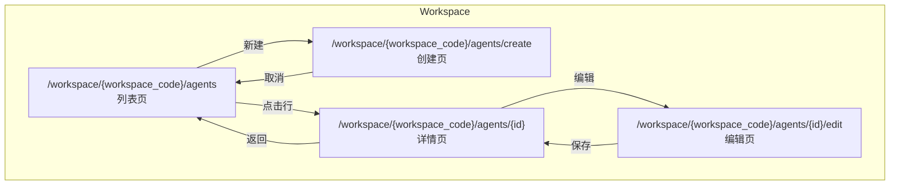

## 🎯 产品概述

### Agent Factory 是什么

Agent Factory用于生产、维护Agent，Agent只能在某个workspace下生成。

### 为什么需要 Agent Factory

Agent Factory 让Agent的生产和运行逻辑分离，Factory只注重生产阶段。

---

## 🎨 UI 设计

### 页面范围

| 页面       | 路由                                           | 说明                            |
| ---------- | ---------------------------------------------- | ------------------------------- |
| **列表页** | `/workspace/{workspace_code}/agents`           | 展示当前 Workspace 下所有 Agent |
| **详情页** | `/workspace/{workspace_code}/agents/{id}`      | 查看 Agent 详情                 |
| **创建页** | `/workspace/{workspace_code}/agents/create`    | 基于 Prototype 创建 Agent       |
| **编辑页** | `/workspace/{workspace_code}/agents/{id}/edit` | 编辑 Agent 配置                 |

### 设计规范

| 项目         | 要求                 |
| ------------ | -------------------- |
| **设计风格** | 轻量商务风，简洁现代 |
| **用户权限** | Workspace 成员       |

### 页面层级关系

---

## ✅ 设计检查清单

- [x] 定义清晰的产品边界
- [x] 定义页面路由
- [x] 定义 UI 原型位置
- [x] 定义状态机
- [x] 建立相关文档双向链接
- [x] 注册路由到 routing-table.md
- [ ] 定义权限矩阵
- [x] 设计 API 接口

## 🔗 相关文档

- [Agent 技术设计](../technical/workspaces/agent-factory) - API 接口和技术实现详细说明
- [Agent 数据库设计](../technical/agents/agent-database-design) - 数据模型详细说明
- [Agent Prototype 管理设计](../../admin/agent-prototype-management) - Prototype 定义和版本管理
- [Agent 概述](../../agents/agents) - Agent 创建流程

## 🔗 关联原型

**UI 原型页面**: [Agent Factory 列表页](../ui/app/workspace/[workspace_code]/agents/page.tsx)

**访问地址**: http://localhost:3300/workspace/1/agents
