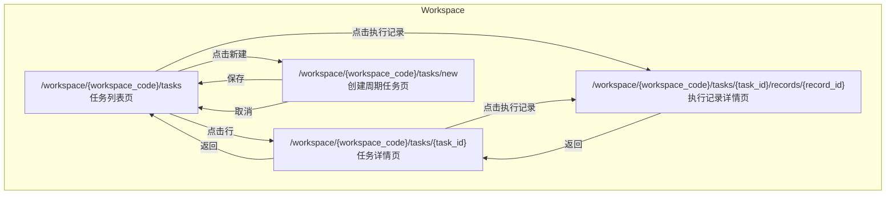

## 变更历史

| 版本 | 日期 | 变更内容 |
|------|------|----------|
| 1.2.0 | 2026-06-09 | 1. 新增「我的任务」跨工作区视图 2. 任务字段变更：`owner_id` → `creator_id`，新增 `executor_id` |
| 1.1.0 | 2026-06-08 | 初始版本 |

## 🎯 产品概述

### 什么是 Agent 任务管理

Agent 任务管理是管理 Agent 执行任务的平台，提供任务的查看、筛选、创建、修改、删除及状态操作等功能。

### 核心设计原则

| 任务类型 | 创建 | 修改 | 删除 |
| -------- | ---- | ---- | ---- |
| **周期任务** | ✅ 通过 Workspace 创建 | ✅ 名称、内容、cron 表达式、优先级 | ✅ 仅限从未执行过 |
| **临时任务** | ❌ | ❌ | ❌ |
| **派发任务** | ❌ | ❌ | ❌ |

**通用操作**：所有任务类型均支持查看、取消、禁用、启用。

**暂停/继续**：UI 按钮存在，点击显示"暂不支持"。

### 周期任务说明

- **可修改字段**：名称、内容、cron 表达式、优先级
- **不可修改**：正在执行中的周期任务（需先取消）
- **可删除条件**：从未执行过（无执行记录）
- **不可删除**：已有执行记录的周期任务（只能禁用）

### 任务定义

任务属性、执行记录属性、业务约束等详见 [Agent 任务系统设计](../agents/agent-task)。

---

## 👤 用户角色

| 角色 | 描述 | 权限说明 |
| ---- | ---- | -------- |
| Agent 拥有者 | 任务的创建者和拥有者 | 可管理自己创建的 Agent 的所有任务 |
| Workspace 管理员 | Workspace 的管理者 | 可管理 workspace 下所有任务 |
| 系统管理员 | 超级管理员 | 可管理所有任务 |

---

## 🎨 UI 设计

### 页面范围

| 页面 | 路由 | 说明 |
| ---- | ---- | ---- |
| **任务列表页** | `/workspace/{workspace_code}/tasks` | 展示当前 Workspace 下所有任务，支持筛选 |
| **任务详情页** | `/workspace/{workspace_code}/tasks/{task_id}` | 查看任务详情、执行记录 |
| **执行记录详情页** | `/workspace/{workspace_code}/tasks/{task_id}/records/{record_id}` | 查看单次执行的详细记录 |
| **创建周期任务页** | `/workspace/{workspace_code}/tasks/new` | 创建新的周期任务 |

### 页面层级关系

---

## ⚙️ 功能设计

### 1. 任务列表

#### 1.1 列表展示

| 字段 | 说明 |
| ---- | ---- |
| 任务ID | 任务的唯一标识 |
| 任务名称 | 任务的简要描述 |
| Agent 名称 | 执行该任务的 Agent |
| 创建者 | 任务创建人 (`creator_id`) |
| 执行人 | 任务执行人 (`executor_id`) |
| 创建时间 | 任务创建时间 |
| 任务类型 | 临时任务 / 周期任务 / 派发任务 |
| 优先级 | 高 / 中 / 低 |
| 上次执行状态 | 待执行 / 执行中 / 暂停 / 成功 / 失败 / 最终失败 / 已取消 |
| 状态 | 启用 / 禁用 |
| 操作 | 查看 / 编辑(周期) / 删除(周期) / 取消 / 暂停 / 继续 / 启用 / 禁用 |

#### 1.2 筛选条件

| 筛选维度 | 说明 |
| -------- | ---- |
| 上次执行状态 | 按任务执行状态筛选 |
| 任务类型 | 按临时/周期/派发筛选 |
| 优先级 | 按高/中/低筛选 |
| Agent | 按 Agent 筛选 |
| 创建者 | 按创建人筛选 |
| 执行人 | 按执行人筛选 |
| 时间范围 | 按创建时间范围筛选 |
| 状态 | 按启用/禁用筛选 |

#### 1.3 搜索

支持按任务名称、任务ID 进行模糊搜索。

---

### 2. 任务详情

#### 2.1 基本信息

任务详情根据任务类型有不同的编辑权限：

| 任务类型 | 编辑权限 |
| -------- | -------- |
| **周期任务** | 可编辑：名称、内容、cron 表达式、优先级 |
| **临时任务** | 只读 |
| **派发任务** | 只读 |

详细字段定义详见 [Agent 任务系统设计 - 任务属性](../agents/agent-task#任务属性)。

#### 2.2 执行记录列表

展示任务的所有执行记录：

| 字段 | 说明 |
| ---- | ---- |
| 记录ID | 执行记录唯一标识 |
| 开始时间 | 本次执行开始时间 |
| 结束时间 | 本次执行结束时间 |
| 执行时长 | 本次执行耗时 |
| 执行状态 | 成功 / 失败 |
| 操作 | 查看详情 |

---

### 3. 执行记录详情

详见 [Agent 任务系统设计 - 任务执行记录](../agents/agent-task#任务执行记录属性)。

包含：任务结果（Markdown/JSON）、执行过程（JSON）、执行录像（rrweb 回放）。

---

### 4. 任务操作

#### 4.1 周期任务操作

| 操作 | 适用状态 | 操作效果 | 约束 |
| ---- | -------- | -------- | ---- |
| 创建 | - | 创建新的周期任务 | - |
| 编辑 | 待执行、暂停、成功、失败、已取消 | 修改任务属性 | 执行中不可编辑 |
| 删除 | 待执行、暂停 | 删除任务 | 仅限无执行记录的任务 |
| 取消 | 待执行、执行中、暂停 | 任务状态变为「已取消」 | 已成功的任务不可取消 |
| 暂停 | 执行中 | UI 显示"暂不支持" | - |
| 继续 | 暂停 | UI 显示"暂不支持" | - |
| 禁用 | 任意状态 | 任务不再被调度执行 | - |
| 启用 | 禁用 | 任务可正常调度执行 | - |

#### 4.2 临时/派发任务操作

| 操作 | 适用状态 | 操作效果 | 约束 |
| ---- | -------- | -------- | ---- |
| 取消 | 待执行、执行中、暂停 | 任务状态变为「已取消」 | 已成功的任务不可取消 |
| 暂停 | 执行中 | UI 显示"暂不支持" | - |
| 继续 | 暂停 | UI 显示"暂不支持" | - |
| 禁用 | 任意状态 | 任务不再被调度执行 | - |
| 启用 | 禁用 | 任务可正常调度执行 | - |

---

### 5. 创建周期任务

#### 5.1 表单字段

| 字段 | 类型 | 必填 | 说明 |
| ---- | ---- | ---- | ---- |
| 任务名称 | 文本 | 是 | 最多 128 字符 |
| 任务描述 | 文本 | 否 | 简要描述 |
| 任务内容 | Markdown | 是 | 任务详细内容和指令 |
| Agent | 选择 | 是 | 选择执行任务的 Agent |
| 执行人 | 选择 | 是 | 选择执行任务的用户（Agent Owner） |
| 优先级 | 选择 | 否 | 高/中/低，默认中 |
| Cron 表达式 | 文本 | 是 | 周期任务的执行频率 |
| 最大重试次数 | 数字 | 否 | 默认 3 次 |
| 重试间隔 | 数字 | 否 | 单位秒，默认 60 秒 |
| 反馈 Webhook | URL | 否 | 执行完成后回调 |

> **执行人说明**：任务执行人默认为 Agent 的 Owner，创建时可手动指定。派发任务的执行人由创建时指定。

#### 5.2 Cron 表达式

使用标准 5 位 Cron 表达式，格式：`分 时 日 月 周`

示例：

| 表达式 | 说明 |
| ---- | ---- |
| `0 8 * * *` | 每天早上 8 点执行 |
| `0 9 * * 1-5` | 工作日早上 9 点执行 |
| `*/15 * * * *` | 每 15 分钟执行一次 |
| `0 0 1 * *` | 每月 1 日午夜执行 |

---

### 6. 我的任务

#### 6.1 概述

「我的任务」是跨工作区的个人任务视图，显示当前用户相关的所有任务。

**入口**：`/tasks`（个人中心侧边栏）

#### 6.2 任务来源

| 来源 | 条件 | 标识 |
|------|------|------|
| 我创建的 | `creator_id = current_user` | 🏷️ 创建者 徽章 |
| 我执行的 | `executor_id = current_user` | 🏷️ 执行者 徽章 |

#### 6.3 列表展示

| 字段 | 说明 |
|------|------|
| 任务ID | 任务的唯一标识 |
| 任务名称 | 任务的简要描述 |
| 所属工作区 | 任务所属的工作区名称 |
| Agent 名称 | 执行该任务的 Agent |
| 我的角色 | 🏷️ 创建者 / 🏷️ 执行者 |
| 任务类型 | 临时任务 / 周期任务 / 派发任务 |
| 上次执行状态 | 待执行 / 执行中 / 成功 / 失败 等 |
| 操作 | 查看详情 |

#### 6.4 筛选器

| 筛选维度 | 说明 |
|----------|------|
| 全部 | 显示所有相关任务 |
| 我创建的 | `creator_id = current_user` |
| 我执行的 | `executor_id = current_user` |

#### 6.5 与工作区任务的关系

| 视角 | 路由 | 说明 |
|------|------|------|
| 我的任务 | `/tasks` | 跨工作区，显示所有相关任务 |
| 工作区任务 | `/workspace/{code}/tasks` | 当前工作区内的所有任务 |

**互补关系**：两个列表数据互为补充，共用任务详情页。

---

## 📊 任务状态机

详见 [Agent 任务系统设计 - 任务状态机](../agents/agent-task#任务状态机)。

---

## 📋 操作权限矩阵

| 操作 | Agent 拥有者 | Workspace 管理员 | 系统管理员 |
| ---- | ------------ | ---------------- | ---------- |
| 查看任务列表 | ✅ 自己创建的 | ✅ 本 Workspace | ✅ 全部 |
| 查看任务详情 | ✅ 自己创建的 | ✅ 本 Workspace | ✅ 全部 |
| 查看执行记录 | ✅ 自己创建的 | ✅ 本 Workspace | ✅ 全部 |
| 创建周期任务 | ✅ | ✅ 本 Workspace | ✅ 全部 |
| 编辑周期任务 | ✅ 自己创建的 | ✅ 本 Workspace | ✅ 全部 |
| 删除周期任务 | ✅ 自己创建的（无执行记录） | ✅ 本 Workspace（无执行记录） | ✅ 全部 |
| 取消任务 | ✅ 自己创建的 | ✅ 本 Workspace | ✅ 全部 |
| 暂停任务 | ❌ UI 不支持 | ❌ UI 不支持 | ❌ UI 不支持 |
| 继续任务 | ❌ UI 不支持 | ❌ UI 不支持 | ❌ UI 不支持 |
| 禁用任务 | ✅ 自己创建的 | ✅ 本 Workspace | ✅ 全部 |
| 启用任务 | ✅ 自己创建的 | ✅ 本 Workspace | ✅ 全部 |

---

## 📝 功能列表汇总

| 功能 | 优先级 | 说明 |
| ---- | ------ | ---- |
| 任务列表展示 | P0 | 展示任务列表，支持分页 |
| 任务筛选 | P0 | 按状态/类型/优先级/Agent/创建者/时间筛选 |
| 任务搜索 | P0 | 按名称/ID 搜索 |
| 任务详情 | P0 | 查看任务完整信息 |
| 执行记录列表 | P0 | 展示任务的执行记录 |
| 执行记录详情 | P0 | 查看单次执行的详细结果 |
| 创建周期任务 | P0 | 创建新的周期任务 |
| 编辑周期任务 | P0 | 修改周期任务的属性 |
| 删除周期任务 | P0 | 删除无执行记录的周期任务 |
| 取消任务 | P0 | 取消待执行/执行中/暂停的任务 |
| 暂停任务 | P2 | UI 显示"暂不支持" |
| 继续任务 | P2 | UI 显示"暂不支持" |
| 禁用任务 | P0 | 禁用任务，停止调度 |
| 启用任务 | P0 | 启用被禁用的任务 |
| 执行录像回放 | P1 | rrweb 录像播放 |

---

## 🚫 非工作范围

- **Agent 执行逻辑**：Agent 如何执行任务的逻辑不在本模块
- **任务分配**：任务的派发逻辑
- **暂停/继续功能**：UI 按钮存在，点击显示"暂不支持"
- **周期任务执行**：Agent 模块未实现，周期任务不会真正执行

---

## 🔗 相关文档

- [Agent 任务系统设计](../agents/agent-task) - 任务定义、属性、约束、状态机
- [Agent 嵌入](../agents/agent-ingest) - 主动模式下任务管理入口
- [Agent Factory](../workspaces/agent-factory) - Agent 管理和任务创建入口

---

## ✅ 设计检查清单

- [x] 定义清晰的产品边界
- [x] 定义用户角色和权限
- [x] 定义页面路由
- [x] 定义 UI 原型位置
- [x] 定义状态机（引用）
- [x] 定义操作权限矩阵
- [x] 定义 API 接口 - 详见 [Agent 任务管理技术设计](../../technical/workspaces/agent-task-manager)
- [ ] 定义权限矩阵（详细）