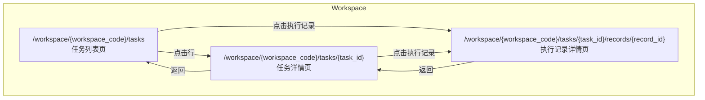

## 🎯 产品概述

### 什么是 Agent 任务管理

Agent 任务管理是管理 Agent 执行任务的平台，提供任务的查看、筛选、操作（取消/禁用/暂停/继续）等功能。

### 核心设计原则

- **不可新增**：任务由其他模块创建（如 Agent 嵌入、Agent Factory），不在此处创建
- **不可修改**：任务一旦创建，内容不可变更，保证审计可追溯
- **不可删除**：所有任务记录必须保留，用于完整追踪
- **可查询**：支持多维度筛选和搜索
- **可操作**：支持取消、禁用、暂停、继续等状态管理操作

### 任务定义

任务属性、执行记录属性、业务约束等详见 [Agent 任务系统设计](../agents/agent-task)。

---

## 👤 用户角色

| 角色 | 描述 | 权限说明 |
| ---- | ---- | -------- |
| Agent 拥有者 | 任务的创建者和拥有者 | 可管理自己创建的 Agent 的所有任务 |
| Workspace 管理员 | Workspace 的管理者 | 可管理 workspace 下所有任务 |
| 系统管理员 | 超级管理员 | 可管理所有任务 |

---

## 🎨 UI 设计

### 页面范围

| 页面 | 路由 | 说明 |
| ---- | ---- | ---- |
| **任务列表页** | `/workspace/{workspace_code}/tasks` | 展示当前 Workspace 下所有任务，支持筛选 |
| **任务详情页** | `/workspace/{workspace_code}/tasks/{task_id}` | 查看任务详情、执行记录 |
| **执行记录详情页** | `/workspace/{workspace_code}/tasks/{task_id}/records/{record_id}` | 查看单次执行的详细记录 |

### 页面层级关系

---

## ⚙️ 功能设计

### 1. 任务列表

#### 1.1 列表展示

| 字段 | 说明 |
| ---- | ---- |
| 任务ID | 任务的唯一标识 |
| 任务名称 | 任务的简要描述 |
| Agent 名称 | 执行该任务的 Agent |
| 创建者 | 任务创建人 |
| 创建时间 | 任务创建时间 |
| 任务类型 | 临时任务 / 周期任务 / 派发任务 |
| 优先级 | 高 / 中 / 低 |
| 执行状态 | 待执行 / 执行中 / 暂停 / 成功 / 失败 / 最终失败 / 已取消 |
| 状态 | 启用 / 禁用 |
| 操作 | 查看 / 取消 / 暂停 / 继续 / 启用 / 禁用 |

#### 1.2 筛选条件

| 筛选维度 | 说明 |
| -------- | ---- |
| 执行状态 | 按任务执行状态筛选 |
| 任务类型 | 按临时/周期/派发筛选 |
| 优先级 | 按高/中/低筛选 |
| Agent | 按 Agent 筛选 |
| 创建者 | 按创建人筛选 |
| 时间范围 | 按创建时间范围筛选 |
| 状态 | 按启用/禁用筛选 |

#### 1.3 搜索

支持按任务名称、任务ID 进行模糊搜索。

---

### 2. 任务详情

#### 2.1 基本信息

所有字段**不可编辑**，详见 [Agent 任务系统设计 - 任务属性](../agents/agent-task#任务属性)。

#### 2.2 执行记录列表

展示任务的所有执行记录：

| 字段 | 说明 |
| ---- | ---- |
| 记录ID | 执行记录唯一标识 |
| 开始时间 | 本次执行开始时间 |
| 结束时间 | 本次执行结束时间 |
| 执行时长 | 本次执行耗时 |
| 执行状态 | 成功 / 失败 |
| 操作 | 查看详情 |

---

### 3. 执行记录详情

详见 [Agent 任务系统设计 - 任务执行记录](../agents/agent-task#任务执行记录属性)。

包含：任务结果（Markdown/JSON）、执行过程（JSON）、执行录像（rrweb 回放）。

---

### 4. 任务操作

| 操作 | 适用状态 | 操作效果 | 约束 |
| ---- | -------- | -------- | ---- |
| 取消 | 待执行、执行中、暂停 | 任务状态变为「已取消」，不可再执行 | 已成功的任务不可取消 |
| 暂停 | 执行中 | 任务状态变为「暂停」，Agent 暂停执行 | - |
| 继续 | 暂停 | 任务状态变为「执行中」，Agent 继续执行 | - |
| 禁用 | 任意状态 | 任务状态变为「禁用」，不再被调度执行 | 周期任务禁用后不再触发 |
| 启用 | 禁用 | 任务状态变为「启用」，可正常调度执行 | 周期任务启用后恢复触发 |

---

## 📊 任务状态机

详见 [Agent 任务系统设计 - 任务状态机](../agents/agent-task#任务状态机)。

---

## 📋 操作权限矩阵

| 操作 | Agent 拥有者 | Workspace 管理员 | 系统管理员 |
| ---- | ------------ | ---------------- | ---------- |
| 查看任务列表 | ✅ 自己创建的 | ✅ 本 Workspace | ✅ 全部 |
| 查看任务详情 | ✅ 自己创建的 | ✅ 本 Workspace | ✅ 全部 |
| 查看执行记录 | ✅ 自己创建的 | ✅ 本 Workspace | ✅ 全部 |
| 取消任务 | ✅ 自己创建的 | ✅ 本 Workspace | ✅ 全部 |
| 暂停任务 | ✅ 自己创建的 | ✅ 本 Workspace | ✅ 全部 |
| 继续任务 | ✅ 自己创建的 | ✅ 本 Workspace | ✅ 全部 |
| 禁用任务 | ✅ 自己创建的 | ✅ 本 Workspace | ✅ 全部 |
| 启用任务 | ✅ 自己创建的 | ✅ 本 Workspace | ✅ 全部 |

---

## 📝 功能列表汇总

| 功能 | 优先级 | 说明 |
| ---- | ------ | ---- |
| 任务列表展示 | P0 | 展示任务列表，支持分页 |
| 任务筛选 | P0 | 按状态/类型/优先级/Agent/创建者/时间筛选 |
| 任务搜索 | P0 | 按名称/ID 搜索 |
| 任务详情 | P0 | 查看任务完整信息（只读） |
| 执行记录列表 | P0 | 展示任务的执行记录 |
| 执行记录详情 | P0 | 查看单次执行的详细结果 |
| 取消任务 | P0 | 取消待执行/执行中/暂停的任务 |
| 暂停任务 | P0 | 暂停执行中的任务 |
| 继续任务 | P0 | 继续暂停的任务 |
| 禁用任务 | P0 | 禁用任务，停止调度 |
| 启用任务 | P0 | 启用被禁用的任务 |
| 执行录像回放 | P1 | rrweb 录像播放 |

---

## 🚫 非工作范围

- **任务创建**：任务由 Agent 嵌入、Agent Factory 等模块创建
- **任务修改**：任务创建后不可修改
- **任务删除**：所有任务记录必须保留
- **任务执行逻辑**：Agent 如何执行任务的逻辑
- **任务分配**：任务的派发逻辑

---

## 🔗 相关文档

- [Agent 任务系统设计](../agents/agent-task) - 任务定义、属性、约束、状态机
- [Agent 嵌入](../agents/agent-ingest) - 主动模式下任务管理入口
- [Agent Factory](../workspaces/agent-factory) - Agent 管理和任务创建入口

---

## ✅ 设计检查清单

- [x] 定义清晰的产品边界
- [x] 定义用户角色和权限
- [x] 定义页面路由
- [x] 定义 UI 原型位置
- [x] 定义状态机（引用）
- [x] 定义操作权限矩阵
- [ ] 定义 API 接口
- [ ] 定义权限矩阵（详细）