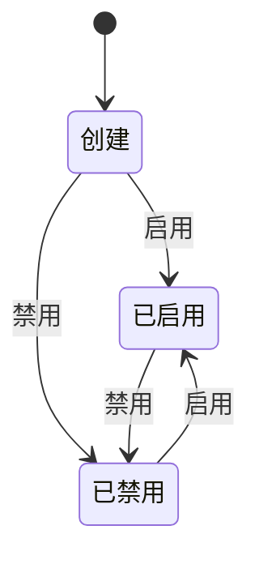

## 产品概述

### 什么是`嵌入网站[embedded-site]`

嵌入网站指[embedded-site]可以被Agents嵌入进行学习和操作的网站。关于Agent嵌入的详细设计，请参考[Agent 嵌入产品需求文档](../agents/agent-ingest)

### 实体设计

- id: 主键，自增id，唯一标识
- site_name: 网站名称
- site_url: 网站地址
- description：网站描述
- workspace_id: workspace 的id
- status: 状态：enabled | disabled

### 状态机设计

