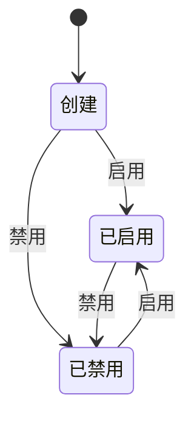

## 产品概述

### 什么是`嵌入网站[embedded-site]`

嵌入网站指[embedded-site]可以被Agents嵌入进行学习和操作的网站。关于Agent嵌入的详细设计，请参考[Agent 嵌入产品需求文档](../agents/agent-ingest)

### 实体设计

| 字段名       | 类型/格式                  | 说明                   | 是否可编辑 |
| ------------ | -------------------------- | ---------------------- | ---------- |
| id           | BIGINT AUTO_INCREMENT      | 主键，自增id，唯一标识 | 否         |
| site_name    | VARCHAR(255)               | 网站名称               | 是         |
| site_url     | VARCHAR(512)               | 网站地址               | 是         |
| description  | TEXT                       | 网站描述               | 是         |
| workspace_id | BIGINT                     | workspace 的 id        | 否         |
| status       | ENUM('enabled','disabled') | 状态：启用,禁用        | 是         |

### 状态机设计

## UI 设计

### 路由

| 页面                 | 路由                                           | 说明                                            |
| -------------------- | ---------------------------------------------- | ----------------------------------------------- |
| embedded-sites 列表页 | `/workspace/{workspace_code}/embedded-sites`  | 展示 embedded-site, 包含简要的过滤功能，使用分页 |
| 创建 embedded-site   | `/workspace/{workspace_code}/embedded-sites/new` | 创建新的 embedded-site                          |
| 修改 embedded-site   | `/workspace/{workspace_code}/embedded-sites/{id}/edit` | 修改 embedded-site                              |

## 🔗 相关文档

- [嵌入网站技术设计](../../technical/workspaces/embedded-site) - API设计、数据库设计

## ✅ 设计检查清单

- [ ] 设计 UI 原型

