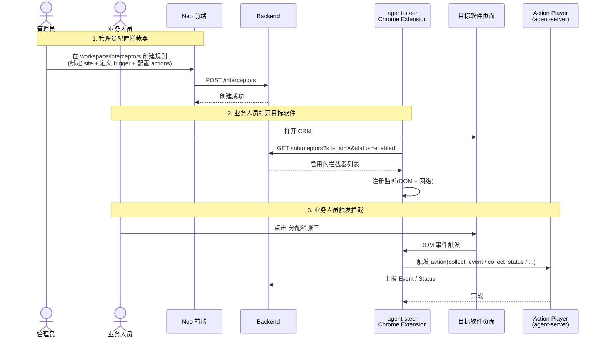

## 背景

业务人员每天在目标软件(如 CRM、ERP)里完成大量操作(分配线索、提交订单、审批流程等),这些操作背后是有"业务意图"的(把线索分配给张三 → 生成"线索分配"事件;张三的状态从"客户少"变成"客户多")。

但这些**业务意图在当前架构里是隐式的** —— 屏幕上看到的是按钮和页面切换,不是"我刚才做了一次 lead.assigned 事件"。后果是:

- **组织知识无法沉淀**:员工离职时,他积累的"在哪些场景做什么操作"的判断力也跟着走了
- **AI 缺乏训练素材**:Agent 想学"业务人员怎么操作 CRM",但没有结构化的数据可用
- **流程规范化困难**:管理员想规范"分配线索必须填备注",但没法强制执行

**拦截器**(Interceptor)就是为解决这个问题 —— 让业务操作**自动变成结构化数据**。

## 目标

让管理员能在 Neo 前端**配置规则**,告诉 agent-steer Chrome Extension:

- 在目标软件上**什么时候**(哪个按钮被点、哪个 API 被调)
- **捕获什么**(操作的主体、操作的目标)
- **触发什么**(生成 Event / 采 Status / 弹确认 / 调 Agent)

业务人员不需要做任何额外操作 —— 他照常用软件,扩展在背后**自动捕获 + 自动上报**。

## 用户故事

### 故事 1:管理员配置规则

> 作为**销售运营管理员**,我希望
> 在 Neo 前端 workspace 下配置"分配线索"拦截器,绑定到销售 CRM 网站,
> 当业务人员点击"分配给张三"按钮时自动生成 `lead.assigned` 事件,
> 这样我能知道谁在什么时候把什么线索分配给了谁。

### 故事 2:业务人员日常使用

> 作为**销售业务员**,我希望
> 我照常用 CRM 软件(分配线索、跟进客户),不要做任何额外操作,
> 扩展在背后自动把每次分配操作记录下来,我不需要关心。

### 故事 3:管理员调整规则

> 作为**销售运营管理员**,我希望
> 当我发现"分配线索"事件数据有噪音,可以暂时禁用某个拦截器
> (不停用、不删除),等调整完再启用,
> 这样不会影响其他拦截器,也不会丢失历史记录。

## 业务流程

### 端到端流程

### 角色分工

| 角色 | 在拦截器流程中做什么 |
|------|---------|
| **管理员** | 在 Neo 前端创建/编辑/禁用拦截器 |
| **业务人员** | 正常使用目标软件(无需感知拦截器) |
| **agent-steer Extension** | 拉取拦截器列表、注册监听、触发时调 Action Player |
| **Action Player** | 执行 action(上报 Event / Status / 弹确认 / 调 Agent) |
| **Backend** | 存储拦截器配置 + 接收 Event/Status 上报 |

## 价值

### 对业务人员

- **零负担**:不需要做任何额外操作,扩展在背后自动捕获
- **隐私可控**:拦截器由管理员配置,业务人员看不到也不会被打扰

### 对管理员

- **可视化配置**:不需要写代码,在前端表单里就能定义拦截规则
- **灵活管理**:可以随时启用/禁用,不会丢失历史记录
- **可观测**:拦截器触发情况可在前端查看(待实现)

### 对组织

- **知识沉淀**:每个业务操作自动变成结构化 Event,供知识图谱 / Agent 训练
- **流程规范**:可以强制"某些操作前必须弹确认"(如"删除客户前确认")
- **AI 助手**:Agent 可以基于历史 Event 学"业务人员怎么操作 CRM"

### 不做什么(本期 scope)

- 不做"动态生成新拦截器"(LLM 自动生成规则)
- 不做"拦截器 A/B 测试"
- 不做"拦截器市场"(第三方分享)

---

## 🔗 相关文档

- [拦截器管理技术设计](../../technical/workspaces/interceptor) - 数据模型、API、状态机
- [拦截器技术设计](../../technical/agent-steer/interceptor) - extension 端实现、Action 编排
- [Action Player 技术设计](../../technical/agent-steer/action-player) - action 执行器
- [嵌入网站管理](./embedded-site) - 拦截器挂载的 site
- [事件管理](./events) - after action 触发的 Event 上报
- [状态管理](./status) - before/after action 触发的 Status 采集

---

## ✅ 设计检查清单

- [ ] 设计 UI 原型
- [ ] trigger JSON 编辑器(form 化,避免手写 JSON)
- [ ] 拦截器触发历史(可观测性)
- [ ] 拦截器导入/导出(批量管理)
