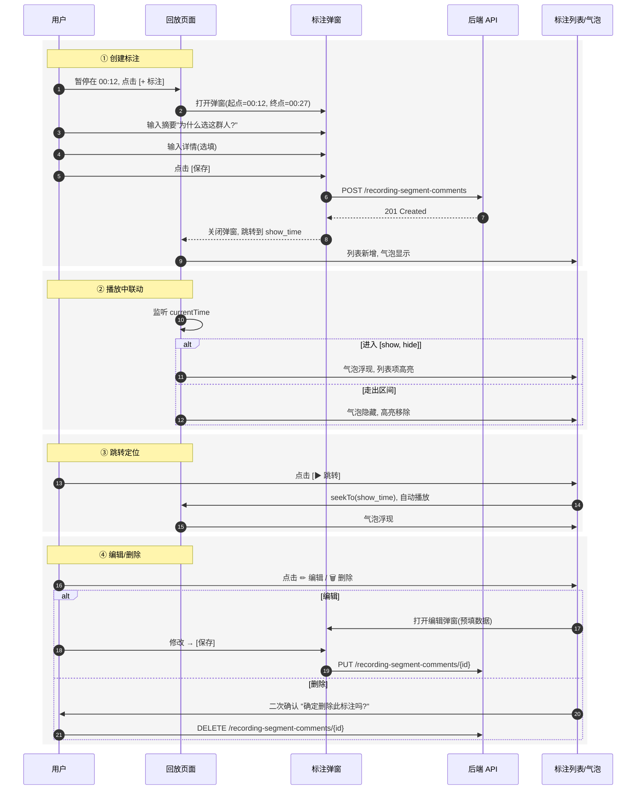
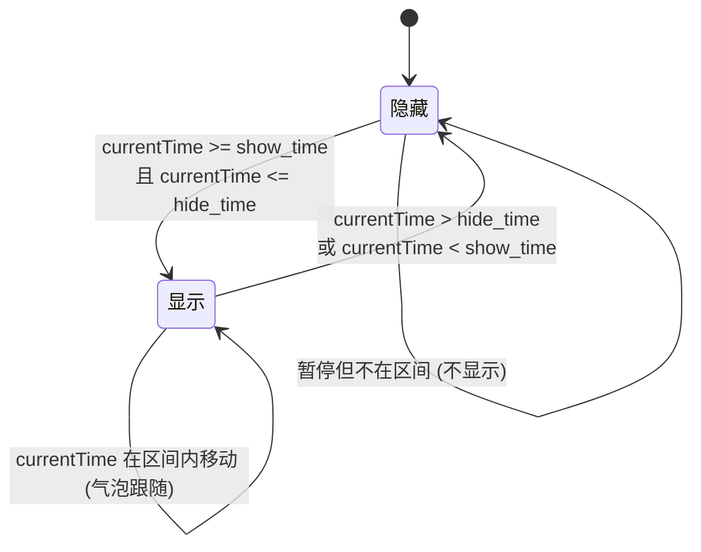

## 🎯 产品概述

### 什么是 Recording

**Recording**（录像）是 Workspace 下的资源，用于存储用户在浏览器中的操作录制数据。

### 为什么需要 Recording

在 Agent Steer 中，用户可以录制自己的操作行为。这些录制数据需要：

1. **持久化存储**：保存到 S3 兼容存储
2. **统一管理**：在 Workspace 下进行增删改查
3. **回放查看**：支持 rrweb 回放
4. **分类检索**：支持标签、搜索、筛选

---

## 📖 核心概念

### 层级结构

```
Workspace
└── Recording（录像）
    └── Segment（录像段）
```

**关键理解**：

- 一个 Recording 包含多个 Segment
- 每个 Segment 是一个独立的 rrweb 文件（每10分钟生成一段）
- 每个 Segment 可能包含多个 PageUrl（录制过程中跳转了不同页面）

### Segment（录像段）

> **定义**：单个 rrweb 录制文件，对应一个时间段的录制数据。

**字段**：

| 字段 | 类型 | 说明 |
|------|------|------|
| id | string | 唯一标识 |
| recordingId | string | 所属 Recording 的 ID |
| startTime | datetime | 段开始时间 |
| endTime | datetime | 段结束时间 |
| pageUrls | string[] | 该段涉及的页面 URL 列表 |
| storageKey | string | S3 存储路径 |
| size | number | 文件大小（字节） |

> 注意：pageUrls 会展示给用户，用于预览该段录制涉及了哪些页面。

### Recording（录像）

> **定义**：用户可见的完整录像，由多个 Segment 组成。

**字段**：

| 字段 | 类型 | 说明 |
|------|------|------|
| id | string | 唯一标识 |
| workspaceId | string | 所属 Workspace |
| name | string | 录像名称（用户可编辑），默认自动生成 |
| tags | string[] | 标签列表 |
| status | enum | 状态：recording/completed/failed |
| enterUrl | string | 进入 URL（开始录制时的页面） |
| exitUrl | string | 退出 URL（结束录制时的页面） |
| totalDuration | number | 总时长（秒） |
| totalSize | number | 总大小（字节） |
| createdAt | datetime | 创建时间 |
| updatedAt | datetime | 更新时间 |

---

## 🔧 功能列表

### 1. 列表展示

- 显示当前 Workspace 下的所有 Recording
- 每条记录显示：名称、时长、创建时间、标签
- 支持排序（按时间、按名称、按大小）

### 2. 搜索筛选

- **全文搜索**：按名称搜索
- **标签筛选**：按标签过滤
- **时间范围**：按创建时间筛选

### 3. 批量操作

- 批量选择（勾选）
- 批量删除
- 批量添加标签
- 批量移除标签

### 4. 单条操作

- **重命名**：编辑录像名称
- **标签管理**：添加/移除标签
- **删除**：删除录像（包括所有 Segment）
- **详情查看**：查看录像详情和段列表

### 5. 回放

- 使用 rrweb Player 播放
- 支持播放/暂停/进度拖拽
- 显示 Segment 列表，用户可以选择从哪个段开始播放

### 6. 删除确认

- 删除录像时需要二次确认
- 提示内容："确定删除此录像吗？此操作不可撤销。"

### 7. 标注

用户在回放时，如果察觉当前画面上值得告知别人的点，比如用户画像时，为什么选择某个人群，则可以利用标注功能告知他人，这样当别人回放这个录像时就能看到用户的标注。

标注针对的的录像的片段(segment)的某个时段进行标注，也就是说，当录像播放到这个时段的起点时，展示标注，当播放到标注时段的结束时，隐藏标注。

回放录像segment时，某一时段，可能出现多个标注。

#### 7.1. 标注实体

**实体名称**: `recording-segment-comment`

**实体字段**:

- id: 自增id
- recording_id: 录像id
- segment_id: 录像片段的id
- show_time: 展示的时间
- hide_time: 隐藏的时间
- abstract: 摘要
- content：标注内容
- creator_id: 创建人id
- create_at
- update_at

#### 7.2. 展示规则

- **进入条件**：`currentTime >= show_time` 且 `currentTime <= hide_time` 时，展示对应标注
- **退出条件**：`currentTime` 超出 `[show_time, hide_time]` 区间，隐藏标注
- **同时段多标注**：当前时段内可能有 N 条标注，画布气泡中**堆叠展示**，提供 N/M 切换器
- **标注归属**：标注属于 `segment`，**侧栏面板与 Segment 卡片展开区对齐**（详情见 7.3）

#### 7.3. 回放页面布局（线框图）

> 在已有录像回放页面（左侧 rrweb 画布 + 右侧 Segments 列表）基础上增强。
> 标注面板以"展开嵌入"形式与 Segment 卡片**叠放**，保留 Segments 列表既有结构。

**整体布局**

```
┌────────────────────────────────────────────────────────────────────────┐
│  回放                                                                    │
│  使用 rrweb 回放 segment 中的操作序列                      [返回详情]     │
├──────────────────────────────────────────────┬─────────────────────────┤
│                                              │ Segments  3              │
│                                              │ ┌─────────────────────┐ │
│                                              │ │ #1 ▾   [3]           │ │  ← 展开态 + 标注数角标
│                                              │ │ 0:00 ─ 05:30         │ │
│                                              │ │ localhost:3000/...   │ │
│                                              │ │                       │ │
│                                              │ │ ── 标注 (4) [+ 标注]─┤ │  ← 叠放:segment 卡片下方
│                                              │ │ 👤 张三  14:23        │ │
│                                              │ │ 00:12 ─ 00:20        │ │
│  ┌─────────────────────────────────────┐    │ │ 为什么选这群人?       │ │
│  │  [rrweb 画布]                       │    │ │ ▶跳转 ✏编辑 🗑删除   │ │
│  │                                     │    │ │ ─────────────────── │ │
│  │                                     │    │ │ 👤 李四  14:25        │ │
│  │   ┌──────────────────────────────┐ │    │ │ 00:34 ─ 00:40        │ │
│  │   │ 💬 当前时段标注 (2)  ▲▼  [×] │ │    │ │ 选择逻辑说明         │ │
│  │   ├──────────────────────────────┤ │    │ │ ▶跳转 ✏编辑 🗑删除   │ │
│  │   │ 👤 张三 · 00:15              │ │    │ │ ─────────────────── │ │
│  │   │ 为什么选这群人?               │ │    │ │ 👤 王五  15:01        │ │
│  │   │                  [详情 ▾]    │ │    │ │ 01:23 ─ 01:45        │ │
│  │   ├──────────────────────────────┤ │    │ │ 进入画像细节页       │ │
│  │   │ 👤 李四 · 00:15              │ │    │ │ ▶跳转 ✏编辑 🗑删除   │ │
│  │   │ 这步很关键                   │ │    │ │                       │ │
│  │   │                  [详情 ▾]    │ │    │ └─────────────────────┘ │
│  │   └──────────────────────────────┘ │    │ ┌─────────────────────┐ │
│  │                                     │    │ │ #2 ▸   [1]           │ │  ← 折叠态 + 角标
│  │                                     │    │ │ 05:30 ─ 12:15        │ │
│  └─────────────────────────────────────┘    │ │ localhost:3000/...   │ │
│                                              │ └─────────────────────┘ │
│ ━━━━━━━━━━━━━━━━━━━━━━━━━━━━━━━━━━━━━━━━   │ ┌─────────────────────┐ │
│ [▶] [1x][2x][4x][8x] [skip inactive] [缩放]   │ │ #3 ▸   [0]           │ │
│                                              │ │ 12:15 ─ 20:00        │ │
│                                              │ │ localhost:3000/...   │ │
│                                              │ └─────────────────────┘ │
│                                              │             [+ 标注]    │
└──────────────────────────────────────────────┴─────────────────────────┘
```

**关键点**

- 右侧保留 Segments 列表，单击 Segment 卡片展开/折叠（`▸`/`▾`）
- 展开后 Segment 卡片下方**纵向拼接**标注面板（共享卡片视觉边界）
- Segment 折叠态右上角显示标注数量角标 `[N]`
- 画布气泡在播放到标注时段时浮现于画布之上，多标注堆叠可切换
- 控制条（沿用现有播放器工具栏样式）新增 **[+ 标注]** 按钮
- 侧栏底部也提供 **[+ 标注]** 按钮作为冗余入口（默认归属当前展开的 Segment）

**进度条标注标记**

在 rrweb-player 自带进度条上方叠加彩色色块/竖线，按创建者分配颜色：

```
原始:    ━━━━━━━━━━━━━━━━━━━━━━━━━━━━━━━━━  0:00 / 0:04
增强后:  ━━━━▲━━━━▲━━━━━━▲━━━━━━━▲━━━━━━━━━  1:23 / 5:30
              12    34      1:45
              └──┬─┘ └──┬─┘  └──┬──┘
              标注区间色块 (按 creator 配色)
```

#### 7.4. 新建/编辑标注弹窗

**新建标注**

```
┌─ 新建标注 ─ segment #1 ─────────────────────────┐
│                                                  │
│ 时间区间                                          │
│ ┌──────────────────────┬─────────────────────┐   │
│ │ 起点   00:12         │ 终点   00:27        │   │  ← 默认 起点+15s
│ └──────────────────────┴─────────────────────┘   │
│ 💡 默认起点=当前播放位置; 终点=起点+15s (可调)     │
│                                                  │
│ 摘要 * (≤50 字符)                                 │
│ ┌────────────────────────────────────────────┐   │
│ │ 为什么选择这群人？                          │   │
│ └────────────────────────────────────────────┘   │
│                                                  │
│ 详情 (选填)                                       │
│ ┌────────────────────────────────────────────┐   │
│ │ 此处详细说明选择逻辑...                       │   │
│ │                                            │   │
│ └────────────────────────────────────────────┘   │
│                                                  │
│                                  [ 取消 ]  [ 保存 ]│
└──────────────────────────────────────────────────┘
```

**编辑标注**

```
┌─ 编辑标注 ─ segment #1 ─────────────────────────┐
│ 作者: 👤 张三                                    │
│ 创建于 2026-06-19 14:23                          │
│                                                  │
│ 时间区间                                          │
│ ┌──────────────────────┬─────────────────────┐   │
│ │ 起点   00:12         │ 终点   00:20        │   │
│ └──────────────────────┴─────────────────────┘   │
│                                                  │
│ 摘要 *                                            │
│ ┌────────────────────────────────────────────┐   │
│ │ 为什么选择这群人？                          │   │
│ └────────────────────────────────────────────┘   │
│                                                  │
│ 详情                                              │
│ ┌────────────────────────────────────────────┐   │
│ │ ...                                        │   │
│ └────────────────────────────────────────────┘   │
│                                                  │
│                  [ 删除 ]  [ 取消 ]  [ 保存 ]     │
└──────────────────────────────────────────────────┘
```

**弹窗交互规则**

- 打开弹窗时**自动暂停**播放
- 时间区间可在弹窗内手动调整（联动下方预览条上的临时色块）
- 摘要必填（用于列表项 / 气泡标题），详情选填
- 保存成功后弹窗关闭 + 自动跳到 `show_time` 处
- 仅创建者本人或 Owner 可见 [删除] 按钮
- 删除需二次确认（沿用既有删除确认弹窗模式）

#### 7.5. 标注交互流程



#### 7.6. 标注状态机



#### 7.7. 权限矩阵补充

| 操作 | Viewer | Editor | Owner | 说明 |
|------|:------:|:------:|:-----:|------|
| 查看标注列表/气泡 | ✅ | ✅ | ✅ | - |
| 创建标注 | ❌ | ✅ | ✅ | - |
| 编辑/删除自己的标注 | ❌ | ✅ | ✅ | `creator_id == 当前用户` |
| 删除他人的标注 | ❌ | ❌ | ✅ | - |

---

## ✅ 设计检查清单

- [x] 定义清晰的产品边界
- [x] 定义名词解释
- [x] 定义功能范围
- [x] 设计 UI 界面
- [x] UI 比较简单，暂不需要原型
- [x] 定义权限矩阵（由 Workspace 级别控制，无需单独定义）

### 权限说明

Recording 属于 Workspace 级别资源，权限继承自 Workspace：

- **Viewer**：可以查看录像列表、详情、回放
- **Editor**：可以重命名、添加标签、删除录像
- **Owner**：全部权限
