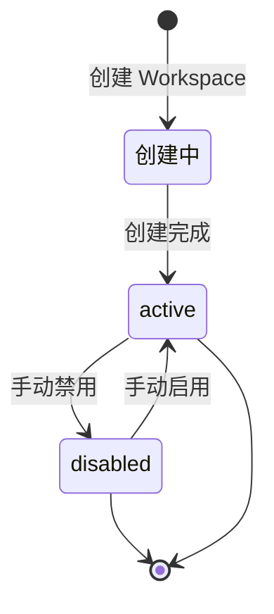

## 🎯 产品概述

### 1.1 workspace定义

**Workspace 是资源的隔离边界，属于某个组织（Organization）**。在 Neo 系统中，Workspace 必须从属于一个组织，一个组织可以拥有多个 Workspace。

> **设计原则**:Workspace 是「隔离容器」，从属于组织。一个组织可以有多个 Workspace，但一个 Workspace 只能属于一个组织。

### 1.2 层级结构

```
组织 (Organization)
├── 组织单元 (Org Unit) - 树形结构
│   ├── 公司
│   ├── 部门
│   └── 小组
├── 员工 (Employee)
└── Workspace (N个)
    ├── 项目
    ├── 配置
    ├── 权限
    └── 数据

用户 (User) ←→ (0..1) UserEmployeeMapping ←→ (N) Employee
```

### 1.3 组织与 Workspace 的关系

- **1:N**：一个组织可以拥有多个 Workspace
- Workspace 必须从属于某个组织
- 组织成员可以访问该组织下的所有 Workspace
- 详见 [组织管理设计](./组织管理设计)

### 1.3 创建方式

| 方式         | 触发时机                                 | 说明                   |
| ------------ | ---------------------------------------- | ---------------------- |
| **手动创建** | 具有「创建 Workspace」权限的用户主动点击 | 输入名称、描述即可创建 |

> ⚠️ **权限控制**:普通用户无权创建 Workspace,需由系统管理员或已授权用户创建。创建者自动成为该 Workspace 的所有者。

### 1.4 workspace属性

| 属性          | 类型     | 必填 | 说明                                         |
| ------------- | -------- | ---- | -------------------------------------------- |
| `id`          | int      | 是   | 自增ID，全局唯一标识符                       |
| `name`        | string   | 是   | Workspace 名称,1-50字符                      |
| `code`        | string   | 是   | URL 友好标识,全局唯一,自动生成，支持手工修改 |
| `description` | string   | 否   | 描述信息,0-500字符                           |
| `status`      | enum     | 是   | `active` / `disabled`                        |
| `created_at`  | datetime | 是   | 创建时间                                     |
| `updated_at`  | datetime | 是   | 最后更新时间                                 |
| `org_id`      | int      | 是   | 所属组织 ID                                  |
| `owner_id`    | int      | 是   | 所有者用户 ID(来自全局用户池)                |
| `settings`    | JSON     | 否   | Workspace 级别配置                           |

### 1.5 业务约束和假设

| 约束                    | 说明                                              |
| ----------------------- | ------------------------------------------------- |
| **唯一所有者**          | 每个 Workspace 必须有一个所有者,不可为空          |
| **名称唯一性**          | Workspace 名称在同一父级下唯一(预留多层级场景)    |
| **无跨 Workspace 资源** | 项目、配置等不可跨越 Workspace 存在               |
| **成员全局管理**        | 用户身份在全局层统一管理,Workspace 仅管理授权关系 |

### 1.6 workspace状态机



| 状态       | 说明                      | 可执行操作       |
| ---------- | ------------------------- | ---------------- |
| `active`   | 正常工作状态              | 查看、编辑、禁用 |
| `disabled` | 已禁用,资源保留但不可访问 | 查看、编辑、启用 |

**状态转移规则**:

- `active` → `disabled`:所有者可以禁用自己创建的 Workspace
- `disabled` → `active`:所有者可以重新启用
- 删除操作**不支持**,只能禁用

### 1.7 业务目标

- 为多团队/多业务线提供强隔离环境
- 支持租户级别的资源独立管理
- 提供清晰的权限边界

### 1.8 非业务目标

- 不做计费/订阅管理(独立模块)
- 不做跨 Workspace 的数据聚合分析(独立模块)
- 不做 Workspace 间的资源迁移(未来可能扩展)

---

## 👤 用户角色与故事

### 2.1 用户角色

| 角色                 | 描述             | 权限范围                         |
| -------------------- | ---------------- | -------------------------------- |
| **系统管理员**       | 平台级管理员     | 创建/禁用 Workspace,管理系统设置 |
| **Workspace 所有者** | Workspace 创建者 | 管理 Workspace 配置,分配成员权限 |
| **Workspace 成员**   | Workspace 参与者 | 访问 Workspace 内的项目和数据    |
| **访客**             | 受邀临时访问     | 仅查看被授权的资源               |

### 2.2 故事一:创建 Workspace

**作为**：系统管理员 / 被授权用户
**前置条件**：当前用户具有「创建 Workspace」权限
**想要**：创建一个新的 Workspace 来隔离团队资源
**故事**:

1. 用户点击「新建 Workspace」按钮
2. 输入 Workspace 名称(必填)和描述(可选)
3. 系统自动生成唯一 code
4. 创建者自动成为该 Workspace 的所有者
5. Workspace 状态为 `active`
6. 用户被导航至新 Workspace 的概览页

**验收标准**:

- [ ] 仅具有「创建 Workspace」权限的用户可见「新建」按钮
- [ ] 名称不能为空,限制 1-50 字符
- [ ] code 自动生成,能手动编辑
- [ ] 创建后立即可以访问
- [ ] 所有者不可为空

### 2.3 故事二:管理 Workspace 成员

**作为**:Workspace 所有者
**想要**:管理谁可以访问我的 Workspace
**故事**:

1. 所有者进入 Workspace 设置 → 成员管理
2. 从全局用户池搜索用户
3. 选择用户并分配角色(管理员/成员/访客)
4. 系统发送邀请通知(可选)
5. 用户获得该 Workspace 的访问权限

**验收标准**:

- [ ] 只能搜索已注册的全域用户
- [ ] 同一用户可被分配不同 Workspace 的不同角色
- [ ] 所有者可以移除成员(除自己外)
- [ ] 用户离开 Workspace 时不影响其全局身份

### 2.4 故事三:禁用 Workspace

**作为**:Workspace 所有者
**想要**:禁用一个不再使用的 Workspace
**故事**:

1. 所有者进入 Workspace 设置
2. 点击「禁用 Workspace」按钮
3. 系统弹出确认对话框,提示影响范围
4. 用户确认后,Workspace 状态变更为 `disabled`
5. 所有资源保留但不可访问
6. 禁用记录写入审计日志

**验收标准**:

- [ ] 禁用前需二次确认
- [ ] 禁用后所有成员无法访问
- [ ] 数据完整保留,可重新启用
- [ ] 禁用操作不可逆(通过 UI 直接恢复,需使用「启用」)
- [ ] 禁用记录可审计

### 2.5 故事四:编辑 Workspace 信息

**作为**:Workspace 所有者
**想要**:修改 Workspace 的名称或描述
**故事**:

1. 所有者进入 Workspace 设置 → 基本信息
2. 编辑名称或描述
3. 保存后实时更新
4. code 不可编辑(如需变更,通过新建解决)

**验收标准**:

- [ ] 名称不可为空
- [ ] 修改后即时生效
- [ ] 变更记录写入审计日志

---

## 🖥️ 页面路由设计

### 管理端路由（Admin）

> ⚠️ **权限控制**: 以下路由仅限具有「Workspace 管理」权限的 admin 角色访问

| 页面             | 路由                             | 说明                    |
| ---------------- | -------------------------------- | ----------------------- |
| Workspace 列表页 | `/admin/workspace`               | 展示所有 Workspace 列表 |
| 创建 Workspace   | `/admin/workspace/new`           | 创建新的 Workspace      |
| Workspace 设置页 | `/admin/workspace/{id}/settings` | Workspace 配置管理      |

### 用户端路由（User）

| 页面             | 路由              | 说明                                |
| ---------------- | ----------------- | ----------------------------------- |
| 我的 Workspace   | `/workspace`      | 展示当前用户可访问的 Workspace 列表 |
| Workspace 详情页 | `/workspace/{id}` | 查看 Workspace 概览信息             |

**路由设计原则**:

- `/admin/*` 路由: 仅限 admin 角色，用于 Workspace 的创建、配置和管理
- `/workspace/*` 路由: 普通用户访问，用于使用已授权的 Workspace

---

| 功能                 | 说明                            | 优先级 |
| -------------------- | ------------------------------- | ------ |
| Workspace 模板       | 基于模板快速创建                | P2     |
| Workspace 间资源复制 | 复制项目/配置到另一个 Workspace | P3     |
| Workspace 统计       | 资源使用统计                    | P2     |
| 多语言支持           | Workspace 名称本地化            | P3     |

---

## 🔗 相关文档

- [ 用户管理设计 ](./product/用户管理设计)
- [ 组织管理设计 ](./product/组织管理设计)
- [ Workspace 技术设计 ](../technical/workspace)

---

## ✅ 设计检查清单

- [x] 定义清晰的产品边界
- [x] 确认隔离模型(全隔离)
- [x] 确认成员管理模型(全局用户池)
- [x] 定义状态机(active/disabled,无删除)
- [x] 明确所有者角色
- [x] 定义页面路由
- [x] 设计 API 接口
- [x] 设计 UI 原型
- [ ] 定义权限矩阵
- [ ] 设计审计日志字段
