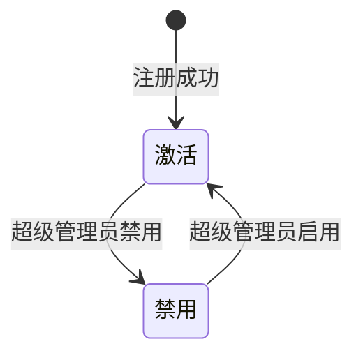

## 🎯 产品概述

### 1.1 用户定义

用户是 Neo 系统的**全局身份**，不依附于 Workspace，属于系统级资源。

### 1.2 核心角色

| 角色           | 说明                         | 权限范围                                       |
| -------------- | ---------------------------- | ---------------------------------------------- |
| **超级管理员** | 系统级管理员，目前仅支持一人 | 管理所有用户、管理所有组织、管理所有 Workspace |
| **普通用户**   | 系统普通用户                 | 访问已加入的组织和管理 Workspace               |
| **游客**       | 未登录用户                   | 仅可访问登录/注册页面                          |

### 1.3 用户与组织的关系

- 用户可以属于多个组织（通过 Employee 映射）
- 用户与 Employee 解耦，通过 `user_employee_mapping` 关联
- 用户可以有账号但不对应任何员工（如纯管理员账号）

---

## 👤 用户注册

### 2.1 注册方式

| 方式           | 说明                             |
| -------------- | -------------------------------- |
| **手机号注册** | 输入手机号 + 验证码 + 密码       |
| **邮箱注册**   | 输入邮箱 + 验证码 + 密码（预留） |

### 2.2 注册流程

```
用户输入手机号
    ↓
发送验证码（60秒倒计时）
    ↓
填写验证码 + 设置密码
    ↓
创建用户账号
    ↓
自动登录，跳转首页
```

### 2.3 注册字段

| 字段       | 类型   | 必填 | 说明                           |
| ---------- | ------ | ---- | ------------------------------ |
| `phone`    | string | 是   | 手机号，11位，纯数字，唯一     |
| `code`     | string | 是   | 短信验证码，6位                |
| `password` | string | 是   | 密码，8-20位，需包含字母和数字 |
| `username` | string | 否   | 用户名，可后续补充，用于展示   |

### 2.4 业务约束

- 手机号唯一，已注册手机号不可重复注册
- 验证码有效期 5 分钟
- 验证码输入错误 3 次后需重新获取
- **暂不支持删除用户**，用户只能被禁用

---

## 👤 用户登录

### 3.1 登录方式

| 方式                    | 说明                               |
| ----------------------- | ---------------------------------- |
| **手机号 + 密码登录**   | 输入手机号和密码                   |
| **手机号 + 验证码登录** | 输入手机号和短信验证码（免密登录） |
| **SSO 登录**            | 通过外部 SSO 系统登录（预留）      |

### 3.2 登录流程

```
用户输入手机号 + 密码/验证码
    ↓
验证凭证
    ↓
生成 JWT Token
    ↓
返回 Token，跳转首页
```

### 3.3 Token 设计

- **访问令牌**（Access Token）：有效期 24 小时
- **刷新令牌**（Refresh Token）：有效期 7 天
- 存储在 httpOnly Cookie 中

---

## 👤 超级管理员功能

### 4.1 超级管理员的职责

- 管理系统内所有用户
- 管理所有组织
- 管理所有 Workspace（创建、禁用）
- 系统配置（预留）

### 4.2 超级管理员设置

> ⚠️ **重要**：系统仅支持一个超级管理员，该设置仅可修改，不可删除。

**初始设置**：

- 系统安装时，强制设置第一个管理员
- 通过环境变量或安装引导界面配置

### 4.3 用户管理功能

| 功能     | 说明                       |
| -------- | -------------------------- |
| 用户列表 | 查看所有用户，分页展示     |
| 创建用户 | 为没有手机号的用户创建账号 |
| 编辑用户 | 修改用户名                 |
| 禁用用户 | 禁用用户账号               |
| 启用用户 | 重新启用已禁用的用户       |

### 4.4 用户属性

> ⚠️ **重要**：编辑用户时，**手机号和邮箱不支持修改**，仅可修改用户名。

| 属性              | 类型     | 必填 | 说明                     |
| ----------------- | -------- | ---- | ------------------------ |
| `id`              | int      | 是   | 自增主键，全局唯一标识符 |
| `username`        | string   | 是   | 用户名，唯一             |
| `email`           | string   | 否   | 邮箱，唯一               |
| `hashed_password` | string   | 是   | 密码哈希值（加密存储）   |
| `phone`           | string   | 是   | 手机号，唯一             |
| `is_admin`        | bool     | 是   | 是否管理员，默认 false   |
| `is_active`       | bool     | 是   | 是否激活，默认 true      |
| `created_at`      | datetime | 是   | 创建时间                 |
| `updated_at`      | datetime | 是   | 更新时间                 |

### 4.5 编辑用户限制

> ⚠️ **重要**：编辑用户时，**手机号和邮箱不支持修改**，仅可修改用户名。

| 可编辑字段 | 说明             |
| ---------- | ---------------- |
| `username` | 用户名，用于展示 |

| 不可编辑字段 | 说明                         |
| ------------ | ---------------------------- |
| `phone`      | 手机号作为唯一标识，不可变更 |
| `email`      | 邮箱作为唯一标识，不可变更   |

**原因**：

- 手机号是用户登录的主要凭证，变更有安全风险
- 邮箱是用户的重要联系方式，需保证可用性

### 4.6 用户状态机



| 状态       | 说明                         | 可执行操作       |
| ---------- | ---------------------------- | ---------------- |
| `active`   | 正常状态，可登录和操作系统   | 查看、编辑、禁用 |
| `disabled` | 已禁用，不可登录，但数据保留 | 查看、编辑、启用 |

**状态转移规则**：

- `active` → `disabled`：超级管理员可以禁用用户
- `disabled` → `active`：超级管理员可以重新启用
- **不支持删除用户**，只能通过禁用来停用账号

---

## 🔗 相关文档

- [ 组织管理设计 ](./组织管理设计)
- [ 用户管理技术设计 ](../technical/user-management)
- [ Workspace 产品设计 ](./workspace)

---

## ✅ 设计检查清单

- [x] 定义用户角色（普通用户、超级管理员）
- [x] 设计注册流程（手机号+验证码+密码）
- [x] 设计登录流程（手机号+密码）
- [x] 设计 Token 机制（JWT）
- [x] 设计用户状态机（active/disabled）
- [x] 设计超级管理员用户管理功能
- [x] 定义用户属性（含完整字段设计）
- [x] 设计 UI 原型
- [x] 补充登录页原型链接
- [x] 补充注册页原型链接
- [x] 补充 username/email 唯一性约束说明
- [ ] 设计用户与 Employee 的关联关系详情
