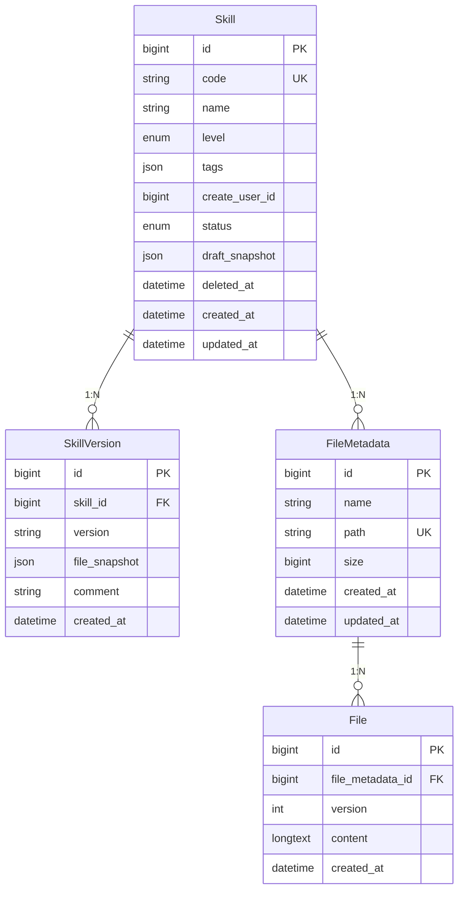

## 路由设计

### Admin 端路由（仅限 admin 角色）

| 路由 | 功能 | 页面文件 |
| ---- | ---- | -------- |
| `/admin/skills` | Skills 列表页 | `app/admin/skills/page.tsx` |
| `/skills/{code}` | Skill 详情页 | `app/skills/[code]/page.tsx` |

### 路由分层原则

- **`/admin/skills/*`**: Admin 专用路由，用于管理 Skills
- **`/skills/*`**: Skill 详情和编辑路由

---

## 🎨 Skill CRUD 操作设计

### 3.1 创建 Skill

**API 端点**:`POST /api/v1/skills`

**请求体**:

```json
{
  "code": "my-first-skill",
  "name": "我的第一个 Skill",
  "level": "Functional",
  "tags": ["data", "analysis"]
}
```

**响应**:

```json
{
  "code": 0,
  "message": "ok",
  "data": {
    "id": 1,
    "code": "my-first-skill",
    "name": "我的第一个 Skill",
    "level": "Functional",
    "tags": ["data", "analysis"],
    "status": "draft",
    "draft_snapshot": null,
    "create_user_id": 123,
    "created_at": "2026-05-28T10:00:00Z",
    "updated_at": "2026-05-28T10:00:00Z"
  },
  "traceId": "abc-123",
  "timestamp": 1716900000000
}
```

**错误场景**:

| 错误码 | 说明 | 处理方式 |
| ------ | ---- | -------- |
| `1001` | Invalid Parameter（code 为空或超长） | 返回 400,提示具体字段 |
| `4001` | Code Conflict（code 已存在） | 返回 409,提示冲突 |
| `1002` | Unauthorized（无权创建） | 返回 401/403 |

### 3.2 读取 Skill

#### 3.2.1 列表

**API 端点**:`GET /api/v1/skills`

**查询参数**:

| 参数 | 类型 | 说明 |
| ---- | ---- | ---- |
| `status` | enum | 按状态过滤 (`draft`, `active`, `disabled`) |
| `level` | enum | 按级别过滤 (`Planning`, `Functional`, `Atomic`) |
| `tags` | string | 按标签过滤，多个用逗号分隔 |
| `search` | string | 按名称/code 搜索(模糊匹配) |
| `page` | int | 页码,默认 1 |
| `page_size` | int | 每页数量,默认 20 |

**响应**:

```json
{
  "code": 0,
  "message": "ok",
  "data": {
    "total": 100,
    "items": [
      {
        "id": 1,
        "code": "my-first-skill",
        "name": "我的第一个 Skill",
        "level": "Functional",
        "tags": ["data", "analysis"],
        "status": "active",
        "current_version": "1.0.0",
        "created_at": "2026-05-28T10:00:00Z"
      }
    ],
    "page": 1,
    "page_size": 20
  },
  "traceId": "abc-123",
  "timestamp": 1716900000000
}
```

#### 3.2.2 详情

**API 端点**:`GET /api/v1/skills/{code}`

**响应**:

```json
{
  "code": 0,
  "message": "ok",
  "data": {
    "id": 1,
    "code": "my-first-skill",
    "name": "我的第一个 Skill",
    "level": "Functional",
    "tags": ["data", "analysis"],
    "status": "active",
    "draft_snapshot": [
      { "file_metadata_id": 1, "file_id": 101 },
      { "file_metadata_id": 2, "file_id": 102 }
    ],
    "current_version": {
      "id": 10,
      "version": "1.0.0",
      "comment": "初始版本",
      "created_at": "2026-05-28T10:00:00Z"
    },
    "create_user_id": 123,
    "created_at": "2026-05-28T10:00:00Z",
    "updated_at": "2026-05-28T10:00:00Z"
  },
  "traceId": "abc-123",
  "timestamp": 1716900000000
}
```

### 3.3 更新 Skill

**API 端点**:`PATCH /api/v1/skills/{code}`

**请求体**:

```json
{
  "name": "更新后的名称",
  "level": "Atomic",
  "tags": ["data", "new-tag"]
}
```

**可编辑字段**:

- `name`: Skill 展示名称
- `level`: 粒度级别
- `tags`: 标签数组

**不可编辑字段**:

- `id`: 全局唯一标识
- `code`: URL 标识(不可变)
- `status`: 状态(通过专用接口变更)
- `draft_snapshot`: 草稿快照(通过文件操作变更)

### 3.4 删除 Skill (软删除)

**API 端点**:`DELETE /api/v1/skills/{code}`

**响应**:

```json
{
  "code": 0,
  "message": "ok",
  "data": null,
  "traceId": "abc-123",
  "timestamp": 1716900000000
}
```

**约束**:

- ❌ 已发布的 Skill（status=active）不允许删除
- ⚠️ 仅允许删除 draft 或 disabled 状态的 Skill

---

## 🔄 状态操作设计

### 3.5 发布 Skill

**API 端点**:`POST /api/v1/skills/{code}/publish`

**请求体**:

```json
{
  "version": "1.0.0",
  "comment": "初始版本发布"
}
```

**响应**:

```json
{
  "code": 0,
  "message": "ok",
  "data": {
    "id": 10,
    "skill_id": 1,
    "version": "1.0.0",
    "file_snapshot": [
      { "file_metadata_id": 1, "file_id": 101 },
      { "file_metadata_id": 2, "file_id": 102 }
    ],
    "comment": "初始版本发布",
    "created_at": "2026-05-28T10:00:00Z"
  },
  "traceId": "abc-123",
  "timestamp": 1716900000000
}
```

**约束**:

- ⚠️ `version` 在同一 Skill 下必须唯一
- ⚠️ `comment` (发布说明) 为必填项
- ⚠️ 发布后 Skill.status 变为 active
- ⚠️ 发布内容来源是 draft_snapshot

**错误场景**:

| 错误码 | 说明 |
| ------ | ---- |
| `1001` | Invalid Parameter（version 或 comment 为空） |
| `4002` | Version Conflict（版本号已存在） |
| `4003` | Draft Empty（草稿为空，无法发布） |

### 3.6 禁用 Skill

**API 端点**:`POST /api/v1/skills/{code}/disable`

**请求体**: 空

**响应**:

```json
{
  "code": 0,
  "message": "ok",
  "data": {
    "code": "my-first-skill",
    "status": "disabled",
    "disabled_at": "2026-05-28T12:00:00Z"
  },
  "traceId": "abc-123",
  "timestamp": 1716900000000
}
```

**反向操作**:`POST /api/v1/skills/{code}/enable`

---

## 📁 文件操作设计

### 3.7 获取文件树

**API 端点**:`GET /api/v1/skills/{code}/files`

**响应**:

```json
{
  "code": 0,
  "message": "ok",
  "data": [
    {
      "id": 1,
      "name": "SKILL.md",
      "path": "SKILL.md",
      "type": "file",
      "size": 1024
    },
    {
      "id": 2,
      "name": "scripts",
      "path": "scripts",
      "type": "directory",
      "children": [
        {
          "id": 3,
          "name": "file1.sh",
          "path": "scripts/file1.sh",
          "type": "file",
          "size": 256
        }
      ]
    }
  ],
  "traceId": "abc-123",
  "timestamp": 1716900000000
}
```

### 3.8 获取文件内容

**API 端点**:`GET /api/v1/skills/{code}/files/{path:.*}`

> **注意**: path 参数需要 URL 编码，如 `scripts/file1.sh` → `scripts%2Ffile1.sh`

**响应**:

```json
{
  "code": 0,
  "message": "ok",
  "data": {
    "id": 3,
    "name": "file1.sh",
    "path": "scripts/file1.sh",
    "size": 256,
    "content": "#!/bin/bash\necho 'Hello'",
    "version": 1,
    "updated_at": "2026-05-28T10:00:00Z"
  },
  "traceId": "abc-123",
  "timestamp": 1716900000000
}
```

### 3.9 创建文件

**API 端点**:`POST /api/v1/skills/{code}/files`

**请求体**:

```json
{
  "path": "scripts/new-file.sh",
  "content": "#!/bin/bash\necho 'Hello'"
}
```

**响应**:

```json
{
  "code": 0,
  "message": "ok",
  "data": {
    "id": 4,
    "name": "new-file.sh",
    "path": "scripts/new-file.sh",
    "size": 32,
    "version": 1,
    "created_at": "2026-05-28T10:00:00Z"
  },
  "traceId": "abc-123",
  "timestamp": 1716900000000
}
```

**约束**:

- ⚠️ path 不能与现有文件重复
- ⚠️ 内容不能为空

### 3.10 更新文件

**API 端点**:`PUT /api/v1/skills/{code}/files/{path:.*}`

**请求体**:

```json
{
  "content": "#!/bin/bash\necho 'Hello World'"
}
```

**响应**:

```json
{
  "code": 0,
  "message": "ok",
  "data": {
    "id": 3,
    "name": "file1.sh",
    "path": "scripts/file1.sh",
    "size": 35,
    "version": 2,
    "updated_at": "2026-05-28T11:00:00Z"
  },
  "traceId": "abc-123",
  "timestamp": 1716900000000
}
```

**约束**:

- ⚠️ 每次更新都会在 File 表新增一条记录（保留历史）
- ⚠️ 更新草稿快照中的 file_id

### 3.11 删除文件

**API 端点**:`DELETE /api/v1/skills/{code}/files/{path:.*}`

**响应**:

```json
{
  "code": 0,
  "message": "ok",
  "data": null,
  "traceId": "abc-123",
  "timestamp": 1716900000000
}
```

**约束**:

- ⚠️ 从草稿快照中移除该文件记录
- ⚠️ 已发布的文件是否可以删除待确认（建议不允许）

---

## 📜 版本历史设计

### 3.12 获取版本历史

**API 端点**:`GET /api/v1/skills/{code}/versions`

**响应**:

```json
{
  "code": 0,
  "message": "ok",
  "data": {
    "total": 3,
    "items": [
      {
        "id": 12,
        "version": "1.2.0",
        "comment": "修复了 xxx 问题",
        "created_at": "2026-05-28T10:00:00Z",
        "is_current": true
      },
      {
        "id": 10,
        "version": "1.1.0",
        "comment": "新增了 yyy 功能",
        "created_at": "2026-05-25T10:00:00Z",
        "is_current": false
      },
      {
        "id": 5,
        "version": "1.0.0",
        "comment": "初始版本",
        "created_at": "2026-05-20T10:00:00Z",
        "is_current": false
      }
    ]
  },
  "traceId": "abc-123",
  "timestamp": 1716900000000
}
```

### 3.13 回滚操作

**API 端点**:`POST /api/v1/skills/{code}/rollback`

**请求体**:

```json
{
  "version_id": 5
}
```

**响应**:

```json
{
  "code": 0,
  "message": "ok",
  "data": {
    "code": "my-first-skill",
    "draft_snapshot": [
      { "file_metadata_id": 1, "file_id": 50 },
      { "file_metadata_id": 2, "file_id": 51 }
    ],
    "rolled_back_version": "1.0.0"
  },
  "traceId": "abc-123",
  "timestamp": 1716900000000
}
```

**约束**:

- ⚠️ 回滚是复制操作，不删除目标版本
- ⚠️ 回滚后 `Skill.draft_snapshot` 变为历史版本的文件快照
- ⚠️ 可再次编辑后重新发布

---

## 🗄️ 数据库设计

### 4.1 ER 图



### 4.2 表结构设计

#### 4.2.1 skills 表

| 字段名 | 类型 | 约束 | 说明 |
|--------|------|------|------|
| `id` | BIGINT | PK, AUTO_INCREMENT | 主键 |
| `code` | VARCHAR(100) | UNIQUE, NOT NULL, 索引 | Skill 唯一标识符 |
| `name` | VARCHAR(200) | NOT NULL | Skill 展示名称 |
| `level` | ENUM('Planning', 'Functional', 'Atomic') | NOT NULL | 粒度级别 |
| `tags` | JSON | | 标签数组 |
| `create_user_id` | BIGINT | | 创建用户 ID |
| `status` | ENUM('draft', 'active', 'disabled') | NOT NULL, DEFAULT 'draft' | 状态 |
| `draft_snapshot` | JSON | | 草稿快照，记录编辑中的文件状态 |
| `deleted_at` | DATETIME | | 软删除时间 |
| `created_at` | DATETIME | NOT NULL | 创建时间 |
| `updated_at` | DATETIME | NOT NULL | 更新时间 |

**索引设计**:

- `idx_code` on (`code`) UNIQUE - 按 code 查询
- `idx_status` on (`status`) - 按状态筛选
- `idx_level` on (`level`) - 按级别筛选
- `idx_deleted_at` on (`deleted_at`) - 软删除标记

#### 4.2.2 skill_versions 表

| 字段名 | 类型 | 约束 | 说明 |
|--------|------|------|------|
| `id` | BIGINT | PK, AUTO_INCREMENT | 主键 |
| `skill_id` | BIGINT | NOT NULL, FK | 关联的 Skill |
| `version` | VARCHAR(50) | NOT NULL | 版本号 |
| `file_snapshot` | JSON | NOT NULL | 文件快照 |
| `comment` | VARCHAR(500) | | 版本发布说明 |
| `created_at` | DATETIME | NOT NULL | 发布时间 |

**索引设计**:

- `idx_skill_id` on (`skill_id`) - 按 Skill 查询版本
- `uk_skill_version` on (`skill_id`, `version`) UNIQUE - 版本号唯一性

**外键关系**:

- `skill_id` → `skills(id)` ON DELETE CASCADE

#### 4.2.3 file_metadata 表

| 字段名 | 类型 | 约束 | 说明 |
|--------|------|------|------|
| `id` | BIGINT | PK, AUTO_INCREMENT | 主键 |
| `name` | VARCHAR(255) | NOT NULL | 文件名 |
| `path` | VARCHAR(1024) | UNIQUE, NOT NULL | 文件路径 |
| `size` | BIGINT | NOT NULL | 文件大小（字节） |
| `created_at` | DATETIME | NOT NULL | 创建时间 |
| `updated_at` | DATETIME | NOT NULL | 更新时间 |

**索引设计**:

- `idx_path` on (`path`) UNIQUE - 按路径查询
- `idx_name` on (`name`) - 按文件名搜索

#### 4.2.4 files 表

| 字段名 | 类型 | 约束 | 说明 |
|--------|------|------|------|
| `id` | BIGINT | PK, AUTO_INCREMENT | 主键 |
| `file_metadata_id` | BIGINT | NOT NULL, FK | 关联的 FileMetadata |
| `version` | INT | NOT NULL | 文件版本号 |
| `content` | LONGTEXT | NOT NULL | 文件内容 |
| `created_at` | DATETIME | NOT NULL | 创建时间 |

**索引设计**:

- `idx_file_metadata_id` on (`file_metadata_id`) - 按文件元数据查询
- `uk_file_metadata_version` on (`file_metadata_id`, `version`) UNIQUE - 版本号唯一性

**外键关系**:

- `file_metadata_id` → `file_metadata(id)` ON DELETE CASCADE

### 4.3 枚举值说明

**SkillLevel (粒度级别)**

| 值 | 说明 |
| ------------ | ------------------------------------------- |
| `Planning` | 规划级 - 粗粒度 Skill，适合复杂业务流程 |
| `Functional` | 功能级 - 中等粒度，适合常见业务场景 |
| `Atomic` | 原子级 - 最小可复用单元，如数据查询、格式化 |

**SkillStatus (状态)**

| 值 | 说明 |
| ---------- | ----------------------- |
| `draft` | 草稿 - 初始状态，可编辑 |
| `active` | 激活 - 已发布，可被调用 |
| `disabled` | 禁用 - 已下线，不可调用 |

### 4.4 JSON 字段格式

#### draft_snapshot 格式

```json
[
  { "file_metadata_id": 1, "file_id": 101 },
  { "file_metadata_id": 2, "file_id": 102 }
]
```

#### file_snapshot 格式（与 draft_snapshot 一致）

```json
[
  { "file_metadata_id": 1, "file_id": 101 },
  { "file_metadata_id": 2, "file_id": 102 }
]
```

---

## 🔐 权限矩阵

### 5.1 角色定义

| 角色 | 说明 | 权限级别 |
|------|------|----------|
| `super_admin` | 超级管理员 | 最高，管理所有 Skill |
| `skill_admin` | Skill 管理员 | 管理所有 Skill |
| `skill_editor` | Skill 编辑者 | 编辑自己的 Skill |
| `skill_viewer` | Skill 查看者 | 仅查看 Skill |

### 5.2 权限矩阵

| 操作 | super_admin | skill_admin | skill_editor | skill_viewer |
|------|-------------|-------------|--------------|--------------|
| 查看 Skill 列表 | ✅ | ✅ | ✅ | ✅ |
| 查看 Skill 详情 | ✅ | ✅ | ✅ | ✅ |
| 创建 Skill | ✅ | ✅ | ✅ | ❌ |
| 编辑 Skill 基本信息 | ✅ | ✅ | ⚠️ 自己的 | ❌ |
| 创建文件 | ✅ | ✅ | ⚠️ 自己的 | ❌ |
| 编辑文件 | ✅ | ✅ | ⚠️ 自己的 | ❌ |
| 删除文件 | ✅ | ✅ | ⚠️ 自己的 | ❌ |
| 发布 Skill | ✅ | ✅ | ❌ | ❌ |
| 禁用 Skill | ✅ | ✅ | ❌ | ❌ |
| 启用 Skill | ✅ | ✅ | ❌ | ❌ |
| 回滚 Skill | ✅ | ✅ | ❌ | ❌ |
| 删除 Skill | ✅ | ✅ | ⚠️ 自己的 draft | ❌ |

**说明**:

- ⚠️ 自己的：指当前用户创建的 Skill
- Skill 管理员和 Skill 编辑者的区分通过 `create_user_id` 判断

### 5.3 默认角色分配

| 角色 | 分配条件 |
|------|----------|
| super_admin | 系统初始化时的超级管理员账户 |
| skill_admin | 被 super_admin 授予权限的用户 |
| skill_editor | 所有登录用户（默认） |
| skill_viewer | 所有登录用户（默认） |

---

## 🔗 相关文档

- [Skills 功能概述](../../product/admin/skills-overview)
- [Skills 管理功能设计](../../product/admin/skills-management)
- [路由表](../product/routing-table)
- [API 设计规范](../technical/rules-api)