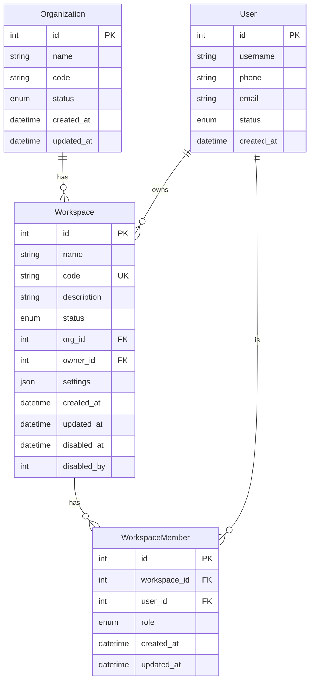

## 路由设计

> ⚠️ 根据产品设计变更，Workspace 路由已按角色分层。

### Admin 端路由（仅限 admin 角色）

| 路由 | 功能 | 页面文件 |
| ---- | ---- | -------- |
| `/admin/workspace` | Workspace 列表页 | `app/admin/workspace/page.tsx` |
| `/admin/workspace/new` | 创建 Workspace | `app/admin/workspace/new/page.tsx` |
| `/admin/workspace/{workspace_id}/settings` | Workspace 设置页 | `app/admin/workspace/[workspace_id]/settings/page.tsx` |

### User 端路由（普通用户）

| 路由 | 功能 | 页面文件 |
| ---- | ---- | -------- |
| `/workspace` | 我的 Workspace | `app/workspace/page.tsx` |
| `/workspace/{workspace_id}` | Workspace 详情页 | `app/workspace/[workspace_id]/page.tsx` |

### 路由分层原则

- **`/admin/workspace/*`**: Admin 专用路由，用于创建、配置和管理 Workspace
- **`/workspace/*`**: 普通用户路由，用于使用已授权的 Workspace

---

## 🎨 Workspace CRUD 操作设计

### 3.1 创建(Create)

**API 端点**:`POST /api/v1/workspaces`

**请求体**:

```json
{
  "name": "研发一部",
  "description": "研发中心第一个团队"
}
```

**响应**:

```json
{
  "code": 0,
  "message": "ok",
  "data": {
    "id": 1876543210,
    "name": "研发一部",
    "code": "yan-fa-yi-bu",
    "description": "研发中心第一个团队",
    "status": "active",
    "org_id": 10001,
    "owner_id": 1234567890,
    "created_at": "2026-05-12T10:00:00Z",
    "updated_at": "2026-05-12T10:00:00Z"
  },
  "traceId": "abc-123",
  "timestamp": 1713700000000
}
```

**错误场景**:
| 错误码 | 说明 | 处理方式 |
| ------ | ---- | -------- |
| `1001` | Invalid Parameter（名称为空或超长） | 返回 400,提示具体字段 |
| `3001` | Name Conflict（名称已存在） | 返回 409,提示冲突 |
| `1002` | Unauthorized（无权创建） | 返回 401/403 |

### 3.2 读取(Read)

**列表**:`GET /api/v1/workspaces`

**查询参数**:
| 参数 | 类型 | 说明 |
| ---- | ---- | ---- |
| `status` | enum | 按状态过滤 (`active`, `disabled`) |
| `page` | int | 页码,默认 1 |
| `page_size` | int | 每页数量,默认 20 |
| `search` | string | 按名称搜索(模糊匹配) |

**详情**:`GET /api/v1/workspaces/{workspace_id}`

> **字段说明**: 为保持与产品设计一致，响应中返回 `owner_id`。如需获取所有者详细信息，可调用 `GET /api/v1/users/{owner_id}` 获取。

**响应**:

```json
{
  "code": 0,
  "message": "ok",
  "data": {
    "id": 1876543210,
    "name": "研发一部",
    "code": "yan-fa-yi-bu",
    "description": "研发中心第一个团队",
    "status": "active",
    "org_id": 10001,
    "owner_id": 1234567890,
    "member_count": 15,
    "project_count": 8,
    "created_at": "2026-05-12T10:00:00Z",
    "updated_at": "2026-05-12T10:00:00Z"
  },
  "traceId": "abc-123",
  "timestamp": 1713700000000
}
```

### 3.3 更新(Update)

**API 端点**:`PATCH /api/v1/workspaces/{workspace_id}`

**请求体**:

```json
{
  "name": "研发二部",
  "description": "更新后的描述"
}
```

**可编辑字段**:

- `name`:Workspace 名称
- `description`:描述信息

**不可编辑字段**:

- `id`:全局唯一标识
- `code`:URL 标识(不可变)
- `owner_id`:所有者(通过转移所有权接口变更)
- `created_at`:创建时间

### 3.4 删除(Disable)

> ⚠️ **重要**:Workspace 不支持物理删除,仅支持禁用。

**API 端点**:`POST /api/v1/workspaces/{workspace_id}/disable`

**请求体**:空

**响应**:

```json
{
  "code": 0,
  "message": "ok",
  "data": {
    "id": 1876543210,
    "status": "disabled",
    "org_id": 10001,
    "disabled_at": "2026-05-12T12:00:00Z",
    "disabled_by": 1234567890
  },
  "traceId": "abc-123",
  "timestamp": 1713700000000
}
```

**反向操作**:`POST /api/v1/workspaces/{workspace_id}/enable`

### 3.5 成员管理 API

#### 3.5.1 获取成员列表

**API 端点**:`GET /api/v1/workspaces/{workspace_id}/members`

**查询参数**:
| 参数 | 类型 | 说明 |
| ---- | ---- | ---- |
| `page` | int | 页码，默认 1 |
| `page_size` | int | 每页数量，默认 20 |
| `role` | enum | 按角色过滤 (`owner`, `admin`, `member`, `guest`) |

**响应**:
```json
{
  "code": 0,
  "message": "ok",
  "data": {
    "total": 15,
    "items": [
      {
        "id": 1,
        "user_id": 1234567890,
        "username": "zhangsan",
        "phone": "13800138001",
        "role": "owner",
        "joined_at": "2026-05-12T10:00:00Z"
      }
    ],
    "page": 1,
    "page_size": 20
  },
  "traceId": "abc-123",
  "timestamp": 1713700000000
}
```

#### 3.5.2 添加成员

**API 端点**:`POST /api/v1/workspaces/{workspace_id}/members`

**请求体**:
```json
{
  "user_id": 9876543210,
  "role": "member"
}
```

**响应**:
```json
{
  "code": 0,
  "message": "ok",
  "data": {
    "id": 2,
    "workspace_id": 1876543210,
    "user_id": 9876543210,
    "role": "member",
    "created_at": "2026-05-12T12:00:00Z"
  },
  "traceId": "abc-123",
  "timestamp": 1713700000000
}
```

**错误场景**:
| 错误码 | 说明 |
| ------ | ---- |
| `1001` | Invalid Parameter（参数错误） |
| `3002` | User Not Found（用户不存在） |
| `3003` | Member Already Exists（成员已存在） |

#### 3.5.3 更新成员角色

**API 端点**:`PATCH /api/v1/workspaces/{workspace_id}/members/{member_id}`

**请求体**:
```json
{
  "role": "admin"
}
```

**响应**:
```json
{
  "code": 0,
  "message": "ok",
  "data": {
    "id": 2,
    "user_id": 9876543210,
    "role": "admin",
    "updated_at": "2026-05-12T14:00:00Z"
  }
}
```

**约束**:
- ❌ 不允许将 `owner` 角色降级或移除
- ❌ 不允许将自己移除或降级

#### 3.5.4 移除成员

**API 端点**:`DELETE /api/v1/workspaces/{workspace_id}/members/{member_id}`

**响应**:
```json
{
  "code": 0,
  "message": "ok",
  "data": null,
  "traceId": "abc-123",
  "timestamp": 1713700000000
}
```

**约束**:
- ❌ 不允许移除 `owner` 角色
- ❌ 不允许自己移除自己（需通过退出 Workspace）

#### 3.5.5 转移所有权

**API 端点**:`POST /api/v1/workspaces/{workspace_id}/transfer-owner`

**请求体**:
```json
{
  "new_owner_id": 9876543210
}
```

**响应**:
```json
{
  "code": 0,
  "message": "ok",
  "data": {
    "id": 1876543210,
    "owner_id": 9876543210,
    "updated_at": "2026-05-12T16:00:00Z"
  }
}
```

**约束**:
- ⚠️ 只有 `owner` 可以执行此操作
- ⚠️ 原所有者自动降级为 `admin` 角色

---

## 📋 Workspace 设置页面结构

```
Workspace 设置
├── 基本信息
│   ├── 名称
│   ├── code(只读)
│   ├── 描述
│   └── 创建时间
├── 所有者
│   ├── 当前所有者信息
│   └── 转移所有权
├── 成员管理
│   ├── 成员列表
│   ├── 邀请成员
│   └── 角色分配
├── 安全设置
│   ├── 访问控制策略
│   └── SSO 配置(预留)
└── 高级设置
    ├── 禁用 Workspace
    └── 导出数据
```

---

## 🗄️ 数据库设计

### 4.1 ER 图



### 4.2 表结构设计

#### 4.2.1 workspaces 表

| 字段名 | 类型 | 约束 | 说明 |
|--------|------|------|------|
| `id` | INT | PK, AUTO_INCREMENT | 主键 |
| `name` | VARCHAR(50) | NOT NULL | Workspace 名称 |
| `code` | VARCHAR(50) | UNIQUE, NOT NULL | URL 友好标识 |
| `description` | VARCHAR(500) | | 描述信息 |
| `status` | ENUM('active', 'disabled') | NOT NULL, DEFAULT 'active' | 状态 |
| `org_id` | INT | NOT NULL, FK | 所属组织 ID |
| `owner_id` | INT | NOT NULL, FK | 所有者用户 ID |
| `settings` | JSON | | Workspace 配置 |
| `created_at` | DATETIME | NOT NULL | 创建时间 |
| `updated_at` | DATETIME | NOT NULL | 更新时间 |
| `disabled_at` | DATETIME | | 禁用时间 |
| `disabled_by` | INT | FK | 禁用操作人 ID |

**索引设计**:
- `idx_org_id` on (`org_id`) - 按组织查询
- `idx_status` on (`status`) - 按状态筛选
- `idx_owner_id` on (`owner_id`) - 按所有者查询
- `idx_code` on (`code`) UNIQUE - 按 code 查询

#### 4.2.2 workspace_members 表

| 字段名 | 类型 | 约束 | 说明 |
|--------|------|------|------|
| `id` | INT | PK, AUTO_INCREMENT | 主键 |
| `workspace_id` | INT | NOT NULL, FK | Workspace ID |
| `user_id` | INT | NOT NULL, FK | 用户 ID |
| `role` | ENUM('owner', 'admin', 'member', 'guest') | NOT NULL | 角色 |
| `created_at` | DATETIME | NOT NULL | 加入时间 |
| `updated_at` | DATETIME | NOT NULL | 更新时间 |

**索引设计**:
- `idx_workspace_id` on (`workspace_id`) - 按 Workspace 查询成员
- `idx_user_id` on (`user_id`) - 按用户查询 Workspace 列表
- `uk_workspace_user` on (`workspace_id`, `user_id`) UNIQUE - 防止重复加入

**外键关系**:
- `workspace_id` → `workspaces(id)` ON DELETE CASCADE
- `user_id` → `users(id)` ON DELETE CASCADE

### 4.3 角色枚举说明

| 角色值 | 说明 | 权限级别 |
|--------|------|----------|
| `owner` | 所有者 | 最高，管理所有资源 |
| `admin` | 管理员 | 仅次于所有者，可管理成员 |
| `member` | 成员 | 基本访问和操作权限 |
| `guest` | 访客 | 仅查看权限 |

### 4.4 初始数据

创建 Workspace 时，系统自动执行以下操作：

1. 在 `workspaces` 表插入记录
2. 在 `workspace_members` 表插入所有者记录（`role = 'owner'`）

```sql
-- 示例: 创建 Workspace "研发一部"
INSERT INTO workspaces (name, code, description, status, org_id, owner_id, created_at, updated_at)
VALUES ('研发一部', 'yan-fa-yi-bu', '研发中心第一个团队', 'active', 10001, 1234567890, NOW(), NOW());

-- 自动创建所有者成员记录
INSERT INTO workspace_members (workspace_id, user_id, role, created_at, updated_at)
VALUES (1, 1234567890, 'owner', NOW(), NOW());
```

---

## 🔗 相关文档

- [ Workspace 产品设计 ](../../product/base/workspace)
- [ 路由表 ](../product/routing-table)
- [ 权限系统设计文档 ](../../technical/admin/authz)
- [ 审计日志设计文档 ](../../technical/admin/audit-log)
