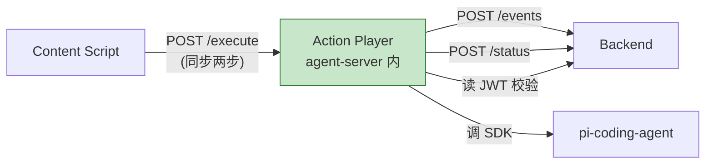
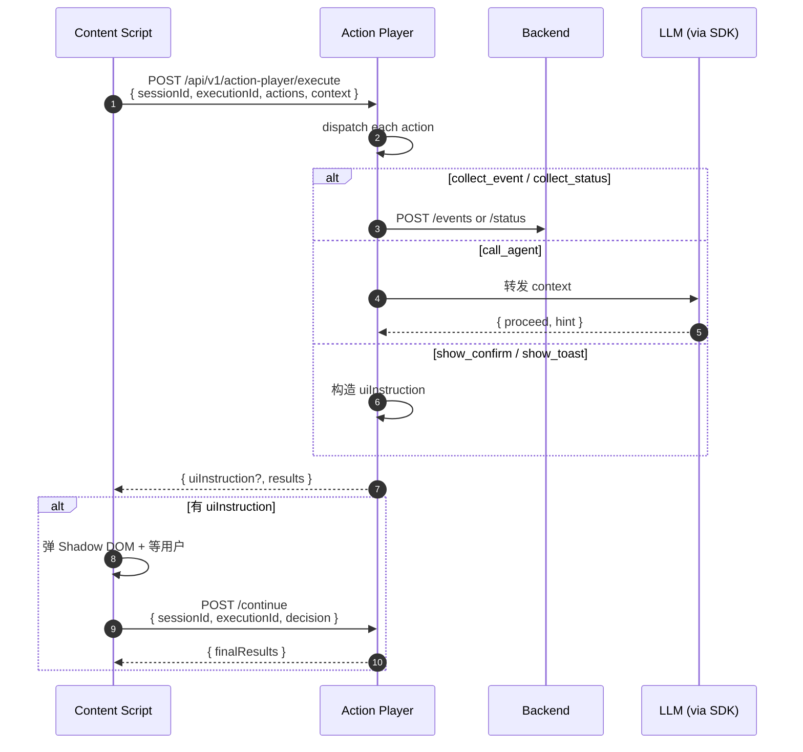

# Action Player (AP) 技术设计

> Action Player 是 agent-server 内的 action 执行器。Content Script 通过 HTTP 调用 AP,AP 按 type 路由到具体 action 实现。**所有 action 业务逻辑都在 AP 进程内,CS 没有任何 action 代码**。

---

## 1. 定位与边界

**AP 是什么**:agent-server 内的 action dispatcher + 各种 action 实现的集合。

**AP 不是什么**:

- 不是 LLM agent 本身(只是转发 LLM 决策)
- 不是 Content Script 的扩展(CS 只调 API,不下载任何 action 代码)
- 不是 backend 的替代(AP 不直接写 DB,只调 backend API 上报 Event/Status)



**AP 跟 interceptor 的关系**:`interceptor` 负责"捕获 DOM/网络事件",`action-player` 负责"事件触发后执行什么"。interceptor 命中 → 调 AP → AP 执行 → 上报 backend。

---

## 2. 整体设计(从 interceptor §8.5 搬过来)

### 2.1 3 个关键决策

| # | 决策 | 结论 |
|---|------|------|
| 1 | **AP 部署位置** | agent-server 内(模块: `lib/action-player/`) |
| 2 | **通道** | HTTP(不走 BBP,BBP 是 chat session 维度) |
| 3 | **协议** | 同步两步:`execute` + `continue` |

> **Session 维度**和**持久化**:AP 不引入新概念,直接复用 [auth-session.md §1](./auth-session) 的 `sessionId`(tab 维度,每个 tab 一个,由 `POST /api/agent/new` 创建)。`executionId` 是**单次 `/execute` 调用的标识**,CS 每次拦截生成新 UUID,用于配对 `/continue`(以后可用于幂等)。

### 2.2 数据流



### 2.3 CS 角色(0 业务逻辑)

| ✅ CS 做 | ❌ CS 不做 |
|---------|-----------|
| 调 AP HTTP API | 任何 action 业务代码 |
| 浏览器能力:Shadow DOM 弹窗、编程式重放 click | 任何敏感凭据(LLM API key、token) |
| 解析 uiInstruction 渲染 UI | 任何网络/DB 写操作 |

---

## 3. 公共机制

### 3.1 Action Dispatcher

AP 收到 `/execute` 后:

```
for action in actions:
  handler = dispatcher.get(action.type)  // 注册表查
  if !handler: skip + log warn
  await handler(action, context)
```

`dispatcher` 是 `Map<actionType, HandlerFn>`,新增 action type = 注册新 handler,**不需要改 dispatcher**。

### 3.2 Session 与执行流

AP **不**引入新的 session 维度,直接复用 [auth-session.md §1](./auth-session) 的 `sessionId`:

- **`sessionId`**:tab 维度,每个 tab 一个,由 `POST /api/agent/new` 创建(见 auth-session.md 阶段 ②)
- **`executionId`**:单次 `/execute` 调用的标识,CS 每次拦截生成新 UUID
  - 用于配对 `/continue`(同一个拦截流程,execute 完 → continue 完)
  - 未来可用于**幂等**:AP 端用 `(sessionId, executionId)` 去重,重复 execute 走缓存

**AP 服务端状态**:`(sessionId, executionId) → 中间状态` 的 LRU,idle 30 分钟清。sessionId 隔离多 tab,executionId 隔离同一 tab 多次拦截。

### 3.3 错误处理

| 阶段 | 失败行为 |
|------|---------|
| **before action** | 同步失败 → 中断后续 action,返回错误给 CS;`intercept` 模式 + 弹 confirm → 放行原行为 |
| **after action** | 失败 → 写后端日志,**不阻塞**原业务 |
| **observe 模式** | 整个 `/execute` 调用 `fire-and-forget`,任何错误都在 AP 端日志,不影响原业务 |
| **AP 整体挂了** | CS 拦截仍触发,但 `/execute` 走 `fetch().catch()` 吞掉异常,原 click 正常放行 |

### 3.4 超时

| 类型 | 默认 | 行为 |
|------|------|------|
| 单个 action | 5s | 超时 → 当作失败处理(before 中断 / after 忽略) |
| 整体 `/execute` | 10s | 超时 → 立即返回已完成的 results,未完成的标 timeout |
| `show_confirm` UI | 30s | 超时 → 默认放行原行为(零风险) |

### 3.5 uiInstruction 协议

`/execute` 返回的 `uiInstruction` 字段(可选):

```ts
type UiInstruction =
  | { type: 'show_confirm', title: string, body: string, confirmLabel?: string, cancelLabel?: string }
  | { type: 'show_toast', message: string, level: 'info'|'warn'|'error', durationMs?: number };
```

CS 收到后用 Shadow DOM 渲染,用户交互后调 `/continue` 带决策。**只有 show_confirm 需要决策回传**;show_toast 单向通知。

---

## 4. Action 实现方案

### 4.1 collect_event

**目的**:拦截触发后,生成一条结构化 Event 上报 backend。

**触发时机**:after(必须,before 时还不知道"事件发生了")

**HTTP**:`POST /workspaces/{code}/events`

**字段映射**:

| 后端 Event 字段 | 来源 |
|----------------|------|
| `name` | `interceptor.eventName` |
| `entity_name` | `interceptor.entityName` |
| `target_entity_name` | `interceptor.targetEntityName`(可选) |
| `actor` | chrome.storage.session.userInfo.userId |
| `event_time` | 拦截触发时刻 |
| `page_url` | `location.href` |
| `session_id` | 拦截器 sessionId(对应 1 条"会话") |
| `metadata` | action 自己的 config(用户可配) |

> `entity_name` / `target_entity_name` 直接来自 `interceptor.options.entityName` / `targetEntityName`,**不动态抽取**(见 interceptor.md §4.1)。如果业务上需要动态 entity,需加模板变量机制。

**错误处理**:

- HTTP 失败 → 写后端日志(`event_upload_failed`),不阻塞
- `entityName` 为空 → 这是配置错误,理论上不应触发(拦截器创建时校验)

**observe 模式**:fire-and-forget,失败不通知 CS

**实现要点**(伪代码):

```
async function collectEvent(action, context):
  event = buildEvent(action.config, context)  // 字段映射
  try:
    await backend.POST('/events', event)
  catch err:
    log.warn('event upload failed', { err, eventName })
```

---

### 4.2 collect_status

**目的**:采集实体某个时刻的状态快照,用于 Event 前后对比(比如"分配线索前张三有多少客户" → "分配后有多少")。

**触发时机**:before / after 都可能,具体看 action 配置。

**HTTP**:`POST /workspaces/{code}/status`

**字段映射**:

| 后端 Status 字段 | 来源 |
|----------------|------|
| `entity_name` | `interceptor.entityName`(必须跟 interceptor 一致——status 就是给这个实体采的) |
| `attributes` | `action.config.attributes`:一个 map,value 是 XPath 表达式,运行时从 DOM 求值 |
| `captured_at` | 当前时间 |
| `source` | 固定 `"interceptor:${ruleName}"` |
| `session_id` | 拦截器 sessionId |
| `page_url` | `location.href` |

**关键机制:动态属性提取**:

```ts
// action.config.attributes 示例
{
  "client_count": ".//span[@class='count']/text()",   // XPath 表达式
  "experience": ".//div[@data-role='exp']/@data-level", // 属性值
  "is_active": ".//input[@name='active']/@checked"     // 存在 → true
}
```

AP 收到 action 后,用 `document.evaluate(xpath, targetElement)` 逐个求值,把结果转成字符串/布尔/数字,组装成 `attributes` 对象。

**错误处理**:

- 某属性 XPath 找不到 → 该字段为 `null`,不阻塞其他字段
- HTTP 失败 → 日志忽略

**observe 模式**:fire-and-forget

---

### 4.3 call_agent

**目的**:把决策权交给 LLM agent,获取"放行/阻止/改写"决策(用于敏感操作二次确认)。

**触发时机**:before(主要),`intercept` 模式必用

**机制**:

- AP 内部转发给 agent-server 的 pi-coding-agent SDK(agent-server 已集成)
- 不是给 LLM 一个 prompt 让它"自主决定",而是给一个**结构化 context** 让它基于事实决策
- LLM 返回结构化结果 `{ proceed: boolean, hint?: string, reason?: string }`

**context 输入**:

- 目标元素 snapshot(simplified a11y tree,类似 browser-tool.snapshot)
- entity 提取结果
- 拦截器配置(actor / eventName / mode)
- 当前 page_url / session_id
- 历史同类操作(可选,从 backend 拉)

**超时**:默认 5s,超时 → **默认放行**(零风险原则)

**错误处理**:

- LLM 失败 / 超时 → 返回 `{ proceed: true, hint: 'fallback due to error' }`,AP 写 warn 日志
- LLM 拒绝(proceed: false)→ 阻止原行为,返回 reason 给 CS(可选弹 toast 提示)

**CS 后续**:

- `proceed: true` → 编程式重放 click(用 browser-tool.click)
- `proceed: false` → 什么都不做(原 click 已被 preventDefault)

**observe 模式**:call_agent 在 observe 模式下不调用(observe 本来就不阻断,调 agent 没意义)

**实现要点**:

```
async function callAgent(action, context):
  decision = await llm.decide({ context, config: action.config })
    .timeout(5000)
    .catch(err => { log.warn(err); return { proceed: true, hint: 'fallback' } })
  return { type: 'call_agent', proceed: decision.proceed, hint: decision.hint }
```

---

### 4.4 show_confirm

**目的**:弹 Shadow DOM 确认卡,等用户决策"是否放行"。

**触发时机**:before(必须,after 弹窗没意义)

**机制**:**不是真正"执行" action,只是返回 uiInstruction**。AP 不阻塞决策,只提供 UI 数据。

**协议**:

```ts
// /execute 返回
{
  uiInstruction: {
    type: 'show_confirm',
    title: '确认分配?',
    body: '您正在把线索 #12345 分配给张三',
    confirmLabel: '确认分配',
    cancelLabel: '取消'
  }
}
```

**CS 收到后的行为**:

1. 用 Shadow DOM 渲染确认卡(参考现有 [recording.md](recording) 的 UI 组件)
2. 等用户点击
3. 调 `/continue` 带 `{ sessionId, executionId, decision: 'confirm' | 'cancel' }`
4. AP 用 decision 决定后续 action 是否继续执行

**AP 内部**:

- 收到 `/execute` 时,如果有 show_confirm,**不立即执行后续 action**,保存中间状态
- 收到 `/continue` 时,根据 decision 决定:
  - `confirm` → 继续执行后续 action / 放行原行为
  - `cancel` → 中断,返回 `{ canceled: true }` 给 CS

**超时**:

- 30s 用户未操作 → 默认按 cancel 处理(零风险,不强制操作)

**错误处理**:

- CS 弹窗失败 / Shadow DOM 注入失败 → 默认按 confirm 处理(用户没阻拦 = 放行)
- 实际上这个错误处理是反的,但跟"零风险"原则匹配

**observe 模式**:show_confirm 在 observe 模式下不调用(observe 不阻断)

**实现要点**:

```
async function showConfirm(action, context, execution):
  // 不执行任何 action,只返回 uiInstruction
  execution.savedState = { waitFor: 'show_confirm', config: action.config }
  return { uiInstruction: buildUiInstruction(action.config) }

async function onContinue(execution, decision):
  if execution.savedState?.waitFor === 'show_confirm':
    return { canceled: decision === 'cancel' }
  // 否则继续执行 savedState 里的后续 action
```

---

### 4.5 show_toast

**目的**:在用户屏幕上显示一条短暂通知(类似浏览器原生 toast)。

**触发时机**:after(必须,before 弹 toast 时机不对)

**机制**:**跟 show_confirm 类似,返回 uiInstruction 让 CS 渲染**。不需要 `/continue`。

**协议**:

```ts
// /execute 返回
{
  uiInstruction: {
    type: 'show_toast',
    message: '线索已分配给张三',
    level: 'info',  // info | warn | error
    durationMs: 3000  // 默认 3 秒自动消失
  }
}
```

**CS 收到后**:用 Shadow DOM 渲染 toast 组件,根据 `level` 选样式,`durationMs` 后淡出移除。

**错误处理**:

- CS 渲染失败 → 不阻塞,原业务照常
- toast 内容为空 → CS 用占位文案 "操作已完成"

**observe 模式**:正常调用(toast 是单向通知,不影响 observe 的零阻塞原则)

**实现要点**:

```
async function showToast(action, context):
  return { uiInstruction: { type: 'show_toast', ...action.config } }
```

---

## 5. Action 对比速查

| Action | 时机 | 需要 continue? | observe 模式 | 关键字段 |
|--------|------|---------------|-------------|---------|
| `collect_event` | after | ❌ | ✅ fire-forget | `eventName`(rule), `entityName`(rule), `actor`(user) |
| `collect_status` | before/after | ❌ | ✅ fire-forget | `entityName`(从 rule 继承), `attributes`(XPath map,action 里) |
| `call_agent` | before | ❌ | ❌ | `context` (snapshot + entity) |
| `show_confirm` | before | ✅ | ❌ | `title`, `body`, `confirmLabel`, `cancelLabel` |
| `show_toast` | after | ❌ | ✅ | `message`, `level`, `durationMs` |

---

## 6. 未决问题(留待后续)

- **Action 字段值的统一表达**:静态字符串 / DOM XPath / URL 模板 三种语法怎么设计
- **Action 扩展机制**:MVP 硬编码 + 注册表;是否需要插件化(允许第三方 action)
- **call_agent context 格式**:简化 a11y snapshot vs 完整 DOM,哪种 LLM 决策更准
- **show_confirm 跨 tab**:用户在 tab A 触发,弹窗显示在哪个 tab?(默认当前 tab,但 UX 是否合理)
- **审计日志**:action 执行记录(成功/失败/超时)在哪看?后端 audit log?

---

## 🔗 相关文档

- [interceptor.md](./interceptor) — interceptor API 跟管理过程(AP 的调用方)
- [auth-session.md](./auth-session) — agent-server 认证形态(AP 调 backend 验证 JWT)
- [recording.md](./recording) — Shadow DOM UI 组件参考(show_confirm / show_toast 可复用)
- [browser-tool.md](./browser-tool) — DOM 工具库(AP 用 `document.evaluate` 提取状态)
