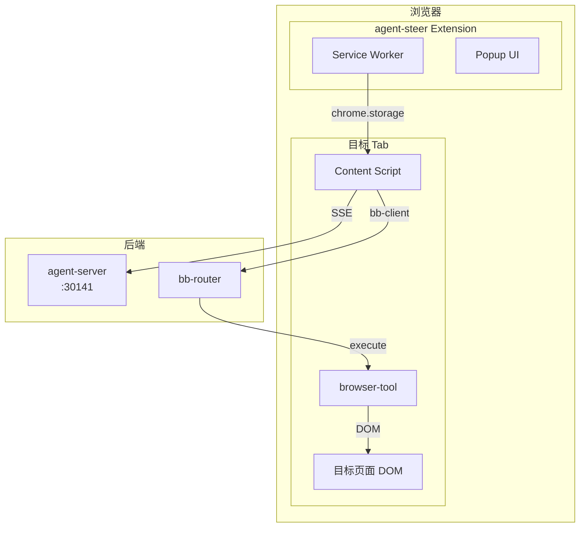

## 一、项目背景

### 1.1 目标

将 `@agegr/agent-ui-chat` 聊天组件集成到 agent-steer Chrome Extension，使 AI Agent 能够：

1. 与用户进行自然语言对话
2. 根据用户操作理解上下文
3. 通过 browser-tool 操作目标页面 DOM

### 1.2 MVP 范围

**本期实现**（基础聊天 + DOM 操作）：

- ✅ ChatWindow 渲染（content script overlay）
- ✅ SSE 流式响应
- ✅ JWT 认证（从 chrome.storage.session）
- ✅ browser-tool 操作（click、fill）
- ❌ bash 命令（后续版本）
- ❌ 高级配置项（后续版本）

### 1.3 现有系统

| 系统 | 位置 | 说明 |
|------|------|------|
| agent-steer (extension) | `neo-agents/extension/` | Chrome Extension(npm name: agent-steer,已有录制功能) |
| neo-frontend | `matrix/neo/frontend/` | Next.js 应用（已有 auth-bridge） |
| agent-server | `neo-agents/agent-server/` | Node.js 服务（端口 30141） |
| agent-ui-chat | `neo-agents/agent-ui-chat/` | React 聊天组件库 |

---

## 二、已明确的约束

### 2.1 已有的功能（无需重新开发）

1. **用户认证** ✅
   - agent-steer 已通过 iframe-bridge 获取 JWT token
   - 机制：`neo-frontend/app/auth-bridge/user-info/page.tsx` → postMessage → chrome.storage.session
   - Token 存储在 `chrome.storage.session`

2. **browser-tool** ✅
   - 已有 `@agegr/browser-tool`（v0.3）
   - 功能：DOM 快照、click、fill 等操作

3. **bb-client / bb-router** ✅
   - WebSocket 协议，连接 agent-server
   - 用于将 browser-tool 操作指令发送到目标页面

### 2.2 技术约束

1. **agent-ui-chat 集成位置**：Content Script（**不是 Popup**）
   - ChatWindow 以 overlay 或 panel 形式渲染在目标页面中
   - 需要处理与 rrweb 录制的共存

2. **MV3 Chrome Extension**
   - 使用 Manifest V3
   - Service Worker 作为占位

---

## 三、集成架构

### 3.1 组件关系图



### 3.2 数据流

1. **消息发送**：用户输入 → ChatWindow → SSE → agent-server
2. **工具调用**：agent-server → bb-router → bb-client → browser-tool → DOM
3. **响应展示**：agent-server → SSE → ChatWindow 渲染

### 3.3 认证流程

```
用户登录 neo-frontend
  → iframe-bridge postMessage 传递 JWT
    → agent-steer Service Worker 存储到 chrome.storage.session
      → Content Script 读取 token
        → 携带 Authorization: Bearer {token} 调用 agent-server
```

---

## 四、功能需求

### 4.1 聊天 UI

| 需求 | 优先级 | 说明 |
|------|--------|------|
| ChatWindow 渲染 | P0 | 在 content script 中渲染 agent-ui-chat 的 ChatWindow 组件 |
| 流式响应 | P0 | 通过 SSE 订阅 agent-server 事件 |
| 消息显示 | P0 | 支持 markdown、代码高亮 |
| 输入框 | P0 | 支持文本输入 |
| 收起/展开 | P1 | 可收起成小按钮、可展开 |
| 状态显示 | P1 | agent 运行状态 |

### 4.2 认证与配置

| 需求 | 优先级 | 说明 |
|------|--------|------|
| JWT 获取 | P0 | 从 chrome.storage.session 读取 token |
| agent-server 地址 | P0 | 从 chrome.storage.local 读取 |
| 认证头传递 | P0 | Authorization: Bearer \{jwt\} |
| 默认地址配置 | P1 | 预设开发/生产环境默认 URL |

### 4.3 工具调用

| 工具 | 优先级 | 说明 |
|------|--------|------|
| browser.click | P0 | 点击元素 |
| browser.fill | P0 | 填写表单 |
| browser.snapshot | P1 | DOM 快照（调试用） |

> **说明**：工具调用通过 bb-client → bb-router → 目标页面 browser-tool 执行

---

## 五、界面设计约束

### 5.1 ChatWindow 渲染位置

- 作为 overlay 悬浮在目标页面上
- 默认显示在右下角
- 可拖拽位置
- 可收起成悬浮小按钮
- 不遮挡目标页面的主要内容

### 5.2 配置界面

在现有的 agent-steer 设置中增加：

| 配置项 | 类型 | 默认值 | 说明 |
|--------|------|--------|------|
| agent-server URL | string | `http://localhost:30141` | agent-server 地址 |

### 5.3 样式约束

- 使用 `--piui-*` CSS 变量（agent-ui-chat 内置）
- 主题跟随系统/用户偏好
- 使用 Shadow DOM 隔离，不影响目标页面样式

---

## 六、技术实现要点

### 6.1 Content Script 中的 React

**问题**：content script 运行在目标页面的 JS 上下文中，可能与目标页面的 React 版本冲突

**解决方案**：

- 使用 Shadow DOM 隔离渲染 ChatWindow
- React 版本由 extension 自己管理，不依赖目标页面

### 6.2 配置管理

| 配置项 | 存储位置 | 读取时机 |
|--------|----------|----------|
| agent-server URL | chrome.storage.local | content script 初始化时 |
| JWT token | chrome.storage.session | 每次请求时 |

### 6.3 bb-client 集成

- 使用现有的 bb-client 连接到 bb-router
- 复用现有的 WebSocket 协议
- 工具调用结果通过 SSE 事件返回

### 6.4 ChatWindow 初始化

- 接收 `apiUrl`、`sessionId` 等参数
- 处理 `onMessageSent`、`onResponse` 等事件
- 支持 markdown 渲染

---

## 七、开放问题（边开发边确认）

| # | 问题 | 状态 | 备注 |
|---|------|------|------|
| 1 | agent-ui-chat authorization header 支持 | 待确认 | MVP 可能需要修改组件 |
| 2 | React 版本兼容性 | 待确认 | 确认是否需要 Shadow DOM |
| 3 | ChatWindow 事件回调 | 待确认 | onAgentEnd 等如何集成 |
| 4 | Session 管理策略 | 待确认 | 多 tab 是否共享 session |
| 5 | 新窗口处理 | 延后 | MVP 不涉及 |

---

## 八、参考文档

| 文档 | 路径 |
|------|------|
| neo-agents 架构 | `neo-agents/AGENTS.md` |
| agent-ui-chat API | `neo-agents/agent-ui-chat/README.md` |
| browser-tool API | `neo-agents/browser-tool/README.md` |
| bb-protocol | `neo-agents/browser-bridge/bb-protocol/` |
| agent-steer 技术设计 | `design/docs/technical/agent-steer/index.md` |
| iframe-bridge 认证 | `design/docs/technical/auth/iframe-bridge.md` |

---

## 九、开发任务拆分

### Phase 1：基础集成（P0）

| 任务 | 说明 |
|------|------|
| 1.1 | 在 agent-steer 中添加 agent-server URL 配置 |
| 1.2 | Content Script 初始化 ChatWindow（Shadow DOM） |
| 1.3 | 实现 JWT token 读取和 Authorization header |
| 1.4 | SSE 连接和消息收发 |
| 1.5 | markdown 渲染验证 |

### Phase 2：工具调用（P0）

| 任务 | 说明 |
|------|------|
| 2.1 | 集成 bb-client |
| 2.2 | 实现 browser.click 工具 |
| 2.3 | 实现 browser.fill 工具 |
| 2.4 | 工具调用结果展示 |

### Phase 3：体验优化（P1）

| 任务 | 说明 |
|------|------|
| 3.1 | ChatWindow 收起/展开 |
| 3.2 | agent 状态显示 |
| 3.3 | 错误处理和重连 |

---

## 十、已完成工作

### ChatLauncher 组件 ✅

在 `agent-ui-chat` 中新增 `ChatLauncher` 组件，提供悬浮按钮 + 可展开的 ChatWindow。

**新增文件**：

- `agent-ui-chat/src/components/ChatLauncher.tsx`

**修改文件**：

- `agent-ui-chat/src/index.ts` - 导出新组件
- `agent-ui-chat/src/styles/chat.css` - 添加样式

**功能特性**：

| 特性 | 说明 |
|------|------|
| 右下角悬浮按钮 | 默认 56px 圆形按钮，带阴影 |
| 点击展开/收起 | 带动画效果 |
| Escape 关闭 | 按 Esc 键收起 |
| 点击外部关闭 | 点击按钮外部区域收起 |
| 可自定义 | 支持自定义图标、尺寸、位置 |
| z-index 最大化 | 确保始终在最顶层 |

**使用示例**：

```tsx
import { ChatLauncher } from "@agegr/agent-ui-chat";

function MyApp() {
  return (
    <ChatLauncher
      session={null}
      newSessionCwd="/path/to/project"
      apiBaseUrl="http://localhost:30141"
      buttonSize={56}
      windowWidth={420}
      windowHeight={600}
    />
  );
}
```

---

## 十一、验收标准

### MVP 验收

- [ ] ChatWindow 可以在任意页面渲染
- [ ] 可以发送消息并收到流式响应
- [ ] 可以执行 click 和 fill 操作
- [ ] 认证 token 正确传递
- [ ] 不影响目标页面的原有功能
