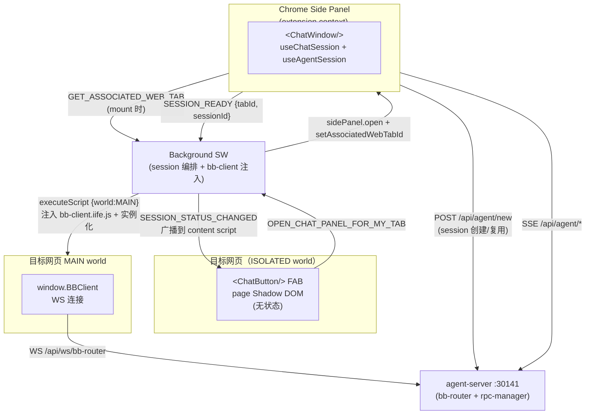

## 一、项目背景

### 1.1 目标

将 `@agegr/agent-ui-chat` 聊天组件集成到 agent-steer Chrome Extension，使 AI Agent 能够：

1. 与用户进行自然语言对话
2. 根据用户操作理解上下文
3. 通过 browser-tool 操作目标页面 DOM

### 1.2 MVP 范围

**本期实现**（基础聊天 + DOM 操作）：

- ✅ `<ChatButton/>` 在 content script overlay（page Shadow DOM，**无状态 FAB**）
- ✅ Chrome **Side Panel** 挂 `<ChatWindow/>`（聊天 UI 在 extension context）
- ✅ `useChatSession` hook 管理 session 生命周期（`chrome.storage.session` 持久化，tabId 维度）
- ✅ SW 编排 session + 注入 bb-client 到 page MAIN world
- ✅ SSE 流式响应
- ✅ browser-tool 操作（click、fill）
- ❌ bash 命令（后续版本）
- ❌ 高级配置项（后续版本）

### 1.3 现有系统

| 系统 | 位置 | 说明 |
|------|------|------|
| agent-steer (extension) | `neo-agents/extension/` | Chrome Extension(npm name: agent-steer,已有录制功能) |
| neo-frontend | `matrix/neo/frontend/` | Next.js 应用（已有 auth-bridge） |
| agent-server | `neo-agents/agent-server/` | Node.js 服务（端口 30141） |
| agent-ui-chat | `neo-agents/agent-ui-chat/` | React 聊天组件库（提供 `ChatButton` / `useChatSession` / `ChatWindow` 等） |

---

## 二、已明确的约束

### 2.1 已有的功能（无需重新开发）

1. **Token 存储在 `chrome.storage.session`**：作为 auth 用途。
   - 注意：chat session **也**用 `chrome.storage.session`，但 key 不同（auth 用 `AUTH_STORAGE_KEYS`，chat 用 `String(tabId)`），两者互不干扰。

2. **browser-tool** ✅
   - 已有 `@agegr/browser-tool`（v0.3）
   - 功能：DOM 快照、click、fill 等操作

3. **bb-client / bb-router** ✅
   - WebSocket 协议，连接 agent-server
   - bb-client IIFE 由 SW 在 `chrome.scripting.executeScript({ world: 'MAIN' })` 时注入到目标页面 MAIN world
   - 用于将 browser-tool 操作指令从 agent-server 发送到目标页面

### 2.2 技术约束

1. **chat UI 集成位置**
   - **`<ChatButton/>`**（FAB，无状态）：每个 tab 通过 ISOLATED content script + page Shadow DOM 注入（**WXT `createShadowRootUi`**）
   - **`<ChatWindow/>`**（聊天 UI）：在 Chrome Side Panel（`chrome-extension://...` extension context）
   - Side Panel 是 Chrome 110+ 的 per-tab 行为，**独立于页面生命周期**（reload / 导航不影响 Side Panel）

2. **MV3 Chrome Extension**
   - Manifest V3
   - Service Worker 作为后台协调（session 编排、bb-client 注入、tab 生命周期）
   - SW 不能持久化模块级状态，所有 session 信息走 `chrome.storage.session`

---

## 三、集成架构

### 3.1 数据流

1. **会话启动**：用户点 ChatButton → content script 发 `OPEN_CHAT_PANEL_FOR_MY_TAB` 给 SW → SW 解析 `sender.tab.id` → 调 `chrome.sidePanel.open({ tabId })` + `setAssociatedWebTabId(tabId)`
2. **Side Panel mount** → 调 `GET_ASSOCIATED_WEB_TAB` → 拿到 tabId → 渲染 `<ChatWindow>`
3. **会话创建**：`useChatSession` 读 `chrome.storage.session[String(tabId)]` → 有则复用（status = connected），无则 `POST /api/agent/new` → 写回 storage → 发 `SESSION_READY { tabId, sessionId }` 给 SW
4. **bb-client 注入**：SW 收到 `SESSION_READY` → 写 storage → `chrome.scripting.executeScript({ world: 'MAIN' })` 注入 `bb-client.iife.js` + 实例化 `new BBClient(sessionId, { serverUrl }).connect("")`
5. **消息发送**：用户在 Side Panel 输入 → `useAgentSession` → SSE → agent-server
6. **工具调用**：agent-server → bb-router → bb-client → browser-tool → DOM
7. **响应展示**：agent-server → SSE → ChatWindow 渲染

### 3.2 关系图



---

## 四、功能需求

### 4.1 chat UI

| 需求 | 优先级 | 说明 |
|------|--------|------|
| ChatButton 渲染 | P0 | content script 在每个 tab 注入 `<ChatButton/>`，page Shadow DOM 隔离 |
| Side Panel ChatWindow 渲染 | P0 | SW `sidePanel.open` 后 mount `<ChatWindow/>` 到 Side Panel DOM |
| 流式响应 | P0 | 通过 SSE 订阅 agent-server 事件 |
| 消息显示 | P0 | 支持 markdown、代码高亮 |
| 输入框 | P0 | 支持文本输入 |
| 状态显示 | P1 | 4 态 status: `none` / `connecting` / `connected` / `error`，反映在 ChatButton FAB 图标 |
| 跨页面导航存活 | P0 | Side Panel 不受页面 reload / 链接跳转 / SPA pushState 影响；session 由 `chrome.storage.session` 持久化 |
| 多 tab 隔离 | P0 | 每个 Chrome tab 独立 session（**1 tab : 1 session : 1 bb-client**） |

### 4.2 工具调用

| 工具 | 优先级 | 说明 |
|------|--------|------|
| browser.click | P0 | 点击元素 |
| browser.fill | P0 | 填写表单 |
| browser.snapshot | P1 | DOM 快照（调试用） |

> **说明**：工具调用通过 bb-client → bb-router → 目标页面 browser-tool 执行。

---

## 五、界面设计约束

### 5.1 ChatButton 渲染位置（page）

- 作为 overlay 悬浮在目标页面右下角
- page Shadow DOM 隔离，不被目标页面 CSS 污染
- 默认 48-56px 圆形按钮
- 状态图标反映 session status（4 态）
- 不抢页面焦点、不干扰页面 modal

### 5.2 ChatWindow 渲染位置（Side Panel）

- Chrome Side Panel（独立 extension context `chrome-extension://...`）
- 不受目标页面 CSS / JS / modal / focus-trap 影响
- 跨页面导航存活（用户点链接 / F5 / SPA pushState 都不影响）
- 用户关闭 Side Panel 后再打开：`useChatSession` 从 storage 复用 session
- 每个 Chrome tab 独立聊天（Side Panel 通过 `key={tabId ?? 'no-tab'}` 切 tab 时重 mount）

### 5.3 配置界面

在现有的 agent-steer 设置中增加：

| 配置项 | 类型 | 默认值 | 说明 |
|--------|------|--------|------|
| agent-server URL | string | `http://localhost:30141` | agent-server 地址 |

### 5.4 样式约束

- 使用 `--piui-*` CSS 变量（agent-ui-chat 内置）
- 主题跟随系统/用户偏好
- ChatButton 在 page Shadow DOM 内
- ChatWindow 在 Side Panel 普通 DOM（extension context，无 Shadow DOM 必要）

---

## 六、技术实现要点

### 6.1 SW session 编排

**新增的 SW 职责**（这是 ChatLauncher 时代没有的）：

| 职责 | 实现 |
|------|------|
| 接收 `OPEN_CHAT_PANEL_FOR_MY_TAB` | 解析 `sender.tab.id`（content script 拿不到自己的 tabId，可靠拿法），调 `chrome.sidePanel.open` + `setAssociatedWebTabId` |
| 接收 `GET_ASSOCIATED_WEB_TAB` | Side Panel mount 时问 SW 当前关联的真实 tabId（解决 Side Panel 自身的 tabId 坑） |
| 接收 `SESSION_READY` | 持久化 sessionId + 注入 bb-client + 广播 `SESSION_STATUS_CHANGED` |
| `chrome.tabs.onActivated` | 自动更新关联 web tabId（Side Panel 永远不会关联 chrome-extension:// 自己） |
| `chrome.tabs.onRemoved` | 清理 `chrome.storage.session[String(tabId)]` |
| `chrome.tabs.onUpdated({ status: 'complete' })` | 已有 session 则重新注入 bb-client（page MAIN world 被 nav 销毁） |

**为什么用 `OPEN_CHAT_PANEL_FOR_MY_TAB` 而不是让 content script 自己查 tabId**：

content script 调 `chrome.tabs.query({ active: true, currentWindow: true })` 时，**如果用户已经 click 进入 Side Panel，会返回 Side Panel 自己的 tabId** —— 因为 `currentWindow` 把 Side Panel UI 视为活跃窗口。这会让 session 创建在 Side Panel 上而不是用户的网页 tab，是关键的坑。

### 6.2 `useChatSession` hook

**位置**：Side Panel（**不是** content script，因为需要 `chrome.storage.session`，且 ChatButton 不持有 session）

**职责**：

- mount 时读 `chrome.storage.session[String(tabId)]`：有则复用（`status = connected`）；无则 `POST /api/agent/new` 创建
- `onSessionReady(sessionId, tabId)` 回调：Side Panel 用此通知 SW
- StrictMode 安全（双重挂载只发一次 POST）
- `tabId` 是 **reactive** 输入：tabId 变化时清状态、重跑 lookup/创建

**实现文件**：`agent-ui-chat/src/hooks/useChatSession.ts`

### 6.3 Session 持久化（`chrome.storage.session`）

| key | value | 用途 |
|------|------|------|
| `String(tabId)` | `{ sessionId, createdAt }` | Side Panel 重挂时复用 sessionId |
| `__associatedWebTab__` | `{ tabId }` | SW 跟踪"用户上次激活的真实网页 tab"（Side Panel 自身绝不能关联到这里） |

**特点**：

- 浏览器重启会清空（设计取舍：旧的 pi session 文件在 agent-server 那边兜底，可通过 `/api/sessions` 列出）
- tab 关闭由 SW `tabs.onRemoved` 自动清理
- key 必须用 `String(tabId)`（chrome.storage API 要求 string key）

### 6.4 bb-client 注入（SW 两阶段）

**不是** content script 自启，而是 SW `executeScript({ world: 'MAIN' })` 两步执行：

```typescript
// extension/entrypoints/background.ts

// Step 1: 加载 bb-client.iife.js（定义 window.BBClient）
await chrome.scripting.executeScript({
  target: { tabId },
  files: ['/bb-client.iife.js'],
  world: 'MAIN',
  injectImmediately: true,
});

// Step 2: 实例化 + connect
await chrome.scripting.executeScript({
  target: { tabId },
  world: 'MAIN',
  func: (sid, serverUrl) => {
    const w = window;
    if (typeof w.BBClient !== 'function') return;
    if (w.__neoBBClientInstance__?.sessionId === sid) return; // cache hit
    const c = new w.BBClient(sid, { serverUrl });
    c.connect('');
    w.__neoBBClientInstance__ = { sessionId: sid, client: c };
  },
  args: [sessionId, 'ws://localhost:30141/api/ws/bb-router'],
});
```

**为什么分两步 + 加缓存**：

- IIFE 必须先于实例化执行（否则 `window.BBClient` 未定义）
- `__neoBBClientInstance__` 缓存避免 page 导航后 SW `onUpdated` 重新注入时重复实例化
- `tabs.onUpdated({ status: 'complete' })` 时如有 session 就重注，保持 bb-router 1:1:1 不变量

---

## 七、相关文档

| 文档 | 路径 |
|------|------|
| neo-agents 架构 | `neo-agents/AGENTS.md` |
| agent-ui-chat API | `neo-agents/agent-ui-chat/README.md` |
| browser-tool API | `neo-agents/browser-tool/README.md` |
| bb-protocol | `neo-agents/browser-bridge/bb-protocol/` |
| agent-steer 技术设计 | `design/docs/technical/agent-steer/index.md` |
| iframe-bridge 认证 | `design/docs/technical/auth/iframe-bridge.md` |
| Browser Bridge 详细设计 | `design/docs/technical/agent-steer/browser-bridge.md` |
| BB Protocol 详细 | `design/docs/technical/agent-steer/browser-bridge-protocol.md` |


