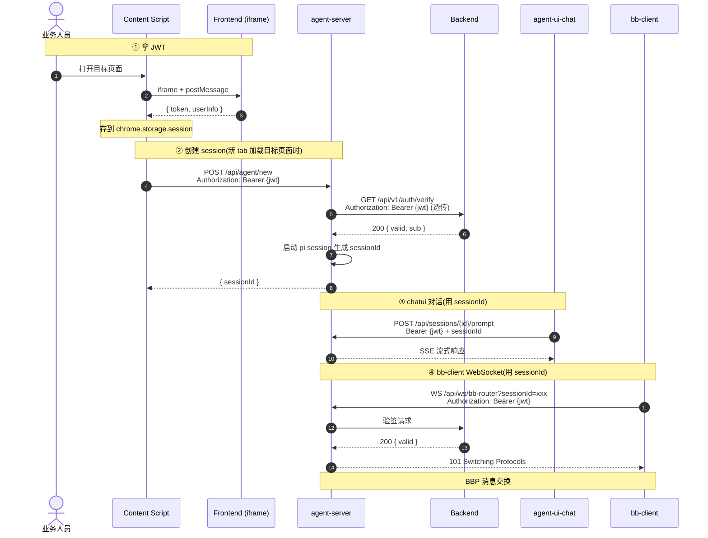

# Agent Server 认证与 Session 设计

> agent-server 怎么跟调用方协作,完成"拿 token → backend 验证 → 拿到 sessionId → 用于对话/WS"的完整交互。

---

## 1. 完整交互



---

## 2. 关键节点

**① CS 拿 JWT**:通过 iframe-bridge 拿(详见 [iframe-bridge](../auth/iframe-bridge))。CS 不自己登录。

**② 创建 session**:**sessionId 是 tab 维度的** —— 每次用户**新建 tab 加载目标页面**,CS 主动调 `POST /api/agent/new`(带 `Authorization: Bearer {jwt}`)创建一个独立 session。tab 关闭后 session 自然失效。一个用户开 N 个 tab → N 个独立 sessionId,互不串,各走各的拦截/对话/WS。

agent-server **不**自己验签,而是**透传给 backend**(`GET /api/v1/auth/verify`)做验证。验证通过后启动 pi session,返回 `sessionId`(UUID v7,本地标识,无业务含义)。

**③ chatui 对话**:用 `sessionId` 调 `POST /api/sessions/{id}/prompt`,SSE 流式响应。每次请求仍带 JWT,agent-server 仍透传给 backend 验证(避免 stale session)。

**④ bb-client WebSocket**:用 `sessionId` 调 `WS /api/ws/bb-router?sessionId=xxx`。握手时 agent-server 调 backend 验证 JWT,通过后注册到 bbRouter,后续 BBP 消息交换(详见 [browser-bridge-protocol](./browser-bridge-protocol))。

---

## 3. 配置

```bash
# agent-server/.env
BACKEND_URL="http://localhost:8000"  # 验证请求发到哪
```

agent-server **不**需要 `JWT_SECRET_KEY` —— 验证逻辑全交给 backend。

---

## 🔗 相关文档

- [index](./index) — 组件总览
- [Browser Bridge 消息协议](./browser-bridge-protocol) — BBP 消息定义
- [Browser Bridge 详细设计](./browser-bridge) — WebSocket 协议
- [iframe Bridge 认证桥接](../auth/iframe-bridge) — CS 拿 JWT 的细节
