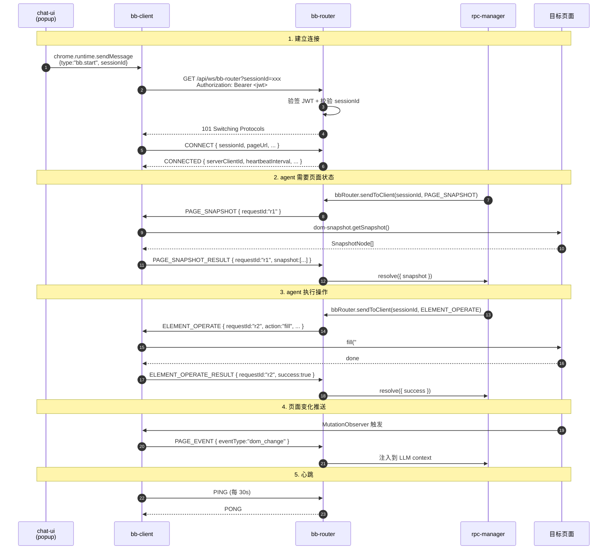
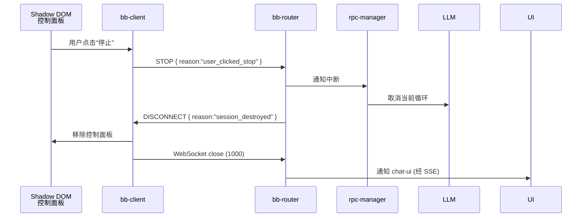

# Browser Bridge 消息协议

## 1. 概述

Browser Bridge 协议（BBP）是 bb-client（运行在浏览器 content script）和 agent-server 内置的 **bb-router** 模块之间的 WebSocket 通信协议。**agent-server 的业务逻辑通过进程内调用 bb-router 与 bb-client 通信，不再走 WebSocket**。

> 与 v1 协议相比，v2 移除了 `clientType: "agent-server"` 的概念，移除了对独立 bb-server 进程的引用，新增了 JWT 握手和 Shadow DOM 控制面板的辅助消息。

### 1.1 设计原则

1. **requestId 匹配响应**：每个请求都有唯一 ID，响应中包含相同的 requestId，便于追踪
2. **sessionId 强绑定**：sessionId 是唯一关联键，1 session = 1 bb-client
3. **payload 解耦**：具体消息内容放在 payload 中，便于扩展新消息类型
4. **timestamp 可追溯**：每条消息都有时间戳，便于调试和日志分析
5. **向后兼容**：`version` 字段支持协议升级
6. **类型单一**：只有一个客户端类型（`browser`），不再区分 bb-client 和 agent-server

### 1.2 协议参与者

| 角色 | 位置 | 通信方式 |
|------|------|----------|
| **bb-client** | 浏览器 content script | WebSocket 客户端 |
| **bb-router** | agent-server 内部模块 | WebSocket 服务端 + 进程内 API |
| **rpc-manager** | agent-server 内部模块 | 进程内调用 bb-router |

---

## 2. 基础结构

### 2.1 消息格式

```typescript
interface BaseMessage {
  version: string;        // 协议版本，如 "2.0"
  type: MessageType;      // 消息类型
  requestId: string;      // 请求唯一 ID，用于匹配响应（事件类消息可省略）
  timestamp: number;      // Unix 时间戳（毫秒）
  sessionId: string;      // 会话 ID，关联 agent-session
  payload: unknown;       // 具体 payload（类型由 type 决定）
}
```

### 2.2 WebSocket 握手

bb-client 连接时，**JWT 放在 HTTP Authorization 头，不在 URL query**（避免 access log 泄漏）：

```
GET /api/ws/bb-router?sessionId=sess-abc123 HTTP/1.1
Host: localhost:30141
Upgrade: websocket
Connection: Upgrade
Authorization: Bearer <jwt>
Sec-WebSocket-Version: 13
```

agent-server 在升级前完成：

1. JWT 验签（共享 `JWT_SECRET_KEY`）
2. exp 检查
3. sessionId 归属校验（`sub` user_id 必须匹配）
4. 全部通过才返回 `101 Switching Protocols`；任一失败返回 `401`

> **握手后，连接期间不再校验 JWT**（信任已建立的 session）。如需踢人，agent-server 主动关闭 WebSocket（code 1008）。

### 2.3 协议版本协商

CONNECT 消息的 `version` 字段必须匹配 bb-router 当前支持的版本：

```json
{
  "type": "CONNECT",
  "payload": { "version": "2.0", ... }
}
```

bb-router 检查版本号，不匹配时返回 `ERROR` 并关闭连接（code 1003）。

---

## 3. 消息类型总览

```typescript
type MessageType =
  // ===== 连接管理 =====
  | "CONNECT"              // bb-client → bb-router, 握手
  | "CONNECTED"            // bb-router → bb-client, 握手响应
  | "DISCONNECT"           // 任一方主动断开（含 reason）
  | "ERROR"                // 错误响应

  // ===== 页面操作 (bb-router → bb-client) =====
  | "PAGE_SNAPSHOT"                 // 请求 DOM 快照
  | "PAGE_SNAPSHOT_RESULT"          // 快照结果
  | "ELEMENT_QUERY"                 // 查询匹配元素
  | "ELEMENT_QUERY_RESULT"          // 查询结果
  | "ELEMENT_OPERATE"               // 操作元素
  | "ELEMENT_OPERATE_RESULT"        // 操作结果

  // ===== 事件推送 (bb-client → bb-router) =====
  | "PAGE_EVENT"            // 页面变化事件

  // ===== UI 控制 (bb-client → bb-router) =====
  | "STOP"                  // 用户通过控制面板点"停止"

  // ===== 心跳 =====
  | "PING"
  | "PONG";
```

> **方向约定**：所有消息都是双向的，但默认方向标注在分类里。请求类消息有 `_RESULT` 后缀的响应，通过 `requestId` 匹配。

---

## 4. 连接消息

### 4.1 CONNECT

bb-client 握手成功后立即发送。

```typescript
interface ConnectPayload {
  version: string;           // 协议版本，bb-client 声称支持的版本
  clientId: string;          // bb-client 生成的唯一 ID（用于日志）
  pageUrl: string;           // 当前页面 URL（仅日志用，不参与路由）
  pageTitle?: string;        // 当前页面 title
  userAgent: string;         // 浏览器 user agent
  domSnapshotVersion: string; // dom-snapshot 包版本
}

interface ConnectMessage extends BaseMessage {
  type: "CONNECT";
  payload: ConnectPayload;
}
```

**示例**：

```json
{
  "version": "2.0",
  "type": "CONNECT",
  "requestId": "req-001",
  "timestamp": 1750684800000,
  "sessionId": "sess-abc123",
  "payload": {
    "version": "2.0",
    "clientId": "bb-client-001",
    "pageUrl": "https://example.com/login",
    "pageTitle": "Login Page",
    "userAgent": "Mozilla/5.0 (Macintosh; Intel Mac OS X 10_15_7) AppleWebKit/537.36",
    "domSnapshotVersion": "1.2.0"
  }
}
```

### 4.2 CONNECTED

bb-router 确认 session 已建立。

```typescript
interface ConnectedPayload {
  serverClientId: string;       // bb-router 分配的 ID
  heartbeatInterval: number;    // 心跳间隔（毫秒）
  requestTimeout: number;       // 请求超时（毫秒）
  sessionIdleTimeout: number;   // session 闲置超时（毫秒）
  serverTime: number;           // bb-router 服务器时间（用于时钟同步）
}

interface ConnectedMessage extends BaseMessage {
  type: "CONNECTED";
  payload: ConnectedPayload;
}
```

**示例**：

```json
{
  "version": "2.0",
  "type": "CONNECTED",
  "requestId": "req-001",
  "timestamp": 1750684800000,
  "sessionId": "sess-abc123",
  "payload": {
    "serverClientId": "srv-xyz789",
    "heartbeatInterval": 30000,
    "requestTimeout": 30000,
    "sessionIdleTimeout": 1800000,
    "serverTime": 1750684800000
  }
}
```

### 4.3 DISCONNECT

任一方主动断开时发送，reason 说明原因。

```typescript
type DisconnectReason =
  | "user_stop"               // 用户主动停止（控制面板按钮）
  | "tab_closing"             // 浏览器 tab 关闭
  | "session_destroyed"       // session 被销毁
  | "replacing"               // 新连接替换旧连接
  | "shutdown"                // 服务关闭
  | "error";                  // 异常断开

interface DisconnectPayload {
  reason: DisconnectReason;
  message?: string;           // 可选说明
}

interface DisconnectMessage extends BaseMessage {
  type: "DISCONNECT";
  payload: DisconnectPayload;
}
```

---

## 5. 页面快照消息

### 5.1 PAGE_SNAPSHOT

获取当前页面 DOM 快照。**bb-router → bb-client**。

```typescript
interface PageSnapshotPayload {
  includeStyles?: boolean;     // 是否包含 computed style（默认 false）
  maxDepth?: number;           // 树最大深度（默认 10）
  filter?: {
    role?: string[];           // 只返回指定 ARIA role
    visibleOnly?: boolean;     // 只返回可见元素
    interactiveOnly?: boolean; // 只返回可交互元素
  };
}

interface PageSnapshotMessage extends BaseMessage {
  type: "PAGE_SNAPSHOT";
  payload: PageSnapshotPayload;
}
```

### 5.2 PAGE_SNAPSHOT_RESULT

bb-client 返回快照。

```typescript
interface PageSnapshotResultPayload {
  success: boolean;
  snapshot?: SnapshotNode[];   // dom-snapshot 的 SnapshotNode[]
  stats?: {
    totalNodes: number;        // 总节点数
    truncated: boolean;        // 是否被截断
    durationMs: number;        // 耗时
  };
  error?: ErrorDetail;
}

interface PageSnapshotResultMessage extends BaseMessage {
  type: "PAGE_SNAPSHOT_RESULT";
  payload: PageSnapshotResultPayload;
}
```

**SnapshotNode**（来自 `@agegr/dom-snapshot`）：

```typescript
interface SnapshotNode {
  id: string;                  // 节点 ID（DFS 顺序）
  tagName: string;             // 标签名（lowercase）
  role?: string;               // ARIA role
  name?: string;               // accessible name
  attributes?: Record<string, string>;
  text?: string;               // 文本内容（截断到 200 字符）
  children?: string[];         // 子节点 ID 列表
  rect?: { x: number; y: number; width: number; height: number };
  isVisible?: boolean;
  isInteractive?: boolean;
}
```

---

## 6. 元素查询消息

### 6.1 ELEMENT_QUERY

查询匹配的元素。**bb-router → bb-client**。

```typescript
interface ElementQueryPayload {
  selector: string;            // CSS 选择器或 XPath
  selectorType?: "css" | "xpath";  // 默认 "css"
  options?: ElementQueryOptions;
}

interface ElementQueryOptions {
  attributes?: string[];       // 要返回的属性列表
  allMatches?: boolean;        // 是否返回所有匹配（默认 false = 第一个）
  visibleOnly?: boolean;       // 只返回可见元素
  interactiveOnly?: boolean;   // 只返回可交互元素
}

interface ElementQueryMessage extends BaseMessage {
  type: "ELEMENT_QUERY";
  payload: ElementQueryPayload;
}
```

### 6.2 ELEMENT_QUERY_RESULT

```typescript
interface ElementInfo {
  id: string;                  // 元素 ID（与 SnapshotNode.id 一致）
  tagName: string;
  text?: string;
  attributes: Record<string, string>;
  rect?: { x: number; y: number; width: number; height: number };
  role?: string;
  isVisible?: boolean;
  isInteractive?: boolean;
}

interface ElementQueryResultPayload {
  success: boolean;
  elements?: ElementInfo[];
  error?: ErrorDetail;
}

interface ElementQueryResultMessage extends BaseMessage {
  type: "ELEMENT_QUERY_RESULT";
  payload: ElementQueryResultPayload;
}
```

---

## 7. 元素操作消息

### 7.1 ELEMENT_OPERATE

操作元素。**bb-router → bb-client**。

```typescript
type ElementAction =
  | "click"
  | "dblclick"
  | "rightClick"
  | "hover"
  | "fill"
  | "select"
  | "check"
  | "uncheck"
  | "scroll"
  | "scrollIntoView"
  | "focus"
  | "blur"
  | "clear"
  | "press"                    // 按键（如 "Enter", "Tab", "Escape"）
  | "dragAndDrop";             // 拖拽

interface ElementOperatePayload {
  // 二选一定位元素
  elementId?: string;          // 来自 SnapshotNode.id
  selector?: string;           // 或 CSS/XPath
  selectorType?: "css" | "xpath";

  action: ElementAction;
  actionParams?: Record<string, unknown>;  // 操作参数
  timeoutMs?: number;          // 等待元素可交互的超时（默认 5000）
}

interface ElementOperateMessage extends BaseMessage {
  type: "ELEMENT_OPERATE";
  payload: ElementOperatePayload;
}
```

**actionParams 示例**：

```typescript
// fill
{ value: "hello" }

// select
{ value: "CN" }                // option value
// 或
{ label: "China" }             // option label
// 或
{ index: 2 }                   // option 索引

// press
{ key: "Enter" }

// scroll
{ x: 0, y: 200 }               // 相对当前位置

// dragAndDrop
{ sourceSelector: "#item1", targetSelector: "#dropzone" }
// 或
{ sourceElementId: "n5", targetElementId: "n8" }
```

### 7.2 ELEMENT_OPERATE_RESULT

```typescript
interface ElementOperateResultPayload {
  success: boolean;
  action: ElementAction;
  result?: {
    newValue?: string;                // fill 后输入框的新值
    selectedOptions?: string[];       // select 后选中的 option
    coordinates?: { x: number; y: number };  // click 实际点击的坐标
    pressedKey?: string;              // press 实际按下的键
  };
  durationMs?: number;                // 操作耗时
  error?: ErrorDetail & { recoverable?: boolean };  // recoverable 决定是否自动重试
}

interface ElementOperateResultMessage extends BaseMessage {
  type: "ELEMENT_OPERATE_RESULT";
  payload: ElementOperateResultPayload;
}
```

---

## 8. 页面事件消息

### 8.1 PAGE_EVENT

bb-client 主动推送的页面变化事件。**bb-client → bb-router**。

```typescript
type PageEventType =
  | "url_change"              // URL 变化（pushState/replace/hashchange）
  | "title_change"            // document.title 变化
  | "dom_change"              // DOM 变化（MutationObserver 触发）
  | "navigation"              // 完整页面导航（beforeunload/load）
  | "ready"                   // 页面 DOMContentLoaded
  | "visibility_change"       // tab 切到后台/前台
  | "close";                  // tab 即将关闭

interface PageEventPayload {
  clientId: string;           // 发送方 bb-client ID
  eventType: PageEventType;
  data?: {
    url?: string;             // url_change/navigation 时
    title?: string;           // title_change 时
    timestamp: number;        // 事件发生时间
    hidden?: boolean;         // visibility_change 时
  };
}

interface PageEventMessage extends BaseMessage {
  type: "PAGE_EVENT";
  payload: PageEventPayload;
}
```

> **背压策略**：`dom_change` 事件频率高，需在 bb-client 端做节流（默认 100ms）+ 防抖（默认 500ms）；超过节流阈值的连续变化合并为一条事件。

---

## 9. UI 控制消息

### 9.1 STOP

用户通过 Shadow DOM 控制面板的"停止 agent"按钮触发。**bb-client → bb-router**。

```typescript
interface StopPayload {
  reason: "user_clicked_stop" | "panel_closing" | "error_threshold_exceeded";
  context?: {
    lastOpType?: MessageType;     // 触发停止的最后一个操作类型
    lastError?: ErrorDetail;      // 如果是 error_threshold_exceeded
  };
}

interface StopMessage extends BaseMessage {
  type: "STOP";
  payload: StopPayload;
}
```

bb-router 收到后立即：

1. 取消 pending 的请求
2. 通知 rpc-manager 中断当前 LLM 循环
3. 关闭 session（WebSocket code 1000）
4. 通知 chat-ui

---

## 10. 错误消息

### 10.1 ERROR

任意错误场景都可以发 ERROR，通常带 `originalRequestId` 关联到出错的请求。

```typescript
interface ErrorDetail {
  code: ErrorCode;             // 见 10.2 错误码表
  message: string;             // 人类可读
  details?: Record<string, unknown>;  // 额外上下文（如堆栈、selector）
}

interface ErrorMessage extends BaseMessage {
  type: "ERROR";
  payload: ErrorDetail & { originalRequestId?: string };
}
```

### 10.2 错误码

| 错误码 | 类别 | 触发场景 | 处理策略 |
|--------|------|----------|----------|
| `INVALID_VERSION` | 协议 | 协议版本不匹配 | 关闭连接，提示升级 bb-client |
| `INVALID_MESSAGE` | 协议 | 消息格式错误 | 关闭连接（code 1003） |
| `WS_UNAUTHORIZED` | 握手 | JWT 验签失败 / 过期 | 401，不升级 WebSocket；chat-ui 触发重新登录 |
| `WS_SESSION_NOT_FOUND` | 握手 | sessionId 不存在 | 401；chat-ui 重新创建 session |
| `WS_SESSION_FORBIDDEN` | 握手 | sessionId 不属于 JWT sub | 403；权限错误 |
| `WS_RATE_LIMITED` | 握手 | 单用户 session 超限 | 429；提示用户关闭多余 session |
| `SESSION_NOT_ACTIVE` | 路由 | session 已销毁 | 重连或结束 |
| `CLIENT_NOT_FOUND` | 路由 | 目标客户端已离线 | 等待重连 / 通知用户 |
| `ELEMENT_NOT_FOUND` | 操作 | 选择器无匹配 | 通知 LLM 重新定位 |
| `ELEMENT_NOT_VISIBLE` | 操作 | 元素不可见 | 通知 LLM 滚动到可见 |
| `ELEMENT_NOT_INTERACTIVE` | 操作 | 元素被禁用 | 通知 LLM 等待 |
| `ELEMENT_AMBIGUOUS` | 操作 | 多元素匹配但 allMatches=false | 通知 LLM 缩小范围 |
| `OPERATION_FAILED` | 操作 | 操作执行异常 | 检查 `recoverable` 决定重试 |
| `OPERATION_TIMEOUT` | 操作 | 操作超时 | 重试一次 |
| `REQUEST_TIMEOUT` | 通信 | 请求 30s 未响应 | 重试（指数退避）|
| `TARGET_CLIENT_OFFLINE` | 通信 | 目标客户端已离线 | 等待重连 / 通知用户 |
| `MAX_SESSIONS_EXCEEDED` | 系统 | 单用户 > 5 sessions | 提示用户关闭多余 session |
| `INTERNAL_ERROR` | 系统 | 内部异常 | 关闭 session，记录日志 |

---

## 11. 心跳消息

### 11.1 PING / PONG

```typescript
// bb-client → bb-router
interface PingMessage extends BaseMessage {
  type: "PING";
  payload: {};
}

// bb-router → bb-client
interface PongMessage extends BaseMessage {
  type: "PONG";
  payload: {};
}
```

**规则**：

- bb-client 每隔 `heartbeatInterval`（CONNECTED 响应中的值，默认 30s）发送 PING
- bb-router 收到 PING 立即返回 PONG
- bb-router 检测到 `heartbeatTimeout`（默认 60s）未收到任何消息 → 判定离线
- bb-client 检测到 `heartbeatTimeout` 未收到 PONG → 主动断开，进入重连

---

## 12. 完整交互流程

### 12.1 正常流程



### 12.2 用户停止流程



### 12.3 401 / 重新登录流程


---

## 13. TypeScript 类型定义

完整类型定义（建议放到 `@agegr/bb-protocol` 包共享给 agent-server 和 agent-steer）：

```typescript
// types/bb-protocol.ts

// ========== 基础 ==========

export const BBP_VERSION = "2.0";

export interface BaseMessage {
  version: string;
  type: MessageType;
  requestId: string;
  timestamp: number;
  sessionId: string;
  payload: unknown;
}

export type MessageType =
  | "CONNECT"
  | "CONNECTED"
  | "DISCONNECT"
  | "ERROR"
  | "PAGE_SNAPSHOT"
  | "PAGE_SNAPSHOT_RESULT"
  | "ELEMENT_QUERY"
  | "ELEMENT_QUERY_RESULT"
  | "ELEMENT_OPERATE"
  | "ELEMENT_OPERATE_RESULT"
  | "PAGE_EVENT"
  | "STOP"
  | "PING"
  | "PONG";

// ========== 连接 ==========

export interface ConnectPayload {
  version: string;
  clientId: string;
  pageUrl: string;
  pageTitle?: string;
  userAgent: string;
  domSnapshotVersion: string;
}

export interface ConnectMessage extends BaseMessage {
  type: "CONNECT";
  payload: ConnectPayload;
}

export interface ConnectedPayload {
  serverClientId: string;
  heartbeatInterval: number;
  requestTimeout: number;
  sessionIdleTimeout: number;
  serverTime: number;
}

export interface ConnectedMessage extends BaseMessage {
  type: "CONNECTED";
  payload: ConnectedPayload;
}

export type DisconnectReason =
  | "user_stop"
  | "tab_closing"
  | "session_destroyed"
  | "replacing"
  | "shutdown"
  | "error";

export interface DisconnectPayload {
  reason: DisconnectReason;
  message?: string;
}

export interface DisconnectMessage extends BaseMessage {
  type: "DISCONNECT";
  payload: DisconnectPayload;
}

// ========== 页面快照 ==========

export interface SnapshotFilter {
  role?: string[];
  visibleOnly?: boolean;
  interactiveOnly?: boolean;
}

export interface PageSnapshotPayload {
  includeStyles?: boolean;
  maxDepth?: number;
  filter?: SnapshotFilter;
}

export interface PageSnapshotMessage extends BaseMessage {
  type: "PAGE_SNAPSHOT";
  payload: PageSnapshotPayload;
}

export interface SnapshotNode {
  id: string;
  tagName: string;
  role?: string;
  name?: string;
  attributes?: Record<string, string>;
  text?: string;
  children?: string[];
  rect?: { x: number; y: number; width: number; height: number };
  isVisible?: boolean;
  isInteractive?: boolean;
}

export interface PageSnapshotStats {
  totalNodes: number;
  truncated: boolean;
  durationMs: number;
}

export interface PageSnapshotResultPayload {
  success: boolean;
  snapshot?: SnapshotNode[];
  stats?: PageSnapshotStats;
  error?: ErrorDetail;
}

export interface PageSnapshotResultMessage extends BaseMessage {
  type: "PAGE_SNAPSHOT_RESULT";
  payload: PageSnapshotResultPayload;
}

// ========== 元素查询 ==========

export interface ElementQueryOptions {
  attributes?: string[];
  allMatches?: boolean;
  visibleOnly?: boolean;
  interactiveOnly?: boolean;
}

export interface ElementQueryPayload {
  selector: string;
  selectorType?: "css" | "xpath";
  options?: ElementQueryOptions;
}

export interface ElementQueryMessage extends BaseMessage {
  type: "ELEMENT_QUERY";
  payload: ElementQueryPayload;
}

export interface ElementInfo {
  id: string;
  tagName: string;
  text?: string;
  attributes: Record<string, string>;
  rect?: { x: number; y: number; width: number; height: number };
  role?: string;
  isVisible?: boolean;
  isInteractive?: boolean;
}

export interface ElementQueryResultPayload {
  success: boolean;
  elements?: ElementInfo[];
  error?: ErrorDetail;
}

export interface ElementQueryResultMessage extends BaseMessage {
  type: "ELEMENT_QUERY_RESULT";
  payload: ElementQueryResultPayload;
}

// ========== 元素操作 ==========

export type ElementAction =
  | "click"
  | "dblclick"
  | "rightClick"
  | "hover"
  | "fill"
  | "select"
  | "check"
  | "uncheck"
  | "scroll"
  | "scrollIntoView"
  | "focus"
  | "blur"
  | "clear"
  | "press"
  | "dragAndDrop";

export interface ElementOperatePayload {
  elementId?: string;
  selector?: string;
  selectorType?: "css" | "xpath";
  action: ElementAction;
  actionParams?: Record<string, unknown>;
  timeoutMs?: number;
}

export interface ElementOperateMessage extends BaseMessage {
  type: "ELEMENT_OPERATE";
  payload: ElementOperatePayload;
}

export interface ElementOperateResult {
  newValue?: string;
  selectedOptions?: string[];
  coordinates?: { x: number; y: number };
  pressedKey?: string;
}

export interface ElementOperateResultPayload {
  success: boolean;
  action: ElementAction;
  result?: ElementOperateResult;
  durationMs?: number;
  error?: (ErrorDetail & { recoverable?: boolean }) | undefined;
}

export interface ElementOperateResultMessage extends BaseMessage {
  type: "ELEMENT_OPERATE_RESULT";
  payload: ElementOperateResultPayload;
}

// ========== 页面事件 ==========

export type PageEventType =
  | "url_change"
  | "title_change"
  | "dom_change"
  | "navigation"
  | "ready"
  | "visibility_change"
  | "close";

export interface PageEventPayload {
  clientId: string;
  eventType: PageEventType;
  data?: {
    url?: string;
    title?: string;
    timestamp: number;
    hidden?: boolean;
  };
}

export interface PageEventMessage extends BaseMessage {
  type: "PAGE_EVENT";
  payload: PageEventPayload;
}

// ========== UI 控制 ==========

export interface StopPayload {
  reason: "user_clicked_stop" | "panel_closing" | "error_threshold_exceeded";
  context?: {
    lastOpType?: MessageType;
    lastError?: ErrorDetail;
  };
}

export interface StopMessage extends BaseMessage {
  type: "STOP";
  payload: StopPayload;
}

// ========== 错误 ==========

export const ErrorCodes = {
  // 协议层
  INVALID_VERSION: "INVALID_VERSION",
  INVALID_MESSAGE: "INVALID_MESSAGE",
  // 握手
  WS_UNAUTHORIZED: "WS_UNAUTHORIZED",
  WS_SESSION_NOT_FOUND: "WS_SESSION_NOT_FOUND",
  WS_SESSION_FORBIDDEN: "WS_SESSION_FORBIDDEN",
  WS_RATE_LIMITED: "WS_RATE_LIMITED",
  // 路由
  SESSION_NOT_ACTIVE: "SESSION_NOT_ACTIVE",
  CLIENT_NOT_FOUND: "CLIENT_NOT_FOUND",
  // 操作
  ELEMENT_NOT_FOUND: "ELEMENT_NOT_FOUND",
  ELEMENT_NOT_VISIBLE: "ELEMENT_NOT_VISIBLE",
  ELEMENT_NOT_INTERACTIVE: "ELEMENT_NOT_INTERACTIVE",
  ELEMENT_AMBIGUOUS: "ELEMENT_AMBIGUOUS",
  OPERATION_FAILED: "OPERATION_FAILED",
  OPERATION_TIMEOUT: "OPERATION_TIMEOUT",
  // 通信
  REQUEST_TIMEOUT: "REQUEST_TIMEOUT",
  TARGET_CLIENT_OFFLINE: "TARGET_CLIENT_OFFLINE",
  // 系统
  MAX_SESSIONS_EXCEEDED: "MAX_SESSIONS_EXCEEDED",
  INTERNAL_ERROR: "INTERNAL_ERROR",
} as const;

export type ErrorCode = typeof ErrorCodes[keyof typeof ErrorCodes];

export interface ErrorDetail {
  code: ErrorCode;
  message: string;
  details?: Record<string, unknown>;
}

export interface ErrorMessage extends BaseMessage {
  type: "ERROR";
  payload: ErrorDetail & { originalRequestId?: string };
}

// ========== 心跳 ==========

export interface PingMessage extends BaseMessage {
  type: "PING";
  payload: Record<string, never>;
}

export interface PongMessage extends BaseMessage {
  type: "PONG";
  payload: Record<string, never>;
}
```

---

## 14. 协议参数

### 14.1 默认值

| 参数 | 默认值 | 覆盖来源 | 说明 |
|------|--------|----------|------|
| `version` | `"2.0"` | 编译时常量 | 协议版本 |
| `heartbeatInterval` | 30000ms | CONNECTED 响应 | 心跳发送间隔 |
| `heartbeatTimeout` | 60000ms | agent-server 配置 | 心跳超时 |
| `requestTimeout` | 30000ms | CONNECTED 响应 | 请求-响应超时 |
| `reconnectInitialDelay` | 1000ms | bb-client 配置 | 重连初始延迟 |
| `reconnectMaxDelay` | 30000ms | bb-client 配置 | 重连最大延迟 |
| `maxReconnectAttempts` | 10 | bb-client 配置 | 最大重连次数 |
| `sessionIdleTimeout` | 1800000ms (30min) | CONNECTED 响应 | session 闲置超时 |
| `maxSessionsPerUser` | 5 | agent-server 配置 | 单用户 session 上限 |
| `domChangeThrottle` | 100ms | bb-client 配置 | dom_change 节流 |
| `domChangeDebounce` | 500ms | bb-client 配置 | dom_change 防抖 |

### 14.2 版本兼容性

当前协议版本 `2.0`。后续升级规则：

- **小版本（2.x）**：新增可选字段、`payload` 子结构，向后兼容
- **大版本（3.0）**：必须双发协议版本号，bb-router 同时支持新旧版本至少 1 个发布周期

---

## 15. 与其他文档的关系

- **架构总览**：[browser-bridge.md](./browser-bridge) - 组件职责、连接流程、Shadow DOM 设计
- **认证设计**：[neo-agents.md §6.8](./neo-agents#68-websocket-认证) - WebSocket 握手的 JWT 校验
- **dom-snapshot 详细**：[dom-snapshot 包文档](./dom-snapshot) - SnapshotNode 字段定义

---

## 16. 版本历史

| 版本 | 日期 | 变更 |
|------|------|------|
| 2.0.0 | 2026-06-22 | 重写：移除 `clientType: "agent-server"`，新增 JWT 握手，新增 STOP 消息，扩展错误码，CONNECTED 返回协商参数 |
| 1.0.0 | 2026-06-22 | 旧版本（独立 bb-server 进程）— 已被 v2 取代 |
