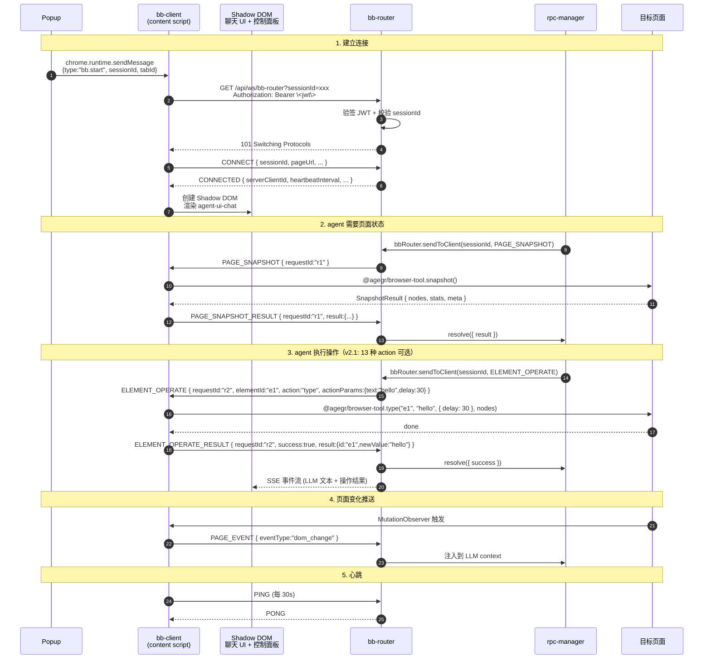
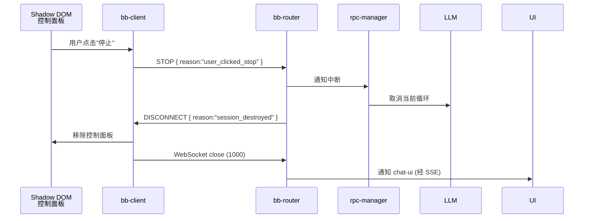
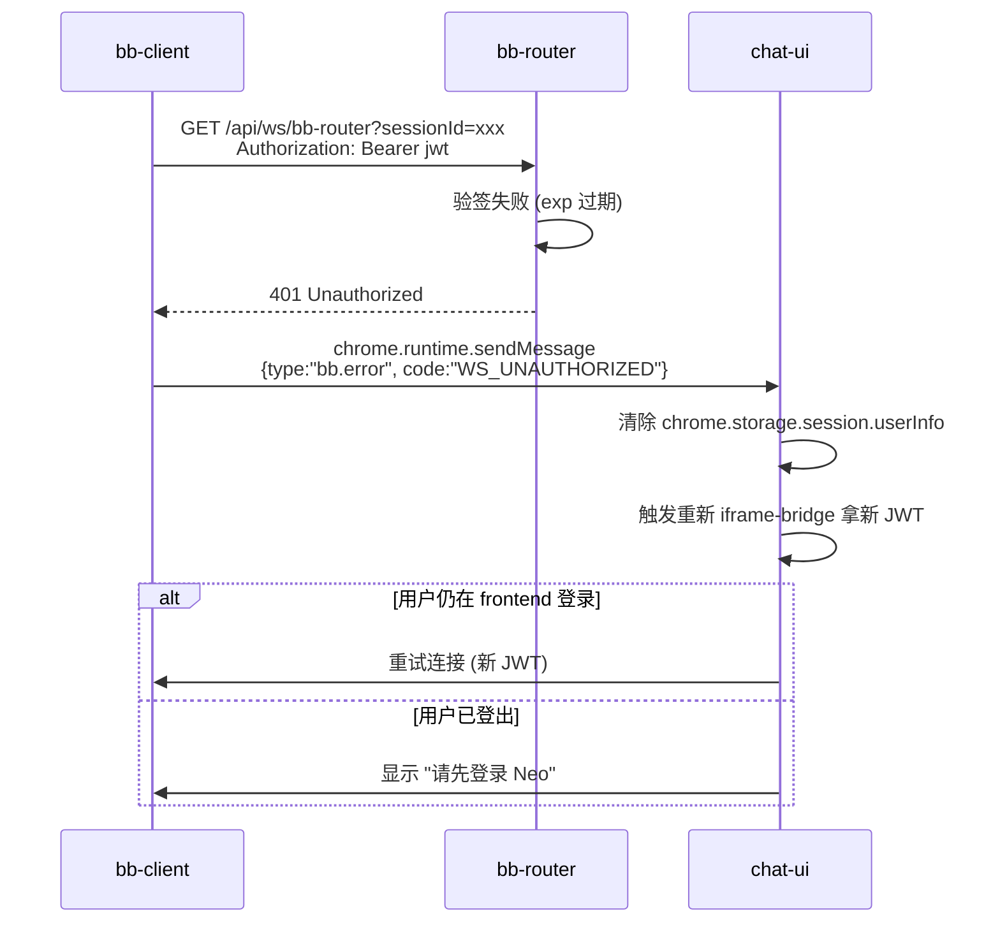

# Browser Bridge 消息协议

## 1. 概述

Browser Bridge 协议（BBP）是 bb-client（运行在浏览器 content script）和 agent-server 内置的 **bb-router** 模块之间的 WebSocket 通信协议。**agent-server 的业务逻辑通过进程内调用 bb-router 与 bb-client 通信，不再走 WebSocket**。

### 1.1 设计原则

1. **requestId 匹配响应**：每个请求都有唯一 ID，响应中包含相同的 requestId，便于追踪
2. **sessionId 强绑定**：sessionId 是唯一关联键，1 session = 1 bb-client
3. **payload 解耦**：具体消息内容放在 payload 中，便于扩展新消息类型
4. **timestamp 可追溯**：每条消息都有时间戳，便于调试和日志分析
5. **向后兼容**：`version` 字段支持协议升级
6. **类型单一**：只有一个客户端类型（`browser`），不再区分 bb-client 和 agent-server

### 1.2 协议参与者

| 角色 | 位置 | 通信方式 |
|------|------|----------|
| **bb-client** | 浏览器 content script | WebSocket 客户端 |
| **bb-router** | agent-server 内部模块 | WebSocket 服务端 + 进程内 API |
| **rpc-manager** | agent-server 内部模块 | 进程内调用 bb-router |

---

## 2. 基础结构

### 2.1 消息格式

```typescript
interface BaseMessage {
  version: string;        // 协议版本，如 "2.0"
  type: MessageType;      // 消息类型
  requestId: string;      // 请求唯一 ID，用于匹配响应（事件类消息可省略）
  timestamp: number;      // Unix 时间戳（毫秒）
  sessionId: string;      // 会话 ID，关联 agent-session
  payload: unknown;       // 具体 payload（类型由 type 决定）
}
```

### 2.2 WebSocket 握手

```
bb-client 连接时，
GET /api/ws/bb-router?sessionId=sess-abc123 HTTP/1.1
Host: localhost:30141
Upgrade: websocket
Connection: Upgrade
Authorization: Bearer <jwt>
Sec-WebSocket-Version: 13

```

agent-server 在升级前完成：

1. JWT 验签（共享 `JWT_SECRET_KEY`）
2. exp 检查
3. sessionId 归属校验（`sub` user_id 必须匹配）
4. 全部通过才返回 `101 Switching Protocols`；任一失败返回 `401`

> **握手后，连接期间不再校验 JWT**（信任已建立的 session）。如需踢人，agent-server 主动关闭 WebSocket（code 1008）。

### 2.3 协议版本协商

CONNECT 消息的 `version` 字段格式为 `"MAJOR.MINOR"`（如 `"2.2"`）。bb-router 按- **同主版本**（如 `2.0`、`2.1`、`2.2` 互认）：接受。客户端可以连接任一比自己新或旧的 2.x 服务端。新客户端调用旧服务端不支持的 action → `OPERATION_FAILED`；旧客户端调用新服务端才有的 message type → 服务端忽略 / 返回 `INVALID_MESSAGE`。
- **不同主版本**（如 `1.x` ↔ `2.x`）：拒绝，返回 `ERROR(code=INVALID_VERSION)` 并关闭连接（code 1003）。

> 补充：v2.0 / v2.1 期间 bb-router 使用严格相等检查（`version !== BBP_VERSION`），任何 minor bump 都会拒接。v2.2 起改为主版本号匹配，未来 v2.3 / v2.4 仅加新 message type，不需要再改 bb-router。

---

## 3. 消息类型总览

```typescript
type MessageType =
  // ===== 连接管理 =====
  | "CONNECT"              // bb-client → bb-router, 握手
  | "CONNECTED"            // bb-router → bb-client, 握手响应
  | "DISCONNECT"           // 任一方主动断开（含 reason）
  | "ERROR"                // 错误响应

  // ===== 页面操作 (bb-router → bb-client) =====
  | "PAGE_SNAPSHOT"                 // 请求 DOM 快照
  | "PAGE_SNAPSHOT_RESULT"          // 快照结果
  | "PAGE_MARKDOWN"                 // v2.3 新增：请求 DOM→Markdown 转换
  | "PAGE_MARKDOWN_RESULT"          // v2.3 新增：Markdown 转换结果
  | "ELEMENT_OPERATE"               // 操作元素（by id，v2.1）
  | "ELEMENT_OPERATE_RESULT"        // 操作结果
  | "LOCATOR_OPERATE"               // v2.2 新增：操作元素（by spec，跳过 snapshot）
  | "LOCATOR_OPERATE_RESULT"        // v2.2 新增：LOCATOR_OPERATE 结果

  // ===== 事件推送 (bb-client → bb-router) =====
  | "PAGE_EVENT"            // 页面变化事件

  // ===== UI 控制 (bb-client → bb-router) =====
  | "STOP"                  // 用户通过控制面板点"停止"

  // ===== 心跳 =====
  | "PING"
  | "PONG";
```

> **方向约定**：所有消息都是双向的，但默认方向标注在分类里。请求类消息有 `_RESULT` 后缀的响应，通过 `requestId` 匹配。
>
> **协议范围说明**（v2.1 起）：协议对齐 `@agegr/browser-tool` v0.2。`PAGE_SNAPSHOT` 调用 `browser-tool.snapshot()`；`ELEMENT_OPERATE` 覆盖 13 个 action（详见 §6.3）。`ELEMENT_QUERY`（CSS/XPath 查询）暂不提供，元素定位统一通过 `PAGE_SNAPSHOT` 返回的 `id`。新增 action 须先在 `@agegr/browser-tool` 实现并加 e2e test，再在本协议增加对应枚举值。
>
> **v2.2 新增** `LOCATOR_OPERATE`（§6.5）：用 `LocatorSpec` 描述目标元素，bb-client 在浏览器内调用 `browser-tool.find(document, spec).resolve()` + action，一次 round-trip 完成 “find + act”。不需要先调 `PAGE_SNAPSHOT` 拿 `id`。响应里会带 `elementId`，服务端后续可以用 `ELEMENT_OPERATE` 继续操作同一个元素。`LocatorSpec` 是 JSON-可序列化的 `browser-tool` `LocatorSpec` 子集（string-only，不含 `RegExp`）。

**v2.3 新增** `PAGE_MARKDOWN`（§6.7）：把 DOM 转成 Markdown，调用 `browser-tool.markdown()`。与 `PAGE_SNAPSHOT` 平行——snapshot 给结构（操作导向），markdown 给内容（理解导向），LLM context 可同送。`mode: 'readability'` 走 Mozilla Readability 抽主体，失败回退 `full`。`@agegr/browser-tool` v0.4 加 `markdown()` API；`@agegr/bb-protocol` v0.3 拆出。

---

## 4. 连接消息

### 4.1 CONNECT

bb-client 握手成功后立即发送。

```typescript
interface ConnectPayload {
  version: string;             // 协议版本，bb-client 声称支持的版本
  clientId: string;            // bb-client 生成的唯一 ID（用于日志）
  pageUrl: string;             // 当前页面 URL（仅日志用，不参与路由）
  pageTitle?: string;          // 当前页面 title
  userAgent: string;           // 浏览器 user agent
  browserToolVersion: string;  // @agegr/browser-tool 包版本（v2.1 起取代原 domSnapshotVersion）
  /**
   * @deprecated 自 v2.1 起改用 `browserToolVersion`。保留字段仅用于
   * 过渡期双读，bb-client ≥ v2.1.0 不再发送此字段。
   */
  domSnapshotVersion?: string;
}

interface ConnectMessage extends BaseMessage {
  type: "CONNECT";
  payload: ConnectPayload;
}
```

### 4.2 CONNECTED

bb-router 确认 session 已建立。

```typescript
interface ConnectedPayload {
  serverClientId: string;       // bb-router 分配的 ID
  heartbeatInterval: number;    // 心跳间隔（毫秒）
  requestTimeout: number;       // 请求超时（毫秒）
  sessionIdleTimeout: number;   // session 闲置超时（毫秒）
  serverTime: number;           // bb-router 服务器时间（用于时钟同步）
}

interface ConnectedMessage extends BaseMessage {
  type: "CONNECTED";
  payload: ConnectedPayload;
}
```

### 4.3 DISCONNECT

任一方主动断开时发送，reason 说明原因。

```typescript
type DisconnectReason =
  | "user_stop"               // 用户主动停止（控制面板按钮）
  | "tab_closing"             // 浏览器 tab 关闭
  | "session_destroyed"       // session 被销毁
  | "replacing"               // 新连接替换旧连接
  | "shutdown"                // 服务关闭
  | "error";                  // 异常断开

interface DisconnectPayload {
  reason: DisconnectReason;
  message?: string;           // 可选说明
}

interface DisconnectMessage extends BaseMessage {
  type: "DISCONNECT";
  payload: DisconnectPayload;
}
```

---

## 5. 页面快照消息

### 5.1 PAGE_SNAPSHOT

获取当前页面 DOM 快照。**bb-router → bb-client**。

调用 `@agegr/browser-tool` 的 `snapshot(root?, opts)` 接口。Payload 直接透传给该函数：

```typescript
interface PageSnapshotPayload {
  root?: string;               // CSS 选择器，限定快照根节点（默认 document.body）
  include?: string[];          // 强制纳入的 CSS Selector（绕过过滤）
  exclude?: string[];          // 强制排除的 CSS Selector
  visibleOnly?: boolean;       // 只保留可见元素（默认 true）
  interactiveOnly?: boolean;   // 只保留可交互元素（默认 true；false 会包含 heading/label 等）
  maxDepth?: number;           // 遍历最大深度（默认无限）
}

interface PageSnapshotMessage extends BaseMessage {
  type: "PAGE_SNAPSHOT";
  payload: PageSnapshotPayload;
}
```

### 5.2 PAGE_SNAPSHOT_RESULT

bb-client 返回 `snapshot()` 的完整 `SnapshotResult`：

```typescript
interface PageSnapshotResultPayload {
  success: boolean;
  result?: SnapshotResult;     // browser-tool 的 SnapshotResult（nodes/stats/meta）
  error?: ErrorDetail;
}

interface PageSnapshotResultMessage extends BaseMessage {
  type: "PAGE_SNAPSHOT_RESULT";
  payload: PageSnapshotResultPayload;
}
```

```typescript
interface SnapshotResult {
  nodes: SnapshotNode[];       // 节点数组（深度优先顺序）
  stats: SnapshotStats;        // 统计信息
  meta: SnapshotMeta;          // 元信息
}

interface SnapshotMeta {
  untrusted: true;             // 安全标志，LLM 需当作不可信输入
  sourceUrl: string | null;    // 捕获时所在 URL
  capturedAt: string;          // ISO 8601 捕获时间
  version: string;             // browser-tool 版本号
}

interface SnapshotStats {
  total: number;               // 节点总数
  visible: number;             // visible=true 的节点数
  byRole: Record<string, number>;  // 按 role 分类计数
  approxChars: number;         // 序列化后的近似字符数
}
```

```typescript
interface SnapshotNode {
  // ===== 必填字段 =====
  id: string;                  // 节点 ID，DFS 顺序，形如 e1/e2/...
  role: string;                // ARIA role（button/textbox/heading/...）
  name: string;                // accessible name
  visible: boolean;            // 元素是否视觉可见
  rect: { x: number; y: number; width: number; height: number };

  // ===== 可选字段（只在元素有相应语义时附带）=====
  value?: string;              // input/textarea/select 当前值
  level?: number;              // heading 级别 1-6
  href?: string;               // a/area/link → href；img/iframe → src
  checked?: boolean;           // checkbox/radio/switch 的勾选状态（仅勾选时为 true）
  disabled?: boolean;          // 元素是否被禁用（仅禁用时为 true）
  placeholder?: string;        // input/textarea 的 placeholder
  text?: string;               // 元素可见文本（仅 button/link/option/tab/menuitem 等有值）
  labeledBy?: string;          // 被 <label for> 关联时记录 label id
  radioGroup?: string;         // radio 按钮的 group name
  states?: string[];           // 其他状态：required / expanded / collapsed / selected
  depth?: number;              // DOM 树中的深度（调试用）
  business?: BusinessAnnotation;  // 业务标注（来自 data-ai-* 属性）
}

interface BusinessAnnotation {
  desc?: string;               // 业务描述（data-ai-desc）
  type?: string;               // 业务类型（data-ai-type）
  context?: string;            // 业务上下文（data-ai-context）
}
```

> **未提供字段说明**：
>
> - `tagName` — DOM 标签名，browser-tool 不返回；需要时可从 `role` 推断
> - `attributes` — 原始 HTML 属性，browser-tool 只提取语义字段
> - `children` — browser-tool 输出扁平数组，父子关系通过 `depth` 和数组顺序推断
> - `isVisible` — 协议使用 `visible`（强制为必填字段）
> - `isInteractive` — 由 LLM 根据 `role` 判断，browser-tool 不显式标注
>
> **id 生命周期**：`@agegr/browser-tool` 内部维护 `idToElement` 全局 Map，每次 `snapshot()` 重新分配 `e1`/`e2`/...。LLM 应在操作前先调 `PAGE_SNAPSHOT` 拿新 id；如需在已有 id 上操作，把 snapshot.nodes 数组作为 `ELEMENT_OPERATE.nodes` 一同发送（避免 id 过期）。

---

## 6. 元素操作消息

> **定位原则**（v2.1）：`@agegr/browser-tool` 同时支持 `id` 定位和直接 `Target` 定位（CSS selector / `Element` / lazy function）。协议仍只暴露 `id` 路径（更稳定、可审计），调用方须先调 `PAGE_SNAPSHOT` 拿到 `id`，再发起操作。
>
> **id 稳定性**：snapshot() 会重新分配 `e1`/`e2`/...，**不接受跨 snapshot 的 id**。为了避免 `ELEMENT_NOT_FOUND`，操作时应同时带上最近一次的 `nodes`（服务会先在数组里查，stale 才回退到全局注册表）。

### 6.1 ELEMENT_OPERATE

操作元素。**bb-router → bb-client**。v2.1 覆盖 13 个 action，详见 §6.3。

```typescript
type ElementAction =
  | "click"        // 鼠标点击
  | "dblclick"     // 双击
  | "hover"        // 鼠标悬停
  | "focus"        // 程序化聚焦
  | "fill"         // 设值 input / textarea
  | "type"         // 一字一字按
  | "press"        // 单个按键（含 modifiers）
  | "check"        // checkbox 勾选
  | "uncheck"      // checkbox 取消
  | "select"       // <select> 选 option
  | "drag"         // 拖拽 source → target
  | "scroll"       // 页面滚动
  | "scrollIntoView";  // 元素滚入视口

interface ElementOperatePayload {
  // 定位元素（仅支持 id；id 必须来自最近的 PAGE_SNAPSHOT 结果）
  elementId: string;           // 来自 SnapshotNode.id（如 "e1", "e2"）

  action: ElementAction;

  // actionParams 形状随 action 变化，详见 §6.3
  // 设为可选：零参数 action（click / hover / focus / check / uncheck /
  // scrollIntoView）可以不传
  actionParams?: ActionParams;

  // 可选：附加最近一次 snapshot 结果，避免 id 过期
  nodes?: SnapshotNode[];      // 上一次的 snapshot nodes
}

type ActionParams =
  | FillParams                 // { value: string }
  | TypeParams                 // { text: string; delay?: number; clear?: boolean }
  | PressParams                // { key: string }
  | SelectParams               // { values: string[] }
  | DragParams                 // { targetId: string }
  | ScrollParams               // { direction: "up"|"down"|"left"|"right"; px?: number }
  | EmptyActionParams;         // {}

interface FillParams { value: string; }
interface TypeParams { text: string; delay?: number; clear?: boolean; }
interface PressParams { key: string; }                          // e.g. "Enter", "Control+a", "Escape"
interface SelectParams { values: string[]; }                     // 单选传 1 个，多选传 N 个
interface DragParams { targetId: string; }                      // source = elementId, target = targetId
interface ScrollParams {
  direction: "up" | "down" | "left" | "right";
  px?: number;                                                  // 默认 300
}
type EmptyActionParams = Record<string, never>;

interface ElementOperateMessage extends BaseMessage {
  type: "ELEMENT_OPERATE";
  payload: ElementOperatePayload;
}
```

### 6.2 ELEMENT_OPERATE_RESULT

```typescript
interface ElementOperateResultPayload {
  success: boolean;            // 整体成功标志
  action: ElementAction;
  result?: {
    id: string;                // 操作的元素 id
    /** fill 后输入框的新值 */
    newValue?: string;
    /** type / fill / select / check / uncheck 后元素的实际状态（如 selected） */
    newState?: Record<string, unknown>;
  };
  error?: ErrorDetail & { recoverable?: boolean };
}

interface ElementOperateResultMessage extends BaseMessage {
  type: "ELEMENT_OPERATE_RESULT";
  payload: ElementOperateResultPayload;
}
```

### 6.3 Action 参考表

按 `@agegr/browser-tool` v0.2 公开 API 1:1 镜像，参数语义保持一致：

| action          | 行为                                                        | actionParams                       | 适用元素                    |
|-----------------|-------------------------------------------------------------|------------------------------------|----------------------------|
| `click`         | 触发 `pointerdown/mousedown/pointerup/mouseup/click` 序列  | （无）                              | 任意可点击元素              |
| `dblclick`      | 两次 click，间隔一个 rAF                                    | （无）                              | 同 click                    |
| `hover`         | 触发 `pointerover/mouseover/pointerenter/mouseenter/mousemove` | （无）                              | 任意元素                    |
| `focus`         | `el.focus({ preventScroll: true })`                          | （无）                              | 任意 focusable 元素         |
| `fill`          | prototype-setter 写值，触发 `input + change`                | `{ value: string }`                | `<input>` / `<textarea>`    |
| `type`          | 一字一字按：每字符 `keydown/input/keyup`                    | `{ text, delay?, clear? }`         | 同 fill                     |
| `press`         | 单键 `keydown/keyup`，含 modifiers                            | `{ key: string }`                  | 当前 activeElement          |
| `check`         | checkbox 勾选（已勾选时 no-op）                              | （无）                              | `<input type=checkbox>`     |
| `uncheck`       | checkbox 取消（已取消时 no-op）                              | （无）                              | 同 check                    |
| `select`        | 设置 `<select>` 的 value(s)，触发 `input + change`            | `{ values: string[] }`             | `<select>`                  |
| `drag`          | 鼠标事件模拟拖拽：source → target，10 步 mousemove            | `{ targetId: string }`             | 任意可拖动元素              |
| `scroll`        | 页面级滚动                                                  | `{ direction, px? }`               | （无 elementId 不填）       |
| `scrollIntoView`| 元素滚入视口                                                | （无）                              | 任意元素                    |

> **未实现的 action**（browser-tool 待 Phase 2+）：
>
> - `get` (text/html/value/attr) — 只读查询
> - `is` (visible/enabled/checked) — 状态判断
> - `find` (chainable locator by role/text/label) — 声明式定位
>
> 这些**不通过协议暴露**——LLM 拿到 snapshot 后可直接从 `SnapshotNode` 字段读 `value`/`checked`/`disabled` 等，`is` 类的判断由 LLM 在 snapshot 数据上做。需要新 API 时，先在 browser-tool 实现，再加协议枚举。

### 6.4 错误信息映射

错误码到 `@agegr/browser-tool` 实际 `OperationResult.message` 文案的映射（用于 `error.message` 字段填充，方便 LLM 理解）：

| 错误码                       | 触发条件（browser-tool 行为）                                                | 示例 message                               |
|------------------------------|------------------------------------------------------------------------------|--------------------------------------------|
| `ELEMENT_NOT_FOUND`          | `id` 在 `nodes` 和全局注册表里都找不到                                       | `id=e99 找不到对应的元素`                  |
| `ELEMENT_STALE`              | `id` 不在最新 `nodes` 列表里（id 已被新 snapshot 覆盖）                      | `id=e3 不在最新 nodes 列表里`              |
| `ELEMENT_NOT_INTERACTIVE`    | 元素 `disabled` / `aria-disabled="true"`                                     | `id=e1 元素被禁用`                         |
| `ELEMENT_NOT_INTERACTIVE`    | 元素 `readonly`                                                              | `id=e1 元素为 readonly`                    |
| `ELEMENT_NOT_INTERACTIVE`    | 元素是 `<button>` 但 action 是 `fill`（类型不匹配）                          | `id=e1 不是可填写的 input/textarea`        |
| `ELEMENT_NOT_INTERACTIVE`    | 元素不是 checkbox/radio 但 action 是 `check/uncheck`                          | `id=e1 不是 checkbox/radio (type=text)`     |
| `ELEMENT_NOT_INTERACTIVE`    | 元素不是 `<select>` 但 action 是 `select`                                    | `id=e1 不是 <select> 元素`                 |
| `ELEMENT_NOT_VISIBLE`        | 元素 `display:none` / `visibility:hidden` / 零尺寸无内容                      | `click: target element is not visible`     |
| `SELECT_OPTION_NOT_FOUND`    | `select` 时 `values` 没有任何匹配 option                                     | `id=e1 找不到匹配 a,b 的 option`           |
| `ACTION_TIMEOUT`             | 元素始终不可点 / 异步加载未完成                                               | （v0.2 不实现；预留）                       |
| `INTERNAL_ERROR`             | 其他未预期错误                                                                | （browser-tool 抛出的非受控异常）            |

`recoverable` 语义：

- `ELEMENT_NOT_FOUND` / `ELEMENT_STALE` — **recoverable=true**（自动重 snapshot 一次再试）
- `ELEMENT_NOT_INTERACTIVE` / `ELEMENT_NOT_VISIBLE` — **recoverable=false**（需要换元素或等用户操作）
- 其他 — 视具体错误码

---

### 6.5 LOCATOR_OPERATE（v2.2 新增）

按 `LocatorSpec` 描述元素位置，免调 `PAGE_SNAPSHOT`。**bb-router → bb-client**。

`v2.0` / `v2.1` 期间操作元素必须先调 `PAGE_SNAPSHOT` 拿 `id`（snapshot → ref → operate 三跳）。v2.2 起 `LOCATOR_OPERATE` 一步走完 find + act：

```
 bb-router  ──LOCATOR_OPERATE { spec, action, actionParams? }──►  bb-client
 bb-client  ──LOCATOR_OPERATE_RESULT { success, action, elementId?, result?, error? }──►  bb-router
```

bb-client 收到后在浏览器内：

1. 调用 `browser-tool.snapshot()` 填充 id → element 反查表（响应需返 `elementId`）
2. 调用 `browser-tool.find(document, spec).resolve()` 拿到目标 `Element`
3. `browser-tool.getIdForElement(element)` 查 id
4. 调对应的 action 函数（与 `ELEMENT_OPERATE` 同一套 13 个 action，详见 §6.3）

#### 6.5.1 TypeScript 类型

```typescript
interface LocatorSpec {
  selector?: string;            // CSS 选择器
  role?: string;                // ARIA role（如 "button" / "link" / "textbox"）
  name?: string;                // accessible name（不含 RegExp；JSON 不可序列化）
  text?: string;                // 元素文本包含
  testId?: string;              // data-testid
  label?: string;               // <label for="..."> 或 wrapper <label> 文本
  placeholder?: string;
  alt?: string;
  title?: string;
  first?: boolean;              // 取首个（默认行为）
  last?: boolean;               // 取末个
  nth?: number;                 // 取第 n 个（0-based）
}

interface LocatorOperatePayload {
  spec: LocatorSpec;             // 元素描述
  action: ElementAction;         // 13 个 action 之一（§6.3）
  actionParams?: ActionParams;   // 按 action 填，零参数 action 可省
}

interface LocatorOperateMessage extends BaseMessage {
  type: "LOCATOR_OPERATE";
  payload: LocatorOperatePayload;
}
```

> 字段类型限制：`name` / `text` / `label` / `placeholder` / `alt` / `title` 在 `browser-tool.LocatorSpec` 里接受 `string | RegExp`；本协议是 JSON  wire format，**只接受 `string`**。如需正则匹配，服务端可以在发协议前自己 regex-to-string 转换（如 "name.*Submit.*"），bb-client 接到后转为 `RegExp` 调 `find()`。

#### 6.5.2 限制

- **`drag` 不支持**：`DragParams.targetId` 是 string ref 不是 `LocatorSpec`。要拖动元素，继续用 `ELEMENT_OPERATE`。v2.3 计划扩 `DragParams` 为 `{ target: LocatorSpec }`。
- **0 匹配 / 多匹配**：`find().resolve()` 招不到元素 → throw（`ELEMENT_NOT_FOUND`）；招到多个且 spec 没指定 `first` / `last` / `nth` → throw（也是 `ELEMENT_NOT_FOUND` 语义，需 spec 消歧）。
- **响应 elementId 必返回**：服务端后续 `ELEMENT_OPERATE` 需要该 id。bb-client 调用 `snapshot()` 是为了填充 id map（性能代价：O(n) 遍历页面 + O(1) 查表）。

### 6.6 LOCATOR_OPERATE_RESULT（v2.2 新增）

`LOCATOR_OPERATE` 的响应。**bb-client → bb-router**。

#### 6.6.1 TypeScript 类型

```typescript
interface LocatorOperateResult {
  id: string;                   // = elementId，同步冗余方便旧消费者
  newValue?: string;            // fill / type 后输入框新值
  newState?: Record<string, unknown>;  // 元素操作后状态
}

interface LocatorOperateResultPayload {
  success: boolean;
  action: ElementAction;
  elementId?: string;           // v2.2 响应必填；bb-client 调 snapshot() 拿的 id
  result?: LocatorOperateResult;
  error?: (ErrorDetail & { recoverable?: boolean }) | undefined;
}

interface LocatorOperateResultMessage extends BaseMessage {
  type: "LOCATOR_OPERATE_RESULT";
  payload: LocatorOperateResultPayload;
}
```

---

### 6.7 PAGE_MARKDOWN（v2.3 新增）

把当前页面 DOM 转成 Markdown 文本。**bb-router → bb-client**。

调用 `@agegr/browser-tool` 的 `markdown(target?, options?)` 接口。与 `PAGE_SNAPSHOT` 平行：snapshot 给结构（操作导向），markdown 给内容（理解导向），两者可同送 LLM context。

```typescript
interface PageMarkdownPayload {
  root?: string;                    // CSS 选择器，限定根节点（默认 document.body）
  mode?: 'full' | 'readability';    // 默认 'full'；'readability' 用 Readability 抽主体，失败回退 full
  maxLength?: number;               // 字符数截断（0 = 不截断）
  includeMetadata?: boolean;        // 顶部加 YAML frontmatter (title/url)
  include?: string[];               // 强制纳入的 CSS Selector（绕过 mode 过滤）
  exclude?: string[];               // 强制排除的 CSS Selector
}

interface PageMarkdownMessage extends BaseMessage {
  type: "PAGE_MARKDOWN";
  payload: PageMarkdownPayload;
}
```

### 6.8 PAGE_MARKDOWN_RESULT（v2.3 新增）

```typescript
interface MarkdownMeta {
  sourceUrl: string;
  title?: string;
  charCount: number;
  byteSize: number;
  truncated: boolean;
  convertedAt: string;              // ISO 8601
}

interface MarkdownResult {
  markdown: string;
  mode: 'full' | 'readability';
  meta: MarkdownMeta;
}

interface PageMarkdownResultPayload {
  success: boolean;
  result?: MarkdownResult;
  error?: ErrorDetail;
}

interface PageMarkdownResultMessage extends BaseMessage {
  type: "PAGE_MARKDOWN_RESULT";
  payload: PageMarkdownResultPayload;
}
```

---

## 7. 页面事件消息

### 7.1 PAGE_EVENT

bb-client 主动推送的页面变化事件。**bb-client → bb-router**。

```typescript
type PageEventType =
  | "url_change"              // URL 变化（pushState/replace/hashchange）
  | "title_change"            // document.title 变化
  | "dom_change"              // DOM 变化（MutationObserver 触发）
  | "navigation"              // 完整页面导航（beforeunload/load）
  | "ready"                   // 页面 DOMContentLoaded
  | "visibility_change"       // tab 切到后台/前台
  | "close";                  // tab 即将关闭

interface PageEventPayload {
  clientId: string;           // 发送方 bb-client ID
  eventType: PageEventType;
  data?: {
    url?: string;             // url_change/navigation 时
    title?: string;           // title_change 时
    timestamp: number;        // 事件发生时间
    hidden?: boolean;         // visibility_change 时
  };
}

interface PageEventMessage extends BaseMessage {
  type: "PAGE_EVENT";
  payload: PageEventPayload;
}
```

> **背压策略**：`dom_change` 事件频率高，需在 bb-client 端做节流（默认 100ms）+ 防抖（默认 500ms）；超过节流阈值的连续变化合并为一条事件。

---

## 8. UI 控制消息

### 8.1 STOP

用户通过 Shadow DOM 控制面板的"停止 agent"按钮触发。**bb-client → bb-router**。

```typescript
interface StopPayload {
  reason: "user_clicked_stop" | "panel_closing" | "error_threshold_exceeded";
  context?: {
    lastOpType?: MessageType;     // 触发停止的最后一个操作类型
    lastError?: ErrorDetail;      // 如果是 error_threshold_exceeded
  };
}

interface StopMessage extends BaseMessage {
  type: "STOP";
  payload: StopPayload;
}
```

bb-router 收到后立即：

1. 取消 pending 的请求
2. 通知 rpc-manager 中断当前 LLM 循环
3. 关闭 session（WebSocket code 1000）
4. 通知 chat-ui

---

## 9. 错误消息

### 9.1 ERROR

任意错误场景都可以发 ERROR，通常带 `originalRequestId` 关联到出错的请求。

```typescript
interface ErrorDetail {
  code: ErrorCode;             // 见 10.2 错误码表
  message: string;             // 人类可读
  details?: Record<string, unknown>;  // 额外上下文（如堆栈、selector）
}

interface ErrorMessage extends BaseMessage {
  type: "ERROR";
  payload: ErrorDetail & { originalRequestId?: string };
}
```

### 9.2 错误码

| 错误码 | 类别 | 触发场景 | 处理策略 |
|--------|------|----------|----------|
| `INVALID_VERSION` | 协议 | 协议版本不匹配 | 关闭连接，提示升级 bb-client |
| `INVALID_MESSAGE` | 协议 | 消息格式错误 | 关闭连接（code 1003） |
| `WS_UNAUTHORIZED` | 握手 | JWT 验签失败 / 过期 | 401，不升级 WebSocket；chat-ui 触发重新登录 |
| `WS_SESSION_NOT_FOUND` | 握手 | sessionId 不存在 | 401；chat-ui 重新创建 session |
| `WS_SESSION_FORBIDDEN` | 握手 | sessionId 不属于 JWT sub | 403；权限错误 |
| `WS_RATE_LIMITED` | 握手 | 单用户 session 超限 | 429；提示用户关闭多余 session |
| `SESSION_NOT_ACTIVE` | 路由 | session 已销毁 | 重连或结束 |
| `CLIENT_NOT_FOUND` | 路由 | 目标客户端已离线 | 等待重连 / 通知用户 |
| `ELEMENT_NOT_FOUND` | 操作 | id 找不到对应元素 | 通知 LLM 重新 snapshot |
| `ELEMENT_NOT_INTERACTIVE` | 操作 | 元素被禁用 / 类型不匹配（如 fill 非 input）| 通知 LLM 等待或换元素 |
| `OPERATION_FAILED` | 操作 | 操作执行异常 | 检查 `recoverable` 决定重试 |
| `OPERATION_TIMEOUT` | 操作 | 操作超时 | 重试一次 |
| `ELEMENT_STALE` | 操作 | `id` 不在最新 `nodes` 里（v2.1 新增） | 重新 snapshot 后重试 |
| `ELEMENT_NOT_VISIBLE` | 操作 | 元素不可见（v2.1 新增） | 等用户交互或换元素 |
| `SELECT_OPTION_NOT_FOUND` | 操作 | select 找不到匹配 option（v2.1 新增） | 换 values 重试 |
| `REQUEST_TIMEOUT` | 通信 | 请求 30s 未响应 | 重试（指数退避）|
| `TARGET_CLIENT_OFFLINE` | 通信 | 目标客户端已离线 | 等待重连 / 通知用户 |
| `MAX_SESSIONS_EXCEEDED` | 系统 | 单用户 > 5 sessions | 提示用户关闭多余 session |
| `INTERNAL_ERROR` | 系统 | 内部异常 | 关闭 session，记录日志 |

> **已删除的错误码**（v2.0 → v2.1 变动）：
>
> - `ELEMENT_NOT_VISIBLE` — 在 v2.0 中被删除（browser-tool 无可见性预检，由 LLM 通过 `visible:false` 字段判断）；v2.1 重新引入（`@agegr/browser-tool` 加了 `isVisible` 预检，默认 `force:false`）
> - `ELEMENT_AMBIGUOUS` — id 定位无歧义场景，仍不提供

---

## 10. 心跳消息

### 10.1 PING / PONG

```typescript
// bb-client → bb-router
interface PingMessage extends BaseMessage {
  type: "PING";
  payload: {};
}

// bb-router → bb-client
interface PongMessage extends BaseMessage {
  type: "PONG";
  payload: {};
}
```

- bb-client 每隔 `heartbeatInterval`（CONNECTED 响应中的值，默认 30s）发送 PING
- bb-router 收到 PING 立即返回 PONG
- bb-router 检测到 `heartbeatTimeout`（默认 60s）未收到任何消息 → 判定离线
- bb-client 检测到 `heartbeatTimeout` 未收到 PONG → 主动断开，进入重连

---

## 11. 完整交互流程

### 11.1 正常流程



### 11.2 用户停止流程



### 11.3 401 / 重新登录流程



---

## 13. 协议参数

### 13.1 默认值

| 参数 | 默认值 | 覆盖来源 | 说明 |
|------|--------|----------|------|
| `version` | `"2.0"` | 编译时常量 | 协议版本 |
| `heartbeatInterval` | 30000ms | CONNECTED 响应 | 心跳发送间隔 |
| `heartbeatTimeout` | 60000ms | agent-server 配置 | 心跳超时 |
| `requestTimeout` | 30000ms | CONNECTED 响应 | 请求-响应超时 |
| `reconnectInitialDelay` | 1000ms | bb-client 配置 | 重连初始延迟 |
| `reconnectMaxDelay` | 30000ms | bb-client 配置 | 重连最大延迟 |
| `maxReconnectAttempts` | 10 | bb-client 配置 | 最大重连次数 |
| `sessionIdleTimeout` | 1800000ms (30min) | CONNECTED 响应 | session 闲置超时 |
| `maxSessionsPerUser` | 5 | agent-server 配置 | 单用户 session 上限 |
| `domChangeThrottle` | 100ms | bb-client 配置 | dom_change 节流 |
| `domChangeDebounce` | 500ms | bb-client 配置 | dom_change 防抖 |

### 13.2 版本兼容性

当前协议版本 `2.3`。后续升级规则：

- **小版本（2.x）**：新增可选字段、`payload` 子结构、新增 `MessageType` 变体，均向后兼容
  - v2.1 旧客户端可连 v2.2 新服务端：不识别 `LOCATOR_OPERATE` → 服务端忽略/返回 `INVALID_MESSAGE`（不发生 fail-fast）
  - v2.2 新客户端可连 v2.1 旧服务端：`LOCATOR_OPERATE` 不被识别 → bb-client 走 fallback 路径
  - **server 端主版本号匹配**（v2.2 起）：只检查 `"2."` 前缀，同主版本任一 minor 都接受。未来 v2.3 / v2.4 仅加新 message type，**不需要再改 bb-router**
- **大版本（3.0）**：必须双发协议版本号，bb-router 同时支持新旧版本至少 1 个发布周期

#### 13.2.1 客户端-服务端兼容矩阵

|  client \ server | v1.x | v2.0 | v2.1 | v2.2 | v2.3 |
|------------------|------|------|------|------|------|
| v1.x             | ✅   | ❌ INVALID_VERSION | ❌ INVALID_VERSION | ❌ INVALID_VERSION | ❌ INVALID_VERSION |
| v2.0             | ❌ INVALID_VERSION | ✅ | ✅ | ✅ | ✅ |
| v2.1             | ❌ INVALID_VERSION | ✅ | ✅ | ✅ | ✅ |
| v2.2             | ❌ INVALID_VERSION | ✅ (OPERATION_FAILED for unknown actions) | ✅ (LOCATOR_OPERATE 被服务端忽略) | ✅ | ✅ (PAGE_MARKDOWN 被服务端忽略) |
| v2.3             | ❌ INVALID_VERSION | ✅ (PAGE_MARKDOWN → OPERATION_FAILED) | ✅ (PAGE_MARKDOWN → OPERATION_FAILED) | ✅ (PAGE_MARKDOWN → OPERATION_FAILED) | ✅ |

旧场景下（v2.0 / v2.1）server 端采用严格 `version === BBP_VERSION` 检查，v2.2 改为 `version.split('.')[0] === '2'`。

---

## 14. 与其他文档的关系

- **架构总览**：[browser-bridge.md](./browser-bridge) - 组件职责、连接流程、Shadow DOM 设计
- **认证设计**：[neo-agents.md §6](./neo-agents#6-认证与授权设计) - WebSocket 握手的 JWT 校验
- **browser-tool 实际类型**：[`@agegr/browser-tool`](../../../../neo-agents/browser-tool/) - SnapshotNode / SnapshotResult / OperationResult 字段定义（v0.3.1），13 个 action + 4 个 wait 函数 + Phase 2 chainable `Locator` API 的语义
- **协议包**：[`@agegr/bb-protocol`](../../../../neo-agents/browser-bridge/bb-protocol/) - 本协议的类型化单一源（v0.2 / wire v2.2），bb-client + bb-router 共同依赖

---

## 15. 版本历史

| 版本 | 日期 | 变更 |
|------|------|------|
| 2.0.0 | 2026-06-22 | 初版：bb-router 内置模块，bb-client + Shadow DOM，JWT 握手，完整消息协议 |
| 2.1.0 | 2026-06-23 | 对齐 `@agegr/browser-tool` v0.2：ElementAction 从 2 扩到 13（+ dblclick/hover/focus/type/press/check/uncheck/select/drag/scroll/scrollIntoView）；actionParams 形状按 action 分支化（FillParams/TypeParams/PressParams/SelectParams/DragParams/ScrollParams/EmptyActionParams）；`ConnectPayload.browserToolVersion` 取代 `domSnapshotVersion`（旧字段保留为可选 deprecated）；错误码新增 `ELEMENT_STALE` / `ELEMENT_NOT_VISIBLE` / `SELECT_OPTION_NOT_FOUND`；§6.4 错误信息映射表按 browser-tool 实际文案重写；为向后兼容，不破坏 v2.0 客户端（旧客户端对未识别的 action 返回 `OPERATION_FAILED`）。 |
| 2.2.0 | 2026-06-23 | **新增 `LOCATOR_OPERATE` / `LOCATOR_OPERATE_RESULT`**（§6.5 / §6.6）：按 `LocatorSpec` 描述元素位置，免调 `PAGE_SNAPSHOT` 拿 id，bb-client 内部走 `browser-tool.find(document, spec).resolve()` + 13 个 action，响应中带 `elementId` 以便后续 `ELEMENT_OPERATE` 跟踪。**服务端版本检查从严格相等改为主版本号匹配**（§2.3 / §13.2.1）：`2.x` ↔ `2.x` 任一 minor 都接受，未来 v2.3 / v2.4 仅加新 message type 即可。`@agegr/bb-protocol` v0.2 拆出（独立 workspace 包），bb-client + bb-router 共同依赖，消除两套 types 漂移。`@agegr/browser-tool` v0.3.1 加 `getIdForElement` 反查函数。bb-client 新增 `handleLocatorOperate`（snapshot → find.resolve → 13-action v1-form switch）。bb-client IIFE +5.5 kB（41.92 → 47.48 kB）。`drag` action 在 `LOCATOR_OPERATE` 路径暂不支持（`DragParams.targetId` 是 string ref 而非 `LocatorSpec`），v2.3 计划扩为 `{ target: LocatorSpec }`。 |
| 2.3.0 | 2026-06-25 | **新增 `PAGE_MARKDOWN` / `PAGE_MARKDOWN_RESULT`**（§6.7 / §6.8）：把 DOM 转成 Markdown，调用 `@agegr/browser-tool` v0.4 的 `markdown()`。与 `PAGE_SNAPSHOT` 平行（snapshot 给结构，markdown 给内容），LLM context 可同送。`mode: 'readability'` 走 Mozilla Readability 抽主体，失败回退 `full`。`maxLength` 截断、`includeMetadata` 输出 YAML frontmatter。错误码新增 `MARKDOWN_CONVERSION_FAILED`。`@agegr/bb-protocol` v0.3 同步拆出。`@agegr/browser-tool` v0.4 依赖 turndown（~4KB gzip）+ @mozilla/readability（~15KB gzip），bb-client IIFE 预计 +20 kB（47.48 → ~67 kB）。`LOCATOR_OPERATE` 的 `drag` 限制顺延到 v2.4。 |
