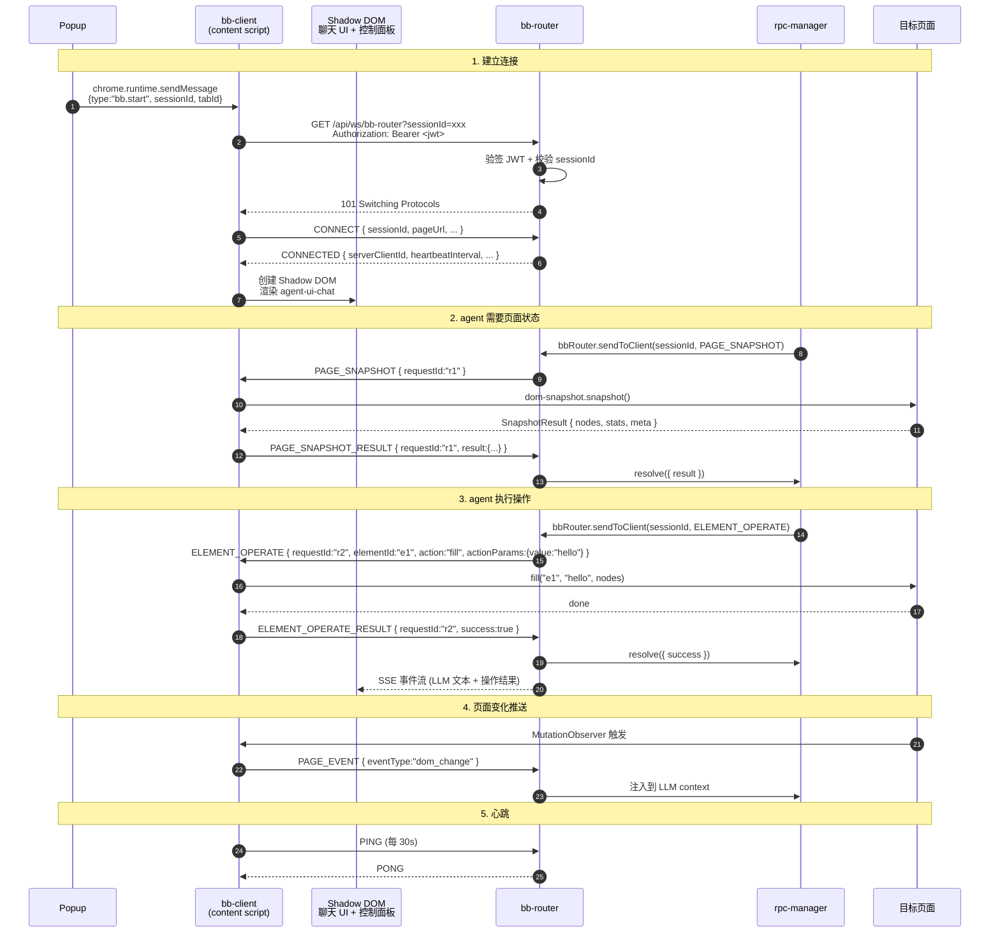
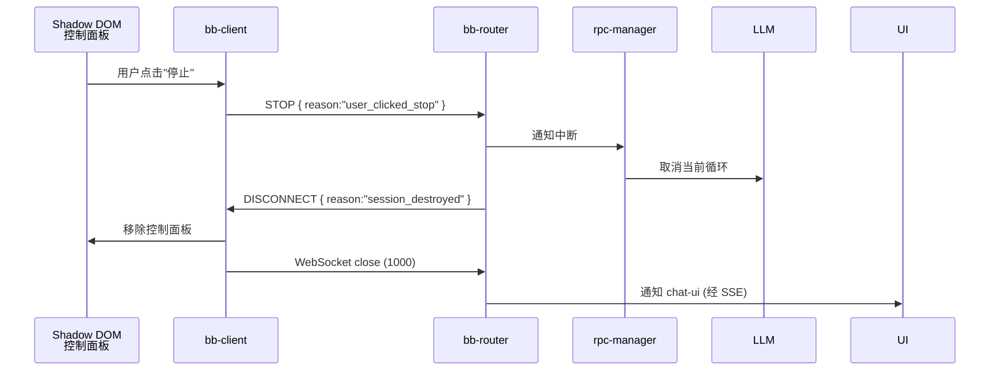

# Browser Bridge 消息协议

## 1. 概述

Browser Bridge 协议（BBP）是 bb-client（运行在浏览器 content script）和 agent-server 内置的 **bb-router** 模块之间的 WebSocket 通信协议。**agent-server 的业务逻辑通过进程内调用 bb-router 与 bb-client 通信，不再走 WebSocket**。

### 1.1 设计原则

1. **requestId 匹配响应**：每个请求都有唯一 ID，响应中包含相同的 requestId，便于追踪
2. **sessionId 强绑定**：sessionId 是唯一关联键，1 session = 1 bb-client
3. **payload 解耦**：具体消息内容放在 payload 中，便于扩展新消息类型
4. **timestamp 可追溯**：每条消息都有时间戳，便于调试和日志分析
5. **向后兼容**：`version` 字段支持协议升级
6. **类型单一**：只有一个客户端类型（`browser`），不再区分 bb-client 和 agent-server

### 1.2 协议参与者

| 角色 | 位置 | 通信方式 |
|------|------|----------|
| **bb-client** | 浏览器 content script | WebSocket 客户端 |
| **bb-router** | agent-server 内部模块 | WebSocket 服务端 + 进程内 API |
| **rpc-manager** | agent-server 内部模块 | 进程内调用 bb-router |

---

## 2. 基础结构

### 2.1 消息格式

```typescript
interface BaseMessage {
  version: string;        // 协议版本，如 "2.0"
  type: MessageType;      // 消息类型
  requestId: string;      // 请求唯一 ID，用于匹配响应（事件类消息可省略）
  timestamp: number;      // Unix 时间戳（毫秒）
  sessionId: string;      // 会话 ID，关联 agent-session
  payload: unknown;       // 具体 payload（类型由 type 决定）
}
```

### 2.2 WebSocket 握手

bb-client 连接时，**JWT 放在 HTTP Authorization 头，不在 URL query**（避免 access log 泄漏）：

```
GET /api/ws/bb-router?sessionId=sess-abc123 HTTP/1.1
Host: localhost:30141
Upgrade: websocket
Connection: Upgrade
Authorization: Bearer <jwt>
Sec-WebSocket-Version: 13
```

agent-server 在升级前完成：

1. JWT 验签（共享 `JWT_SECRET_KEY`）
2. exp 检查
3. sessionId 归属校验（`sub` user_id 必须匹配）
4. 全部通过才返回 `101 Switching Protocols`；任一失败返回 `401`

> **握手后，连接期间不再校验 JWT**（信任已建立的 session）。如需踢人，agent-server 主动关闭 WebSocket（code 1008）。

### 2.3 协议版本协商

CONNECT 消息的 `version` 字段必须匹配 bb-router 当前支持的版本：

```json
{
  "type": "CONNECT",
  "payload": { "version": "2.0", ... }
}
```

bb-router 检查版本号，不匹配时返回 `ERROR` 并关闭连接（code 1003）。

---

## 3. 消息类型总览

```typescript
type MessageType =
  // ===== 连接管理 =====
  | "CONNECT"              // bb-client → bb-router, 握手
  | "CONNECTED"            // bb-router → bb-client, 握手响应
  | "DISCONNECT"           // 任一方主动断开（含 reason）
  | "ERROR"                // 错误响应

  // ===== 页面操作 (bb-router → bb-client) =====
  | "PAGE_SNAPSHOT"                 // 请求 DOM 快照
  | "PAGE_SNAPSHOT_RESULT"          // 快照结果
  | "ELEMENT_OPERATE"               // 操作元素（click / fill）
  | "ELEMENT_OPERATE_RESULT"        // 操作结果

  // ===== 事件推送 (bb-client → bb-router) =====
  | "PAGE_EVENT"            // 页面变化事件

  // ===== UI 控制 (bb-client → bb-router) =====
  | "STOP"                  // 用户通过控制面板点"停止"

  // ===== 心跳 =====
  | "PING"
  | "PONG";
```

> **方向约定**：所有消息都是双向的，但默认方向标注在分类里。请求类消息有 `_RESULT` 后缀的响应，通过 `requestId` 匹配。
>
> **协议范围说明**：协议定义的消息需严格与 `@agegr/dom-snapshot` 当前能力对齐（v0.2.0）。dom-snapshot 仅提供 `snapshot` / `click` / `fill` 三个操作；`ELEMENT_QUERY`（CSS/XPath 查询）暂不提供，元素定位统一通过 `PAGE_SNAPSHOT` 返回的 `id`。后续如果需要额外动作，需先在 dom-snapshot 实现，再扩展协议。

---

## 4. 连接消息

### 4.1 CONNECT

bb-client 握手成功后立即发送。

```typescript
interface ConnectPayload {
  version: string;           // 协议版本，bb-client 声称支持的版本
  clientId: string;          // bb-client 生成的唯一 ID（用于日志）
  pageUrl: string;           // 当前页面 URL（仅日志用，不参与路由）
  pageTitle?: string;        // 当前页面 title
  userAgent: string;         // 浏览器 user agent
  domSnapshotVersion: string; // dom-snapshot 包版本
}

interface ConnectMessage extends BaseMessage {
  type: "CONNECT";
  payload: ConnectPayload;
}
```

**示例**：

```json
{
  "version": "2.0",
  "type": "CONNECT",
  "requestId": "req-001",
  "timestamp": 1750684800000,
  "sessionId": "sess-abc123",
  "payload": {
    "version": "2.0",
    "clientId": "bb-client-001",
    "pageUrl": "https://example.com/login",
    "pageTitle": "Login Page",
    "userAgent": "Mozilla/5.0 (Macintosh; Intel Mac OS X 10_15_7) AppleWebKit/537.36",
    "domSnapshotVersion": "1.2.0"
  }
}
```

### 4.2 CONNECTED

bb-router 确认 session 已建立。

```typescript
interface ConnectedPayload {
  serverClientId: string;       // bb-router 分配的 ID
  heartbeatInterval: number;    // 心跳间隔（毫秒）
  requestTimeout: number;       // 请求超时（毫秒）
  sessionIdleTimeout: number;   // session 闲置超时（毫秒）
  serverTime: number;           // bb-router 服务器时间（用于时钟同步）
}

interface ConnectedMessage extends BaseMessage {
  type: "CONNECTED";
  payload: ConnectedPayload;
}
```

**示例**：

```json
{
  "version": "2.0",
  "type": "CONNECTED",
  "requestId": "req-001",
  "timestamp": 1750684800000,
  "sessionId": "sess-abc123",
  "payload": {
    "serverClientId": "srv-xyz789",
    "heartbeatInterval": 30000,
    "requestTimeout": 30000,
    "sessionIdleTimeout": 1800000,
    "serverTime": 1750684800000
  }
}
```

### 4.3 DISCONNECT

任一方主动断开时发送，reason 说明原因。

```typescript
type DisconnectReason =
  | "user_stop"               // 用户主动停止（控制面板按钮）
  | "tab_closing"             // 浏览器 tab 关闭
  | "session_destroyed"       // session 被销毁
  | "replacing"               // 新连接替换旧连接
  | "shutdown"                // 服务关闭
  | "error";                  // 异常断开

interface DisconnectPayload {
  reason: DisconnectReason;
  message?: string;           // 可选说明
}

interface DisconnectMessage extends BaseMessage {
  type: "DISCONNECT";
  payload: DisconnectPayload;
}
```

---

## 5. 页面快照消息

### 5.1 PAGE_SNAPSHOT

获取当前页面 DOM 快照。**bb-router → bb-client**。

调用 dom-snapshot 的 `snapshot(root?, opts)` 接口。Payload 直接透传给该函数：

```typescript
interface PageSnapshotPayload {
  root?: string;               // CSS 选择器，限定快照根节点（默认 document.body）
  include?: string[];          // 强制纳入的 CSS Selector（绕过过滤）
  exclude?: string[];          // 强制排除的 CSS Selector
  visibleOnly?: boolean;       // 只保留可见元素（默认 true）
  interactiveOnly?: boolean;   // 只保留可交互元素（默认 true；false 会包含 heading/label 等）
  maxDepth?: number;           // 遍历最大深度（默认无限）
}

interface PageSnapshotMessage extends BaseMessage {
  type: "PAGE_SNAPSHOT";
  payload: PageSnapshotPayload;
}
```

### 5.2 PAGE_SNAPSHOT_RESULT

bb-client 返回 `snapshot()` 的完整 `SnapshotResult`：

```typescript
interface PageSnapshotResultPayload {
  success: boolean;
  result?: SnapshotResult;     // dom-snapshot 的 SnapshotResult（nodes/stats/meta）
  error?: ErrorDetail;
}

interface PageSnapshotResultMessage extends BaseMessage {
  type: "PAGE_SNAPSHOT_RESULT";
  payload: PageSnapshotResultPayload;
}
```

**SnapshotResult**（来自 `@agegr/dom-snapshot`）：

```typescript
interface SnapshotResult {
  nodes: SnapshotNode[];       // 节点数组（深度优先顺序）
  stats: SnapshotStats;        // 统计信息
  meta: SnapshotMeta;          // 元信息
}

interface SnapshotMeta {
  untrusted: true;             // 安全标志，LLM 需当作不可信输入
  sourceUrl: string | null;    // 捕获时所在 URL
  capturedAt: string;          // ISO 8601 捕获时间
  version: string;             // dom-snapshot 版本号
}

interface SnapshotStats {
  total: number;               // 节点总数
  visible: number;             // visible=true 的节点数
  byRole: Record<string, number>;  // 按 role 分类计数
  approxChars: number;         // 序列化后的近似字符数
}
```

**SnapshotNode**（来自 `@agegr/dom-snapshot`）：

```typescript
interface SnapshotNode {
  // ===== 必填字段 =====
  id: string;                  // 节点 ID，DFS 顺序，形如 e1/e2/...
  role: string;                // ARIA role（button/textbox/heading/...）
  name: string;                // accessible name
  visible: boolean;            // 元素是否视觉可见
  rect: { x: number; y: number; width: number; height: number };

  // ===== 可选字段（只在元素有相应语义时附带）=====
  value?: string;              // input/textarea/select 当前值
  level?: number;              // heading 级别 1-6
  href?: string;               // a/area/link → href；img/iframe → src
  checked?: boolean;           // checkbox/radio/switch 的勾选状态（仅勾选时为 true）
  disabled?: boolean;          // 元素是否被禁用（仅禁用时为 true）
  placeholder?: string;        // input/textarea 的 placeholder
  text?: string;               // 元素可见文本（仅 button/link/option/tab/menuitem 等有值）
  labeledBy?: string;          // 被 <label for> 关联时记录 label id
  radioGroup?: string;         // radio 按钮的 group name
  states?: string[];           // 其他状态：required / expanded / collapsed / selected
  depth?: number;              // DOM 树中的深度（调试用）
  business?: BusinessAnnotation;  // 业务标注（来自 data-ai-* 属性）
}

interface BusinessAnnotation {
  desc?: string;               // 业务描述（data-ai-desc）
  type?: string;               // 业务类型（data-ai-type）
  context?: string;            // 业务上下文（data-ai-context）
}
```

> **未提供字段说明**：
>
> - `tagName` — DOM 标签名，dom-snapshot 不返回；需要时可从 `role` 推断
> - `attributes` — 原始 HTML 属性，dom-snapshot 只提取语义字段
> - `children` — dom-snapshot 输出扁平数组，父子关系通过 `depth` 和数组顺序推断
> - `isVisible` — 协议使用 `visible`（强制为必填字段）
> - `isInteractive` — 由 LLM 根据 `role` 判断，dom-snapshot 不显式标注

---

## 6. 元素操作消息

> **定位原则**：dom-snapshot v0.2.0 仅提供基于 `id` 的元素定位（通过 `click(id, nodes?)` / `fill(id, value, nodes?)`）。协议**不**支持 CSS/XPath 选择器定位；调用方必须先通过 `PAGE_SNAPSHOT` 拿到元素 `id`，再发起操作。

### 6.1 ELEMENT_OPERATE

操作元素。**bb-router → bb-client**。

```typescript
type ElementAction = "click" | "fill";

interface ElementOperatePayload {
  // 定位元素（仅支持 id）
  elementId: string;           // 来自 SnapshotNode.id（如 "e1", "e2"）

  action: ElementAction;

  // actionParams 仅 fill 需要
  actionParams?: {
    value: string;             // fill 时填写的文本值
  };

  // 可选：附加最近一次 snapshot 结果，避免 id 过期
  nodes?: SnapshotNode[];      // 上一次的 snapshot nodes（用于元素解析）
}

interface ElementOperateMessage extends BaseMessage {
  type: "ELEMENT_OPERATE";
  payload: ElementOperatePayload;
}
```

**action 行为说明**：

| action | 行为 | actionParams | 适用元素 |
|--------|------|--------------|----------|
| `click` | 触发 `el.click()`（模拟点击事件）| 不需要 | 任意可点击元素（button/link 等）|
| `fill`  | native setter 写入 value，触发 `input` + `change` 事件 | `{ value: string }` | `input` / `textarea` |

> **后续扩展**：dom-snapshot 后续版本可能新增 `select` / `check` / `hover` / `scroll` 等操作，协议在 minor 版本同步增加 action 类型。

### 6.2 ELEMENT_OPERATE_RESULT

```typescript
interface ElementOperateResultPayload {
  success: boolean;            // 整体成功标志
  action: ElementAction;
  result?: {
    id: string;                // 操作的元素 id
    newValue?: string;         // fill 后输入框的新值
  };
  error?: ErrorDetail & { recoverable?: boolean };  // recoverable 决定是否自动重试
}

interface ElementOperateResultMessage extends BaseMessage {
  type: "ELEMENT_OPERATE_RESULT";
  payload: ElementOperateResultPayload;
}
```

> **错误信息映射**（来自 dom-snapshot `OperationResult.message`）：
>
> - "找不到 id=xxx 对应的元素" →  `ELEMENT_NOT_FOUND`
> - "xxx 元素被禁用" → `ELEMENT_NOT_INTERACTIVE`
> - "xxx 不是可填写的 input/textarea" → `ELEMENT_NOT_INTERACTIVE`

---

## 7. 页面事件消息

### 7.1 PAGE_EVENT

bb-client 主动推送的页面变化事件。**bb-client → bb-router**。

```typescript
type PageEventType =
  | "url_change"              // URL 变化（pushState/replace/hashchange）
  | "title_change"            // document.title 变化
  | "dom_change"              // DOM 变化（MutationObserver 触发）
  | "navigation"              // 完整页面导航（beforeunload/load）
  | "ready"                   // 页面 DOMContentLoaded
  | "visibility_change"       // tab 切到后台/前台
  | "close";                  // tab 即将关闭

interface PageEventPayload {
  clientId: string;           // 发送方 bb-client ID
  eventType: PageEventType;
  data?: {
    url?: string;             // url_change/navigation 时
    title?: string;           // title_change 时
    timestamp: number;        // 事件发生时间
    hidden?: boolean;         // visibility_change 时
  };
}

interface PageEventMessage extends BaseMessage {
  type: "PAGE_EVENT";
  payload: PageEventPayload;
}
```

> **背压策略**：`dom_change` 事件频率高，需在 bb-client 端做节流（默认 100ms）+ 防抖（默认 500ms）；超过节流阈值的连续变化合并为一条事件。

---

## 8. UI 控制消息

### 8.1 STOP

用户通过 Shadow DOM 控制面板的"停止 agent"按钮触发。**bb-client → bb-router**。

```typescript
interface StopPayload {
  reason: "user_clicked_stop" | "panel_closing" | "error_threshold_exceeded";
  context?: {
    lastOpType?: MessageType;     // 触发停止的最后一个操作类型
    lastError?: ErrorDetail;      // 如果是 error_threshold_exceeded
  };
}

interface StopMessage extends BaseMessage {
  type: "STOP";
  payload: StopPayload;
}
```

bb-router 收到后立即：

1. 取消 pending 的请求
2. 通知 rpc-manager 中断当前 LLM 循环
3. 关闭 session（WebSocket code 1000）
4. 通知 chat-ui

---

## 9. 错误消息

### 9.1 ERROR

任意错误场景都可以发 ERROR，通常带 `originalRequestId` 关联到出错的请求。

```typescript
interface ErrorDetail {
  code: ErrorCode;             // 见 10.2 错误码表
  message: string;             // 人类可读
  details?: Record<string, unknown>;  // 额外上下文（如堆栈、selector）
}

interface ErrorMessage extends BaseMessage {
  type: "ERROR";
  payload: ErrorDetail & { originalRequestId?: string };
}
```

### 9.2 错误码

| 错误码 | 类别 | 触发场景 | 处理策略 |
|--------|------|----------|----------|
| `INVALID_VERSION` | 协议 | 协议版本不匹配 | 关闭连接，提示升级 bb-client |
| `INVALID_MESSAGE` | 协议 | 消息格式错误 | 关闭连接（code 1003） |
| `WS_UNAUTHORIZED` | 握手 | JWT 验签失败 / 过期 | 401，不升级 WebSocket；chat-ui 触发重新登录 |
| `WS_SESSION_NOT_FOUND` | 握手 | sessionId 不存在 | 401；chat-ui 重新创建 session |
| `WS_SESSION_FORBIDDEN` | 握手 | sessionId 不属于 JWT sub | 403；权限错误 |
| `WS_RATE_LIMITED` | 握手 | 单用户 session 超限 | 429；提示用户关闭多余 session |
| `SESSION_NOT_ACTIVE` | 路由 | session 已销毁 | 重连或结束 |
| `CLIENT_NOT_FOUND` | 路由 | 目标客户端已离线 | 等待重连 / 通知用户 |
| `ELEMENT_NOT_FOUND` | 操作 | id 找不到对应元素 | 通知 LLM 重新 snapshot |
| `ELEMENT_NOT_INTERACTIVE` | 操作 | 元素被禁用 / 类型不匹配（如 fill 非 input）| 通知 LLM 等待或换元素 |
| `OPERATION_FAILED` | 操作 | 操作执行异常 | 检查 `recoverable` 决定重试 |
| `OPERATION_TIMEOUT` | 操作 | 操作超时 | 重试一次 |
| `REQUEST_TIMEOUT` | 通信 | 请求 30s 未响应 | 重试（指数退避）|
| `TARGET_CLIENT_OFFLINE` | 通信 | 目标客户端已离线 | 等待重连 / 通知用户 |
| `MAX_SESSIONS_EXCEEDED` | 系统 | 单用户 > 5 sessions | 提示用户关闭多余 session |
| `INTERNAL_ERROR` | 系统 | 内部异常 | 关闭 session，记录日志 |

> **已删除的错误码**（v2.0 → dom-snapshot v0.2.0 对齐）：
>
> - `ELEMENT_NOT_VISIBLE` — dom-snapshot 无可见性预检，由 LLM 通过 `visible:false` 字段判断
> - `ELEMENT_AMBIGUOUS` — id 定位无歧义场景

---

## 10. 心跳消息

### 10.1 PING / PONG

```typescript
// bb-client → bb-router
interface PingMessage extends BaseMessage {
  type: "PING";
  payload: {};
}

// bb-router → bb-client
interface PongMessage extends BaseMessage {
  type: "PONG";
  payload: {};
}
```

**规则**：

- bb-client 每隔 `heartbeatInterval`（CONNECTED 响应中的值，默认 30s）发送 PING
- bb-router 收到 PING 立即返回 PONG
- bb-router 检测到 `heartbeatTimeout`（默认 60s）未收到任何消息 → 判定离线
- bb-client 检测到 `heartbeatTimeout` 未收到 PONG → 主动断开，进入重连

---

## 11. 完整交互流程

### 11.1 正常流程



### 11.2 用户停止流程



### 11.3 401 / 重新登录流程


---

## 12. TypeScript 类型定义

完整类型定义（建议放到 `@agegr/bb-protocol` 包共享给 agent-server 和 agent-steer）：

```typescript
// types/bb-protocol.ts

// ========== 基础 ==========

export const BBP_VERSION = "2.0";

export interface BaseMessage {
  version: string;
  type: MessageType;
  requestId: string;
  timestamp: number;
  sessionId: string;
  payload: unknown;
}

export type MessageType =
  | "CONNECT"
  | "CONNECTED"
  | "DISCONNECT"
  | "ERROR"
  | "PAGE_SNAPSHOT"
  | "PAGE_SNAPSHOT_RESULT"
  | "ELEMENT_OPERATE"
  | "ELEMENT_OPERATE_RESULT"
  | "PAGE_EVENT"
  | "STOP"
  | "PING"
  | "PONG";

// ========== 连接 ==========

export interface ConnectPayload {
  version: string;
  clientId: string;
  pageUrl: string;
  pageTitle?: string;
  userAgent: string;
  domSnapshotVersion: string;
}

export interface ConnectMessage extends BaseMessage {
  type: "CONNECT";
  payload: ConnectPayload;
}

export interface ConnectedPayload {
  serverClientId: string;
  heartbeatInterval: number;
  requestTimeout: number;
  sessionIdleTimeout: number;
  serverTime: number;
}

export interface ConnectedMessage extends BaseMessage {
  type: "CONNECTED";
  payload: ConnectedPayload;
}

export type DisconnectReason =
  | "user_stop"
  | "tab_closing"
  | "session_destroyed"
  | "replacing"
  | "shutdown"
  | "error";

export interface DisconnectPayload {
  reason: DisconnectReason;
  message?: string;
}

export interface DisconnectMessage extends BaseMessage {
  type: "DISCONNECT";
  payload: DisconnectPayload;
}

// ========== 页面快照 ==========

export interface PageSnapshotPayload {
  root?: string;               // CSS 选择器限定根节点（默认 document.body）
  include?: string[];          // 强制纳入的 CSS Selector（绕过过滤）
  exclude?: string[];          // 强制排除的 CSS Selector
  visibleOnly?: boolean;       // 只保留可见元素（默认 true）
  interactiveOnly?: boolean;   // 只保留可交互元素（默认 true）
  maxDepth?: number;           // 遍历最大深度（默认无限）
}

export interface PageSnapshotMessage extends BaseMessage {
  type: "PAGE_SNAPSHOT";
  payload: PageSnapshotPayload;
}

// SnapshotNode / SnapshotStats / SnapshotMeta / SnapshotResult
// 与 @agegr/dom-snapshot 实际类型一致（v0.2.0）

export interface BusinessAnnotation {
  desc?: string;
  type?: string;
  context?: string;
}

export interface SnapshotNode {
  // 必填字段
  id: string;
  role: string;
  name: string;
  visible: boolean;
  rect: { x: number; y: number; width: number; height: number };
  // 可选字段
  value?: string;
  level?: number;
  href?: string;
  checked?: boolean;
  disabled?: boolean;
  placeholder?: string;
  text?: string;
  labeledBy?: string;
  radioGroup?: string;
  states?: string[];
  depth?: number;
  business?: BusinessAnnotation;
}

export interface SnapshotStats {
  total: number;
  visible: number;
  byRole: Record<string, number>;
  approxChars: number;
}

export interface SnapshotMeta {
  untrusted: true;
  sourceUrl: string | null;
  capturedAt: string;
  version: string;
}

export interface SnapshotResult {
  nodes: SnapshotNode[];
  stats: SnapshotStats;
  meta: SnapshotMeta;
}

export interface PageSnapshotResultPayload {
  success: boolean;
  result?: SnapshotResult;
  error?: ErrorDetail;
}

export interface PageSnapshotResultMessage extends BaseMessage {
  type: "PAGE_SNAPSHOT_RESULT";
  payload: PageSnapshotResultPayload;
}

// ========== 元素操作 ==========
// dom-snapshot v0.2.0 仅支持 click / fill 两个 action

export type ElementAction = "click" | "fill";

export interface ElementOperatePayload {
  elementId: string;
  action: ElementAction;
  actionParams?: { value: string };  // 仅 fill 需要
  nodes?: SnapshotNode[];            // 可选快照缓存（避免 id 过期）
}

export interface ElementOperateMessage extends BaseMessage {
  type: "ELEMENT_OPERATE";
  payload: ElementOperatePayload;
}

export interface ElementOperateResultPayload {
  success: boolean;
  action: ElementAction;
  result?: {
    id: string;                // 操作的元素 id
    newValue?: string;         // fill 后输入框的新值
  };
  error?: (ErrorDetail & { recoverable?: boolean }) | undefined;
}

export interface ElementOperateResultMessage extends BaseMessage {
  type: "ELEMENT_OPERATE_RESULT";
  payload: ElementOperateResultPayload;
}

// ========== 页面事件 ==========

export type PageEventType =
  | "url_change"
  | "title_change"
  | "dom_change"
  | "navigation"
  | "ready"
  | "visibility_change"
  | "close";

export interface PageEventPayload {
  clientId: string;
  eventType: PageEventType;
  data?: {
    url?: string;
    title?: string;
    timestamp: number;
    hidden?: boolean;
  };
}

export interface PageEventMessage extends BaseMessage {
  type: "PAGE_EVENT";
  payload: PageEventPayload;
}

// ========== UI 控制 ==========

export interface StopPayload {
  reason: "user_clicked_stop" | "panel_closing" | "error_threshold_exceeded";
  context?: {
    lastOpType?: MessageType;
    lastError?: ErrorDetail;
  };
}

export interface StopMessage extends BaseMessage {
  type: "STOP";
  payload: StopPayload;
}

// ========== 错误 ==========

export const ErrorCodes = {
  // 协议层
  INVALID_VERSION: "INVALID_VERSION",
  INVALID_MESSAGE: "INVALID_MESSAGE",
  // 握手
  WS_UNAUTHORIZED: "WS_UNAUTHORIZED",
  WS_SESSION_NOT_FOUND: "WS_SESSION_NOT_FOUND",
  WS_SESSION_FORBIDDEN: "WS_SESSION_FORBIDDEN",
  WS_RATE_LIMITED: "WS_RATE_LIMITED",
  // 路由
  SESSION_NOT_ACTIVE: "SESSION_NOT_ACTIVE",
  CLIENT_NOT_FOUND: "CLIENT_NOT_FOUND",
  // 操作
  ELEMENT_NOT_FOUND: "ELEMENT_NOT_FOUND",
  ELEMENT_NOT_INTERACTIVE: "ELEMENT_NOT_INTERACTIVE",
  OPERATION_FAILED: "OPERATION_FAILED",
  OPERATION_TIMEOUT: "OPERATION_TIMEOUT",
  // 通信
  REQUEST_TIMEOUT: "REQUEST_TIMEOUT",
  TARGET_CLIENT_OFFLINE: "TARGET_CLIENT_OFFLINE",
  // 系统
  MAX_SESSIONS_EXCEEDED: "MAX_SESSIONS_EXCEEDED",
  INTERNAL_ERROR: "INTERNAL_ERROR",
} as const;

export type ErrorCode = typeof ErrorCodes[keyof typeof ErrorCodes];

export interface ErrorDetail {
  code: ErrorCode;
  message: string;
  details?: Record<string, unknown>;
}

export interface ErrorMessage extends BaseMessage {
  type: "ERROR";
  payload: ErrorDetail & { originalRequestId?: string };
}

// ========== 心跳 ==========

export interface PingMessage extends BaseMessage {
  type: "PING";
  payload: Record<string, never>;
}

export interface PongMessage extends BaseMessage {
  type: "PONG";
  payload: Record<string, never>;
}
```

---

## 13. 协议参数

### 13.1 默认值

| 参数 | 默认值 | 覆盖来源 | 说明 |
|------|--------|----------|------|
| `version` | `"2.0"` | 编译时常量 | 协议版本 |
| `heartbeatInterval` | 30000ms | CONNECTED 响应 | 心跳发送间隔 |
| `heartbeatTimeout` | 60000ms | agent-server 配置 | 心跳超时 |
| `requestTimeout` | 30000ms | CONNECTED 响应 | 请求-响应超时 |
| `reconnectInitialDelay` | 1000ms | bb-client 配置 | 重连初始延迟 |
| `reconnectMaxDelay` | 30000ms | bb-client 配置 | 重连最大延迟 |
| `maxReconnectAttempts` | 10 | bb-client 配置 | 最大重连次数 |
| `sessionIdleTimeout` | 1800000ms (30min) | CONNECTED 响应 | session 闲置超时 |
| `maxSessionsPerUser` | 5 | agent-server 配置 | 单用户 session 上限 |
| `domChangeThrottle` | 100ms | bb-client 配置 | dom_change 节流 |
| `domChangeDebounce` | 500ms | bb-client 配置 | dom_change 防抖 |

### 13.2 版本兼容性

当前协议版本 `2.0`。后续升级规则：

- **小版本（2.x）**：新增可选字段、`payload` 子结构，向后兼容
- **大版本（3.0）**：必须双发协议版本号，bb-router 同时支持新旧版本至少 1 个发布周期

---

## 14. 与其他文档的关系

- **架构总览**：[browser-bridge.md](./browser-bridge) - 组件职责、连接流程、Shadow DOM 设计
- **认证设计**：[neo-agents.md §6](./neo-agents#6-认证与授权设计) - WebSocket 握手的 JWT 校验
- **dom-snapshot 实际类型**：[`@agegr/dom-snapshot`](https://github.com/...) - SnapshotNode / SnapshotResult 字段定义（v0.2.0）

---

## 15. 版本历史

| 版本 | 日期 | 变更 |
|------|------|------|
| 2.0.0 | 2026-06-22 | 初版：bb-router 内置模块，bb-client + Shadow DOM，JWT 握手，完整消息协议 |
