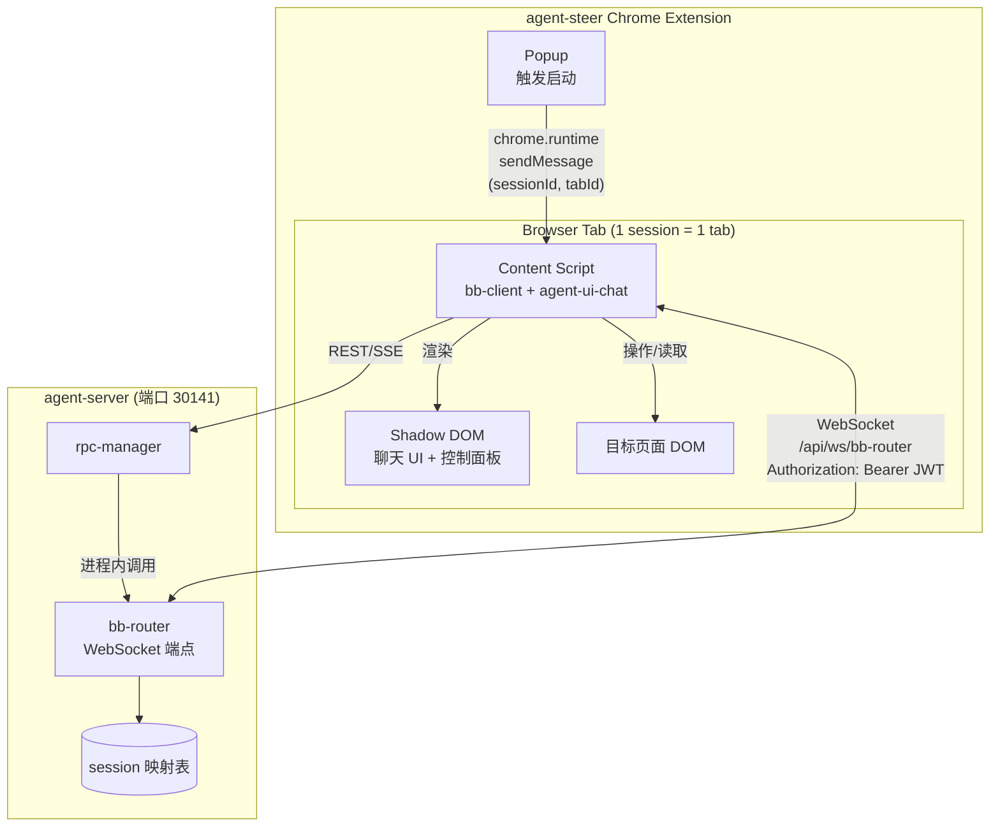
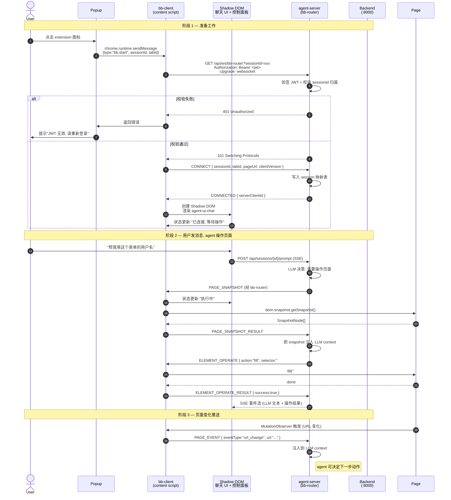
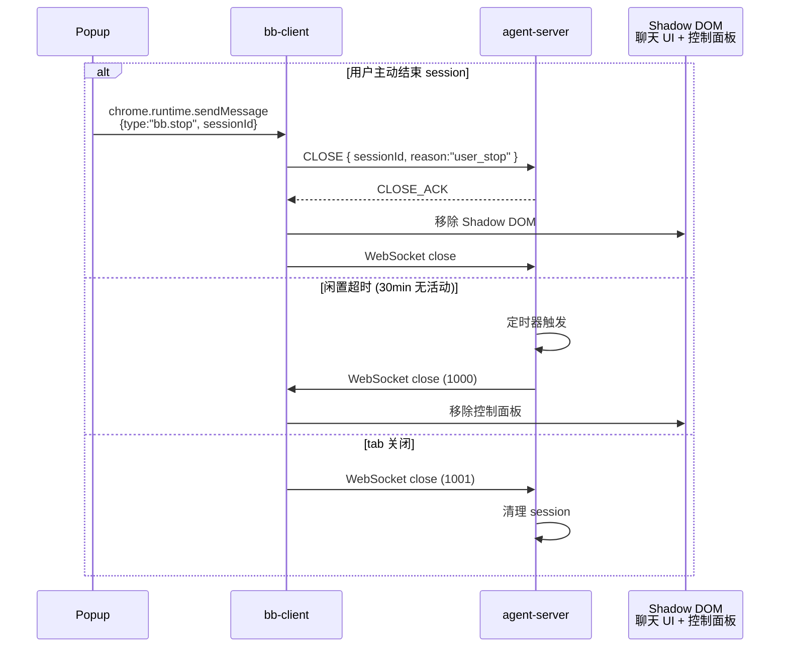

# Browser Bridge 详细设计

## 1. 背景

### 1.1 问题

Neo Agents 提供的 AI 编程智能体需要**在用户的真实浏览器里操作网页**——填充表单、点击按钮、读取页面状态。当用户说"帮我在这个网站登录"，智能体必须能：

1. 看到目标页面的 DOM 结构
2. 模拟用户操作（点击 / 填写 / 滚动）
3. 监听页面变化（URL 变化、DOM 变化）

而智能体本身（`pi-coding-agent` SDK）运行在 `agent-server` 的 Node 进程里——**它无法直接访问用户的浏览器**。Browser Bridge 就是架在两者之间的桥梁。

### 1.2 目标

1. **低延迟**：智能体发指令到页面执行，< 200ms 完成单次操作
2. **1:1:1 强绑定**：一个 chat session 严格对应一个浏览器标签页，避免跨 tab 误操作
3. **样式隔离**：通过 Shadow DOM 把 Agent 控制面板注入到目标网站，不污染原页面样式
4. **可观测**：所有页面事件、DOM 操作都有结构化日志，便于调试和回放
5. **可恢复**：bb-client 断线自动重连，session 闲置超时自动清理

---

## 2. 核心约束

以下约束是整个设计的基础，**不可更改**：

| 约束 | 说明 |
|------|------|
| **1:1:1 关系** | 1 chat session = 1 browser tab = 1 bb-client = 1 agent session |
| **sessionId 是关联键** | 由 agent-server 创建并下发给 bb-client，两者通过 sessionId 严格匹配 |
| **bb-router 内置** | bb-router 作为模块集成在 agent-server 内，端口 30141；**不**是独立进程 |
| **bb-client 在 content script** | 运行在 agent-steer 的 content script 里，通过 Shadow DOM 挂载 Agent 控制面板 |
| **agent-server 不再走 WebSocket** | agent-server 通过进程内 API 调用 bb-router，**不**经过 WebSocket |

### 2.1 关系图



---

## 3. 组件职责

### 3.1 bb-client

- **位置**：agent-steer content script（运行在每个 active tab）
- **包名**：`@agegr/bb-client`（独立 npm 包，被 agent-steer 引入）
- **运行环境**：Chrome Extension content script context
- **职责**：
  - 接收来自 popup 的 sessionId，启动 WebSocket 连接 `/api/ws/bb-router`
  - 渲染 `agent-ui-chat` 聊天组件到 Shadow DOM
  - 通过 Shadow DOM 在目标页面挂载 Agent 控制面板
  - 接收 agent-server 的页面操作指令，调用 `dom-snapshot` 执行
  - 监听页面变化（URL / DOM），通过 `PAGE_EVENT` 推送给 agent-server
  - 断线自动重连（指数退避，最多 10 次）

### 3.2 Agent 控制面板 + 聊天 UI（Shadow DOM）

- **位置**：目标网站 body 末尾的 Shadow Root（`mode: "closed"`）
- **职责**：
  - **聊天 UI**：由 `agent-ui-chat` 渲染，提供用户与 Agent 对话界面
  - **控制面板**：显示 Agent 当前状态（"观察中" / "执行中" / "等待确认"）
  - 提供**调试入口**：实时显示当前 snapshot、最后 10 条操作记录、错误堆栈
- **设计原则**：
  - 不影响原页面 DOM 结构（Shadow DOM 隔离）
  - 不读取用户隐私数据（仅显示状态和元信息）
  - 用户可一键收起 / 展开

### 3.3 BB Router

- **位置**：`agent-server` 内置模块（`lib/bb-router.ts`）
- **依赖**：随 agent-server 进程启动，监听 `/api/ws/bb-router` 路径
- **职责**：
  - WebSocket 端点：接受 bb-client 的升级请求
  - 握手时验签 JWT，校验通过后建立 session 映射
  - 消息路由：接收 bb-client 的响应/事件，转发给对应的 agent session
  - 进程内 API：暴露 `sendToClient(sessionId, message)` 给 rpc-manager 调用
  - Session 生命周期管理（创建 / 闲置超时 / 主动销毁）
  - 心跳保活

### 3.4 rpc-manager（agent-server 内部）

- **位置**：`agent-server/lib/rpc-manager.ts`
- **职责**：
  - 包装 `pi-coding-agent` 的 `AgentSession`
  - 接收 chat-ui 的 prompt，驱动 LLM 决策
  - 当 LLM 决定需要操作页面时，**通过进程内 API**调用 bb-router（不经过 WebSocket）
  - 接收 bb-client 的 `PAGE_SNAPSHOT_RESULT` / `ELEMENT_OPERATE_RESULT` / `PAGE_EVENT`
  - 把结果注入到 agent context

### 3.5 dom-snapshot

- **位置**：`@agegr/dom-snapshot`（独立 npm 包）
- **运行环境**：浏览器（被 bb-client 调用）
- **职责**：
  - DOM → 扁平节点数组（id 按 DFS 顺序）
  - 提供 click / fill / scroll 等操作（兼容 React/Vue）
  - 计算 ARIA role + accessible name

---

## 4. 认证设计

### 4.1 WebSocket 握手

bb-client 连接 `/api/ws/bb-router` 时必须携带 JWT：

```
GET /api/ws/bb-router?sessionId=sess-abc123 HTTP/1.1
Host: localhost:30141
Upgrade: websocket
Connection: Upgrade
Authorization: Bearer <jwt>
Sec-WebSocket-Version: 13
```

agent-server 在升级前完成以下校验：

1. **JWT 验签**：用与 backend 共享的 `JWT_SECRET_KEY` 验证签名
2. **exp 检查**：JWT 未过期
3. **sessionId 归属校验**：校验该 sessionId 属于 `sub` user_id
4. **不通过直接 401**，不升级 WebSocket

### 4.2 与 neo-agents 认证的协同

完整认证链路详见 [neo-agents.md §6](./neo-agents#6-认证与授权设计)。本节只描述 bridge 相关的部分：

- JWT 一路从 frontend → agent-steer (chrome.storage.session) → bb-client (WebSocket header) → agent-server (验签)
- **不允许 token 出现在 URL query**（避免 access log 泄漏）
- 握手通过后，连接期间不再校验（信任连接建立后的 session）

### 4.3 sessionId 创建时机

```
chat-ui POST /api/sessions ──► agent-server 创建 sessionId ──► 返回给 chat-ui
chat-ui chrome.runtime.sendMessage(sessionId) ──► bb-client CONNECT(sessionId)
bb-client GET /api/ws/bb-router?sessionId=xxx + JWT ──► agent-server 校验 + 关联
```

sessionId 在 chat-ui 创建 chat session 时由 agent-server 颁发，下发给 bb-client。

---

## 5. 连接流程

### 5.1 正常时序



### 5.2 关键时序点

| 时刻 | 事件 | 说明 |
|------|------|------|
| T1 | Popup 触发 bb-client 启动 | 传递 sessionId 和 tabId |
| T2 | bb-client 发起 WS 握手 | URL `?sessionId=xxx` + `Authorization: Bearer` header |
| T3 | agent-server 验签 | 不通过 → 401；通过 → 升级 + 写入 session 映射 |
| T4 | bb-client 渲染 Shadow DOM | 挂载 agent-ui-chat + 控制面板, 显示 "已连接" |
| T5 | 业务循环 | 用户在 Shadow DOM 聊天 → PAGE_SNAPSHOT → ELEMENT_OPERATE → PAGE_EVENT |

### 5.3 关闭流程



---

## 6. Session 生命周期

### 6.1 状态机


### 6.2 创建

session 在 chat-ui 调用 `POST /api/sessions` 时创建，此时 bb-client **尚未连接**。

### 6.3 Connecting → Active

bb-client 发起 WS 握手 → 验签 → CONNECT → CONNECTED，session 进入 Active。

### 6.4 销毁

满足以下任一条件时销毁 session：

1. 用户主动结束（chat-ui 调用 `DELETE /api/sessions/{id}`）
2. bb-client 关闭 tab（WebSocket 1001）
3. 30 分钟无活动（任何一方）
4. bb-client 重连超过 `maxReconnectAttempts` (默认 10)
5. agent-server 关闭（进程级销毁所有 session）

### 6.5 bb-client 离线 / 重连

| 场景 | agent-server 行为 | bb-client 行为 |
|------|-------------------|----------------|
| 短暂断网（< 10s） | session 保持，等待重连 | 指数退避重连 (1s/2s/4s/8s/16s/30s 封顶) |
| 长时断网（> 10s） | 标记 session 为 Reconnecting | 继续重连，最多 10 次 |
| 重连成功 | session 恢复 Active | 重新发送 CONNECT |
| 重连失败 | 销毁 session, 通知 chat-ui | 显示 "连接已断开" 状态 |

### 6.6 agent-server 重启

- 所有 session 销毁
- chat-ui 收到 503 错误
- 用户需重新创建 session（拿到新 sessionId）+ 重新触发 bb-client 连接

---

## 7. Shadow DOM 控制面板设计

### 7.1 挂载位置

- 目标网站 `<body>` 末尾
- `attachShadow({ mode: "closed" })` — 外部 JS 无法访问
- z-index 最高，但定位 fixed 在屏幕角落，默认不抢焦点

### 7.2 内部结构

```
<host-element id="neo-agent-panel">
  #shadow-root (closed)
    <div class="neo-panel neo-panel--minimized">
      <header class="neo-panel__header">
        <span class="neo-panel__status">● 已连接</span>
        <button class="neo-panel__toggle">▾</button>
      </header>
      <main class="neo-panel__body" hidden>
        <section class="neo-panel__state">
          <h3>当前状态</h3>
          <p>观察中 / 执行中 / 等待确认</p>
        </section>
        <section class="neo-panel__snapshot">
          <h3>最后 Snapshot</h3>
          <pre>{id:"n1", tagName:"INPUT", role:"textbox"}</pre>
        </section>
        <section class="neo-panel__ops">
          <h3>最近 10 条操作</h3>
          <ul>
            <li>14:23:01 fill #username → ✓</li>
            <li>14:23:03 click #submit → ✗ ELEMENT_NOT_FOUND</li>
          </ul>
        </section>
        <section class="neo-panel__errors">
          <h3>错误日志</h3>
          <pre>...</pre>
        </section>
      </main>
    </div>
    <style>...</style>
</host-element>
```

### 7.3 样式隔离

- 所有 class 名称加 `neo-` 前缀
- CSS 变量定义在 `:host` 上
- 不用 Tailwind（避免与原网站冲突）
- 颜色 / 字体走系统变量（`color-scheme: light dark`）

### 7.4 调试入口

控制面板的"操作记录"和"错误日志"是核心调试入口，agent-steer 开发者和高级用户都依赖它：

- 出问题时第一时间查看 "最近操作" 是否成功
- "错误日志" 显示 dom-snapshot 抛出的完整堆栈
- "最后 Snapshot" 可以手动复制出来，反馈 bug 时附上

### 7.5 用户控制

- 点击头部展开 / 收起
- 长按头部可"最小化到角标"
- 提供"停止 agent"按钮 — 立即发送 `STOP` 指令给 agent-server，中断当前 LLM 循环

---

## 8. 配置参数

### 8.1 agent-server (bb-router)

```typescript
interface BBRouterConfig {
  // WebSocket 路径
  path: string;                        // 默认 "/api/ws/bb-router"

  // 心跳
  heartbeatInterval: number;           // 默认 30000ms
  heartbeatTimeout: number;            // 默认 60000ms

  // Session
  sessionIdleTimeout: number;          // 默认 1800000ms (30min)
  maxSessionsPerUser: number;          // 默认 5 (防止资源滥用)

  // 限流
  maxConcurrentOperations: number;     // 默认 10 (每 session)
}
```

### 8.2 bb-client

```typescript
interface BBClientConfig {
  // 端点
  agentServerUrl: string;              // 默认 "ws://localhost:30141/api/ws/bb-router"

  // 重连
  reconnectInitialDelay: number;       // 默认 1000ms
  reconnectMaxDelay: number;           // 默认 30000ms
  maxReconnectAttempts: number;        // 默认 10

  // 请求超时
  requestTimeout: number;              // 默认 30000ms (PAGE_SNAPSHOT/OPERATE)

  // Shadow DOM
  panelDefaultMinimized: boolean;      // 默认 true
  panelPosition: 'bottom-right' | 'bottom-left';  // 默认 'bottom-right'
}
```

### 8.3 配置来源

- **开发**：两份 `.env` 文件 / `chrome.storage.local`
- **生产**：K8s ConfigMap (agent-server) + Chrome Extension 打包配置 (bb-client)
- **运行时变更**：bb-client 配置通过 `chrome.storage.local` 支持热更新（agent-server 端需重启）

---

## 9. 消息路由

### 9.1 进程内路由（agent-server 内部）

```typescript
// rpc-manager 想让 bb-client 执行操作
await bbRouter.sendToClient(sessionId, {
  type: 'ELEMENT_OPERATE',
  requestId: nanoid(),
  payload: { action: 'click', selector: '#submit' }
});

// 收到 bb-client 的响应（requestId 匹配）
bbRouter.onMessage(sessionId, (message) => {
  switch (message.type) {
    case 'PAGE_SNAPSHOT_RESULT': /* 注入 LLM context */ break;
    case 'ELEMENT_OPERATE_RESULT': /* ... */ break;
    case 'PAGE_EVENT': /* 实时事件流 */ break;
  }
});
```

### 9.2 session 映射表

```typescript
// agent-server 内部状态
class BBRouter {
  private sessions = new Map<string, SessionState>();
  // sessionId -> SessionState
}

interface SessionState {
  sessionId: string;
  userId: number;             // JWT sub
  bbClient?: WebSocket;        // bb-client 连接
  createdAt: number;
  lastActivity: number;
  // 关联的 AgentSession 引用
  agentSessionId: string;
  // pendingRequests 用于 requestId 匹配
  pendingRequests: Map<string, PendingRequest>;
}
```

### 9.3 请求-响应匹配

```typescript
async function sendRequest(
  sessionId: string,
  message: BaseMessage
): Promise<BaseMessage> {
  return new Promise((resolve, reject) => {
    const timer = setTimeout(() => {
      this.pendingRequests.delete(message.requestId);
      reject(new Error('Request timeout'));
    }, this.requestTimeout);

    this.pendingRequests.set(message.requestId, {
      resolve,
      reject,
      timer,
      sessionId,
    });

    this.sendToClient(sessionId, message);
  });
}
```

---

## 10. 错误处理

### 10.1 错误分类

| 类别 | 错误码 | 触发场景 | 处理策略 |
|------|--------|----------|----------|
| 握手 | `WS_UNAUTHORIZED` | JWT 验签失败 / 过期 | chat-ui 触发重新登录 |
| 握手 | `WS_SESSION_NOT_FOUND` | sessionId 不存在 | chat-ui 重新创建 session |
| 路由 | `CLIENT_NOT_FOUND` | 目标 bb-client 已离线 | 等待重连 / 通知用户 |
| 操作 | `ELEMENT_NOT_FOUND` | 选择器无匹配 | 通知 LLM 重新定位 |
| 操作 | `ELEMENT_NOT_VISIBLE` | 元素不可见 | 通知 LLM 滚动到可见 |
| 操作 | `ELEMENT_NOT_INTERACTIVE` | 元素被禁用 | 通知 LLM 等待 |
| 操作 | `OPERATION_FAILED` | 操作执行异常 | 检查 `recoverable` 决定是否重试 |
| 通信 | `REQUEST_TIMEOUT` | 操作 30s 未响应 | 重试一次（指数退避）|
| 通信 | `CLIENT_OFFLINE` | bb-client 断线 | session 进入 Reconnecting |
| 系统 | `MAX_SESSIONS_EXCEEDED` | 单用户超过 5 个 session | 提示用户关闭多余 session |

### 10.2 重试策略

```typescript
interface RetryConfig {
  maxAttempts: number;       // 默认 3 (操作错误) / 10 (重连)
  baseDelay: number;          // 默认 1000ms
  maxDelay: number;           // 默认 10000ms
  backoffMultiplier: number;  // 默认 2
}

function withRetry<T>(fn: () => Promise<T>, config: RetryConfig): Promise<T> {
  // 指数退避, 带抖动
}
```

### 10.3 错误传播

- bb-client 操作错误 → agent-server → LLM context（agent 自己决定下一步）
- 通信错误（超时 / 离线）→ chat-ui 提示用户
- 致命错误（session 销毁）→ chat-ui 强制结束当前对话

---

## 11. 不在本次设计范围内

| 内容 | 说明 | 后续 |
|------|------|------|
| **多 tab 支持** | 当前 1 session 严格对应 1 tab | 未来可能支持 tab 切换 |
| **跨域 iframe 操作** | 不处理跨域 iframe 内的页面操作 | 通过 `iframe-manager` 单独设计 |
| **服务端录屏回放** | Bridge 只做实时操作，不录屏 | 录屏由 agent-steer 的 rrweb 负责 |
| **Agent 自主驱动** | Bridge 只响应 server 指令，不主动触发 | 由上层 `agent.command` 协议处理 |
| **权限审批** | 用户没有操作审批环节 | 未来加 "危险操作需确认" 机制 |
| **审计日志** | 不持久化 Bridge 操作日志 | 由 backend 的 audit_log 模块负责 |

---

## 12. 文件结构

```
neo-agents/
├── agent-server/
│   ├── lib/
│   │   ├── rpc-manager.ts       # AgentSession 包装
│   │   ├── bb-router.ts         # WebSocket 端点 + Session 管理
│   │   └── bb-protocol.ts       # 消息类型定义（共享）
│   └── server.ts                # HTTP + WS 入口
│
├── agent-ui-chat/
│   └── useAgentSession.ts       # chat-ui 的 session 管理
│
└── dom-snapshot/
    └── src/                     # DOM 工具（被 bb-client 调用）

agent-steer/                     # Chrome Extension
├── entrypoints/
│   └── content.ts               # 加载 bb-client
└── src/
    ├── bb/                      # bb-client 实现
    │   ├── client.ts            # WebSocket 客户端
    │   ├── panel.ts             # Shadow DOM 控制面板
    │   ├── reconnect.ts         # 重连策略
    │   └── snapshot-bridge.ts   # 封装 dom-snapshot 调用
    └── ...
```

---

## 13. 监控与可观测性

### 13.1 关键指标

| 指标 | 来源 | 告警阈值 |
|------|------|----------|
| `bb_router_active_sessions` | agent-server | - |
| `bb_router_connect_duration_ms` | 握手耗时 | p99 > 1000ms |
| `bb_router_message_latency_ms` | 请求-响应耗时 | p99 > 5000ms |
| `bb_client_reconnect_total` | bb-client | 持续增长 |
| `bb_client_op_failure_rate` | 操作错误率 | > 10% |

### 13.2 日志格式

```json
{
  "level": "info",
  "ts": "2026-06-22T14:23:01.234Z",
  "sessionId": "sess-abc123",
  "userId": 1,
  "tabId": 123,
  "event": "bb.op",
  "msgType": "ELEMENT_OPERATE",
  "action": "fill",
  "selector": "#username",
  "durationMs": 45,
  "success": true
}
```

**不打印**：JWT 原文、用户输入的具体值（只记 selector / 长度）

---

## 14. 版本历史

| 版本 | 日期 | 变更 |
|------|------|------|
| 2.0.0 | 2026-06-22 | 初版：bb-router 内置模块，bb-client + Shadow DOM，JWT 认证集成 |

---

## 🔗 相关文档

- [Neo Agents 工程架构](./neo-agents) - 模块结构、认证设计、与 agent-steer 集成
- [Browser Bridge 消息协议](./browser-bridge-protocol) - 消息类型、TypeScript 类型定义
- [Agent Steer 技术设计](./index) - agent-steer 整体架构
- [iframe Bridge 认证桥接设计](../auth/iframe-bridge) - JWT 从 frontend 到 agent-steer 的传递
