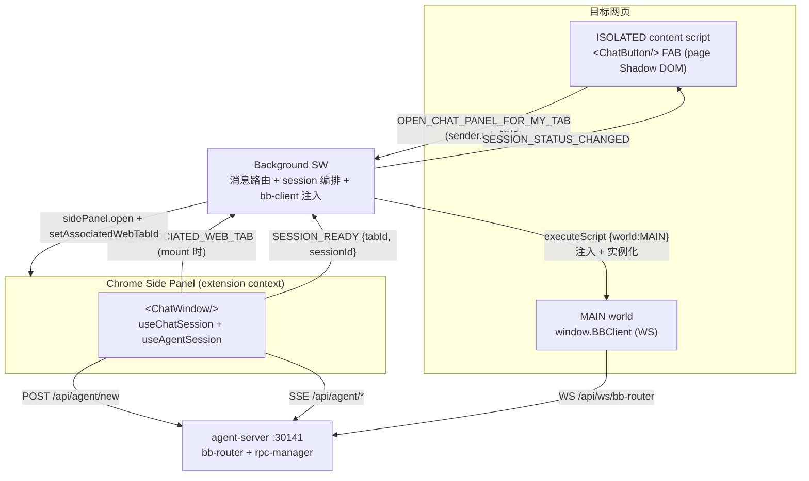
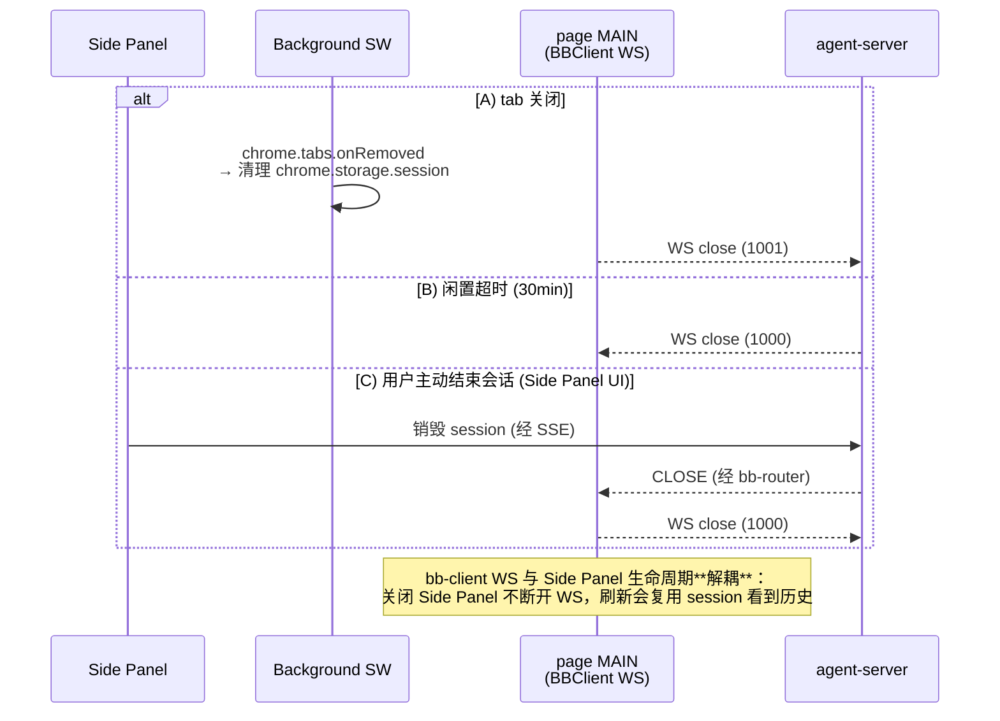
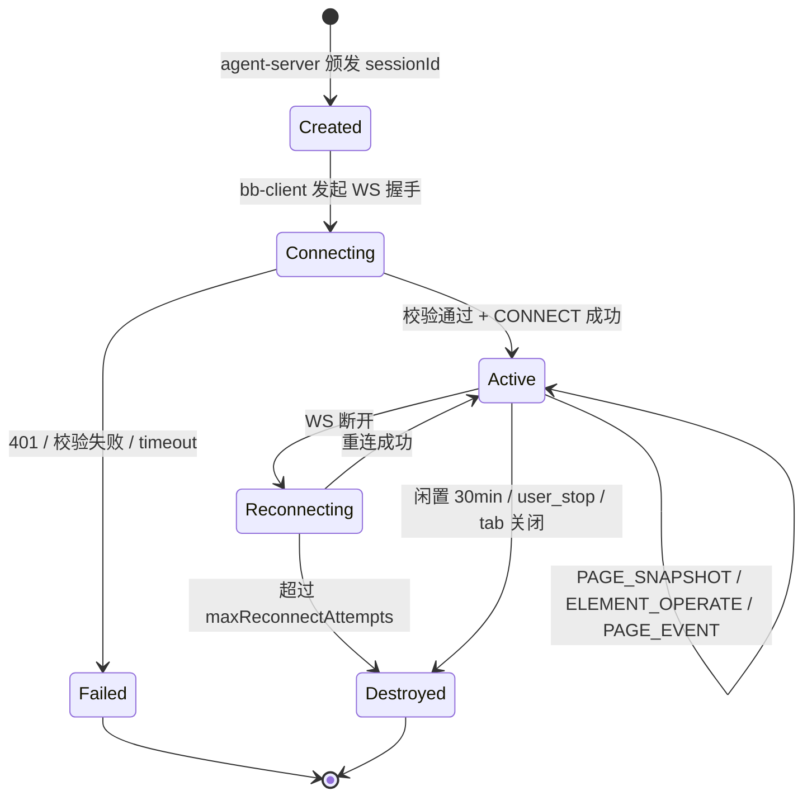

# Browser Bridge 详细设计

## 1. 背景

### 1.1 问题

Neo Agents 提供的 AI 编程智能体需要**在用户的真实浏览器里操作网页**——填充表单、点击按钮、读取页面状态。当用户说"帮我在这个网站登录"，智能体必须能：

1. 看到目标页面的 DOM 结构
2. 模拟用户操作（点击 / 填写 / 滚动）
3. 监听页面变化（URL 变化、DOM 变化）

而智能体本身（`pi-coding-agent` SDK）运行在 `agent-server` 的 Node 进程里——**它无法直接访问用户的浏览器**。Browser Bridge 就是架在两者之间的桥梁。

### 1.2 目标

1. **低延迟**：智能体发指令到页面执行，< 200ms 完成单次操作
2. **1:1:1 强绑定**：一个 chat session 严格对应一个浏览器标签页，避免跨 tab 误操作
3. **样式隔离**：`<ChatButton/>` 在 page Shadow DOM，`<ChatWindow/>` 在 Chrome Side Panel（独立 extension context，不受目标页面 CSS / JS / modal / focus-trap 影响）
4. **可观测**：所有页面事件、DOM 操作都有结构化日志，便于调试和回放
5. **可恢复**：bb-client 断线自动重连，session 闲置超时自动清理

---

## 2. 核心约束

以下约束是整个设计的基础，**不可更改**：

| 约束 | 说明 |
|------|------|
| **1:1:1 关系** | 1 chat session = 1 browser tab = 1 bb-client = 1 agent session |
| **sessionId 是关联键** | 由 agent-server 创建并下发给 bb-client，两者通过 sessionId 严格匹配 |
| **bb-router 内置** | bb-router 作为模块集成在 agent-server 内，端口 30141；**不**是独立进程 |
| **bb-client 由 SW 注入 MAIN world** | 目标页面 MAIN world（SW `executeScript({world: 'MAIN'})` 在 session ready 时注入 bb-client.iife.js + 实例化） |
| **chat UI 拆分两处** | `<ChatButton/>` 在每个 tab 的 page Shadow DOM；`<ChatWindow/>` 在 Chrome Side Panel（避免 page modal 抢焦点 / z-index 冲突） |
| **agent-server 不再走 WebSocket** | agent-server 通过进程内 API 调用 bb-router，**不**经过 WebSocket |

### 2.1 关系图



---

## 3. 组件职责

### 3.1 bb-client

- **位置**：目标 page **MAIN world**（由 Background SW 在 session ready 时通过 `chrome.scripting.executeScript({ world: 'MAIN' })` 注入）
- **包**：`@agegr/bb-client` IIFE（`bb-client.iife.js` 静态资源由 extension 打包）
- **协议端点**：`/api/ws/bb-router`（agent-server 内置 bb-router，端口 30141）
- **核心能力**：
  - WS 客户端：连 `bb-router`、发 tool 调用结果（`ELEMENT_OPERATE_RESULT` / `PAGE_SNAPSHOT_RESULT`）、推 `PAGE_EVENT`
  - 工具执行：接收 server 操作指令（`ELEMENT_OPERATE`），调 `@agegr/browser-tool` 执行 DOM 操作
  - 断线重连：指数退避，详见 [BB Protocol](./browser-bridge-protocol.md)

### 3.2 Chat UI 集成位置

`<ChatButton/>` 在 page Shadow DOM，`<ChatWindow/>` 在 Chrome Side Panel。详细架构、4 态 status、跨页面导航存活、associated web tab 跟踪机制等设计见 [`agent-chat-integration.md`](./agent-chat-integration.md)。

### 3.3 BB Router

- **位置**：`agent-server` 内置模块（`lib/bb-router.ts`）
- **依赖**：随 agent-server 进程启动，监听 `/api/ws/bb-router` 路径
- **职责**：
  - WebSocket 端点：接受 bb-client 的升级请求
  - 握手校验通过后建立 session 映射
  - 消息路由：接收 bb-client 的响应/事件，转发给对应的 agent session
  - 进程内 API：暴露 `sendToClient(sessionId, message)` 给 rpc-manager 调用
  - Session 生命周期管理（创建 / 闲置超时 / 主动销毁）
  - 心跳保活

### 3.4 rpc-manager（agent-server 内部）

- **位置**：`agent-server/lib/rpc-manager.ts`
- **职责**：
  - 包装 `pi-coding-agent` 的 `AgentSession`
  - 接收 chat-ui 的 prompt，驱动 LLM 决策
  - 当 LLM 决定需要操作页面时，**通过进程内 API**调用 bb-router（不经过 WebSocket）
  - 接收 bb-client 的 `PAGE_SNAPSHOT_RESULT` / `ELEMENT_OPERATE_RESULT` / `PAGE_EVENT`
  - 把结果注入到 agent context

### 3.5 browser-tool

- **位置**：`@agegr/browser-tool`（独立 npm 包）
- **运行环境**：浏览器（被 bb-client 调用）
- **职责**：
  - DOM → 扁平节点数组（id 按 DFS 顺序）
  - 提供 click / fill / scroll 等操作（兼容 React/Vue）
  - 计算 ARIA role + accessible name

---

## 5. 连接流程

### 5.1 正常时序

```mermaid
sequenceDiagram
    autonumber
    actor User
    participant CB as &lt;ChatButton/&gt;<br/>(page Shadow DOM)
    participant SW as Background SW
    participant SP as Side Panel<br/>&lt;ChatWindow/&gt;
    participant SRV as agent-server
    participant Page as page MAIN

    Note over User,SRV: 1) 会话启动
    User->>CB: 点击 FAB
    CB->>SW: OPEN_CHAT_PANEL_FOR_MY_TAB
    SW->>SP: sidePanel.open + setAssociatedWebTabId
    SP->>SRV: POST /api/agent/new<br/>(优先复用 chrome.storage.session)
    SRV-->>SP: sessionId
    SP->>SW: SESSION_READY { tabId, sessionId }
    SW-->>SW: 写 chrome.storage.session[String(tabId)]

    Note over User,SRV: 2) bb-client 注入 MAIN world
    SW->>Page: executeScript({world:'MAIN'})<br/>加载 bb-client.iife.js
    SW->>Page: executeScript({world:'MAIN'})<br/>实例化 + connect
    SW->>CB: SESSION_STATUS_CHANGED = connected

    Note over User,SRV: 3) 业务循环
    User->>SP: 输入 prompt
    SP->>SRV: SSE /api/agent/{id}/prompt
    SRV->>Page: PAGE_SNAPSHOT (经 bb-router)
    Page-->>SRV: PAGE_SNAPSHOT_RESULT
    SRV->>Page: ELEMENT_OPERATE
    Page-->>SRV: ELEMENT_OPERATE_RESULT
    SRV-->>SP: SSE 事件流
```

### 5.2 关键时序点

| 时刻 | 事件 | 说明 |
|------|------|------|
| T1 | ChatButton click → `OPEN_CHAT_PANEL_FOR_MY_TAB` | content script 发 SW |
| T2 | SW `sidePanel.open` + `setAssociatedWebTabId` | Side Panel mount；通过 `sender.tab` 解析 tabId（避免 Side Panel 自身的 tabId 坑） |
| T3 | `useChatSession` POST `/api/agent/new`（优先复用 storage） | 先查 `chrome.storage.session[String(tabId)]` 复用 sessionId |
| T4 | Side Panel 发 `SESSION_READY {tabId, sessionId}` 给 SW | SW 写 storage + 注入 bb-client |
| T5 | SW `executeScript({world: 'MAIN'})` 两步 | 加载 `bb-client.iife.js` + 实例化 + WS 连接 |
| T6 | 业务循环 | Side Panel ←→ agent-server SSE + bb-client ←→ bb-router WS |

### 5.3 关闭流程



---

## 6. Session 生命周期

### 6.1 状态机



### 6.2 创建

session 在 chat-ui 调用 `POST /api/sessions` 时创建，此时 bb-client **尚未连接**。

### 6.3 Connecting → Active

bb-client 发起 WS 握手 → 校验 → CONNECT → CONNECTED，session 进入 Active。

### 6.4 销毁

满足以下任一条件时销毁 session：

1. 用户主动结束（chat-ui 调用 `DELETE /api/sessions/{id}`）
2. bb-client 关闭 tab（WebSocket 1001）
3. 30 分钟无活动（任何一方）
4. bb-client 重连超过 `maxReconnectAttempts` (默认 10)
5. agent-server 关闭（进程级销毁所有 session）

### 6.5 bb-client 离线 / 重连

| 场景 | agent-server 行为 | bb-client 行为 |
|------|-------------------|----------------|
| 短暂断网（< 10s） | session 保持，等待重连 | 指数退避重连 (1s/2s/4s/8s/16s/30s 封顶) |
| 长时断网（> 10s） | 标记 session 为 Reconnecting | 继续重连，最多 10 次 |
| 重连成功 | session 恢复 Active | 重新发送 CONNECT |
| 重连失败 | 销毁 session, 通知 chat-ui | 显示 "连接已断开" 状态 |

### 6.6 agent-server 重启

- 所有 session 销毁
- chat-ui 收到 503 错误
- 用户需重新创建 session（拿到新 sessionId）+ 重新触发 bb-client 连接

---

## 7. chat session 与 tab 生命周期

chat UI（`<ChatButton/>` + `<ChatWindow/>`）和 bb-client 的生命周期绑定见 [§5](#5-连接流程)；持久化和 associated web tab 等关键设计决策见 [`agent-chat-integration.md`](./agent-chat-integration.md)。

**3 个核心约束**：

| 项 | 说明 |
|----|------|
| **持久化** | `chrome.storage.session`（key = `String(tabId)`）；浏览器重启清空，旧 pi session 在 agent-server 那边兜底 |
| **associated web tab 跟踪** | `chrome.storage.session[__associatedWebTab__]`；SW `tabs.onActivated` 更新；Side Panel 自身 `chrome-extension://` tab 必须排除 |
| **tab 关闭清理** | `chrome.tabs.onRemoved` → 清 `chrome.storage.session[String(tabId)]`；同时 bb-client WS close (1001) |

---

## 8. 配置参数

### 8.1 agent-server (bb-router)

```typescript
interface BBRouterConfig {
  // WebSocket 路径
  path: string;                        // 默认 "/api/ws/bb-router"

  // 心跳
  heartbeatInterval: number;           // 默认 30000ms
  heartbeatTimeout: number;            // 默认 60000ms

  // Session
  sessionIdleTimeout: number;          // 默认 1800000ms (30min)
  maxSessionsPerUser: number;          // 默认 5 (防止资源滥用)

  // 限流
  maxConcurrentOperations: number;     // 默认 10 (每 session)
}
```

### 8.2 bb-client

```typescript
interface BBClientConfig {
  // 端点
  agentServerUrl: string;              // 默认 "ws://localhost:30141/api/ws/bb-router"

  // 重连
  reconnectInitialDelay: number;       // 默认 1000ms
  reconnectMaxDelay: number;           // 默认 30000ms
  maxReconnectAttempts: number;        // 默认 10

  // 请求超时
  requestTimeout: number;              // 默认 30000ms (PAGE_SNAPSHOT/OPERATE)

  // Shadow DOM
  panelDefaultMinimized: boolean;      // 默认 true
  panelPosition: 'bottom-right' | 'bottom-left';  // 默认 'bottom-right'
}
```

### 8.3 配置来源

- **开发**：两份 `.env` 文件 / `chrome.storage.local`
- **生产**：K8s ConfigMap (agent-server) + Chrome Extension 打包配置 (bb-client)
- **运行时变更**：bb-client 配置通过 `chrome.storage.local` 支持热更新（agent-server 端需重启）

---

## 9. 消息路由

### 9.1 进程内路由（agent-server 内部）

```typescript
// rpc-manager 想让 bb-client 执行操作
await bbRouter.sendToClient(sessionId, {
  type: 'ELEMENT_OPERATE',
  requestId: nanoid(),
  payload: { action: 'click', selector: '#submit' }
});

// 收到 bb-client 的响应（requestId 匹配）
bbRouter.onMessage(sessionId, (message) => {
  switch (message.type) {
    case 'PAGE_SNAPSHOT_RESULT': /* 注入 LLM context */ break;
    case 'ELEMENT_OPERATE_RESULT': /* ... */ break;
    case 'PAGE_EVENT': /* 实时事件流 */ break;
  }
});
```

### 9.2 session 映射表

```typescript
// agent-server 内部状态
class BBRouter {
  private sessions = new Map<string, SessionState>();
  // sessionId -> SessionState
}

interface SessionState {
  sessionId: string;
  userId: number;             // 握手时关联到 sessionId
  bbClient?: WebSocket;        // bb-client 连接
  createdAt: number;
  lastActivity: number;
  // 关联的 AgentSession 引用
  agentSessionId: string;
  // pendingRequests 用于 requestId 匹配
  pendingRequests: Map<string, PendingRequest>;
}
```

### 9.3 请求-响应匹配

```typescript
async function sendRequest(
  sessionId: string,
  message: BaseMessage
): Promise<BaseMessage> {
  return new Promise((resolve, reject) => {
    const timer = setTimeout(() => {
      this.pendingRequests.delete(message.requestId);
      reject(new Error('Request timeout'));
    }, this.requestTimeout);

    this.pendingRequests.set(message.requestId, {
      resolve,
      reject,
      timer,
      sessionId,
    });

    this.sendToClient(sessionId, message);
  });
}
```

---

## 10. 错误处理

### 10.1 错误分类

| 类别 | 错误码 | 触发场景 | 处理策略 |
|------|--------|----------|----------|
| 握手 | `WS_UNAUTHORIZED` | (reserved) 保留错误码,当前未使用 |
| 握手 | `WS_SESSION_NOT_FOUND` | sessionId 不存在 | chat-ui 重新创建 session |
| 路由 | `CLIENT_NOT_FOUND` | 目标 bb-client 已离线 | 等待重连 / 通知用户 |
| 操作 | `ELEMENT_NOT_FOUND` | 选择器无匹配 | 通知 LLM 重新定位 |
| 操作 | `ELEMENT_NOT_VISIBLE` | 元素不可见 | 通知 LLM 滚动到可见 |
| 操作 | `ELEMENT_NOT_INTERACTIVE` | 元素被禁用 | 通知 LLM 等待 |
| 操作 | `OPERATION_FAILED` | 操作执行异常 | 检查 `recoverable` 决定是否重试 |
| 通信 | `REQUEST_TIMEOUT` | 操作 30s 未响应 | 重试一次（指数退避）|
| 通信 | `CLIENT_OFFLINE` | bb-client 断线 | session 进入 Reconnecting |
| 系统 | `MAX_SESSIONS_EXCEEDED` | 单用户超过 5 个 session | 提示用户关闭多余 session |

### 10.2 重试策略

```typescript
interface RetryConfig {
  maxAttempts: number;       // 默认 3 (操作错误) / 10 (重连)
  baseDelay: number;          // 默认 1000ms
  maxDelay: number;           // 默认 10000ms
  backoffMultiplier: number;  // 默认 2
}

function withRetry<T>(fn: () => Promise<T>, config: RetryConfig): Promise<T> {
  // 指数退避, 带抖动
}
```

### 10.3 错误传播

- bb-client 操作错误 → agent-server → LLM context（agent 自己决定下一步）
- 通信错误（超时 / 离线）→ chat-ui 提示用户
- 致命错误（session 销毁）→ chat-ui 强制结束当前对话

---

## 11. 不在本次设计范围内

| 内容 | 说明 | 后续 |
|------|------|------|
| **多 tab 支持** | 当前 1 session 严格对应 1 tab | 未来可能支持 tab 切换 |
| **跨域 iframe 操作** | 不处理跨域 iframe 内的页面操作 | 通过 `iframe-manager` 单独设计 |
| **服务端录屏回放** | Bridge 只做实时操作，不录屏 | 录屏由 agent-steer 的 rrweb 负责 |
| **Agent 自主驱动** | Bridge 只响应 server 指令，不主动触发 | 由上层 `agent.command` 协议处理 |
| **权限审批** | 用户没有操作审批环节 | 未来加 "危险操作需确认" 机制 |
| **审计日志** | 不持久化 Bridge 操作日志 | 由 backend 的 audit_log 模块负责 |

---

## 12. 文件结构

```
neo-agents/
├── agent-server/
│   ├── lib/
│   │   ├── rpc-manager.ts       # AgentSession 包装
│   │   ├── bb-router.ts         # WebSocket 端点 + Session 管理
│   │   └── bb-protocol.ts       # 消息类型定义（共享）
│   └── server.ts                # HTTP + WS 入口
│
├── agent-ui-chat/               # 提供 ChatButton / ChatWindow / useChatSession
│   └── src/
│       ├── components/
│       │   ├── ChatButton.tsx   # 纯 UI FAB（page Shadow DOM）
│       │   └── ChatWindow.tsx   # 聊天 UI（Chrome Side Panel）
│       └── hooks/
│           └── useChatSession.ts # session 创建 + chrome.storage.session 持久化
│
├── browser-tool/
│   └── src/                     # DOM 工具（被 bb-client 调用）
│
└── extension/                   # Chrome Extension (npm name: agent-steer)
    ├── entrypoints/
    │   ├── background.ts                              # SW：消息路由 + session 编排 + bb-client 注入
    │   ├── chat-button.content/index.tsx              # 每个 tab 挂 <ChatButton/>
    │   └── sidepanel/{main.tsx, index.html}           # Side Panel 挂 <ChatWindow/>
    └── public/
        └── bb-client.iife.js                          # 由 SW executeScript({world: 'MAIN'}) 注入目标页
```

---

## 13. 监控与可观测性

### 13.1 关键指标

| 指标 | 来源 | 告警阈值 |
|------|------|----------|
| `bb_router_active_sessions` | agent-server | - |
| `bb_router_connect_duration_ms` | 握手耗时 | p99 > 1000ms |
| `bb_router_message_latency_ms` | 请求-响应耗时 | p99 > 5000ms |
| `bb_client_reconnect_total` | bb-client | 持续增长 |
| `bb_client_op_failure_rate` | 操作错误率 | > 10% |

### 13.2 日志格式

```json
{
  "level": "info",
  "ts": "2026-06-22T14:23:01.234Z",
  "sessionId": "sess-abc123",
  "userId": 1,
  "tabId": 123,
  "event": "bb.op",
  "msgType": "ELEMENT_OPERATE",
  "action": "fill",
  "selector": "#username",
  "durationMs": 45,
  "success": true
}
```

**不打印**：用户输入的具体值（只记 selector / 长度）

---

## 14. 版本历史

| 版本 | 日期 | 变更 |
|------|------|------|
| 3.0.0 | 2026-07-06 | ChatButton + Side Panel 拆分；bb-client 由 SW 注入 MAIN world；chat session 按 tabId 持久化到 chrome.storage.session |
| 2.0.0 | 2026-06-22 | 初版：bb-router 内置模块，bb-client + Shadow DOM，完整消息协议 |

---

## 🔗 相关文档

- [Neo Agents 工程架构](./neo-agents) - 模块结构、与 agent-steer 集成
- [Browser Bridge 消息协议](./browser-bridge-protocol) - 消息类型、TypeScript 类型定义
- [Agent Steer 技术设计](./index) - agent-steer 整体架构
- [iframe Bridge 认证桥接设计](../../auth/iframe-bridge) - CS 拿 token 的细节
