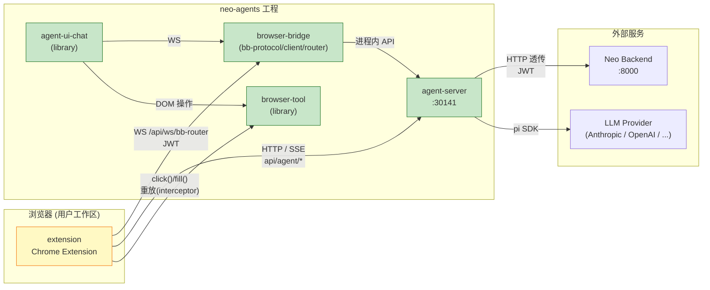

# Agent Steer 技术总览

> agent-steer 是个**产品/品牌名**,代表"AI Agent 驾驶舱"。本文档是它的**总览**:列组件、画关系,不重复子组件设计细节。

---

## 1. 6 个产品组件

| # | 组件 | 物理位置 | 类型 | 状态 | 端口 |
|---|------|---------|------|------|------|
| 1 | **extension** | `neo-agents/extension/` | Chrome Extension (WXT) | ✅ 已实现 | dev 3030 |
| 2 | **agent-server** | `neo-agents/agent-server/` | Next.js 16 API | ✅ 已实现 | 30141 |
| 3 | **agent-ui** | `neo-agents/agent-ui/` | Vite + React 19 SPA | ❌ 已废弃(空目录,仅 AGENTS.md) | — |
| 4 | **agent-ui-chat** | `neo-agents/agent-ui-chat/` | Vite library | ✅ 已实现 | — |
| 5 | **browser-tool** | `neo-agents/browser-tool/` | Vite library | ✅ 已实现 | demo 30148 |
| 6 | **browser-bridge** | `neo-agents/browser-bridge/` | WS 协议层 (bb-protocol / bb-client / bb-router) | ✅ 已实现 | — |

**排除**(非产品组件):

- `agent-ui-demo/` — `@agegr/agent-ui-chat` 的测试应用
- `websocket-example/` — 协议验证 example
- `docs/`、`hooks/`、`script/` — 工程内辅助目录

---

## 2. 组件关系

**关键依赖方向**:

- **extension ↔ agent-server**:通过 BBP (WebSocket) + HTTP / SSE,双协议栈
- **agent-server → Neo Backend**:主动 HTTP 调用,透传 JWT
- **agent-server → LLM Provider**:通过 pi-coding-agent SDK(支持多种 provider)
- **agent-ui-chat → browser-bridge + browser-tool**:UI 集成所需的两个 library
- **extension**:不依赖任何 `@agegr/*` workspace 包作为依赖项;底层 click/fill 重放调用 [browser-tool](./browser-tool) 的 API(见 [interceptor](./interceptor))

---

## 3. 详细设计入口

每个组件的**详细技术设计**在子文档里,本总览不重复:

| 组件 | 设计文档 |
|------|----------|
| **extension** | [recording](./recording) / [interceptor](./interceptor) / [browser-bridge](./browser-bridge) / [agent-chat-integration](./agent-chat-integration) / [auth-session](./auth-session) |
| **agent-server** | [auth-session](./auth-session) / [browser-bridge](./browser-bridge) |
| **browser-bridge** | [browser-bridge](./browser-bridge) / [browser-bridge-protocol](./browser-bridge-protocol) |
| **browser-tool** | [browser-tool](./browser-tool) |
| **agent-ui / agent-ui-chat** | 暂无独立设计文档(代码自身 README + AGENTS.md 足够) |
| 工程结构、构建命令 | [neo-agents](./neo-agents) |
