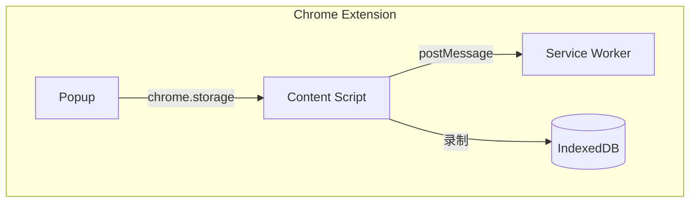

## 1. 系统架构

### 1.1 整体架构



### 1.2 组件职责

| 组件 | 职责 | 运行环境 |
|------|------|----------|
| Popup | 系统配置管理 <br/> 录像上传 | Chrome Extension |
| Content Script | 底层执行（rrweb 录制、事件收集） | Chrome Extension |
| Agent Steer | 交互 UI（录制控制、录像查看与回放） | Chrome Extension |

---

## 2. 关键设计

### 2.1 系统配置管理项

```typescript
// 成功路径
interface SysConfig {
  frontendUrl: 'http://localhost:3000', //前端地址
  backendUrl: 'http://localhost:8000', //后端地址
}
```

SysConfig -> 保存 -> `chrome.storage.local`

## 3. 消息协议

### 3.1 设计原则

- **类型开放**：消息类型用字符串标识，新增功能只需注册新类型名，不改动协议格式
- **双向分离**：`command` 为主动命令（Popup → CS），`event` 为状态上报（CS → Popup）
- **Payload 灵活**：不同类型有不同的 payload 结构，格式独立演进
- **协议版本**：`version` 字段用于格式兼容性判断

### 3.2 消息格式

```typescript
interface AgentMessage {
  /** 消息类型，如 "recording.start"、"agent.command" */
  type: string;

  /** 协议版本，当前为 1 */
  version: number;

  /** 消息方向 */
  direction: 'command' | 'event';

  /** 消息创建时间（毫秒时间戳） */
  timestamp: number;

  /** 唯一消息 ID，用于关联请求与响应 */
  messageId: string;

  /** 消息载荷，结构由 type 决定 */
  payload: Record<string, unknown>;
}
```

### 3.3 消息类型清单

#### 3.3.1 录制相关

| type | direction | 说明 | 关键 payload |
|------|-----------|------|-------------|
| `recording.start` | command | 开始录制 | — |
| `recording.pause` | command | 暂停录制 | — |
| `recording.resume` | command | 继续录制 | — |
| `recording.stop` | command | 停止录制 | — |
| `recording.fetch` | command | 请求录制数据（上传前） | — |
| `recording.state` | event | 录制状态变更上报 | `isRecording`, `isPaused`, `duration`, `segmentCount`, `eventCount` |
| `recording.data` | event | 返回录制数据 | `segments: Segment[]` |

#### 3.3.2 预留（暂不使用）

| type | direction | 说明 |
|------|-----------|------|
| `agent.command` | command | Agent 指令（自主驱动功能） |
| `agent.state` | event | Agent 执行状态上报 |
| `dom.query` | command | 查询 DOM 结构（自主驱动功能） |
| `dom.result` | event | DOM 查询结果 |


### 3.4 扩展新消息类型

新增功能时，只需：
1. 在 3.3 节中注册新的 type 名称
2. 定义该 type 对应的 payload 结构
3. 通信双方按约定处理，无需改动本协议格式


---

## 🔗 相关文档

- [Agent Steer 产品设计](../../product/agent-steer/) - 产品意图和功能说明
- [软件操作录像与回放](../../product/agent-steer/recording) - 功能详细设计
