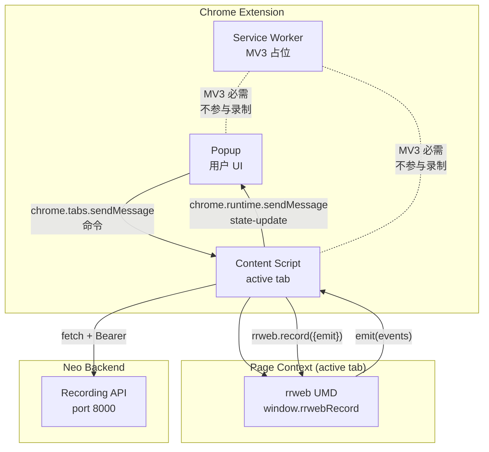
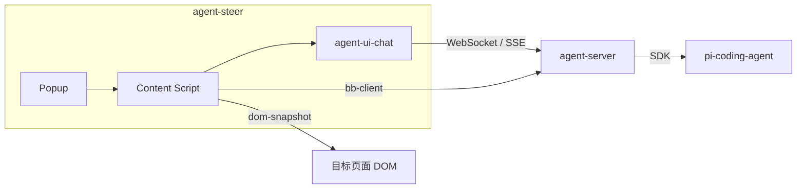

## 1. 系统架构

### 1.1 整体架构（v2 阶段 5 后）



### 1.2 组件职责

| 组件 | 职责 | 运行环境 |
|------|------|----------|
| Popup | 系统配置管理；录制控制 UI（3 view） | Chrome Extension |
| Content Script | rrweb 录制、segment 切分、调后端 API、trigger 监听 | Chrome Extension（active tab） |
| Service Worker | MV3 必需的占位（空壳） | Chrome Extension |
| Page Context | rrweb UMD（v2 cs 动态加载） | active tab |
| Backend | recording / segment 的 source of truth | Neo Backend |

> Recording 模块的详细设计见 [recording.md v2.0.0](./recording.md)。本文件中关于 Recording 的描述以 v2.0.0 为准。

### 1.3 v2 vs v1 关键差异

| 维度 | v1 | v2 |
|------|----|----|
| 状态机 | 7 状态（idle/recording/paused/pending/uploading/success/error） | 3 状态（idle/recording/paused） |
| 录制数据 | IndexedDB 持久化 segments | 内存 buffer，切 segment 立即上传 |
| 上传 | 用户手动输入名称批量上传 | 自动追加到 recording |
| SW 角色 | 消息路由 + 上传中转 | 极薄壳（MV3 占位） |
| rrweb 注入 | SW 注入 recorder.js | CS 动态创建 `<script>` 加载 UMD |
| 持久化 | IndexedDB 多份 segment | chrome.storage.local 单 recordingUid |

---

## 2. 系统配置

系统配置（前端地址、后端地址等）存 `chrome.storage.local`。配置项是独立的，与 recording 解耦。

---

## 3. 模块化设计

Recording 是当前唯一的业务模块：

- [Recording 模块技术设计 v2.0.0](./recording.md)
- [Recording 实施细节](./todo.md)

新模块的接入方式参考 Recording 的模式：

- 在 Popup 下增加视图
- 在 Content Script 下增加运行时
- 必要时扩展消息通道

---

## 4. 消息协议

### 4.1 设计原则

- **简单字符串 type**：每条消息用字符串 `type` 区分，无复杂信封字段。
- **fire-and-update**：CS 收到命令后执行并主动推状态，**不**用 requestId 关联请求响应。
- **方向隐含**：消息方向由 type 命名隐含（如 `recording.start` = 命令，`recording.state-update` = 状态），不单设 direction 字段。

### 4.2 消息格式

```
{
  type:    string   // 消息类型
  payload: object   // 载荷（可选）
}
```

### 4.3 消息类型清单

#### 4.3.1 录制相关

| type | 方向 | 说明 | 关键 payload |
|------|------|------|--------------|
| `recording.start` | Popup → CS | 开始录制 | — |
| `recording.pause` | Popup → CS | 暂停录制 | — |
| `recording.resume` | Popup → CS | 继续录制 | — |
| `recording.stop` | Popup → CS | 停止录制 | — |
| `recording.state-update` | CS → Popup | 录制状态变更上报 | `status`, `recordingUid`, `currentSegmentUid`, `recordingStartedAt`, `totalPausedMs`, `pausedAt`, `segmentCount` |

> 详细 payload 与实施细节见 [recording.md](./recording.md) 与 [todo.md](./todo.md)。

#### 4.3.2 预留（暂不使用）

| type | 方向 | 说明 |
|------|------|------|
| `agent.command` | Popup → CS | Agent 指令（自主驱动功能） |
| `agent.state` | CS → Popup | Agent 执行状态上报 |
| `dom.query` | Popup → CS | 查询 DOM 结构（自主驱动功能） |
| `dom.result` | CS → Popup | DOM 查询结果 |

### 4.4 扩展新消息类型

新增功能时：

1. 在 4.3 节注册新 type 名称和方向。
2. 在该功能模块的文档中定义 payload 结构。
3. 通信双方按约定处理。

---

## 5. 与 Neo Agents 的集成

agent-steer 通过集成 neo-agents 获得 AI Agent 对话能力，无需自行实现聊天 UI 和通信逻辑。

### 5.1 集成架构



### 5.2 依赖包

| 包 | 说明 | 来源 |
|----|------|------|
| `@agegr/agent-ui-chat` | 聊天 UI + 通信能力 | neo-agents |
| `@agegr/dom-snapshot` | DOM 快照 + 操作 | neo-agents |
| `@agegr/bb-client` | bb-server 客户端 | neo-agents |

### 5.3 集成方式

```typescript
import { ChatWindow } from '@agegr/agent-ui-chat';

// 只需提供地址，通信逻辑已内置
<ChatWindow
  apiBaseUrl="http://localhost:30141"
  backendUrl="http://localhost:8000"
/>
```

### 5.4 角色职责

| 组件 | 职责 |
|------|------|
| **agent-steer** | rrweb 录制、页面事件采集、agent-ui-chat 集成 |
| **agent-ui-chat** | 聊天 UI、SSE 订阅、WebSocket 连接 |
| **bb-client** | 与 agent-server 的 BB Router 通信 |
| **dom-snapshot** | 目标页面的 DOM 快照和操作 |

## 🔗 相关文档

- [Neo Agents 工程架构](./neo-agents) - neo-agents 模块结构和集成方式
- [Browser Bridge 详细设计](./browser-bridge) - bb-client/bb-router 通信协议
- [Agent Steer 产品设计](../../product/agent-steer/) - 产品意图和功能说明
- [软件操作录像与回放 v0.2.0](../../product/agent-steer/recording) - 产品功能
- [Recording 模块技术设计 v2.0.0](./recording.md) - Recording 详细设计
- [Recording 实施细节](./todo.md) - 接口、字段、消息类型、实施步骤
