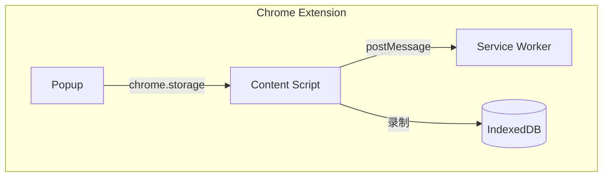

## 1. 系统架构

### 1.1 整体架构

### 1.2 组件职责

| 组件 | 职责 | 运行环境 |
|------|------|----------|
| Popup | 配置管理（是否开启录制） | Chrome Extension |
| Content Script | 底层执行（rrweb 录制、事件收集） | Chrome Extension |
| Agent Steer | 交互 UI（录制控制、录像查看与回放） | Chrome Extension |

---

## 2. 消息协议

### 2.1 消息格式

---

## 🔗 相关文档

- [Agent Steer 产品设计](../../product/agent-steer/) - 产品意图和功能说明
- [软件操作录像与回放](../../product/agent-steer/recording) - 功能详细设计
