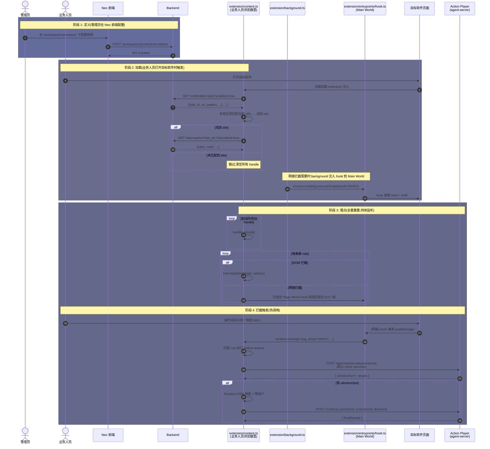

# Intercept 拦截器技术设计

> interceptor 是 **extension 项目的功能**。在 extension/content.ts 内实现完整 lifecycle(DOM 拦截 + 网络拦截 + 全量重置),跟外部数据源 / Action Player 通信。
>
> 底层 DOM 编程式重放(用于 intercept 模式)用 [browser-tool](./browser-tool) 的 `click()` / `fill()`。

---

## 1. 背景

业务事件采集 / 敏感操作二次确认需要的能力:

- 不是"我去点这个按钮",而是"**这个按钮被点时**通知我(或阻止)"
- 不是"立刻发生",而是"**持续监听**直到我取消"
- 不是"无脑执行",而是"按 before / after 流程编排动作"

**interceptor** = 在 extension/content.ts 内提供 `intercept(target, options)` API,支持 DOM 元素和 HTTP 请求两种 target,observe / intercept 两种模式,before / after action 编排。

---

## 2. 目标

1. **`intercept(target, options)` 是底层原子操作**(与 `click(target)` 同级),上层"规则引擎"是业务概念,不在 API 层体现
2. **DOM + 网络两种 target 统一抽象**,内部不同实现
3. **模式按 target 区分**:
   - DOM 拦截:`observe` / `intercept` 两种模式
   - 网络拦截:**仅 `observe` 模式**,intercept 永久不做(见 §6)
4. **before / after Action 编排**,跟 product 文档定义的 Event/Status 采集流程对齐
5. **可取消**: 返回 `InterceptHandle`,调用方随时 `cancel()`

---

## 3. 抽象签名

```ts
// 模块路径: extension/src/interceptor/

// DOM 拦截
function intercept(
  target: DomTarget,
  options: InterceptOptions
): Promise<InterceptHandle>;

// 网络拦截
function intercept(
  target: NetworkTarget,
  options: InterceptOptions
): Promise<InterceptHandle>;
```

**API 风格对比**:

| 操作 | 抽象签名 | 触发时机 | 阻塞原行为 |
|------|---------|---------|----------|
| `click(target)` | `action(target)` | 立即一次 | 是(主动执行) |
| `fill(target, value)` | `action(target, value)` | 立即一次 | 是(主动执行) |
| `intercept(target, opts)` | `action(target, options)` | 持续监听 | DOM: observe 否 / intercept 是 / **网络: 否(永久)** |

---

## 4. API 设计

### 4.1 Options

```ts
interface InterceptOptions {
  /** 事件名,after 动作里生成 Event 时使用 */
  eventName: string;

  /** 拦截模式,默认 'observe' */
  mode?: 'observe' | 'intercept';

  /** 被拦截/操作的实体名(主语)。必填,后续 collect_event / collect_status 直接用作 Event.entity_name / Status.entity_name,不再动态抽取 */
  entityName: string;

  /** 操作的目标实体名(宾语)。选填,只有"操作另一个实体"的场景需要(如"把线索分配给张三") */
  targetEntityName?: string;

  /** before 动作:target 触发前执行 */
  beforeActions?: Action[];

  /** after 动作:target 触发后执行 */
  afterActions?: Action[];

  /** 页面 URL 正则,限定生效范围(DOM 模式) */
  pageUrlPattern?: string;

  /** 触发后,是否锁定一段时间防重入(ms),默认 1000 */
  debounceMs?: number;
}
```

> **entityName / targetEntityName 是静态字符串**(不动态抽取)。如果将来要支持动态(如"每次点不同 lead,lead_id 从 URL 提取"),再加模板变量机制——见 §8.4 未决问题。

### 4.2 Action 类型(与 product 文档对齐)

```ts
type Action =
  | { type: 'collect_event', config: { actor: string, metadata?: Record<string, any> } }
  | { type: 'collect_status', config: { entityName: string, attributes: Record<string, string> } }
  | { type: 'call_agent', config: { endpoint: string, timeoutMs?: number } }
  | { type: 'show_confirm', config: { title: string, body: string, confirmLabel?: string, cancelLabel?: string } }
  | { type: 'show_toast', config: { message: string, level?: 'info'|'warn'|'error' } };
```

`attributes: Record<string, string>` 的 value 是 XPath 表达式(从 DOM 提取状态字段),后端 schema 跟 product 文档一致。

### 4.3 Target 格式

```ts
// DOM Target 沿用 browser-tool 现有格式
type DomTarget = string | Element | (() => Element | null);
//  - string: CSS selector / id (e1/e2...)
//  - Element: 直接传元素
//  - function: lazy 解析(适合动态元素)

// Network Target
type NetworkTarget =
  | string                            // 简写: URL pattern
  | { urlPattern: string, method?: 'GET'|'POST'|'PUT'|'DELETE'|'PATCH' };
```

### 4.4 返回值

```ts
interface InterceptHandle {
  /** 取消监听 */
  cancel(): void;

  /** 已触发次数(observe: 实际触发;intercept: 放行次数) */
  readonly triggered: number;

  /** 最后一次触发的 before/after 执行结果 */
  readonly lastResult?: {
    beforeOk: boolean;
    afterOk: boolean;
    error?: string;
  };
}
```

---

## 8. 管理过程

interceptor 跟其他 workspace 数据对象(embedded-sites / events / status)一样,需要**定义 → 加载 → 埋点**三个阶段。

### 8.1 三阶段职责

| 阶段 | 做什么 | 在哪做 | 谁触发 |
|------|--------|--------|--------|
| **定义** | 在 Neo 前端 workspace 下的 `interceptors` 菜单配置规则 | Neo 前端 + 后端 API | **管理员** |
| **加载** | 业务人员浏览器里,extension/content.ts 拉取当前页面匹配的 interceptors | extension/content.ts | **业务人员** 打开目标软件页面 |
| **埋点** | 调 `intercept()` 注册监听 | extension/content.ts + extension/entrypoints/hook.ts(网络模式) | 加载阶段自动衔接 |

### 8.2 数据流(时序图)



### 8.3 关键设计决策(本节定调)

| 决策 | 结论 | 理由 |
|------|------|------|
| **数据模型** | `Interceptor = Rule`(平铺) | 单表,心智简单 |
| **归属** | Interceptor 挂在 Site 下(`site_id` 外键) | 隔离天然,加载逻辑清晰 |
| **URL → Site 匹配** | extension/content.ts 本地缓存 site 列表,本地正则 | site 列表变化频率低,避免每次都查后端 |
| **加载策略** | **全量重置** | 每次拉取都 `cancel()` 所有旧 handle + 重新 `intercept()`。实现简单,保证"前端状态 = 后端状态",不会出现"已禁用规则还在触发"或"重复监听" |
| **加载时机** | (1) Content Script 启动 (2) URL 变化 (3) 30s 定时刷新 | 覆盖"首次进入 / SPA 路由 / 后端规则更新" |
| **拦截器定义拉取源** | 环境变量决定:fixture / mock-server / real-backend | demo / 测试 / 生产可切换,不依赖固定后端 |
| **Action Player 调用** | 默认 mock executor,环境变量切真调 | demo / CI 不依赖后端;测试稳定 |
| **网络拦截模式** | **永久 observe,intercept 不做** | 网络拦截主要用例是业务事件采集,observe 已够用 |

### 8.4 未决问题(留待后续,本节不展开)

- Action 字段值的填法:静态字符串 / DOM XPath 提取 / URL 模板提取 —— 怎么统一表达
- Action 扩展机制:硬编码 / 注册表 / 插件化
- 启用/禁用 UI、测试工具、审计日志
- 动态 entityName:目前是静态字符串,如果业务上需要"每次拦截不同实体"(如"每次分配不同 lead"),需加模板变量或 context 抽取机制

---

## 🔗 相关文档

- [browser-tool 技术设计](./browser-tool) - 底层 click/fill 重放(本设计用)
- [Action Player (AP) 技术设计](./action-player) - 后端 action 执行器,extension 通过 HTTP 调用
- [Browser Bridge 详细设计](./browser-bridge) - BBP 协议设计
- [Agent Steer 技术设计](./index) - Chrome Extension 总览
